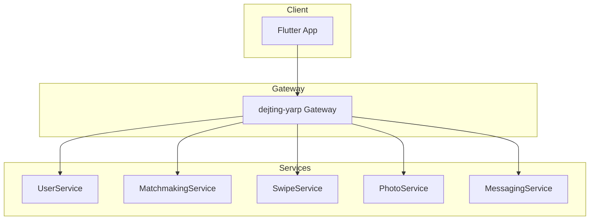

# PM Tools - Quick Reference

## 🏆 Top 3 Recommendations

### 1. GitHub Projects v2 + Mermaid (FREE) ⭐ DO THIS FIRST
**Why**: You're already 90% there. Just add:
- Roadmap view (10 min setup)
- Mermaid diagrams for dependencies (2 hours)
- Architecture Decision Records (30 min)

**Action**: See [Quick Start Guide in full report](PROJECT_MANAGEMENT_RESEARCH.md#quick-start-guide-best-option-github--mermaid--adr)

### 2. Linear ($8/mo) - Premium Upgrade
**Why**: Lightning-fast UI, visual dependencies, 2-way GitHub sync
**When**: Try after you max out GitHub Projects features
**ROI**: Saves ~4 hours/week = $4k/year value

**Action**: Sign up for 14-day trial at https://linear.app

### 3. Plane.so (FREE, self-hosted) - Open Source Alternative
**Why**: Linear-like UX without vendor lock-in
**When**: If you want full control and don't mind self-hosting
**ROI**: FREE forever, but requires maintenance

**Action**: Deploy via Docker: https://plane.so

---

## 📋 Immediate Action Items (Today)

### 1. Enable GitHub Roadmap View (10 minutes)
```bash
# Go to: https://github.com/users/best-koder-ever/projects/2
# Click: New View → Roadmap
# Add fields: Start Date, Target Date, Iteration (1-week sprints)
# Set Phase 0 target = Feb 1, Phase 1 = Feb 8, etc.
```

### 2. Add Mermaid Diagrams (2 hours) - Satisfies T002!
```bash
# Create architecture diagrams
cat > specs/001-mvp-foundation/ARCHITECTURE.md << 'ARCH'
# DatingApp Architecture

## Service Dependencies

ARCH

# Add task dependency graphs to tasks.md (edit manually)
```

### 3. Start ADR Log (30 minutes) - Addresses T007
```bash
mkdir -p docs/architecture/decisions

# Document database standardization decision
cat > docs/architecture/decisions/ADR-002-postgresql.md << 'EOF'
# ADR-002: Standardize on PostgreSQL

**Status**: Proposed  
**Date**: 2026-01-24  

## Decision
Standardize on PostgreSQL for all services.

## Rationale
- Single DB engine to maintain
- Better JSON support
- Superior full-text search

## Implementation
See T007 in tasks.md
