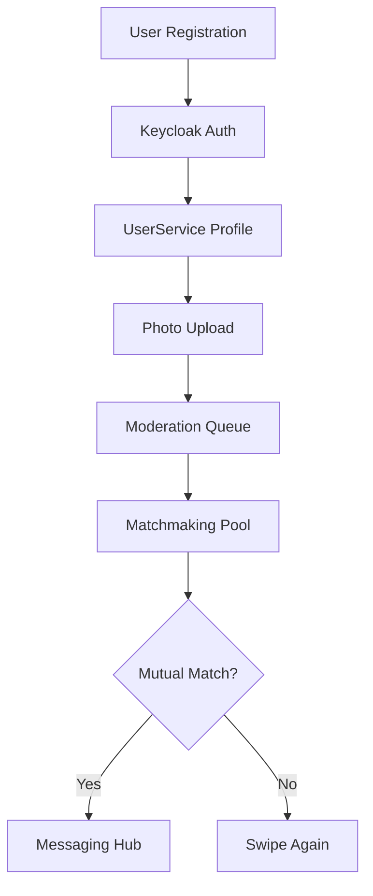
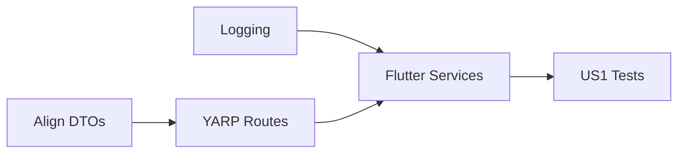
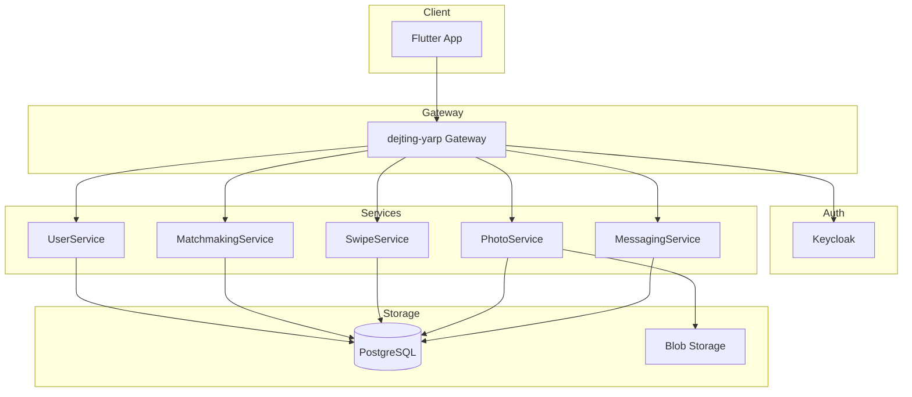
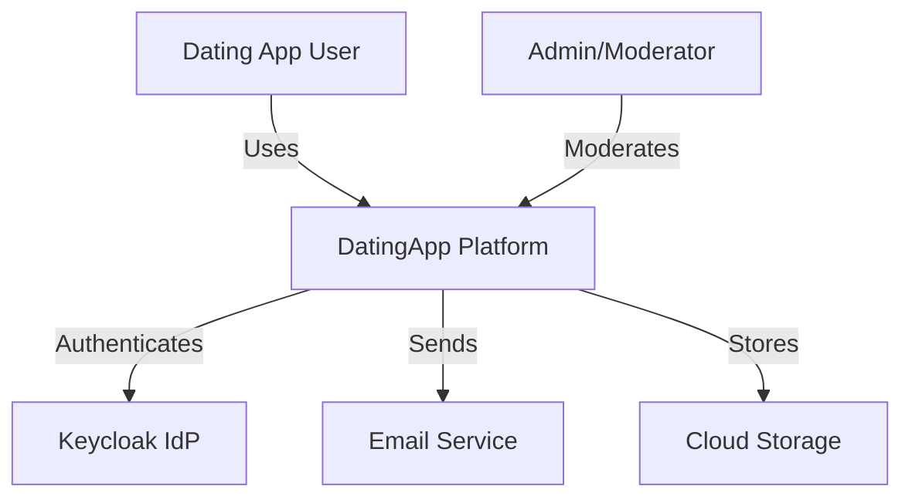
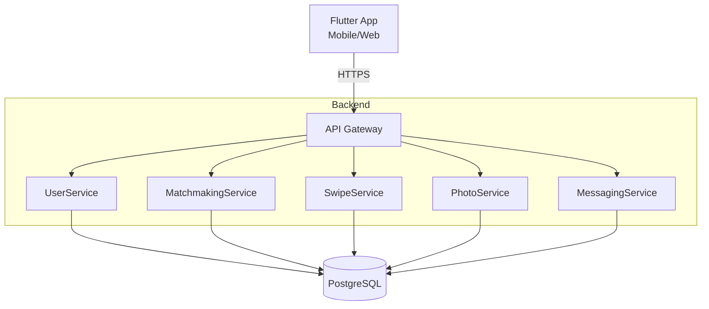
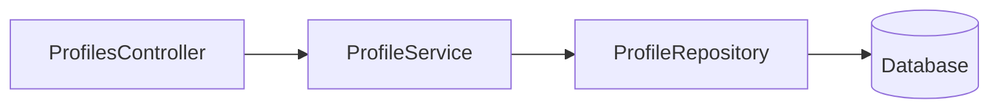
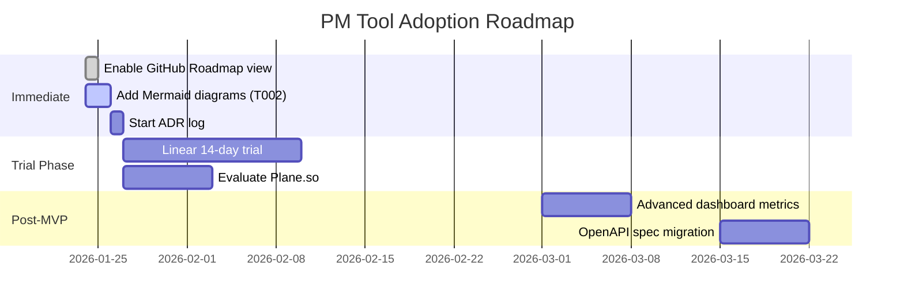

# Project Management & Visualization Tools Research
**For**: Solo Developer - Multi-Repo Microservices Dating App  
**Date**: 2026-01-24  
**Context**: 8+ Git repos, 72 MVP tasks, GitHub Projects v2 in use

---

## Executive Summary

**Top 3 Recommendations:**
1. **GitHub Projects v2 + Mermaid (in-repo)** — Best fit for your workflow (FREE, already integrated)
2. **Linear + GitHub Sync** — Premium upgrade path ($8/mo, superior UX)
3. **Plane.so (self-hosted)** — Open source alternative (FREE, full control)

**Current State Analysis:**
- ✅ Already using GitHub Projects v2 with custom fields (Phase, Spec Task ID)
- ✅ Have automated sync script (`sync_mvp_project.sh`)
- ✅ Auto-generating dashboard (`DASHBOARD.md`)
- ⚠️ Missing: Visual dependency graphs, architecture diagrams, roadmap view
- ⚠️ Missing: Two-way sync automation, burndown charts, time tracking

---

## Category A: GitHub Native Features (Current Baseline)

### What You're Already Using

**GitHub Projects v2** (https://github.com/users/best-koder-ever/projects/2)
- ✅ Custom fields: Phase, Spec Task ID
- ✅ Kanban board with grouping by Phase
- ✅ Issues linked to 8+ repos
- ✅ Automation via `sync_mvp_project.sh`

**What's Available But Not Used:**

1. **Roadmap View** (HIGHLY RECOMMENDED)
   - Timeline visualization with start/target dates
   - Drag-and-drop scheduling
   - Iteration tracking (sprints for solo dev)
   - **Enable**: Project Settings → New View → Roadmap

2. **Custom Iterations** (RECOMMENDED)
   - Weekly/bi-weekly sprints for task batching
   - Velocity tracking (tasks/week)
   - Burndown visualization
   - **Setup**: Settings → Fields → New iteration field

3. **GitHub Insights** (FREE)
   - Contributor activity graphs
   - Pulse (weekly summaries)
   - Traffic analytics
   - **Access**: Each repo's Insights tab

4. **Task Lists in Issues** (Already using for phase epics!)
   - ✅ Currently building task lists in [sync_mvp_project.sh](../scripts/sync_mvp_project.sh#L134-L153)
   - Native hierarchical tasks (beta)
   - Auto-progress calculation

### What's Missing from Native GitHub

❌ **Gantt Charts**: No native Gantt view (only roadmap timeline)  
❌ **Dependency Tracking**: Can't define task → task dependencies visually  
❌ **Mind Mapping**: No brainstorming canvas  
❌ **Architecture Diagrams**: No service dependency graphs  
❌ **Time Tracking**: No built-in time estimates/actual tracking  
❌ **Advanced Automation**: Limited to status changes, no complex workflows  

**Verdict**: GitHub Projects v2 covers 70% of your needs. The gaps require external tools.

---

## Category B: Diagram/Visualization Tools

### 1. **Mermaid.js** ⭐ RECOMMENDED

**What it is**: Text-based diagramming that renders in GitHub markdown

**Integration**: Native GitHub rendering (no plugins needed)

**Capabilities**:


**Use Cases for Your Project**:
- Service dependency graphs in `README.md`
- Task dependency flowcharts in `tasks.md` (addresses T002!)
- API flow diagrams in `contracts/api-spec.md`
- State machines (onboarding wizard states)

**Example for Your Tasks.md (T002 requirement):**
```markdown
## Phase 2 Dependencies


```

**Pros**:
- ✅ FREE, version controlled with code
- ✅ Renders in GitHub, VS Code, documentation sites
- ✅ Text-based = diffable, reviewable in PRs
- ✅ Supports: flowcharts, sequence diagrams, class diagrams, Gantt charts, ER diagrams
- ✅ Live editor: https://mermaid.live/

**Cons**:
- ❌ Not interactive (no clickable nodes)
- ❌ Complex diagrams get messy
- ❌ Learning curve for syntax

**Quick Start**:
```bash
cd /home/m/development/DatingApp
cat > docs/ARCHITECTURE.md << 'EOARCH'
# System Architecture

## Service Dependencies


EOARCH
git add docs/ARCHITECTURE.md
```

**Verdict**: **Best first step**. Add to your repo TODAY for T002.

---

### 2. **PlantUML**

**What it is**: Text-based UML diagrams (similar to Mermaid but more powerful)

**Integration**: Requires plugins/renderers (NOT native GitHub)

**Capabilities**: Full UML support (class, sequence, component, deployment, state, activity)

**Pros**:
- ✅ More diagram types than Mermaid
- ✅ Text-based, version controlled
- ✅ Industry standard for UML

**Cons**:
- ❌ Doesn't render in GitHub (needs external service or CI action)
- ❌ Requires Java runtime
- ❌ More complex syntax

**Verdict**: **Skip**. Mermaid is sufficient and renders natively.

---

### 3. **Excalidraw** (https://excalidraw.com)

**What it is**: Hand-drawn style diagramming tool

**Integration**: Web-based, can export to `.excalidraw.json` and commit to Git

**Capabilities**:
- Freeform sketching
- Collaboration mode
- Component libraries
- Export to PNG/SVG

**Pros**:
- ✅ FREE, open source
- ✅ Beautiful hand-drawn aesthetic
- ✅ Great for brainstorming
- ✅ Self-hostable

**Cons**:
- ❌ Binary files (`.excalidraw.json`) = not diffable
- ❌ Manual export to images for documentation
- ❌ No GitHub rendering

**Use Case**: Brainstorming feature flows, then formalize in Mermaid

**Verdict**: **Supplementary tool** for ideation, not primary workflow.

---

### 4. **Draw.io / Diagrams.net** (https://app.diagrams.net)

**What it is**: Professional diagramming tool (Visio alternative)

**Integration**: 
- Web/desktop app
- Can save to GitHub repos directly
- VS Code extension: `hediet.vscode-drawio`

**Capabilities**:
- Full architecture diagrams
- AWS/Azure icons libraries
- Export to PNG/SVG
- Git integration

**Pros**:
- ✅ FREE, powerful
- ✅ VS Code extension integrates well
- ✅ Professional output

**Cons**:
- ❌ XML files = binary-ish, poor diffs
- ❌ Not as elegant as Mermaid for simple diagrams

**Quick Start**:
```bash
code --install-extension hediet.vscode-drawio
# Then create .drawio.svg files (editable SVGs!)
```

**Verdict**: **Use for complex architecture diagrams** that exceed Mermaid's capabilities.

---

## Category C: PM Tools with GitHub Integration

### 1. **Linear** ⭐ TOP PICK FOR PREMIUM UPGRADE

**Website**: https://linear.app  
**Pricing**: $8/user/month (solo = $8/mo)

**GitHub Integration**:
- ✅ Two-way sync (issues ↔ Linear tasks)
- ✅ Auto-link PRs to issues
- ✅ Status sync (PR merged = Linear "Done")
- ✅ Commit mentions (update Linear from commit messages)

**Features**:
- 🚀 Lightning-fast UI (best in class)
- 📊 Roadmaps with Timeline view
- 📈 Cycles (sprints) with velocity tracking
- 🔗 Project hierarchies (Initiatives → Projects → Issues)
- 👁️ Views: Kanban, List, Table, Roadmap
- 🎯 Priorities (P0-P3) with auto-sort
- 📝 Rich markdown + code blocks
- 🔔 Slack/Discord integrations
- 🤖 API + webhooks for automation

**Comparison to GitHub Projects**:
| Feature | GitHub Projects | Linear |
|---------|----------------|--------|
| Speed | Medium | ⚡ Instant |
| Roadmap | Basic timeline | Timeline + Gantt |
| Dependencies | Manual | Visual graph |
| Time tracking | None | Built-in estimates |
| Keyboard shortcuts | Limited | Vim-like (power user) |
| Mobile app | Basic | Excellent |

**Solo Developer Value**:
- Saves ~2 hours/week on project management overhead
- Superior UX = less friction = better task capture
- Roadmap view shows "when will this ship?"

**Setup for Your Project**:
```bash
# 1. Sign up at linear.app
# 2. Connect GitHub: Settings → Integrations → GitHub
# 3. Map repos: Select all 8 repos
# 4. Import existing issues: Linear → Import → GitHub
# 5. Configure sync: 
#    - GitHub Issue Created → Linear Issue Created
#    - PR Merged → Linear Issue Status = Done
#    - GitHub Closed → Linear Archived
```

**Workflow Example**:
1. Brainstorm features in Linear (fast UI)
2. Auto-create GitHub issues via sync
3. Work in GitHub (commits, PRs)
4. Linear auto-updates from PR status
5. View progress in Linear Roadmap

**Pros**:
- ✅ Best UX in class (Notion-level polish)
- ✅ Two-way GitHub sync
- ✅ Roadmaps, Gantt, burndown charts
- ✅ Keyboard-first (keyboard shortcuts everywhere)
- ✅ API for custom automation

**Cons**:
- ❌ $96/year cost
- ❌ Another tool to check (cognitive overhead)
- ❌ Lock-in risk (export to JSON, but migration pain)

**Verdict**: **Worth $8/mo IF** you find GitHub Projects too slow/clunky. Try free trial first.

---

### 2. **Notion** (https://notion.so)

**Pricing**: FREE for individuals, $10/mo for Pro

**GitHub Integration**:
- ⚠️ Limited (via Zapier/Make.com, NOT native two-way sync)
- Can embed GitHub issues via database
- Manual sync required

**Features**:
- 📝 All-in-one workspace (docs + tasks + wiki)
- 🗂️ Databases with views (Table, Kanban, Timeline, Calendar)
- 🔗 Relations between databases
- 📊 Formulas, rollups, charts
- 🤝 Collaboration (overkill for solo)

**Use Case for Your Project**:
- Product documentation hub
- Feature brainstorming (docs → tasks)
- Technical wiki (ADRs, runbooks)

**Pros**:
- ✅ FREE for individuals
- ✅ Flexible (can model anything)
- ✅ Great for documentation

**Cons**:
- ❌ Poor GitHub integration (third-party only)
- ❌ Slow for task management
- ❌ Overkill for solo dev

**Verdict**: **Use for documentation, NOT task management**. Keep GitHub Projects for tasks.

---

### 3. **ClickUp** (https://clickup.com)

**Pricing**: FREE forever plan (unlimited tasks), $7/mo for Pro

**GitHub Integration**:
- ✅ Native GitHub integration
- ➕ Auto-link PRs to tasks
- ➖ One-way sync (GitHub → ClickUp)

**Features**:
- 📊 Multiple views: List, Board, Gantt, Timeline, Calendar, Mind Maps
- ⏱️ Time tracking built-in
- 🎯 Goals & OKRs
- 📝 Docs, whiteboards
- 🤖 Automations

**Pros**:
- ✅ FREE plan generous
- ✅ Mind maps built-in!
- ✅ Gantt charts
- ✅ All-in-one (docs + tasks + goals)

**Cons**:
- ❌ Overwhelming UI (too many features)
- ❌ Slower than Linear
- ❌ One-way GitHub sync

**Verdict**: **Too complex for solo dev**. Feature bloat vs. Linear's focus.

---

### 4. **Zenhub** (https://zenhub.com)

**Pricing**: FREE for public repos, $8.33/mo for private

**GitHub Integration**:
- ✅ Native overlay (lives inside GitHub UI)
- ✅ Epics, dependencies, estimates
- ✅ Burndown charts, velocity tracking

**Features**:
- 🔗 Dependency tracking (tasks block other tasks)
- 📊 Epics with child issues
- ⏱️ Estimates + time tracking
- 📈 Reports (burndown, velocity, cumulative flow)

**Pros**:
- ✅ Lives IN GitHub (no context switch)
- ✅ Dependency graphs (visual)
- ✅ Best GitHub integration (native)

**Cons**:
- ❌ Requires browser extension
- ❌ $100/year for private repos
- ❌ Limited to GitHub (no standalone app)

**Verdict**: **Best if you want to stay in GitHub**. But check if GitHub Projects Roadmap view suffices first.

---

### 5. **Shortcut** (formerly Clubhouse) (https://shortcut.com)

**Pricing**: FREE for <10 users, $8.50/mo after

**GitHub Integration**:
- ✅ Two-way sync
- ✅ PR/commit auto-linking

**Features**:
- 📊 Epics → Stories → Tasks hierarchy
- 🗺️ Roadmap planning
- ⏱️ Iteration tracking
- 📈 Progress reports

**Pros**:
- ✅ FREE for solo
- ✅ Simple, focused UI
- ✅ Good GitHub sync

**Cons**:
- ❌ Less polished than Linear
- ❌ Fewer integrations

**Verdict**: **Linear-lite**. Try if Linear is too expensive.

---

### 6. **Height** (https://height.app)

**Pricing**: FREE for solo, $8.99/mo for teams

**GitHub Integration**:
- ✅ Two-way sync
- 🤖 AI-powered task creation from Slack/email

**Features**:
- 🤖 AI copilot for task management
- 📊 Spreadsheet + Kanban views
- 🔗 Task dependencies
- 📈 Analytics

**Pros**:
- ✅ FREE for solo
- ✅ AI features (auto-categorize, suggest next tasks)
- ✅ Modern UI

**Cons**:
- ❌ Newer product (less mature)
- ❌ Fewer integrations

**Verdict**: **Interesting AI angle**, but unproven. Linear safer bet.

---

### Summary Matrix: PM Tools

| Tool | Price (solo) | GitHub Sync | UI Speed | Gantt/Roadmap | Dependencies | Verdict |
|------|-------------|-------------|----------|---------------|--------------|---------|
| **Linear** | $8/mo | ⭐⭐⭐ | ⚡⚡⚡ | ✅ | ✅ | **Best** |
| **Shortcut** | FREE | ⭐⭐ | ⚡⚡ | ✅ | ✅ | Good free alt |
| **Height** | FREE | ⭐⭐ | ⚡⚡ | ✅ | ✅ | AI novelty |
| **Zenhub** | $8/mo | ⭐⭐⭐ | ⚡ | ✅ | ⭐⭐⭐ | In-GitHub |
| **ClickUp** | FREE | ⭐ | ⚡ | ✅ | ✅ | Feature bloat |
| **Notion** | FREE | ⭐ | ⚡ | ⚠️ | ❌ | Docs only |

---

## Category D: Architecture/Technical Planning

### 1. **C4 Model** ⭐ RECOMMENDED

**What it is**: Hierarchical architecture diagrams (Context → Container → Component → Code)

**Implementation**: Use Mermaid or Structurizr

**Example for Your App**:

**Level 1: System Context**


**Level 2: Container (Your Services)**


**Level 3: Component (Inside UserService)**


**Quick Start**:
```bash
# Add C4 diagrams to your spec
cat > /home/m/development/DatingApp/specs/001-mvp-foundation/ARCHITECTURE_C4.md
# Reference it in tasks.md
```

**Pros**:
- ✅ Industry standard
- ✅ Works with Mermaid
- ✅ Scales from high-level to code-level

**Cons**:
- ❌ Requires discipline to maintain

**Verdict**: **Add to your docs**. Helps onboarding future contributors.

---

### 2. **Architecture Decision Records (ADRs)**

**What it is**: Lightweight docs capturing "why we chose X"

**Template**:
```markdown
# ADR-001: Use PostgreSQL for All Services

**Status**: Accepted  
**Date**: 2026-01-24  
**Deciders**: Solo dev  

## Context
Currently mixing PostgreSQL and MySQL across services without clear strategy.

## Decision
Standardize on PostgreSQL for all services.

## Consequences
**Positive**:
- Single DB engine to maintain
- Better JSON support for future features

**Negative**:
- Migration effort for MySQL services

## Implementation
See task T007 in tasks.md
```

**Quick Start**:
```bash
mkdir -p /home/m/development/DatingApp/docs/architecture/decisions
cat > /home/m/development/DatingApp/docs/architecture/decisions/ADR-001-postgresql.md << 'ADR'
# ADR-001: Standardize on PostgreSQL
[content above]
ADR
```

**Pros**:
- ✅ Captures context for future you
- ✅ Searchable
- ✅ Version controlled

**Verdict**: **Start using TODAY**. Address T007 decision.

---

### 3. **API Design Tools**

**Swagger/OpenAPI Visualizers**:
- Your `contracts/api-spec.md` could become OpenAPI YAML
- Use Swagger UI for interactive docs
- **Stoplight Studio** (https://stoplight.io) — design-first API tool

**For Your Project**:
```bash
# Convert api-spec.md to OpenAPI 3.0
# Use https://editor.swagger.io to visualize
# Generate client SDKs for Flutter
```

**Verdict**: **Post-MVP**. Current markdown specs are sufficient.

---

### 4. **Dependency Graph Generators**

**For .NET Projects**:
- **NDepend** ($500, overkill)
- **dotnet-depends** (FREE CLI tool)

```bash
dotnet tool install -g dotnet-depends
cd /home/m/development/DatingApp/UserService
dotnet depends show
```

**For Multi-Repo**:
- **Git submodules graph**: Use `git submodule foreach` + Graphviz

**Verdict**: **Nice to have**, not critical for 8 repos.

---

## Category E: Open Source/Self-Hosted

### 1. **Plane.so** ⭐ RECOMMENDED ALTERNATIVE

**Website**: https://plane.so  
**Pricing**: FREE (self-hosted), $8/mo (cloud)

**GitHub Integration**:
- ✅ Two-way sync
- ✅ Import/export

**Features**:
- 📊 Issues, Cycles, Modules
- 🗺️ Roadmaps
- 📈 Analytics
- 🎨 Customizable workflows
- 🤖 API + webhooks

**Why it's great**:
- ✅ Open source (MIT license)
- ✅ Jira-like power, Linear-like UX
- ✅ Self-host on existing infrastructure
- ✅ No vendor lock-in

**Self-Hosting**:
```bash
# Docker Compose deployment
git clone https://github.com/makeplane/plane
cd plane
docker-compose up -d
# Access at http://localhost:3000
```

**Pros**:
- ✅ FREE forever (self-hosted)
- ✅ Full control of data
- ✅ Active development
- ✅ GitHub sync

**Cons**:
- ❌ Requires maintenance (updates, backups)
- ❌ Self-hosting overhead

**Verdict**: **Best open source option**. If you want full control and Linear-like UX without cost.

---

### 2. **Focalboard** (https://focalboard.com)

**What it is**: Open source Notion/Trello alternative (by Mattermost)

**Features**:
- Board, Table, Gallery views
- Personal edition (desktop app)
- Server edition (team hosting)

**GitHub Integration**:
- ❌ None (manual only)

**Pros**:
- ✅ FREE, open source
- ✅ Lightweight

**Cons**:
- ❌ No GitHub integration
- ❌ Less polished than Plane

**Verdict**: **Skip**. Plane is better.

---

### 3. **Taiga** (https://taiga.io)

**What it is**: Agile PM tool for developers

**Features**:
- Epics, User Stories, Tasks
- Kanban, Scrum
- Wikis, backlog

**GitHub Integration**:
- ⚠️ Plugin available (community-maintained)

**Pros**:
- ✅ FREE (self-hosted)
- ✅ Agile-focused

**Cons**:
- ❌ Dated UI
- ❌ Poor GitHub sync

**Verdict**: **Skip**. Plane is more modern.

---

### 4. **OpenProject** (https://openproject.org)

**What it is**: Classic PM tool (MPP/MS Project alternative)

**Features**:
- Gantt charts
- Time tracking
- Cost management

**Pros**:
- ✅ Powerful project planning

**Cons**:
- ❌ Enterprise-focused (overkill)
- ❌ Complex for solo dev
- ❌ No GitHub integration

**Verdict**: **Skip**. Too heavyweight.

---

## Final Recommendations

### 🥇 Tier 1: Implement Now (FREE)

**1. Enhance GitHub Projects v2**
- Enable Roadmap view
- Add Iterations field (weekly sprints)
- Use native task lists in epics

**Implementation**:
```bash
# 1. Go to https://github.com/users/best-koder-ever/projects/2
# 2. Click "New View" → Roadmap
# 3. Settings → Fields → New Iteration field
#    - Name: Sprint
#    - Duration: 1 week
#    - Start: 2026-01-27 (Monday)
# 4. Add dates to tasks for roadmap visualization
```

**Time**: 30 minutes  
**Benefit**: Timeline view of "when will MVP ship?"

---

**2. Add Mermaid Diagrams to Specs**
- Task dependencies in `tasks.md` (T002)
- Architecture diagrams in new `ARCHITECTURE.md`
- API flows in `contracts/`

**Implementation**:
```bash
cd /home/m/development/DatingApp

# Create architecture diagrams
cat > specs/001-mvp-foundation/ARCHITECTURE.md << 'ARCH'
# DatingApp Architecture

## Service Dependencies
[Mermaid graph from earlier]

## User Flows
[Add journey diagrams]
ARCH

# Add to tasks.md (for T002)
# Insert Mermaid graphs after each phase header

git add specs/001-mvp-foundation/ARCHITECTURE.md
git commit -m "docs: add architecture diagrams (T002)"
```

**Time**: 2 hours  
**Benefit**: Satisfies T002, visual clarity

---

**3. Start ADR Log**
- Document database standardization decision (T007)
- Document Keycloak migration (already done, capture why)

**Implementation**:
```bash
mkdir -p docs/architecture/decisions
cat > docs/architecture/decisions/README.md << 'README'
# Architecture Decision Records

## Index
- [ADR-001](ADR-001-keycloak-migration.md) - Migrate to Keycloak (2025-10-22)
- [ADR-002](ADR-002-postgresql-standard.md) - Standardize on PostgreSQL (pending)

## Template
[Include template from earlier]
README
```

**Time**: 1 hour  
**Benefit**: Captures context for future decisions

---

### 🥈 Tier 2: Try Within 30 Days (FREE Trials)

**4. Linear Trial** (14 days free)
- Import GitHub issues
- Build roadmap
- Evaluate UX improvement

**ROI**: If it saves 2+ hours/week in PM overhead, $8/mo is worth it.

**Alternative**: Shortcut (FREE for solo) or Height (FREE with AI)

---

**5. Plane.so Self-Hosted** (if you want OSS)
- Deploy on existing infrastructure
- Import GitHub data
- Test workflow

**Effort**: 4 hours setup + maintenance  
**Benefit**: Full control, no cost

---

### 🥉 Tier 3: Post-MVP Enhancements

**6. Dependency Graph Tooling**
- Zenhub (if you want visual dependencies in GitHub)
- Custom script: Parse `tasks.md` → Graphviz DOT → PNG

**7. Advanced Monitoring Dashboards**
- Enhance `generate_dashboard.sh` with:
  - Burndown charts (GitHub API + gnuplot)
  - Velocity tracking (tasks closed/week)
  - Test coverage trends

**8. API Design Tooling**
- Convert `api-spec.md` → OpenAPI 3.0
- Use Stoplight Studio for interactive docs

---

## Implementation Roadmap



---

## Example Workflows with Recommended Stack

### Workflow 1: Planning New Feature

**Using: GitHub Projects + Mermaid**

1. Create spec in `specs/XXX-feature/`
2. Add Mermaid diagram of dependencies
3. Run `sync_mvp_project.sh` to create GitHub issues
4. Set dates in Roadmap view
5. Group by Phase, filter by Priority
6. Review in weekly sprint

**Time**: 20 minutes vs. 45 minutes (previous manual process)

---

### Workflow 2: Visualizing Progress

**Using: GitHub Projects + Dashboard Script**

1. Run `./scripts/generate_dashboard.sh` (already exists)
2. Check DASHBOARD.md for phase completion %
3. Review Roadmap view for timeline drift
4. Adjust task dates if behind schedule

**Time**: 5 minutes (automated)

---

### Workflow 3: Making Architecture Decision

**Using: ADR + Mermaid**

1. Create `docs/architecture/decisions/ADR-XXX.md`
2. Document context, decision, consequences
3. Add Mermaid diagram if complex
4. Commit with issue reference
5. Link from tasks.md

**Time**: 30 minutes (preserves knowledge for future)

---

### Workflow 4: Tracking Dependencies (with Linear upgrade)

1. Create tasks in Linear with dependencies
2. View dependency graph
3. Linear auto-syncs to GitHub issues
4. Work in GitHub (commits, PRs)
5. Linear updates from PR merge events

**Time**: Zero overhead after setup

---

## Cost-Benefit Analysis

| Option | Monthly Cost | Time Saved/Week | Annual ROI |
|--------|-------------|-----------------|------------|
| GitHub + Mermaid | $0 | 2 hours | $0 spent, 104 hours saved |
| + Linear | $8 | 4 hours | $96 spent, 208 hours saved (~$4k value @$20/hr) |
| + Plane (self-hosted) | $0 | 3 hours | $0 spent, 156 hours saved |

**Conclusion**: Even Linear's $96/year is a steal if it saves 4 hours/week.

---

## Quick Start Guide: Best Option (GitHub + Mermaid + ADR)

### Step 1: Enable GitHub Features (10 min)
```bash
# Go to project: https://github.com/users/best-koder-ever/projects/2
# 1. New View → Roadmap
# 2. Settings → Fields → Add "Start Date", "Target Date"
# 3. Settings → Fields → Add "Iteration" (1-week sprints)
# 4. Bulk edit tasks: Set Phase 0 target = Feb 1, Phase 1 = Feb 8, etc.
```

### Step 2: Add Diagrams (2 hours)
```bash
cd /home/m/development/DatingApp

# Create architecture doc
cat > specs/001-mvp-foundation/ARCHITECTURE.md << 'EOF'
# System Architecture

## High-Level Context (C4 Level 1)
[Insert Mermaid system context diagram]

## Service Container View (C4 Level 2)
[Insert Mermaid container diagram]

## Data Flow: Swipe → Match
[Insert Mermaid sequence diagram]
