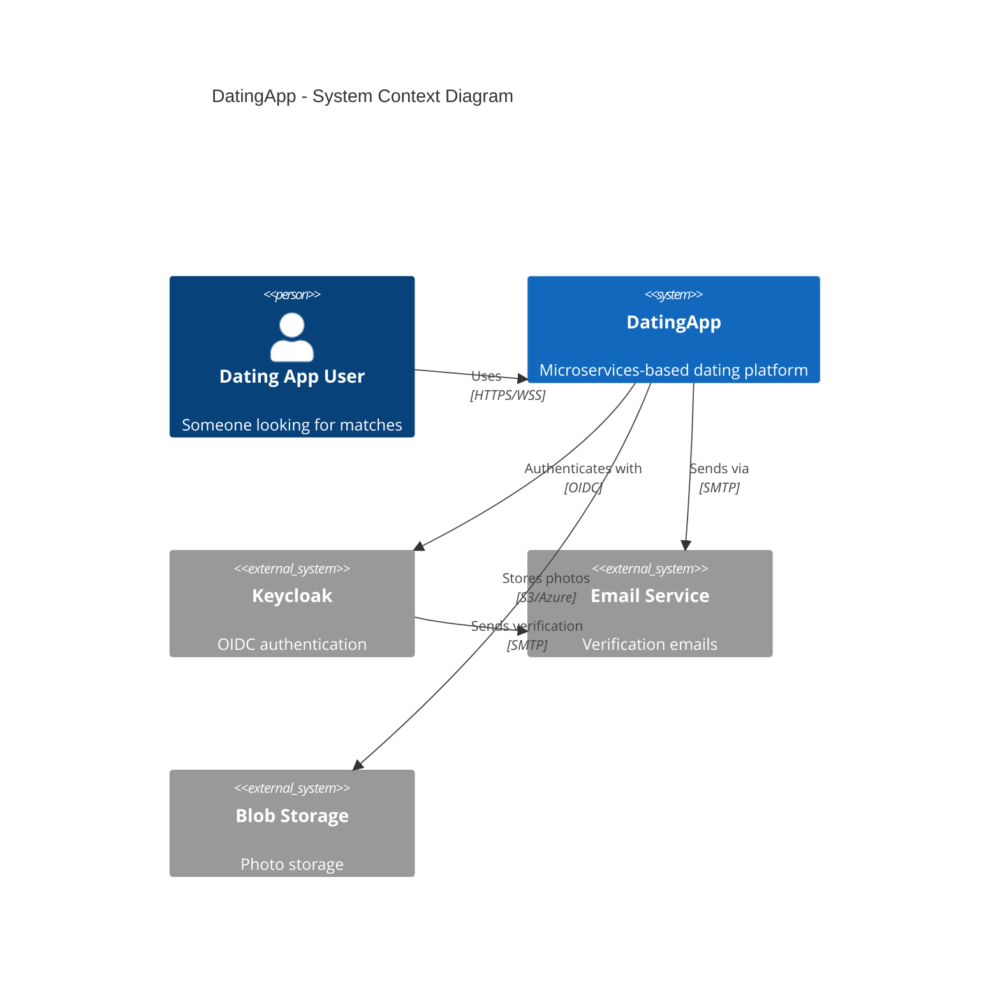
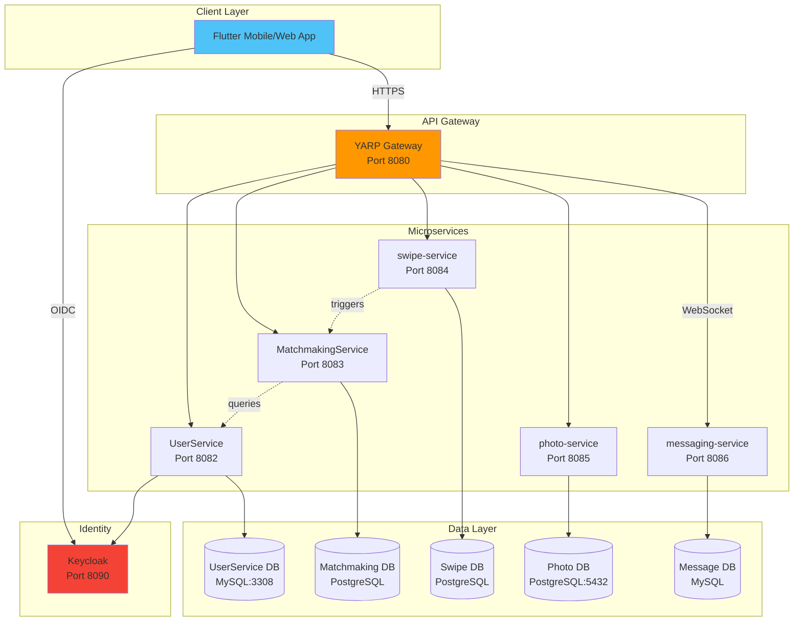
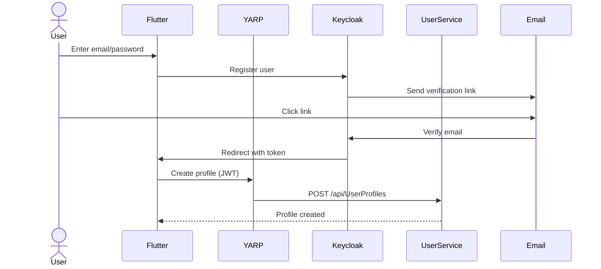
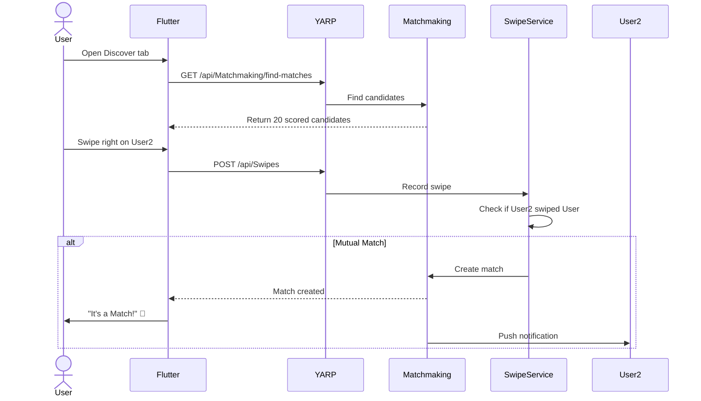
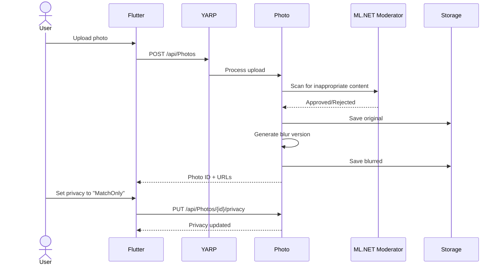
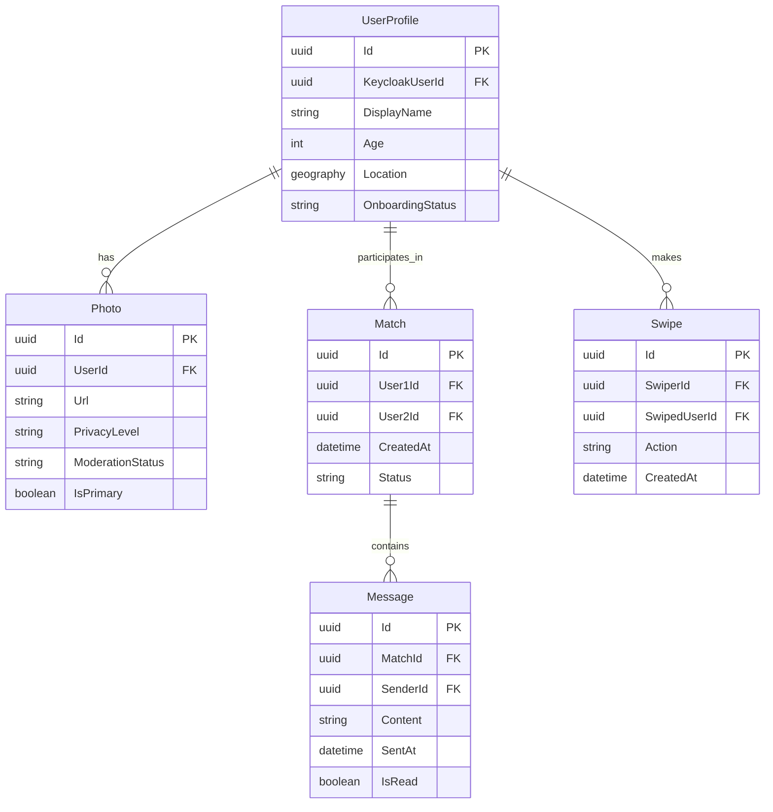

# Architecture Overview

**Last Updated**: 2026-01-24  
**Status**: As-Built (reflects current implementation)

---

## 🏗️ System Context (C4 Level 1)

---

## 🧩 Container Diagram (C4 Level 2)

---

## 📡 Service Responsibilities

| Service | Purpose | Database | Key APIs |
|---------|---------|----------|----------|
| **UserService** | Profile CRUD, verification, demographics | MySQL:3308 | GET/POST/PUT `/api/UserProfiles` |
| **MatchmakingService** | Compatibility scoring, candidate selection | PostgreSQL | POST `/api/Matchmaking/find-matches` |
| **swipe-service** | Swipe recording, mutual match detection | PostgreSQL | POST `/api/Swipes`, GET `/api/Swipes/matches` |
| **photo-service** | Upload, moderation, blur, privacy | PostgreSQL:5432 | POST `/api/Photos`, PUT `/api/Photos/{id}/privacy` |
| **messaging-service** | SignalR chat, delivery, moderation | MySQL | SignalR hub `/messagingHub` |
| **dejting-yarp** | API gateway, routing, rate limiting | None | Routes all `/api/*` traffic |
| **Keycloak** | Authentication, OIDC, user management | PostgreSQL | `/realms/dating/protocol/openid-connect` |

---

## 🔄 Key Workflows

### 1. User Registration

### 2. Match Discovery (Swipe Loop)

### 3. Photo Upload with Privacy

---

## 🗄️ Data Model (Simplified)

---

## 🔒 Security Architecture

### Authentication Flow
1. **Keycloak OIDC** - All auth via OpenID Connect
2. **JWT Tokens** - Stateless authentication
3. **YARP Middleware** - Token validation at gateway
4. **Service-to-Service** - No authentication (internal network trust)

### Privacy Controls
- **Photo Privacy Levels**: Public, Private, MatchOnly, VIP
- **Blur Enforcement**: Non-matches see blurred photos
- **Match-Only Messaging**: Can only message mutual matches
- **Block/Report**: (Planned - US4)

---

## 📈 Scalability Considerations

### Current (MVP)
- **Monolithic deployment** via Docker Compose
- **Single instance** per service
- **No caching** (direct DB queries)
- **No message queue** (synchronous processing)

### Future (Post-MVP)
- **Kubernetes** deployment
- **Horizontal scaling** for UserService, Matchmaking
- **Redis cache** for candidate queues
- **RabbitMQ** for async match notifications
- **CDN** for photo delivery

---

## 🔗 Related Documentation

- **[Feature Catalog](../features/README.md)** - What's built
- **[API Reference](../api/README.md)** - Endpoint docs
- **[Data Model](../../specs/001-mvp-foundation/data-model.md)** - Detailed schema
- **[Architecture Decisions](decisions/)** - ADRs

---

*Generated from actual codebase as of 2026-01-24*
