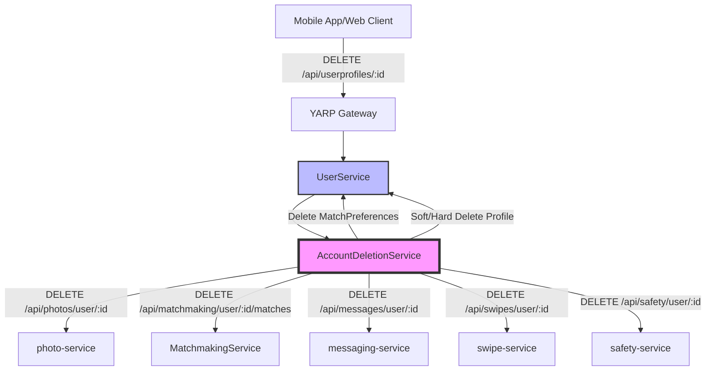
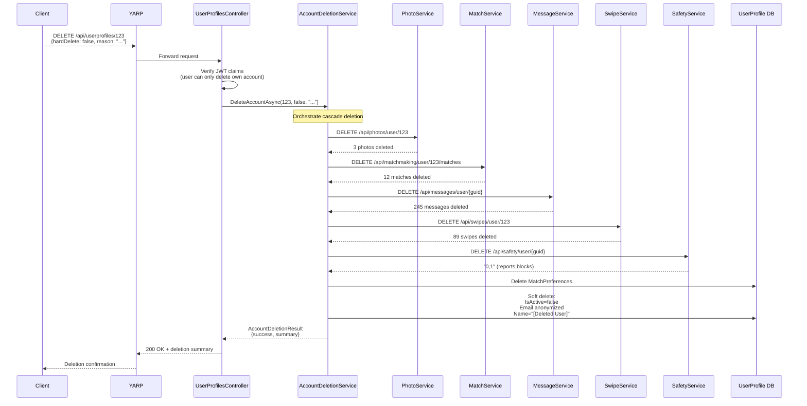
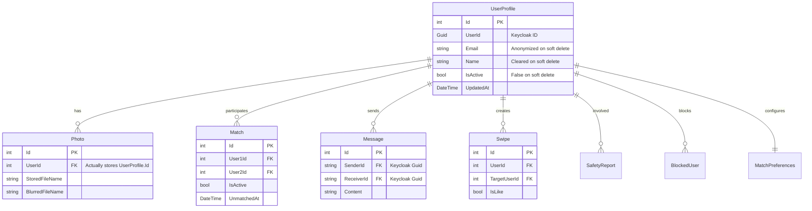

# Account Deletion Feature

## Layer 1: Feature Specification

### Business Context

Account deletion is a critical privacy feature and legal requirement (GDPR Article 17 - Right to Erasure) that allows users to permanently remove their data from the platform. The feature must handle data spread across multiple microservices while providing audit trails for compliance.

### User Stories

**US-1: Basic Account Deletion**
```
As a user
I want to delete my account
So that I can permanently remove my data from the platform
```

**US-2: Soft Delete for Safety**
```
As a platform administrator
I want deleted accounts to be anonymized but preserved
So that we can investigate safety reports and maintain moderation history
```

**US-3: GDPR Compliance**
```
As a data subject
I want to completely erase all my personal data
So that I exercise my right to be forgotten under GDPR
```

### Acceptance Criteria

- [x] User can only delete their own account (authorization check)
- [x] Soft delete anonymizes data but preserves for moderation
- [x] Hard delete removes all data across all services
- [x] Cascade deletion works across 6 microservices
- [x] Returns detailed summary of what was deleted
- [x] Continues on partial failures (best-effort)
- [x] Logs all deletion operations with timestamps
- [x] Supports optional reason tracking for analytics

---

## Layer 2: Implementation Plan

### Architecture Overview



### Data Flow Sequence



### Component Design

#### AccountDeletionService

**Responsibilities:**
- Orchestrate HTTP calls to all microservices
- Aggregate deletion results into summary
- Handle partial failures gracefully
- Support both soft and hard delete modes
- Track deletion counts per service

**Key Methods:**
```csharp
Task<AccountDeletionResult> DeleteAccountAsync(int userProfileId, bool hardDelete, string? reason)
Task<int> DeleteUserPhotosAsync(HttpClient, int profileId)
Task<int> DeleteUserMatchesAsync(HttpClient, int profileId)
Task<int> DeleteUserMessagesAsync(HttpClient, string userId)
Task<int> DeleteUserSwipesAsync(HttpClient, int profileId)
Task<(int, int)> DeleteUserSafetyDataAsync(HttpClient, string userId)
Task DeleteUserPreferencesAsync(int profileId)
```

### Technology Choices

| Choice | Rationale |
|--------|-----------|
| **Best-Effort Cascade** | Continue deleting even if some services fail; track errors in summary |
| **HTTP via YARP** | Consistent routing through gateway; leverages existing infrastructure |
| **Dual ID Strategy** | UserProfile.Id (int) for legacy services; UserId (Guid) for Keycloak-aware services |
| **Soft Delete Default** | Preserve data for legal/moderation; anonymize PII |
| **AllowAnonymous on Cascade Endpoints** | Service-to-service calls authenticated via network isolation, not JWT |

---

## Layer 3: API Contracts

### Primary Endpoint

#### Delete User Account

**Endpoint:** `DELETE /api/userprofiles/{id}`

**Authorization:** Required (Bearer token)

**Request Headers:**
```
Authorization: Bearer {jwt_token}
Content-Type: application/json
```

**Request Body:**
```json
{
  "hardDelete": false,
  "reason": "Found someone, no longer need app",
  "confirmationToken": "optional-2fa-token"
}
```

**Request Schema:**
```typescript
interface AccountDeletionRequest {
  hardDelete?: boolean;        // Default: false
  reason?: string;              // Analytics tracking
  confirmationToken?: string;   // Future 2FA support
}
```

**Success Response (200 OK):**
```json
{
  "success": true,
  "message": "Account deactivated and data removed",
  "summary": {
    "profileDeleted": true,
    "photosDeleted": 3,
    "matchesDeleted": 12,
    "messagesDeleted": 245,
    "swipesDeleted": 89,
    "safetyReportsDeleted": 0,
    "blocksDeleted": 1,
    "errors": [],
    "deletedAt": "2026-01-25T10:30:45Z"
  }
}
```

**Response Schema:**
```typescript
interface AccountDeletionResult {
  success: boolean;
  message: string;
  summary: AccountDeletionSummary;
}

interface AccountDeletionSummary {
  profileDeleted: boolean;
  photosDeleted: number;
  matchesDeleted: number;
  messagesDeleted: number;
  swipesDeleted: number;
  safetyReportsDeleted: number;
  blocksDeleted: number;
  errors: string[];
  deletedAt: string;  // ISO 8601
}
```

**Error Responses:**

| Code | Scenario | Response |
|------|----------|----------|
| 401 | Not authenticated | `Unauthorized` |
| 403 | Deleting another user's account | `Forbidden` |
| 404 | User profile not found | `{"success": false, "message": "User profile not found"}` |
| 500 | Unexpected error | `{"success": false, "message": "Error occurred during account deletion", "summary": {...}}` |

### Cascade Endpoints

#### Delete User Photos

**Endpoint:** `DELETE /api/photos/user/{userProfileId}`  
**Service:** photo-service  
**Authorization:** AllowAnonymous (internal)  
**Returns:** `200 OK` with count as plain text: `"3"`

#### Delete User Matches

**Endpoint:** `DELETE /api/matchmaking/user/{userProfileId}/matches`  
**Service:** MatchmakingService  
**Authorization:** AllowAnonymous (internal)  
**Returns:** `200 OK` with count: `"12"`

#### Delete User Messages

**Endpoint:** `DELETE /api/messages/user/{userId}`  
**Service:** messaging-service  
**Authorization:** AllowAnonymous (internal)  
**Parameter:** Keycloak userId (Guid as string)  
**Returns:** `200 OK` with count: `"245"`

#### Delete User Swipes

**Endpoint:** `DELETE /api/swipes/user/{userProfileId}`  
**Service:** swipe-service  
**Authorization:** AllowAnonymous (internal)  
**Returns:** `200 OK` with count: `"89"`

#### Delete User Safety Data

**Endpoint:** `DELETE /api/safety/user/{userId}`  
**Service:** safety-service  
**Authorization:** AllowAnonymous (internal)  
**Parameter:** Keycloak userId (Guid as string)  
**Returns:** `200 OK` with format: `"0,1"` (reports,blocks)

### Data Models



---

## Layer 4: Architecture Decisions

### ADR-001: Best-Effort Cascade with Error Tracking

**Context:**  
When deleting a user account, data must be removed from 6 independent microservices. Network failures or service downtime could prevent complete deletion.

**Decision:**  
Implement best-effort cascade deletion that continues even if individual services fail. Track all errors in `AccountDeletionSummary.Errors` list and log warnings.

**Consequences:**
- ✅ User accounts can be deleted even if some services are temporarily down
- ✅ Detailed error tracking aids troubleshooting
- ✅ Partial deletion is transparent to caller
- ⚠️ May leave orphaned data in failed services (requires retry mechanism in future)
- ⚠️ No distributed transaction guarantees

**Alternatives Considered:**
- Distributed transaction (2PC): Rejected due to complexity and performance impact
- All-or-nothing: Rejected as too rigid for microservices architecture
- Queue-based deletion: Deferred to future enhancement

### ADR-002: Soft Delete as Default Mode

**Context:**  
GDPR requires "right to erasure" but platform needs data for moderation and legal compliance.

**Decision:**  
Default to soft delete (IsActive=false, anonymize PII) unless `HardDelete=true` explicitly requested. Soft delete preserves UserProfile record with anonymized data.

**Consequences:**
- ✅ Meets legal obligations for moderation history
- ✅ Allows safety team to investigate past reports
- ✅ Preserves referential integrity for cascade deletions
- ✅ GDPR compliant when hard delete used
- ⚠️ Storage costs for inactive profiles

**Alternatives Considered:**
- Always hard delete: Rejected due to legal/moderation needs
- Move to archive table: Rejected as unnecessary complexity
- Never hard delete: Rejected due to GDPR Article 17 requirements

### ADR-003: Dual ID Strategy (ProfileId vs UserId)

**Context:**  
Some services use UserProfile.Id (int, auto-increment) while others use Keycloak UserId (Guid). AccountDeletionService must call both types.

**Decision:**  
AccountDeletionService retrieves both IDs from UserProfile entity and calls each service with its expected ID type:
- photo, matchmaking, swipe services: Use UserProfile.Id (int)
- messaging, safety services: Use UserProfile.UserId (Guid as string)

**Consequences:**
- ✅ Works with existing service APIs unchanged
- ✅ No breaking changes to cascade endpoints
- ✅ Clear separation of ID domains
- ⚠️ Future services must choose ID strategy carefully
- ⚠️ Inconsistency in API design across services

**Alternatives Considered:**
- Standardize on Guid across all services: Rejected due to migration cost
- Always pass both IDs: Rejected as confusing API contract
- Use path parameters with ID type hints: Rejected as overly complex

### ADR-004: Service-to-Service via YARP Gateway

**Context:**  
AccountDeletionService needs to call DELETE endpoints on 5 other microservices.

**Decision:**  
Route all cascade calls through YARP gateway using HttpClient with configurable base URL (`http://dejting-yarp:8080`). Mark cascade endpoints as `[AllowAnonymous]` since calls originate from trusted internal network.

**Consequences:**
- ✅ Consistent routing through single entry point
- ✅ Leverages existing YARP configuration
- ✅ Easy to add circuit breakers/retry via YARP extensions
- ✅ Network-level security (service mesh isolation)
- ⚠️ Slightly more latency than direct service-to-service
- ⚠️ YARP becomes critical path for account deletion

**Alternatives Considered:**
- Direct service-to-service HTTP: Rejected to avoid tight coupling
- Message queue for async deletion: Deferred to future enhancement
- Shared database for deletion flags: Rejected as anti-pattern for microservices

---

## Implementation Checklist

- [x] Layer 1: Feature spec with user stories and acceptance criteria
- [x] Layer 2: Architecture diagrams (components, sequence)
- [x] Layer 3: API contracts with request/response schemas
- [x] Layer 4: ADRs for key architectural decisions
- [x] Mermaid diagrams for visual understanding
- [x] Code implementation in UserService
- [x] Cascade endpoints in all 6 services
- [x] Build verification (all services compile)
- [x] Authorization checks (JWT claims)
- [x] Error handling and logging
- [x] Soft delete anonymization logic
- [x] Hard delete cascade logic

## Testing Status

- [ ] Unit tests for AccountDeletionService
- [ ] Integration tests for cascade flow
- [ ] Authorization test (cannot delete other users)
- [ ] Soft delete verification
- [ ] Hard delete verification
- [ ] Partial failure handling
- [ ] GDPR compliance audit

## Future Enhancements

1. **Retry Mechanism**: Queue failed deletions for retry
2. **Audit Log**: Dedicated audit table for deletion history
3. **2FA Confirmation**: Require confirmation token before deletion
4. **Data Export**: Provide data export before deletion (GDPR Article 20)
5. **Scheduled Deletion**: Allow users to schedule deletion for future date
6. **Notification**: Email confirmation after deletion completes

---

**Status:** ✅ **Implemented** | **Date:** 2026-01-20  
**Related ADRs:** ADR-001, ADR-002, ADR-003, ADR-004  
**Related Contracts:** [API Spec](../contracts/api-spec.md#account-deletion)
