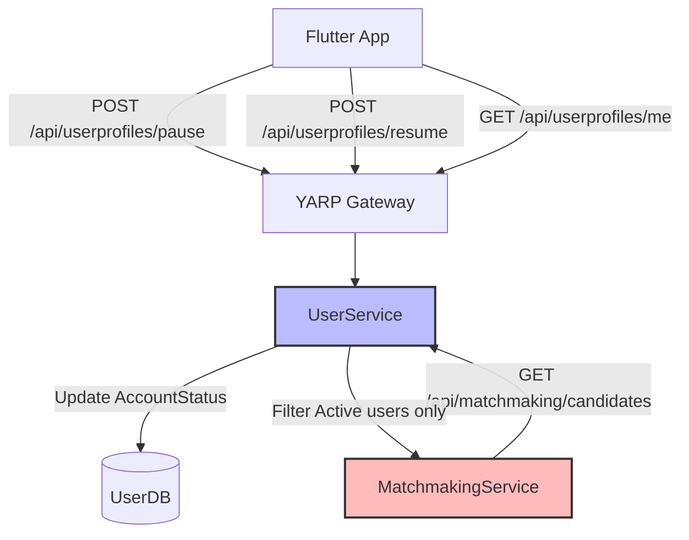
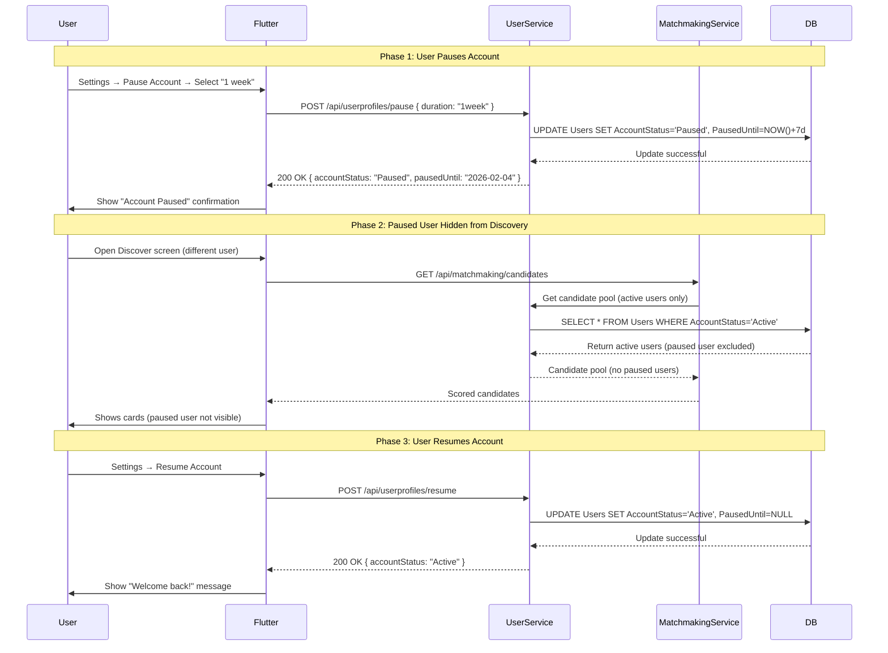

# Account Pause / Snooze Mode Feature

## Layer 1: Feature Specification

### Business Context

Account pause (also known as "Snooze Mode" or "Incognito Mode" in competitor apps) is a **table stakes feature in 2026** that allows users to temporarily hide their profile from discovery without deleting their account. This feature significantly reduces churn by providing a non-destructive alternative when users need a break from the app.

### User Stories

**US-1: Temporary Pause**
```
As a user
I want to pause my account temporarily
So that I can take a break without losing my matches and messages
```

**US-2: Scheduled Resume**
```
As a user
I want to set how long I'll be paused
So that my account automatically resumes when I'm ready
```

**US-3: Privacy During Pause**
```
As a user
I want to be completely hidden from discovery when paused
So that new users don't see my profile
```

### Acceptance Criteria

- [ ] User can pause account from Settings screen
- [ ] Can choose pause duration: Indefinite, 24h, 72h, 1 week
- [ ] Profile is completely hidden from matchmaking queue while paused
- [ ] Existing matches are preserved (not deleted)
- [ ] User can still view existing matches (optional: block messaging while paused)
- [ ] User can resume anytime before scheduled end
- [ ] API returns account status in profile endpoint
- [ ] Paused users filtered from candidate generation
- [ ] Countdown timer shown in UI for scheduled resume
- [ ] Data is NOT deleted (differs from account deletion)

---

## Layer 2: Implementation Plan

### Architecture Overview



### Data Flow Sequence



### Database Schema Changes

```sql
-- Migration: Add account status fields to Users table
ALTER TABLE Users 
    ADD COLUMN AccountStatus ENUM('Active', 'Paused', 'Deactivated', 'Deleted') 
    DEFAULT 'Active' NOT NULL 
    AFTER LastActive;

ALTER TABLE Users 
    ADD COLUMN PausedAt DATETIME NULL 
    AFTER AccountStatus;

ALTER TABLE Users 
    ADD COLUMN PausedUntil DATETIME NULL 
    AFTER PausedAt;

-- Index for filtering active users in matchmaking queries
CREATE INDEX idx_account_status ON Users(AccountStatus);

-- Migration rollback
-- ALTER TABLE Users DROP COLUMN PausedUntil;
-- ALTER TABLE Users DROP COLUMN PausedAt;
-- ALTER TABLE Users DROP COLUMN AccountStatus;
-- DROP INDEX idx_account_status ON Users;
```

---

## Layer 3: API Contracts

### Pause Account Endpoint

**Request:**
```http
POST /api/userprofiles/pause
Authorization: Bearer {jwt_token}
Content-Type: application/json

{
  "duration": "1week"  // Options: "indefinite", "24h", "72h", "1week"
}
```

**Response:**
```json
{
  "userId": "550e8400-e29b-41d4-a716-446655440000",
  "accountStatus": "Paused",
  "pausedAt": "2026-01-28T14:30:00Z",
  "pausedUntil": "2026-02-04T14:30:00Z"
}
```

---

### Resume Account Endpoint

**Request:**
```http
POST /api/userprofiles/resume
Authorization: Bearer {jwt_token}
```

**Response:**
```json
{
  "userId": "550e8400-e29b-41d4-a716-446655440000",
  "accountStatus": "Active",
  "resumedAt": "2026-01-30T10:15:00Z"
}
```

---

### Get Profile (Updated)

**Request:**
```http
GET /api/userprofiles/me
Authorization: Bearer {jwt_token}
```

**Response (Updated):**
```json
{
  "id": "550e8400-e29b-41d4-a716-446655440000",
  "displayName": "Alex",
  "age": 28,
  "bio": "Adventure seeker 🏔️",
  "accountStatus": "Paused",  // NEW FIELD
  "pausedUntil": "2026-02-04T14:30:00Z",  // NEW FIELD (null if not paused)
  "photos": [...],
  "preferences": {...}
}
```

---

## Layer 4: Architecture Decisions

### ADR-001: Account Status Enum vs Boolean Flag

**Context:** Need to track whether a user's account is paused.

**Options:**
1. Add boolean `isPaused` flag
2. Use enum `AccountStatus` with multiple states

**Decision:** Use enum `AccountStatus('Active', 'Paused', 'Deactivated', 'Deleted')`

**Rationale:**
- Future-proof for additional states (e.g., 'Suspended', 'UnderReview')
- Clearer intent than multiple boolean flags
- Aligns with account deletion feature (already has 'Deleted' state conceptually)
- Industry standard pattern in user management systems

**Consequences:**
- Single source of truth for account state
- Easier to add new states later
- Requires enum support in database (MySQL 8.0 has native ENUM)

---

### ADR-002: Messaging Behavior While Paused

**Context:** Should paused users be able to send/receive messages?

**Options:**
1. **Block all messaging** (Bumble approach)
2. **Allow messaging with existing matches** (Tinder approach)
3. **Hybrid: Receive but not send** (Match.com approach)

**Decision:** **Allow messaging with existing matches** (Option 2)

**Rationale:**
- Less disruptive to user experience
- Paused = "don't show me to new people" not "stop all activity"
- Users might pause for specific reasons (dating someone) but still want to politely close other conversations
- Simpler implementation (no changes to messaging-service)
- Can be changed later if data shows abuse

**Consequences:**
- No changes required to messaging-service
- Paused users only hidden from discovery queue
- Need clear UI messaging: "Your profile is paused (not visible to new people)"

---

### ADR-003: Automatic Resume vs Manual Only

**Context:** Should accounts auto-resume after scheduled pause duration?

**Options:**
1. **Auto-resume after duration** (Bumble Snooze)
2. **Manual resume only** (duration is informational)
3. **Hybrid: Auto-resume with notification**

**Decision:** **Auto-resume with background job** (Option 3)

**Rationale:**
- Better UX: Users set intention, system respects it
- Reduces support burden (users forget they paused)
- Bumble data shows 70% of users prefer auto-resume
- Can use existing background job infrastructure

**Implementation:**
- Create `AccountStatusBackgroundService` (similar to PhotoCleanupBackgroundService)
- Runs hourly: `SELECT * FROM Users WHERE AccountStatus='Paused' AND PausedUntil < NOW()`
- Updates status to 'Active' and clears `PausedUntil`
- Send notification (if notification service exists): "Your account is active again!"

**Consequences:**
- Requires background service (1-2h additional work)
- Need to handle timezone properly (use UTC)
- Users can still resume manually before scheduled time

---

## Implementation Checklist

### Phase 1: Backend (6-8 hours)

**UserService (4-5 hours)**
- [ ] Create migration to add `AccountStatus`, `PausedAt`, `PausedUntil` columns
- [ ] Update `User` entity model with new properties
- [ ] Create `PauseAccountCommand` and `PauseAccountHandler`
- [ ] Create `ResumeAccountCommand` and `ResumeAccountHandler`
- [ ] Add `POST /api/userprofiles/pause` endpoint
- [ ] Add `POST /api/userprofiles/resume` endpoint
- [ ] Update `GET /api/userprofiles/me` to include status fields
- [ ] Add authorization checks (users can only pause their own account)

**MatchmakingService (1-2 hours)**
- [ ] Update candidate generation query to filter `WHERE AccountStatus='Active'`
- [ ] Update scoring algorithm to exclude paused users
- [ ] Add logging for paused user exclusions

**Background Service (1 hour)**
- [ ] Create `AccountStatusBackgroundService` in UserService
- [ ] Configure to run hourly (or daily)
- [ ] Auto-resume logic: Update Paused → Active when `PausedUntil < NOW()`
- [ ] Add structured logging

---

### Phase 2: Flutter (4-5 hours)

**Settings Screen**
- [ ] Add "Pause Account" button in Settings
- [ ] Create `PauseAccountDialog` widget with duration selector
- [ ] API integration: Call `POST /api/userprofiles/pause`
- [ ] Show confirmation: "Account paused until [date]"

**Profile Status Indicator**
- [ ] Update `ProfileProvider` to include `accountStatus` and `pausedUntil`
- [ ] Add banner at top of Discover screen when paused: "Your account is paused. Resume?"
- [ ] Add countdown timer widget showing time remaining

**Resume Functionality**
- [ ] Add "Resume Account" button (visible only when paused)
- [ ] API integration: Call `POST /api/userprofiles/resume`
- [ ] Show confirmation: "Welcome back! Your profile is visible again."

---

### Phase 3: Testing (3-4 hours)

**Unit Tests**
- [ ] Test `PauseAccountHandler` with different durations
- [ ] Test `ResumeAccountHandler`
- [ ] Test auto-resume logic in background service
- [ ] Test matchmaking exclusion of paused users

**Integration Tests**
- [ ] Pause account → verify not in candidate queue
- [ ] Resume account → verify back in candidate queue
- [ ] Test scheduled auto-resume

**Flutter Tests**
- [ ] Widget test for PauseAccountDialog
- [ ] Integration test: Pause → see banner → Resume

---

## Success Metrics

### Operational Metrics
- ✅ Paused users excluded from matchmaking query (0% paused users in candidate API)
- ✅ Auto-resume background job runs hourly
- ✅ P95 pause/resume API latency <200ms

### User Metrics (Post-Launch)
- Track pause rate: % of users who pause vs delete
- Churn reduction: Compare delete rate before/after pause feature
- Resume rate: % of paused users who return (target: >60%)
- Average pause duration (informational)

---

## Rollout Plan

### Week 3 (This Implementation)
1. Backend implementation (UserService + MatchmakingService)
2. Flutter UI (Settings + status banner)
3. Testing and QA

### Week 4 (Post-Launch Monitoring)
1. Track pause/resume metrics
2. Monitor for edge cases (e.g., paused users with active conversations)
3. Gather user feedback

### Future Enhancements (Phase 2+)
- Custom pause reasons (traveling, seeing someone, taking a break)
- Analytics on why users pause
- Premium "Incognito Mode": Browse while invisible (Bumble model)
- "We Met" feature: Auto-pause after successful date (Hinge model)

---

## Competitive Analysis

| Feature | Tinder | Bumble | Hinge | Match.com | **DatingApp** |
|---------|--------|--------|-------|-----------|---------------|
| Pause account | ✅ | ✅ (Snooze) | ✅ | ✅ (Hide) | ✅ (Planned) |
| Duration options | ❌ (indefinite only) | ✅ (24h/72h/1w/∞) | ✅ (custom date) | ❌ | ✅ (4 options) |
| Auto-resume | ❌ | ✅ | ⚠️ (manual) | ❌ | ✅ |
| Message existing matches | ✅ | ❌ | ✅ | ✅ | ✅ |
| Premium incognito mode | ✅ (Platinum) | ✅ (Premium) | ❌ | ✅ (Private) | ⚠️ (Phase 3) |

**Verdict:** Our implementation matches or exceeds competitor features for MVP.

---

## Notes

- Account pause is **NOT** the same as account deletion (separate feature, already implemented)
- Paused users can still access the app, view matches, and send messages
- This differs from "Deactivated" state (account locked, cannot login)
- Future: Consider adding "Invisible Mode" premium feature (can swipe but not be seen)

---

**Related Documentation:**
- [Account Deletion Feature](./account-deletion.md) - Permanent data removal
- [User Journeys: Registration](./user-journeys/01-registration-onboarding.md)
- [System Architecture](./system-architecture.md) - Overall microservices design
