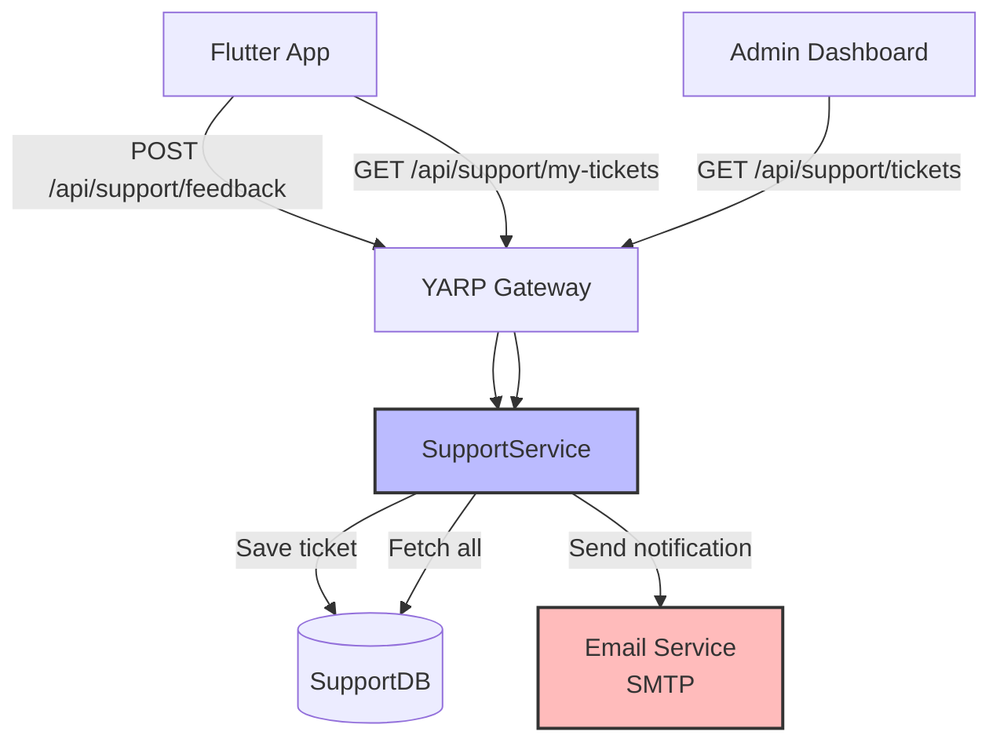
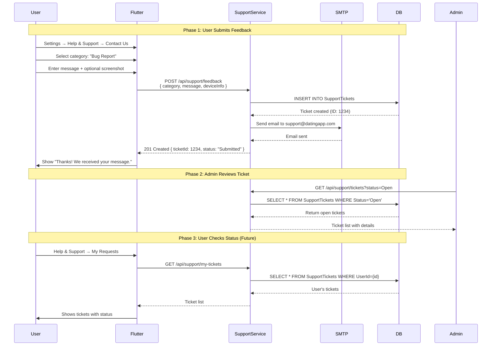

# Feedback & Customer Support System

## Layer 1: Feature Specification

### Business Context

A customer support system is essential for beta launch to collect user feedback, bug reports, and provide a support channel. This feature enables users to contact the team without leaving the app, improving user retention and providing valuable product insights.

### User Stories

**US-1: Submit Feedback**
```
As a user
I want to submit feedback in the app
So that I can report issues or suggest features without using email
```

**US-2: Bug Reporting**
```
As a user experiencing a bug
I want to report the issue with context automatically included
So that the support team can reproduce and fix it quickly
```

**US-3: Support Ticket Tracking**
```
As a user who submitted feedback
I want to see the status of my request
So that I know it's being addressed
```

### Acceptance Criteria

- [ ] User can access "Help & Support" from Settings screen
- [ ] Contact form supports categories: Bug, Feature Request, Account Issue, Safety Concern
- [ ] Form collects context: user ID, app version, device info, OS version
- [ ] User can optionally attach screenshot
- [ ] Submissions sent via email to support@datingapp.com
- [ ] User receives confirmation: "We received your message"
- [ ] Admin can view submissions (basic list view, can be manual initially)
- [ ] Response within 24-48h (manual for beta, automated later)

---

## Layer 2: Implementation Plan

### Architecture Overview



### Data Flow Sequence



### Database Schema

```sql
CREATE TABLE SupportTickets (
    Id VARCHAR(36) PRIMARY KEY,
    UserId VARCHAR(36) NOT NULL,
    Category ENUM('Bug', 'Feature', 'Account', 'Safety', 'Other') NOT NULL,
    Subject VARCHAR(255) NOT NULL,
    Message TEXT NOT NULL,
    DeviceInfo JSON NULL,  -- { os, osVersion, appVersion, deviceModel }
    ScreenshotUrl VARCHAR(500) NULL,
    Status ENUM('Open', 'InProgress', 'Resolved', 'Closed') DEFAULT 'Open',
    Priority ENUM('Low', 'Medium', 'High', 'Critical') DEFAULT 'Medium',
    CreatedAt DATETIME NOT NULL DEFAULT CURRENT_TIMESTAMP,
    UpdatedAt DATETIME NOT NULL DEFAULT CURRENT_TIMESTAMP ON UPDATE CURRENT_TIMESTAMP,
    ResolvedAt DATETIME NULL,
    AssignedTo VARCHAR(36) NULL,  -- Future: admin user ID
    
    INDEX idx_user_id (UserId),
    INDEX idx_status (Status),
    INDEX idx_created_at (CreatedAt)
);
```

---

## Layer 3: API Contracts

### Submit Feedback Endpoint

**Request:**
```http
POST /api/support/feedback
Authorization: Bearer {jwt_token}
Content-Type: application/json

{
  "category": "Bug",
  "subject": "Photos not uploading",
  "message": "When I try to upload a photo, the app crashes after selecting from gallery.",
  "deviceInfo": {
    "os": "iOS",
    "osVersion": "17.2",
    "appVersion": "1.0.0+23",
    "deviceModel": "iPhone 14 Pro"
  },
  "screenshotUrl": "blob://local/screenshot.png"  // Optional
}
```

**Response:**
```json
{
  "ticketId": "550e8400-e29b-41d4-a716-446655440000",
  "status": "Open",
  "message": "Thank you for your feedback. We'll respond within 24-48 hours.",
  "createdAt": "2026-01-28T14:30:00Z"
}
```

---

### Get User's Tickets

**Request:**
```http
GET /api/support/my-tickets
Authorization: Bearer {jwt_token}
```

**Response:**
```json
{
  "tickets": [
    {
      "ticketId": "550e8400-e29b-41d4-a716-446655440000",
      "category": "Bug",
      "subject": "Photos not uploading",
      "status": "InProgress",
      "createdAt": "2026-01-28T14:30:00Z",
      "updatedAt": "2026-01-29T09:15:00Z"
    }
  ],
  "total": 1
}
```

---

### Admin: Get All Tickets

**Request:**
```http
GET /api/support/tickets?status=Open&page=1&limit=20
Authorization: Bearer {admin_jwt_token}
```

**Response:**
```json
{
  "tickets": [
    {
      "ticketId": "550e8400-e29b-41d4-a716-446655440000",
      "userId": "user-123",
      "userEmail": "user@example.com",
      "category": "Bug",
      "subject": "Photos not uploading",
      "message": "When I try to upload...",
      "deviceInfo": {
        "os": "iOS",
        "osVersion": "17.2",
        "appVersion": "1.0.0+23"
      },
      "status": "Open",
      "priority": "High",
      "createdAt": "2026-01-28T14:30:00Z"
    }
  ],
  "total": 47,
  "page": 1,
  "pageSize": 20
}
```

---

## Layer 4: Architecture Decisions

### ADR-001: Dedicated Service vs Extension of UserService

**Context:** Where should support ticket functionality live?

**Options:**
1. Extend UserService with support endpoints
2. Create dedicated SupportService microservice
3. Use third-party service (Zendesk, Intercom)

**Decision:** **Extend UserService** (Option 1)

**Rationale:**
- Support tickets are user-centric data
- Low complexity for MVP (simple CRUD operations)
- Avoid microservice overhead for small feature
- Can extract to dedicated service later if volume grows
- UserService already has email infrastructure
- Cost: Third-party tools expensive for beta scale

**Consequences:**
- Support code lives in UserService/Controllers/SupportController.cs
- SupportTickets table in UserService database
- Can migrate to dedicated service in Phase 2 if needed

---

### ADR-002: Email Notification Strategy

**Context:** How to notify support team of new tickets?

**Options:**
1. **Email to support@datingapp.com** (SMTP)
2. **Slack webhook** (instant notification)
3. **Both email + Slack**
4. **Admin dashboard polling** (no push notifications)

**Decision:** **Email first, add Slack later** (Option 1 → Option 3)

**Rationale:**
- Email is universal, no external dependencies
- Support inbox can use existing tools (Gmail, Outlook)
- Creates audit trail
- Slack webhook is 30 min additional work - can add in Phase 2
- Admin dashboard polling requires constant checking

**Implementation:**
- Phase 1: SMTP email to support@datingapp.com
- Phase 2: Add Slack webhook for urgent categories (Safety, Critical bugs)

**Consequences:**
- Need SMTP configuration in appsettings.json
- Support team checks support@datingapp.com inbox
- Can integrate with existing ticketing system if adopted

---

### ADR-003: User Response Mechanism

**Context:** How should support team respond to users?

**Options:**
1. **Email replies** (user's registered email)
2. **In-app messaging** (custom notification system)
3. **Push notifications** → open ticket in app
4. **No response** (view-only)

**Decision:** **Email replies for MVP** (Option 1)

**Rationale:**
- Simplest implementation (no additional infrastructure)
- Users already check email for account verification
- In-app messaging requires notification service (planned for push notifications in P1-003)
- Can add in-app responses later when notification service exists

**Consequences:**
- Support team replies directly to user's email
- TicketId included in email subject: "[Ticket #1234] Re: Photos not uploading"
- Phase 2: Integrate with push notification service for in-app alerts

---

## Implementation Checklist

### Phase 1: Backend (6-7 hours)

**UserService Updates**
- [ ] Create `SupportTickets` table migration
- [ ] Create `SupportTicket` entity model
- [ ] Create `SubmitFeedbackCommand` and handler
- [ ] Create `SupportController` with POST `/api/support/feedback`
- [ ] Add GET `/api/support/my-tickets` (user's own tickets)
- [ ] Add GET `/api/support/tickets` (admin only)
- [ ] Configure SMTP settings in appsettings.json
- [ ] Create `EmailService` helper for sending notifications
- [ ] Add authorization: Users can only see their own tickets

**Email Template**
```html
Subject: [Support Ticket #1234] New Bug Report from user@example.com

Category: Bug
User: user@example.com (ID: 550e8400-e29b-41d4-a716-446655440000)
Subject: Photos not uploading

Message:
When I try to upload a photo, the app crashes after selecting from gallery.

Device Info:
- OS: iOS 17.2
- App Version: 1.0.0+23
- Device: iPhone 14 Pro

Screenshot: [URL if provided]

Created: 2026-01-28 14:30:00 UTC

---
Reply to this email to respond to the user.
```

---

### Phase 2: Flutter (3-4 hours)

**Settings Screen**
- [ ] Add "Help & Support" menu item in Settings
- [ ] Create `HelpSupportScreen` widget
- [ ] Add FAQ section (static list of common questions)
- [ ] Add "Contact Us" button → opens feedback form

**Feedback Form**
- [ ] Create `FeedbackFormScreen` widget
- [ ] Category dropdown: Bug, Feature Request, Account Issue, Safety, Other
- [ ] Subject text field (required)
- [ ] Message text area (required, min 10 chars)
- [ ] Auto-collect device info (package: device_info_plus)
- [ ] Optional: Screenshot picker
- [ ] Submit button → API call
- [ ] Show success dialog: "Thanks! Ticket #1234 submitted"

**My Tickets Screen** (Optional for MVP)
- [ ] Create `MyTicketsScreen` widget
- [ ] List user's submitted tickets with status
- [ ] Tap ticket → view details
- [ ] Pull-to-refresh

---

### Phase 3: Testing (1-2 hours)

**Unit Tests**
- [ ] Test `SubmitFeedbackHandler` creates ticket
- [ ] Test email service sends notification
- [ ] Test authorization (user can only view own tickets)

**Integration Tests**
- [ ] Submit feedback → verify ticket in DB
- [ ] Submit feedback → verify email sent
- [ ] Get my tickets → verify correct tickets returned

**Flutter Tests**
- [ ] Widget test for feedback form validation
- [ ] Integration test: Submit feedback → success dialog

---

## Success Metrics

### Operational Metrics
- ✅ Ticket submission endpoint <500ms P95 latency
- ✅ Email delivery within 5 seconds of submission
- ✅ Zero duplicate ticket submissions (idempotency)

### User Metrics (Post-Launch)
- Track submission rate: tickets per 100 DAU
- Category distribution (identify common issues)
- Response time (target: <24h for beta)
- Resolution time (informational)

### Quality Metrics
- Useful feedback rate (subjective, review manually)
- Spam/abuse rate (should be <1%)

---

## Rollout Plan

### Week 3 (This Implementation)
1. Backend: SupportController + email notifications
2. Flutter: Help & Support screen + feedback form
3. Testing and QA

### Week 4 (Post-Launch)
1. Monitor submission patterns
2. Create FAQ based on common questions
3. Train support team on response process

### Future Enhancements (Phase 2+)
- Slack webhook for urgent tickets
- In-app notifications when ticket status changes
- Canned responses for common issues
- Ticket voting: "Is this helpful?" for responses
- Knowledge base / Help Center (Markdown articles)

---

## Competitive Analysis

| Feature | Tinder | Bumble | Hinge | **DatingApp** |
|---------|--------|--------|-------|---------------|
| In-app contact form | ✅ | ✅ | ✅ | ✅ (Planned) |
| Help Center / FAQ | ✅ | ✅ | ✅ | ✅ (Static MVP) |
| Category selection | ✅ | ✅ | ✅ | ✅ |
| Ticket tracking | ❌ | ⚠️ (limited) | ❌ | ✅ |
| Live chat support | ⚠️ (Premium) | ⚠️ (Premium) | ❌ | ❌ (Email only) |
| Response SLA | 48h | 24-48h | 72h | 24-48h (MVP) |

**Verdict:** Our implementation meets industry standards for beta/MVP phase.

---

## Notes

- For MVP/beta scale (100-1000 users), email-based support is sufficient
- As scale grows, consider third-party tools:
  - Zendesk ($19/mo/agent)
  - Intercom ($74/mo base)
  - Freshdesk (free up to 10 agents)
- Current implementation allows easy integration with these tools later
- Support ticket IDs can be used as reference in any future system

---

**Related Documentation:**
- [Account Deletion Feature](./account-deletion.md) - Account issues category
- [Safety & Privacy Journey](./user-journeys/04-safety-privacy.md) - Safety concerns category
- [System Architecture](./system-architecture.md) - Email service integration
