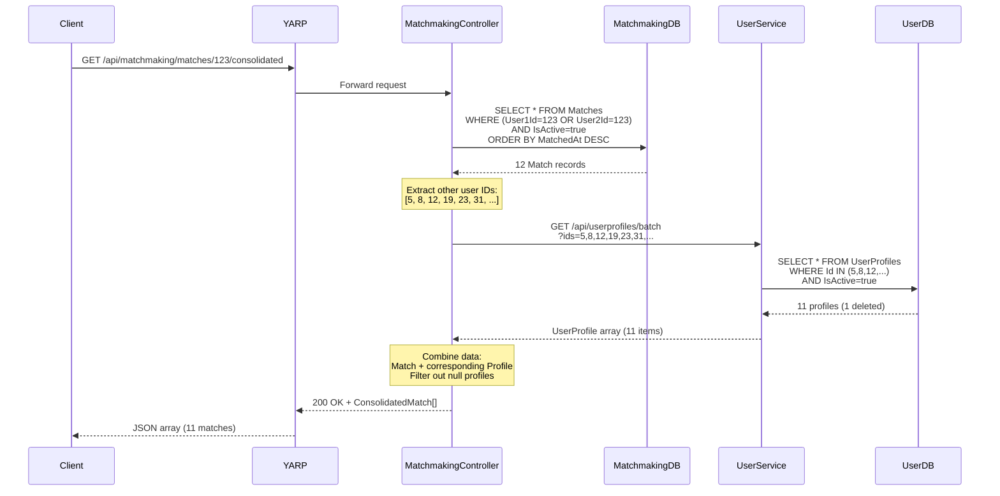
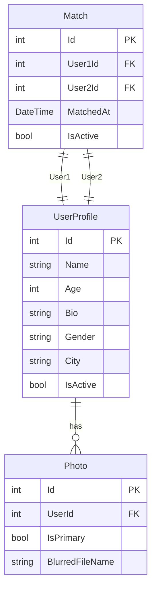

# Consolidated Match List Feature

## Layer 1: Feature Specification

### Business Context

Users need a single source of truth to view all their active matches with complete profile information. Previously, the client would need to fetch matches from MatchmakingService, then make individual calls to UserService for each match's profile details. The consolidated endpoint reduces network round-trips and provides a better UX.

### User Stories

**US-1: View All Matches**
```
As a user
I want to see all my active matches with their photos and profiles
So that I can decide who to message
```

**US-2: Performance Optimization**
```
As a product manager
I want the match list to load quickly
So that users have a smooth experience when opening the app
```

**US-3: Accurate Status**
```
As a user
I want to see deleted/deactivated accounts removed from my match list
So that I don't waste time on unavailable profiles
```

### Acceptance Criteria

- [x] Returns all active matches where user is participant (User1Id OR User2Id)
- [x] Each match includes full UserProfile for the **other** user
- [x] Filters out matches where other user IsActive=false (deleted accounts)
- [x] Sorted by MatchedAt descending (newest first)
- [x] Single endpoint call replaces Match list + N profile fetches
- [x] UserProfile includes Id, Name, Bio, Age, Gender, City (no sensitive data)
- [x] Response time under 500ms for <100 matches

---

## Layer 2: Implementation Plan

### Data Aggregation Flow

```mermaid
graph LR
    Client[Mobile/Web Client]
    YARP[YARP Gateway]
    Controller[MatchmakingController]
    MatchDB[(MatchmakingDB)]
    UserAPI[UserService API]
    
    Client -->|GET /api/matchmaking/matches/:userId/consolidated| YARP
    YARP --> Controller
    
    Controller -->|1. Query active matches<br/>WHERE User1Id OR User2Id| MatchDB
    MatchDB -->|Return 12 Match entities| Controller
    
    Controller -->|2. Extract other user IDs<br/>[5, 8, 12, 19, ...]| Controller
    Controller -->|3. GET /api/userprofiles/batch<br/>?ids=5,8,12,...| UserAPI
    UserAPI -->|Return UserProfile list| Controller
    
    Controller -->|4. Combine Match + Profile| Controller
    Controller -->|ConsolidatedMatch array| YARP
    YARP -->|JSON response| Client
    
    style Controller fill:#f9f,stroke:#333,stroke-width:4px
```

### Request Sequence



### Component Design

#### MatchmakingController.GetConsolidatedMatches

**Method Signature:**
```csharp
[HttpGet("matches/{userId}/consolidated")]
public async Task<ActionResult<IEnumerable<ConsolidatedMatchDto>>> GetConsolidatedMatches(int userId)
```

**Logic Steps:**
1. Query active matches for userId from MatchmakingDB
2. Extract "other user IDs" (if User1Id=userId, take User2Id, else User1Id)
3. Call UserService batch endpoint to fetch profiles for all IDs
4. Zip matches with profiles
5. Filter out matches where profile is null (deleted users)
6. Return ConsolidatedMatchDto array

**Performance Considerations:**
- Use `.Include()` if Match has navigation properties
- Single HTTP call to UserService (batch endpoint)
- Consider caching UserProfiles (future enhancement)

---

## Layer 3: API Contracts

### Consolidated Match List Endpoint

**Endpoint:** `GET /api/matchmaking/matches/{userId}/consolidated`

**Authorization:** Required (Bearer token)

**Path Parameters:**
- `userId` (integer): UserProfile.Id to get matches for

**Request Headers:**
```
Authorization: Bearer {jwt_token}
```

**Query Parameters:** None

**Success Response (200 OK):**
```json
[
  {
    "matchId": 42,
    "matchedAt": "2026-01-15T14:30:00Z",
    "otherUser": {
      "id": 5,
      "name": "Alice",
      "age": 28,
      "bio": "Love hiking and coffee",
      "gender": "Female",
      "city": "Stockholm",
      "primaryPhotoUrl": "https://photos.example.com/alice-blur.jpg"
    }
  },
  {
    "matchId": 38,
    "matchedAt": "2026-01-14T09:12:00Z",
    "otherUser": {
      "id": 8,
      "name": "Bob",
      "age": 32,
      "bio": "Tech enthusiast",
      "gender": "Male",
      "city": "Gothenburg",
      "primaryPhotoUrl": "https://photos.example.com/bob-blur.jpg"
    }
  }
]
```

**Response Schema:**
```typescript
interface ConsolidatedMatchDto {
  matchId: number;
  matchedAt: string;  // ISO 8601
  otherUser: UserProfileSummary;
}

interface UserProfileSummary {
  id: number;
  name: string;
  age: number;
  bio: string | null;
  gender: string;
  city: string | null;
  primaryPhotoUrl: string | null;  // Blurred version
}
```

**Empty Response (200 OK):**
```json
[]
```
*Returned when user has no active matches.*

**Error Responses:**

| Code | Scenario | Response |
|------|----------|----------|
| 401 | Not authenticated | `Unauthorized` |
| 403 | Requesting another user's matches | `Forbidden` |
| 500 | Service communication error | `{"message": "Error fetching matches"}` |

### Supporting Endpoints

#### Batch User Profiles

**Endpoint:** `GET /api/userprofiles/batch?ids={comma-separated}`

**Service:** UserService

**Example Request:**
```
GET /api/userprofiles/batch?ids=5,8,12,19,23,31
```

**Example Response:**
```json
[
  {
    "id": 5,
    "name": "Alice",
    "age": 28,
    "bio": "Love hiking and coffee",
    "gender": "Female",
    "city": "Stockholm",
    "primaryPhotoUrl": "https://photos.example.com/alice-blur.jpg"
  },
  {
    "id": 8,
    "name": "Bob",
    ...
  }
]
```

**Authorization:** AllowAnonymous (internal service-to-service)

**Notes:**
- Returns only active profiles (IsActive=true)
- Missing IDs silently excluded from response
- Order not guaranteed

### Data Model



**Data Aggregation Strategy:**

1. **MatchmakingService** fetches Match records
2. **UserService** fetches UserProfile + primary Photo (via batch endpoint)
3. **MatchmakingController** combines data into ConsolidatedMatchDto

---

## Layer 4: Architecture Decisions

### ADR-009: Single Consolidated Endpoint vs Client-Side Aggregation

**Context:**  
Client needs Match data + UserProfile data to render match list. Two options:
1. Client calls MatchmakingService, then UserService for each profile
2. Server provides consolidated endpoint

**Decision:**  
Implement server-side consolidated endpoint that aggregates Match + UserProfile data via batch call to UserService.

**Consequences:**
- ✅ Reduces network round-trips from N+1 to 2 (client → matchmaking, matchmaking → user)
- ✅ Faster perceived performance on mobile
- ✅ Simpler client code
- ✅ Server can optimize batch fetching
- ⚠️ Tighter coupling between MatchmakingService and UserService
- ⚠️ More complex backend logic

**Alternatives Considered:**
- Client-side aggregation: Rejected due to poor mobile performance (N+1 requests)
- GraphQL endpoint: Deferred to future as over-engineering for MVP
- Materialized view in shared DB: Rejected as anti-pattern for microservices

### ADR-010: Batch Endpoint for UserProfile Fetching

**Context:**  
MatchmakingService needs to fetch multiple UserProfiles efficiently.

**Decision:**  
Create `GET /api/userprofiles/batch?ids=1,2,3` endpoint in UserService that accepts comma-separated IDs and returns array of profiles.

**Consequences:**
- ✅ Single HTTP call instead of N calls
- ✅ Database can optimize with IN clause
- ✅ Reusable for other services needing batch profiles
- ⚠️ URL length limit (~2000 chars) constrains batch size
- ⚠️ No pagination (assumes <100 matches per user)

**Alternatives Considered:**
- POST with JSON body: Rejected to keep endpoint simple (GET is cacheable)
- GraphQL: Deferred to future
- Individual GET calls with connection pooling: Rejected as inefficient

### ADR-011: Filter Deleted Users Server-Side

**Context:**  
When user deletes account (IsActive=false), their matches should disappear from other users' match lists.

**Decision:**  
UserService batch endpoint returns only active profiles (WHERE IsActive=true). MatchmakingController filters out matches with null profiles before returning to client.

**Consequences:**
- ✅ Client sees accurate match list without deleted accounts
- ✅ Privacy preserved (deleted users invisible)
- ✅ No client-side filtering logic needed
- ⚠️ Match count may differ from what DB shows (includes inactive)

**Alternatives Considered:**
- Client-side filtering: Rejected as leaks deleted user info
- Cascade delete matches on account deletion: Deferred (preserves analytics)
- Mark matches as invalid: Rejected as redundant with IsActive filtering

### ADR-012: Include Blurred Photo in Response

**Context:**  
Match list needs to show photos, but blur verification may not be complete for all users.

**Decision:**  
Include `primaryPhotoUrl` field pointing to blurred version of primary photo. If no photo exists, return `null`. Client shows placeholder.

**Consequences:**
- ✅ Privacy-first (never expose unblurred photos in public endpoints)
- ✅ Consistent with photo-service blur pipeline
- ✅ Graceful degradation (null → placeholder)
- ⚠️ Adds complexity to UserService batch endpoint (join with Photo table)

**Alternatives Considered:**
- Always include original photo: Rejected due to privacy concerns
- Separate photo fetch: Rejected as defeats purpose of consolidated endpoint
- Omit photos entirely: Rejected as poor UX

---

## Implementation Checklist

- [x] Layer 1: Feature spec with user stories
- [x] Layer 2: Data aggregation and sequence diagrams
- [x] Layer 3: API contract with schemas
- [x] Layer 4: ADRs for key decisions
- [x] Consolidated endpoint implementation
- [x] Batch UserProfile endpoint in UserService
- [x] Authorization checks
- [x] Filter inactive users
- [x] Build verification

## Testing Status

- [ ] Unit test: Consolidated endpoint returns correct data
- [ ] Unit test: Filters out deleted users
- [ ] Unit test: Empty match list
- [ ] Unit test: Authorization (cannot view other users' matches)
- [ ] Integration test: Batch endpoint correctness
- [ ] Performance test: 100 matches load time <500ms
- [ ] Performance test: Batch endpoint with 50 IDs

## Performance Metrics

**Target:** Match list loads in <500ms for typical user

| Metric | Target | Current |
|--------|--------|---------|
| Database query time | <50ms | TBD |
| UserService batch call | <100ms | TBD |
| Total response time | <500ms | TBD |
| Batch size limit | 100 IDs | 100 IDs |

## Future Enhancements

1. **Pagination**: Support `?page=1&limit=20` for users with many matches
2. **Caching**: Cache UserProfile data in Redis (invalidate on profile update)
3. **Include Last Message**: Add `lastMessage` field to show conversation preview
4. **Include Unread Count**: Add `unreadCount` to highlight active conversations
5. **Sort Options**: Allow sorting by MatchedAt, LastActivity, Name
6. **Filter Options**: Allow filtering by Gender, Age, City
7. **Favorite Matches**: Allow users to pin/favorite certain matches

---

**Status:** ✅ **Implemented** | **Date:** 2026-01-20  
**Related ADRs:** ADR-009, ADR-010, ADR-011, ADR-012  
**Related Features:** [Unmatch](./unmatch.md), [Account Deletion](./account-deletion.md)
