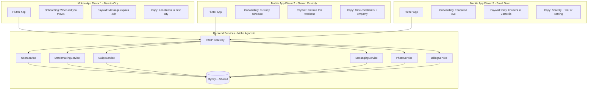

# Niche-Agnostic Backend Architecture
**Multi-Flavor Mobile Strategy**

**Status**: 🟡 Planning Phase  
**Priority**: P1 (Foundational for Growth)  
**Last Updated**: 2026-01-28

---

## Philosophy

**Problem**: We might not hit the right niche on the first try.

**Solution**: 
- **Backend = Niche-Agnostic**: One set of services supports ANY niche
- **Mobile Apps = Niche-Specific**: Multiple Flutter app flavors/variants for different target markets
- **Fast Iteration**: Test new niche = new mobile app build, backend unchanged

---

## Architecture Overview



**Key Principle**: Backend services don't know or care about niche. All niche logic lives in mobile app + flexible backend filtering.

---

## Backend Design (Niche-Agnostic)

### 1. User Profile — Generic Metadata Fields

**Current Schema** (UserService/Data/Models/User.cs):
```csharp
public class User {
    public string UserId { get; set; }
    public string Email { get; set; }
    public string Name { get; set; }
    public DateTime DateOfBirth { get; set; }
    // ... existing fields
}
```

**Add Generic Niche Fields** (flexible, not hardcoded):
```csharp
public class User {
    // ... existing fields
    
    // Generic niche targeting (JSON metadata)
    public string NicheMetadata { get; set; } // JSON: App determines structure
    
    // Examples of what mobile apps might store:
    // Flavor 1 (New to City): {"movedToCity": "2025-12-01", "city": "Stockholm"}
    // Flavor 2 (Custody): {"custodySchedule": "EOWE", "kidFreeWeekends": []}
    // Flavor 3 (Small Town): {"educationLevel": "Masters", "town": "Västerås"}
    
    // Generic filter fields (indexed for performance)
    public DateTime? NicheDate { get; set; }      // e.g., moved to city date, divorce date
    public string NicheCategory { get; set; }     // e.g., "new_to_city", "shared_custody"
    public string NicheLocation { get; set; }     // e.g., "Stockholm", "Västerås"
}
```

**Why This Works**:
- ✅ Backend doesn't need code changes per niche
- ✅ Mobile app sends niche-specific data during onboarding
- ✅ Match algorithm can filter generically: `WHERE NicheDate > DATE_SUB(NOW(), INTERVAL 6 MONTH)`
- ✅ Add new niche = just populate metadata differently, no DB migration

---

### 2. Match Algorithm — Generic Filtering

**Current MatchmakingService** (hardcoded logic):
```csharp
// BAD: Niche-specific logic in backend
var matches = await _dbContext.Users
    .Where(u => u.City == userCity && 
                u.MovedToCityDate > DateTime.UtcNow.AddMonths(-6)) // HARDCODED
    .ToListAsync();
```

**Niche-Agnostic Approach** (filter via request params):
```csharp
// GOOD: Mobile app specifies filters
public class GetMatchesRequest {
    public string UserId { get; set; }
    public Dictionary<string, object> Filters { get; set; } // Flexible filters
}

// Backend applies generic filters
var query = _dbContext.Users.AsQueryable();

if (request.Filters.ContainsKey("nicheDate")) {
    var dateThreshold = (DateTime)request.Filters["nicheDate"];
    query = query.Where(u => u.NicheDate >= dateThreshold);
}

if (request.Filters.ContainsKey("nicheLocation")) {
    var location = (string)request.Filters["nicheLocation"];
    query = query.Where(u => u.NicheLocation == location);
}

var matches = await query.ToListAsync();
```

**Mobile App Controls Niche Logic**:
```dart
// Flutter App Flavor 1: New to City
final matches = await matchApi.getMatches(
  userId: currentUser.id,
  filters: {
    'nicheDate': DateTime.now().subtract(Duration(days: 180)), // <6 months
    'nicheLocation': 'Stockholm',
  },
);

// Flutter App Flavor 2: Shared Custody
final matches = await matchApi.getMatches(
  userId: currentUser.id,
  filters: {
    'nicheCategory': 'shared_custody',
    'kidFreeThisWeekend': true, // Custom filter
  },
);
```

---

### 3. Paywall Configuration — Feature Flags

**Backend Defines Generic Features** (not niche-specific):
```csharp
public enum PremiumFeature {
    UnlimitedMatches,      // Generic: See all matches (not "unlimited swipes")
    ReadMessages,          // Generic: Read locked messages
    SendPings,             // Generic: Ping feature
    PriorityVisibility,    // Generic: Boost profile
    AdvancedFilters        // Generic: Custom match filters
}
```

**Mobile App Maps to Niche Copy**:
```dart
// Flavor 1 (New to City): Maps features to emotional copy
class NewToCityPaywall {
  String getFeatureDescription(PremiumFeature feature) {
    switch (feature) {
      case PremiumFeature.UnlimitedMatches:
        return "See all newcomers this week (35 people moved to Stockholm)";
      case PremiumFeature.ReadMessages:
        return "Read messages before they expire (48h countdown)";
      // ... niche-specific descriptions
    }
  }
}

// Flavor 2 (Shared Custody): Different copy, same backend feature
class SharedCustodyPaywall {
  String getFeatureDescription(PremiumFeature feature) {
    switch (feature) {
      case PremiumFeature.UnlimitedMatches:
        return "See all kid-free matches this weekend (8 parents available)";
      case PremiumFeature.ReadMessages:
        return "Chat without Spark costs this weekend";
      // ... different copy, same backend
    }
  }
}
```

**Backend Just Checks Access** (no niche awareness):
```csharp
public async Task<bool> CanAccessFeature(string userId, PremiumFeature feature) {
    var subscription = await GetActiveSubscription(userId);
    return subscription != null && subscription.Features.Contains(feature);
}
```

---

## Mobile App Flavors (Flutter)

### Strategy: Build Variants (Not Separate Codebases)

**Single Codebase, Multiple Flavors**:
```
mobile-apps/flutter/dejtingapp/
  lib/
    main.dart                     # Entry point
    flavors/
      flavor_config.dart          # Flavor definitions
      new_to_city_config.dart     # Flavor 1 config
      shared_custody_config.dart  # Flavor 2 config
      small_town_config.dart      # Flavor 3 config
    features/
      onboarding/
        onboarding_screen.dart    # Generic scaffold
        questions/
          new_to_city_questions.dart   # Flavor-specific questions
          shared_custody_questions.dart
      paywall/
        paywall_screen.dart       # Generic UI
        copy/
          new_to_city_copy.dart   # Flavor-specific copy
          shared_custody_copy.dart
      match/
        match_screen.dart         # Shared UI (90% same)
        filters/
          new_to_city_filters.dart   # Flavor-specific filters
```

**Flavor Config Example**:
```dart
// lib/flavors/new_to_city_config.dart
class NewToCityFlavor extends FlavorConfig {
  @override
  String get appName => "CityConnect";
  
  @override
  String get niche => "new_to_city";
  
  @override
  Color get primaryColor => Color(0xFF6C63FF); // Purple for energy
  
  @override
  List<OnboardingQuestion> get onboardingQuestions => [
    OnboardingQuestion(
      id: 'movedToCity',
      text: 'When did you move to $_cityName?',
      options: ['<1 month', '1-3 months', '3-6 months', '6-12 months'],
    ),
  ];
  
  @override
  Map<String, Object> buildMatchFilters(User user) => {
    'nicheDate': user.movedToCityDate,
    'nicheLocation': user.city,
  };
  
  @override
  String getPaywallCopy(PaywallMoment moment) {
    switch (moment) {
      case PaywallMoment.matchMessage:
        return "{{name}} moved to {{neighborhood}} 2 weeks ago. Read message before it expires!";
      case PaywallMoment.weekendBoost:
        return "23 people new to Stockholm this week — boost to meet them!";
    }
  }
}
```

**Build Commands** (separate app bundles):
```bash
# Flavor 1: New to City
flutter build apk --flavor newToCity --target lib/main_new_to_city.dart

# Flavor 2: Shared Custody
flutter build apk --flavor sharedCustody --target lib/main_shared_custody.dart

# Flavor 3: Small Town
flutter build apk --flavor smallTown --target lib/main_small_town.dart
```

**Result**: 3 separate apps on app stores, same backend API.

---

## Testing Strategy (Niche Experimentation)

### Week 1: Launch Flavor 1 Only
- Deploy "New to City" flavor to Stockholm users
- Measure: Free → Paid conversion (target 15%+)
- If <10%: Problem with niche OR paywall moments
- If >15%: Success, scale to more cities

### Week 3: Launch Flavor 2 (Parallel Test)
- Deploy "Shared Custody" flavor to different user segment
- Same backend, different mobile app
- Compare conversion rates between niches

### Week 5: Winner Analysis
- If Flavor 1 converts 20%, Flavor 2 converts 8% → Focus on New to City
- If both fail → Backend is solid, need to test Flavor 3 (Small Town)
- Backend never changes, just swap mobile app

---

## Benefits of This Architecture

### 1. **Fast Iteration**
- Test new niche = 2 days of Flutter work (new flavor config + onboarding)
- No backend code changes = no deployment risk
- Can run A/B tests: 50% users see Flavor 1, 50% see Flavor 2

### 2. **Solid Backend**
- Backend services are business logic (matching, messaging, billing)
- Not polluted with niche-specific code
- One set of APIs tested thoroughly = reliable foundation

### 3. **Multi-Market Strategy**
- Launch "New to City" in Sweden, "Shared Custody" in US, "Small Town" in Germany
- Different markets, different pain points, same infrastructure
- Scale winners, kill losers without backend refactoring

### 4. **Independent Teams (Future)**
- Team 1: Works on "New to City" flavor (Swedish market)
- Team 2: Works on "Shared Custody" flavor (US market)
- Backend team: Maintains shared services
- No conflicts, parallel development

---

## Implementation Phases

### Phase 12.1: Backend Niche Support (8 hours)
**Goal**: Add generic niche fields to UserService, make MatchmakingService accept flexible filters.

**Tasks**:
1. Add `NicheMetadata`, `NicheDate`, `NicheCategory`, `NicheLocation` to User model
2. Migration: `ALTER TABLE Users ADD COLUMN NicheMetadata JSON`
3. Update MatchmakingService to accept `Dictionary<string, object> Filters` in GetMatches
4. Add indexes: `CREATE INDEX idx_niche_date ON Users(NicheDate)` (for date-based niches)
5. Test: Query users with generic filters (no niche-specific logic)

**Success**: Backend can filter by arbitrary criteria without code changes.

---

### Phase 12.2: Flutter Flavor Architecture (12 hours)
**Goal**: Set up build variants in Flutter, create first two flavors.

**Tasks**:
1. Create `lib/flavors/flavor_config.dart` (abstract class)
2. Implement `NewToCityFlavor` and `SharedCustodyFlavor` configs
3. Set up `android/app/build.gradle` flavor dimensions
4. Create flavor-specific onboarding questions
5. Test: Build both flavors, install on device, verify different onboarding

**Success**: Two separate APKs from same codebase, different behaviors.

---

### Phase 12.3: Niche Brainstorming & Selection (Ongoing)
**Goal**: Experiment with niche strategies, measure conversion, pick winners.

**Tasks**:
1. Review [emotional-monetization-strategy.md](emotional-monetization-strategy.md) (4 niche options)
2. Choose 2 niches to test first (recommend: New to City + Shared Custody)
3. Design paywall moments per niche (emotional triggers, urgency copy)
4. Launch both flavors to small user groups (100 users each)
5. Measure Week 1 conversion: Which niche converts better?
6. Double down on winner OR test Flavor 3 if both fail

**Success**: Data-driven niche selection, not guessing.

---

## Example: Adding New Niche (Zero Backend Changes)

**Scenario**: Want to test "Fitness Enthusiasts" niche.

**Steps**:

1. **Create Flutter Flavor** (4 hours):
```dart
// lib/flavors/fitness_enthusiast_config.dart
class FitnessEnthusiastFlavor extends FlavorConfig {
  @override
  String get appName => "FitMatch";
  
  @override
  List<OnboardingQuestion> get onboardingQuestions => [
    OnboardingQuestion(
      id: 'workoutFrequency',
      text: 'How often do you work out?',
      options: ['Daily', '4-5x/week', '2-3x/week'],
    ),
    OnboardingQuestion(
      id: 'fitnessGoal',
      text: 'What's your fitness goal?',
      options: ['Weightlifting', 'Running', 'CrossFit', 'Yoga'],
    ),
  ];
  
  @override
  Map<String, Object> buildMatchFilters(User user) => {
    'nicheCategory': 'fitness',
    'nicheMetadata': jsonEncode({
      'workoutFrequency': user.workoutFrequency,
      'fitnessGoal': user.fitnessGoal,
    }),
  };
}
```

2. **Build Flavor** (1 command):
```bash
flutter build apk --flavor fitnessEnthusiast --target lib/main_fitness.dart
```

3. **Launch & Test** (1 week):
- Deploy to 100 fitness-focused users
- Measure conversion
- If >20% → Winner, scale
- If <10% → Kill flavor, try next niche

**Backend**: Unchanged. Zero code, zero deployment.

---

## Database Schema (Niche-Agnostic)

**UserService/Data/Migrations/**:
```sql
ALTER TABLE Users 
ADD COLUMN NicheMetadata JSON DEFAULT NULL COMMENT 'Flexible niche data (app-defined)',
ADD COLUMN NicheDate DATETIME DEFAULT NULL COMMENT 'Generic date filter (moved, divorced, etc)',
ADD COLUMN NicheCategory VARCHAR(50) DEFAULT NULL COMMENT 'Niche type (new_to_city, shared_custody)',
ADD COLUMN NicheLocation VARCHAR(100) DEFAULT NULL COMMENT 'Geographic niche (city, town)';

CREATE INDEX idx_niche_date ON Users(NicheDate);
CREATE INDEX idx_niche_category ON Users(NicheCategory);
CREATE INDEX idx_niche_location ON Users(NicheLocation);
```

**Migration Safety**:
- All columns nullable (existing users don't break)
- JSON field allows arbitrary niche data
- Indexed fields for fast filtering

---

## Next Steps

1. **Review emotional-monetization-strategy.md** (understand niche psychology)
2. **Choose 2 niches to test** (recommendation: New to City + Shared Custody)
3. **Implement Phase 12.1** (backend niche support, 8 hours)
4. **Implement Phase 12.2** (Flutter flavors, 12 hours)
5. **Launch small test** (100 users per flavor, measure conversion)
6. **Iterate based on data** (kill losers, scale winners)

**This architecture lets you experiment fast without breaking the backend.**
