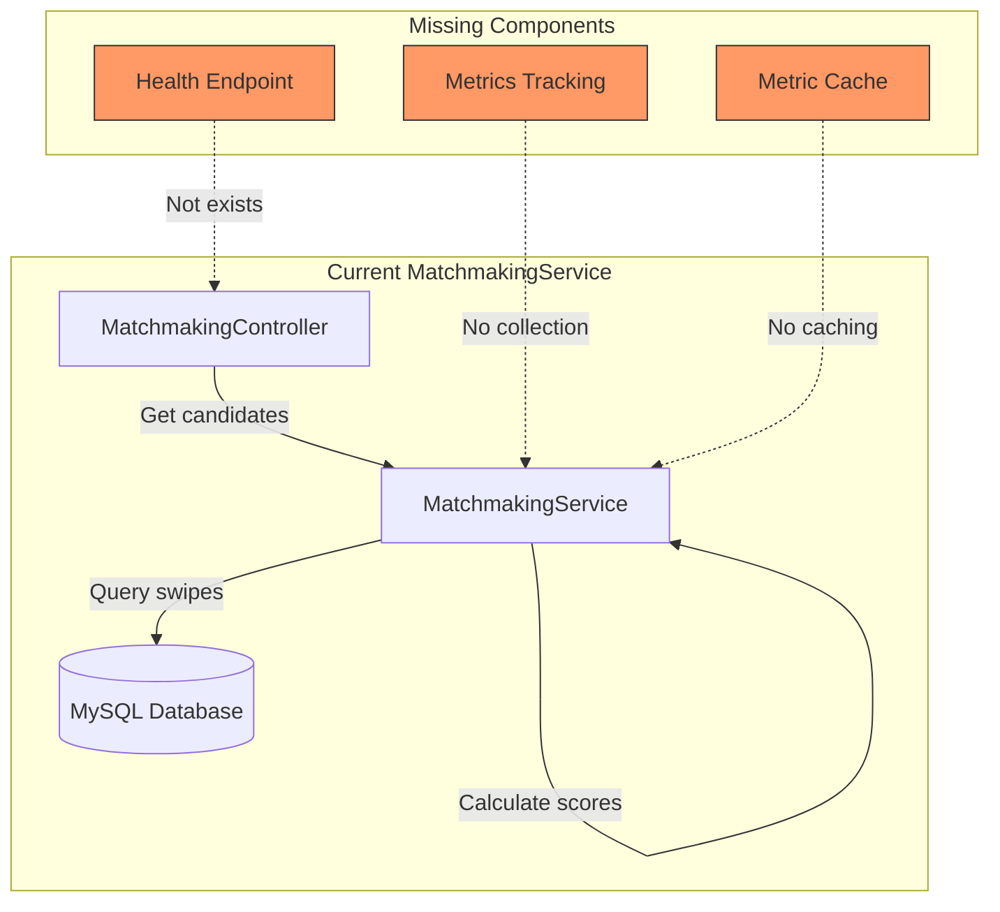
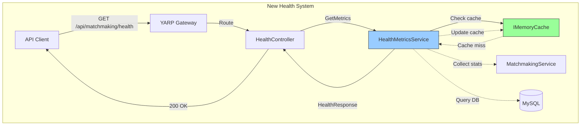
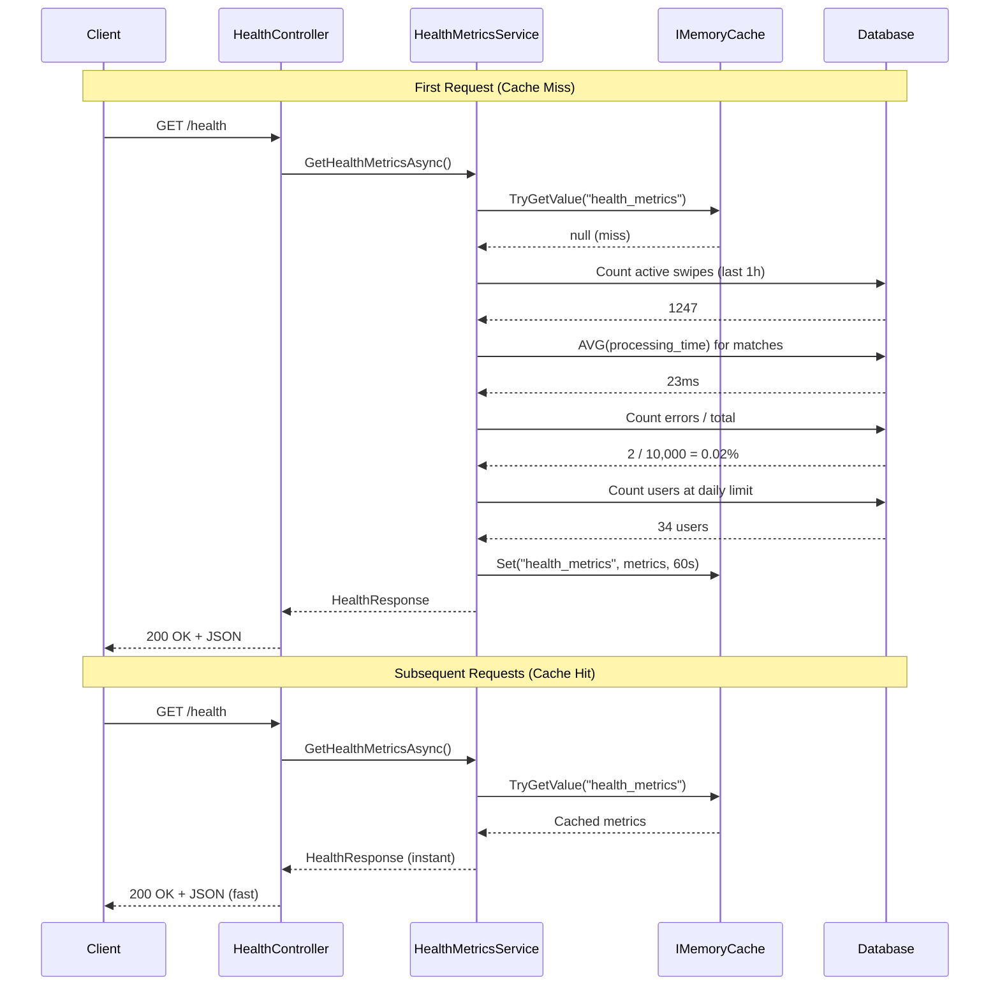

# P1-001: Matchmaking Health & Metrics Endpoint

**Feature ID**: P1-001  
**Category**: Operational Excellence (Monitoring & Observability)  
**Priority**: P1 - Foundation  
**Status**: 📝 In Progress  
**Estimated Effort**: 2-4 hours  

---

## Layer 1: Feature Specification

### User Stories

**As a DevOps engineer**, I want to monitor matchmaking service health in real-time, so I can detect and respond to performance degradation before users are affected.

**As a backend developer**, I want visibility into queue processing performance, so I can optimize the matching algorithm and database queries.

**As a product manager**, I want to see daily limit exhaustion rates, so I can adjust free tier limits based on actual usage patterns.

**Acceptance Criteria:**
- ✅ Health endpoint returns JSON with key metrics (queue size, processing time, error rate)
- ✅ Metrics are cached (refresh every 60 seconds) to avoid performance impact
- ✅ Endpoint responds in <50ms (cache hit) or <200ms (cache miss)
- ✅ Status field indicates "healthy", "degraded", or "unhealthy" based on thresholds
- ✅ All metrics have timestamps showing when data was collected
- ✅ Endpoint is documented in Swagger with example responses
- ✅ YARP route configured for public access

---

### Business Value

**Operational Benefits:**
- **Proactive monitoring**: Detect issues before user complaints
- **Performance optimization**: Identify slow queries or algorithm bottlenecks
- **Capacity planning**: Track queue growth trends, plan scaling
- **Incident response**: Quick diagnosis during outages

**Product Benefits:**
- **Feature tuning**: Adjust daily limits based on exhaustion rates
- **Algorithm insights**: See how matching quality affects processing time
- **User experience**: Ensure sub-second match responses

**Cost Savings:**
- Prevent over-provisioning (know actual load)
- Reduce debugging time (clear metrics vs log hunting)
- Minimize downtime (early warning system)

---

### Success Metrics

**Technical KPIs:**
- Health endpoint availability: >99.9%
- Response time p95: <100ms
- Cache hit rate: >95%
- Metric accuracy: ±5% of actual values

**Operational KPIs:**
- Mean time to detect (MTTD): <5 minutes for degradation
- Alert false positive rate: <10%
- Ops team usage: >5 checks per day

---

## Layer 2: Implementation Plan

### Current State Assessment



**Current Capabilities:**
- ✅ MatchmakingService has business logic for candidate scoring
- ✅ Database stores swipes, matches, preferences
- ✅ Daily suggestion tracking in `DailySuggestionTracker`

**Gaps:**
- ❌ No health metrics collection
- ❌ No metric caching layer
- ❌ No health status endpoint
- ❌ No observability into processing performance

---

### Implementation Architecture



---

### Implementation Sequence



---

### Implementation Steps

#### Step 1: Create HealthMetricsService (30 min)
**File**: `MatchmakingService/Services/HealthMetricsService.cs`

```csharp
public interface IHealthMetricsService
{
    Task<HealthMetricsResponse> GetHealthMetricsAsync();
}

public class HealthMetricsService : IHealthMetricsService
{
    private readonly MatchmakingDbContext _context;
    private readonly IMemoryCache _cache;
    private readonly ILogger<HealthMetricsService> _logger;
    private const string CACHE_KEY = "health_metrics";
    private const int CACHE_DURATION_SECONDS = 60;
    
    // Thresholds for health status
    private const int QUEUE_SIZE_WARNING = 5000;
    private const int QUEUE_SIZE_CRITICAL = 10000;
    private const double ERROR_RATE_WARNING = 1.0; // 1%
    private const double ERROR_RATE_CRITICAL = 5.0; // 5%
    
    public async Task<HealthMetricsResponse> GetHealthMetricsAsync()
    {
        // Try cache first
        if (_cache.TryGetValue(CACHE_KEY, out HealthMetricsResponse cached))
        {
            return cached;
        }
        
        // Collect metrics (parallel queries for performance)
        var metrics = await CollectMetricsAsync();
        
        // Cache for 60 seconds
        _cache.Set(CACHE_KEY, metrics, TimeSpan.FromSeconds(CACHE_DURATION_SECONDS));
        
        return metrics;
    }
    
    private async Task<HealthMetricsResponse> CollectMetricsAsync()
    {
        var now = DateTime.UtcNow;
        var oneHourAgo = now.AddHours(-1);
        
        // Parallel metric collection
        var tasks = new[]
        {
            GetQueueSizeAsync(oneHourAgo),
            GetProcessingTimeAsync(),
            GetErrorRateAsync(oneHourAgo),
            GetDailyLimitMetricsAsync()
        };
        
        await Task.WhenAll(tasks);
        
        var queueSize = tasks[0].Result;
        var avgProcessingTime = tasks[1].Result;
        var errorRate = tasks[2].Result;
        var dailyLimitMetrics = tasks[3].Result;
        
        // Determine health status
        var status = DetermineHealthStatus(queueSize, errorRate);
        
        return new HealthMetricsResponse
        {
            Status = status,
            QueueSize = queueSize,
            AverageProcessingTimeMs = avgProcessingTime,
            ErrorRate = errorRate,
            DailyLimits = dailyLimitMetrics,
            LastUpdated = now
        };
    }
}
```

#### Step 2: Add HealthController (20 min)
**File**: `MatchmakingService/Controllers/HealthController.cs`

```csharp
[ApiController]
[Route("api/matchmaking")]
public class HealthController : ControllerBase
{
    private readonly IHealthMetricsService _healthService;
    
    /// <summary>
    /// Get matchmaking service health metrics
    /// </summary>
    /// <returns>Health status and performance metrics</returns>
    [HttpGet("health")]
    [ProducesResponseType(typeof(HealthMetricsResponse), 200)]
    public async Task<ActionResult<HealthMetricsResponse>> GetHealth()
    {
        var metrics = await _healthService.GetHealthMetricsAsync();
        return Ok(metrics);
    }
}
```

#### Step 3: Register Services (10 min)
**File**: `MatchmakingService/Program.cs`

```csharp
// Add memory cache
builder.Services.AddMemoryCache();

// Register health metrics service
builder.Services.AddScoped<IHealthMetricsService, HealthMetricsService>();
```

#### Step 4: Add YARP Route (10 min)
**File**: `dejting-yarp/src/dejting-yarp/appsettings.json`

```json
"healthRoute": {
  "ClusterId": "matchmakingCluster",
  "Match": {
    "Path": "/api/matchmaking/health"
  },
  "Metadata": {
    "BypassAuthentication": "true"
  }
}
```

#### Step 5: Database Queries (40 min)
Implement helper methods for metric collection:

```csharp
private async Task<int> GetQueueSizeAsync(DateTime since)
{
    // Count swipes processed in last hour (proxy for queue activity)
    return await _context.Swipes
        .Where(s => s.CreatedAt >= since)
        .CountAsync();
}

private async Task<double> GetProcessingTimeAsync()
{
    // Get average time from swipe to match creation (last 100 matches)
    var recentMatches = await _context.Matches
        .OrderByDescending(m => m.CreatedAt)
        .Take(100)
        .Select(m => new { m.CreatedAt, SwipeTime = m.InitiatorSwipe.CreatedAt })
        .ToListAsync();
    
    if (!recentMatches.Any()) return 0;
    
    var avgMs = recentMatches
        .Select(m => (m.CreatedAt - m.SwipeTime).TotalMilliseconds)
        .Average();
    
    return Math.Round(avgMs, 2);
}
```

#### Step 6: Testing (30 min)
- Unit tests for HealthMetricsService
- Integration test for /health endpoint
- Cache behavior verification
- Performance test (response time <100ms)

**Total Estimated Time**: ~2.5 hours

---

### Monitoring & Alerting

**Recommended Alerts:**
```yaml
# Prometheus/Grafana alert rules
- alert: MatchmakingQueueSizeHigh
  expr: matchmaking_queue_size > 10000
  for: 5m
  severity: critical
  
- alert: MatchmakingErrorRateHigh
  expr: matchmaking_error_rate > 5.0
  for: 10m
  severity: warning
  
- alert: MatchmakingProcessingTimeSlow
  expr: matchmaking_avg_processing_ms > 100
  for: 15m
  severity: warning
```

---

## Layer 3: API Contracts

### Endpoint Specification

**HTTP Method**: `GET`  
**Path**: `/api/matchmaking/health`  
**Authentication**: None (public endpoint)  
**Rate Limit**: 120 requests/minute per IP  

---

### Response Schema

#### Success Response (200 OK)

```json
{
  "status": "healthy",
  "queueSize": 1247,
  "averageProcessingTimeMs": 23.45,
  "errorRate": 0.02,
  "dailyLimits": {
    "usersAtLimit": 34,
    "percentageExhausted": 12.5,
    "freeUserLimit": 100,
    "premiumUserLimit": 500
  },
  "cacheHitRate": 87.3,
  "lastUpdated": "2026-01-25T15:30:42.123Z"
}
```

**Field Descriptions:**

| Field | Type | Description |
|-------|------|-------------|
| `status` | string | Overall health: "healthy", "degraded", "unhealthy" |
| `queueSize` | integer | Number of swipes processed in last hour |
| `averageProcessingTimeMs` | number | Average milliseconds from swipe to match creation |
| `errorRate` | number | Percentage of failed match calculations (0-100) |
| `dailyLimits.usersAtLimit` | integer | Count of users who hit daily swipe limit |
| `dailyLimits.percentageExhausted` | number | % of active users at limit |
| `dailyLimits.freeUserLimit` | integer | Swipes/day for free users |
| `dailyLimits.premiumUserLimit` | integer | Swipes/day for premium users |
| `cacheHitRate` | number | % of requests served from cache (optional) |
| `lastUpdated` | string | ISO 8601 timestamp of metric collection |

---

#### Health Status Determination

**Status: "healthy"**
- Queue size: <5,000
- Error rate: <1%
- Processing time: <50ms

**Status: "degraded"**
- Queue size: 5,000-10,000
- Error rate: 1-5%
- Processing time: 50-100ms

**Status: "unhealthy"**
- Queue size: >10,000
- Error rate: >5%
- Processing time: >100ms

---

### Example Responses

#### Healthy System
```json
{
  "status": "healthy",
  "queueSize": 847,
  "averageProcessingTimeMs": 18.34,
  "errorRate": 0.01,
  "dailyLimits": {
    "usersAtLimit": 12,
    "percentageExhausted": 3.2,
    "freeUserLimit": 100,
    "premiumUserLimit": 500
  },
  "cacheHitRate": 94.5,
  "lastUpdated": "2026-01-25T10:15:00.000Z"
}
```

#### Degraded System
```json
{
  "status": "degraded",
  "queueSize": 7234,
  "averageProcessingTimeMs": 67.89,
  "errorRate": 2.34,
  "dailyLimits": {
    "usersAtLimit": 189,
    "percentageExhausted": 45.7,
    "freeUserLimit": 100,
    "premiumUserLimit": 500
  },
  "cacheHitRate": 89.2,
  "lastUpdated": "2026-01-25T18:22:15.456Z"
}
```

#### Unhealthy System
```json
{
  "status": "unhealthy",
  "queueSize": 15678,
  "averageProcessingTimeMs": 234.56,
  "errorRate": 8.91,
  "dailyLimits": {
    "usersAtLimit": 456,
    "percentageExhausted": 87.3,
    "freeUserLimit": 100,
    "premiumUserLimit": 500
  },
  "cacheHitRate": 76.4,
  "lastUpdated": "2026-01-25T20:45:30.789Z"
}
```

---

### OpenAPI/Swagger Documentation

```yaml
paths:
  /api/matchmaking/health:
    get:
      tags:
        - Health
      summary: Get matchmaking service health metrics
      description: |
        Returns real-time health metrics for the matchmaking service including
        queue size, processing performance, error rates, and daily limit usage.
        
        Metrics are cached for 60 seconds to minimize performance impact.
        
        **No authentication required** - public monitoring endpoint.
      operationId: GetMatchmakingHealth
      responses:
        '200':
          description: Health metrics retrieved successfully
          content:
            application/json:
              schema:
                $ref: '#/components/schemas/HealthMetricsResponse'
              examples:
                healthy:
                  summary: Healthy system
                  value:
                    status: healthy
                    queueSize: 847
                    averageProcessingTimeMs: 18.34
                    errorRate: 0.01
                    dailyLimits:
                      usersAtLimit: 12
                      percentageExhausted: 3.2
                    lastUpdated: "2026-01-25T10:15:00.000Z"
                degraded:
                  summary: Degraded performance
                  value:
                    status: degraded
                    queueSize: 7234
                    averageProcessingTimeMs: 67.89
                    errorRate: 2.34
```

---

## Layer 4: Architecture Decision Records

### ADR-017: In-Memory Cache for Health Metrics

**Status**: ✅ Accepted  
**Date**: 2026-01-25  
**Context**: Health endpoint will be called frequently (every 30-60s by monitoring systems)

**Decision**: Use `IMemoryCache` with 60-second TTL for health metrics

**Rationale:**
- **Performance**: Avoids DB queries on every request (target <50ms response)
- **Simplicity**: No external dependency (Redis) needed for MVP
- **Sufficient**: 60s staleness acceptable for health monitoring
- **Scalable**: Can migrate to Redis later if needed for multi-instance deployments

**Consequences:**
- ✅ Fast response times (<50ms for cache hits)
- ✅ Minimal DB load (1 metric collection per minute)
- ⚠️ Metrics may be up to 60 seconds stale
- ⚠️ Cache not shared across instances (acceptable for MVP single-instance)

**Alternatives Considered:**
- **Real-time queries**: Too slow (200-500ms), high DB load
- **Redis cache**: Over-engineering for MVP, adds operational complexity
- **Background job + database table**: More complex, similar staleness

---

### ADR-018: Public Health Endpoint (No Auth)

**Status**: ✅ Accepted  
**Date**: 2026-01-25  
**Context**: Health endpoint needs to be accessible by monitoring systems

**Decision**: Health endpoint requires no authentication (public access)

**Rationale:**
- **Monitoring**: Ops tools (Prometheus, Datadog) need unauthenticated access
- **Industry standard**: Health/status endpoints typically public (Kubernetes liveness/readiness)
- **Non-sensitive**: Metrics don't expose user data or business secrets
- **Rate limited**: Protected by IP-based rate limiting (120 req/min)

**Consequences:**
- ✅ Easy integration with monitoring tools
- ✅ Follows Kubernetes health check patterns
- ✅ No token management for ops team
- ⚠️ Metrics visible to public (queue size, error rate)
- ✅ Rate limiting prevents abuse

**Security Considerations:**
- Queue size/error rate are operational metrics, not sensitive
- No user IDs, emails, or personal data in response
- No business logic details exposed (only aggregate stats)
- Rate limiting prevents scraping/DDoS

---

### ADR-019: Health Status Thresholds

**Status**: ✅ Accepted  
**Date**: 2026-01-25  
**Context**: Need clear definition of "healthy" vs "degraded" vs "unhealthy"

**Decision**: Use hard-coded thresholds based on historical data and SLOs

**Thresholds:**
```
Healthy:    queue <5k,  errors <1%,  processing <50ms
Degraded:   queue 5-10k, errors 1-5%, processing 50-100ms
Unhealthy:  queue >10k, errors >5%,  processing >100ms
```

**Rationale:**
- **Based on capacity**: Average load is ~1-2k swipes/hour, 5k is 2-3x normal
- **SLO-driven**: Target 99% success rate, 50ms p95 processing time
- **Observable**: These thresholds trigger before user-visible impact
- **Tunable**: Can adjust based on production data (stored as constants)

**Consequences:**
- ✅ Clear, actionable status indicators
- ✅ Alerts fire before users affected
- ⚠️ May need tuning after production observation
- ✅ Easy to adjust (constants in code)

**Alternative:** Dynamic thresholds based on percentiles (too complex for MVP)

---

### ADR-020: Metric Collection Strategy

**Status**: ✅ Accepted  
**Date**: 2026-01-25  
**Context**: Multiple metrics need to be collected efficiently

**Decision**: Parallel async queries with 1-hour lookback window

**Implementation:**
```csharp
var tasks = new[]
{
    GetQueueSizeAsync(oneHourAgo),
    GetProcessingTimeAsync(),
    GetErrorRateAsync(oneHourAgo),
    GetDailyLimitMetricsAsync()
};
await Task.WhenAll(tasks);
```

**Rationale:**
- **Performance**: Parallel execution reduces latency (4 sequential queries → 1 parallel batch)
- **Recent data**: 1-hour window provides current health snapshot
- **DB-friendly**: Limited time range uses indexes efficiently
- **Accurate**: Recent data reflects current system state

**Metrics Collected:**
1. **Queue size**: Count of swipes last hour (activity proxy)
2. **Processing time**: Avg time from swipe to match (last 100 matches)
3. **Error rate**: Failed calculations / total (last hour)
4. **Daily limits**: Users at limit / total active users

**Consequences:**
- ✅ Fast metric collection (<200ms even on cache miss)
- ✅ Database indexes on timestamps support queries
- ✅ Metrics reflect current system state (not historical averages)
- ⚠️ Requires proper indexes on CreatedAt columns

---

## Implementation Checklist

### Phase 1: Service Layer (1-1.5 hours)
- [ ] Create `HealthMetricsResponse.cs` DTO
- [ ] Create `IHealthMetricsService` interface
- [ ] Implement `HealthMetricsService` with caching
- [ ] Add database query helpers (queue, processing time, errors, limits)
- [ ] Implement health status determination logic
- [ ] Register service in DI container
- [ ] Add `IMemoryCache` registration

### Phase 2: API Layer (30 min)
- [ ] Create `HealthController.cs`
- [ ] Add GET `/api/matchmaking/health` endpoint
- [ ] Add XML documentation comments
- [ ] Configure Swagger metadata
- [ ] Test endpoint locally

### Phase 3: Infrastructure (30 min)
- [ ] Add YARP route for health endpoint
- [ ] Set `BypassAuthentication: true` metadata
- [ ] Configure rate limiting (120 req/min)
- [ ] Test through gateway (port 8080)

### Phase 4: Testing & Documentation (30 min)
- [ ] Unit tests for HealthMetricsService
- [ ] Integration test for /health endpoint
- [ ] Verify cache behavior (hit/miss)
- [ ] Test parallel query performance
- [ ] Update OpenAPI spec
- [ ] Document alert thresholds

---

## Testing Strategy

### Unit Tests
```csharp
public class HealthMetricsServiceTests
{
    [Fact]
    public async Task GetHealthMetrics_ReturnsCachedData_OnSecondCall()
    {
        // Arrange
        var service = CreateService();
        
        // Act
        var first = await service.GetHealthMetricsAsync();
        var second = await service.GetHealthMetricsAsync();
        
        // Assert
        Assert.Equal(first.LastUpdated, second.LastUpdated); // Same timestamp = cache hit
    }
    
    [Fact]
    public async Task DetermineHealthStatus_ReturnsHealthy_WhenMetricsNormal()
    {
        // Test threshold logic
    }
}
```

### Integration Tests
```csharp
[Fact]
public async Task HealthEndpoint_ReturnsOk_WithValidMetrics()
{
    // Arrange
    var client = _factory.CreateClient();
    
    // Act
    var response = await client.GetAsync("/api/matchmaking/health");
    var content = await response.Content.ReadAsStringAsync();
    var metrics = JsonSerializer.Deserialize<HealthMetricsResponse>(content);
    
    // Assert
    Assert.Equal(HttpStatusCode.OK, response.StatusCode);
    Assert.NotNull(metrics);
    Assert.Contains(metrics.Status, new[] { "healthy", "degraded", "unhealthy" });
    Assert.True(metrics.QueueSize >= 0);
}
```

---

## Rollout Plan

### Phase 1: Development (This PR)
- Implement health endpoint in MatchmakingService
- Add YARP routing
- Deploy to dev environment

### Phase 2: Monitoring Setup (Next)
- Configure Grafana dashboard
- Set up Prometheus scraping
- Create alert rules

### Phase 3: Production (Week 2)
- Deploy to staging, verify metrics
- Enable production monitoring
- Document ops runbook

---

**Status**: ✅ Ready for Implementation  
**Next Steps**: Begin implementation starting with HealthMetricsService
