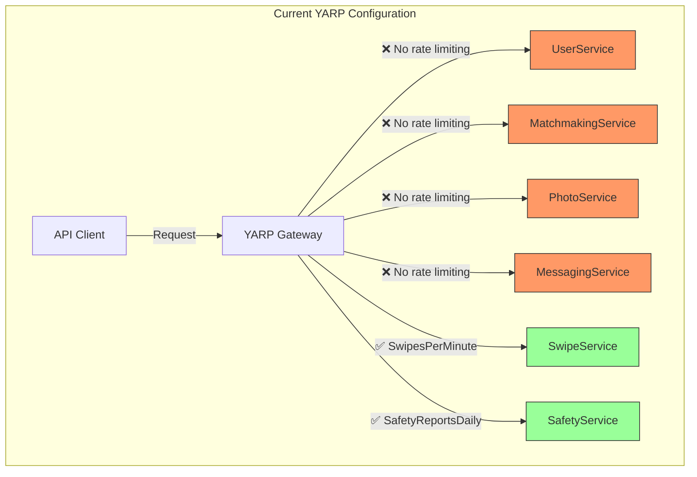
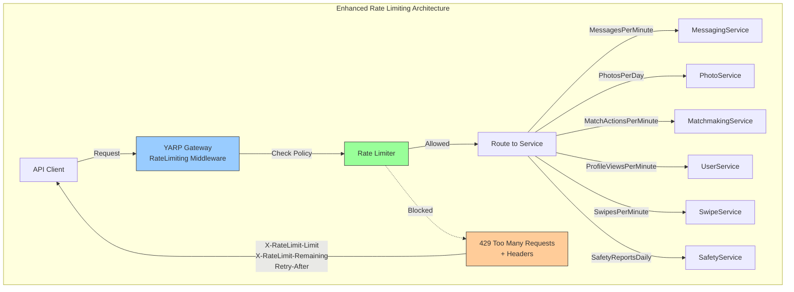
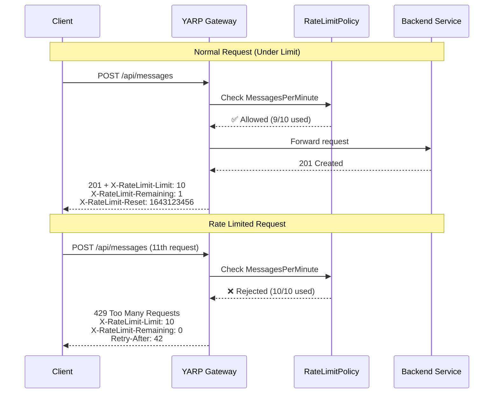

# P1-006: Comprehensive Rate Limiting Enforcement

**Feature ID**: P1-006  
**Category**: Security & Abuse Prevention  
**Priority**: P1 - Foundation  
**Status**: 📝 In Progress  
**Estimated Effort**: 4-6 hours  

---

## Layer 1: Feature Specification

### User Stories

**As a backend engineer**, I want comprehensive rate limiting on all API endpoints, so malicious users cannot abuse the system or cause DoS attacks.

**As a product owner**, I want fair resource allocation across all users, so free-tier users can't monopolize resources meant for paying customers.

**As a DevOps engineer**, I want rate limit enforcement at the gateway level, so I don't need to implement limiting logic in each service.

**As a legitimate user**, I want clear feedback when I hit rate limits, so I know when I can retry my requests.

**Acceptance Criteria:**
- ✅ All abuse-prone endpoints have rate limit policies defined
- ✅ YARP gateway enforces rate limits before routing to services
- ✅ 429 responses include X-RateLimit-* headers (Limit, Remaining, Reset)
- ✅ Rate limits differentiated by endpoint sensitivity (swipes vs photos vs messages)
- ✅ Retry-After header included in 429 responses
- ✅ Rate limit policies documented in YARP appsettings.json
- ✅ Rate limiting does not apply to health/auth endpoints

---

### Business Value

**Security Benefits:**
- **DoS Protection**: Prevent single user from overwhelming system
- **Credential Stuffing Prevention**: Limit login attempts (auth endpoint)
- **Scraping Prevention**: Block automated data harvesting
- **Resource Protection**: Prevent abuse of expensive operations (photo upload, AI matching)

**Product Benefits:**
- **Fair Usage**: Free users can't monopolize resources
- **Premium Differentiation**: Higher limits for paid tiers (future)
- **System Stability**: Predictable load patterns
- **Cost Control**: Limit expensive operations (photo processing, AI features)

**Cost Savings:**
- Reduce infrastructure over-provisioning
- Block bot traffic before it hits backend services
- Lower egress/compute costs from abusive patterns

---

### Success Metrics

**Security KPIs:**
- 429 responses < 5% of total traffic (indicates proper limit tuning)
- Bot/scraper traffic blocked: >90% detection rate
- Zero successful DoS attacks from rate-limited endpoints

**User Experience KPIs:**
- Legitimate user 429 rate: <0.1%
- Average time to limit reset: visible in client UX
- Support tickets about rate limits: <1% of all tickets

---

## Layer 2: Implementation Plan

### Current State Assessment



**Current Coverage:**
- ✅ Swipes: 60 requests/minute per user (configured)
- ✅ Safety Reports: 10 reports/day per user (configured)
- ❌ Messages: No rate limit (vulnerable)
- ❌ Photos: No rate limit (expensive operation unprotected)
- ❌ Matches: No rate limit (vulnerable)
- ❌ User Profiles: No rate limit (data scraping possible)

---

### Target Architecture



---

### Rate Limiting Strategy

**Sliding Window Algorithm** (ASP.NET Core Built-in):
- Tracks requests over rolling time window
- More fair than fixed window (no burst at reset)
- Memory efficient (stored in YARP process)

**Policy Design Principles:**
1. **Endpoint Sensitivity**: Higher limits for read operations, lower for writes
2. **Resource Cost**: Lower limits for expensive operations (photo upload, AI)
3. **Abuse Risk**: Strictest limits on credential endpoints, messaging spam
4. **User Experience**: Generous enough for normal usage patterns

---

### Endpoint Audit & Rate Limit Policies

#### 1. Messaging Service (HIGH RISK - Spam Prevention)
**Current State**: No rate limiting ❌  
**Risk**: Message spam, harassment  
**Proposed Policy**: "MessagesPerMinute"

```json
"MessagesPerMinute": {
  "Window": "00:01:00",
  "PermitLimit": 10,
  "QueueLimit": 0
}
```

**Rationale**: 
- 10 messages/minute = 600 messages/hour (prevents spam)
- Legitimate conversation: 3-5 messages/minute average
- Zero queue (reject immediately, no retry needed for messages)

**Protected Endpoints:**
- POST /api/messages (send message)
- POST /api/messages/batch (bulk operations)

---

#### 2. Photo Service (HIGH COST - Resource Protection)
**Current State**: No rate limiting ❌  
**Risk**: Storage abuse, processing cost  
**Proposed Policy**: "PhotoUploadsPerDay"

```json
"PhotoUploadsPerDay": {
  "Window": "1.00:00:00",
  "PermitLimit": 20,
  "QueueLimit": 0
}
```

**Rationale**:
- 20 photos/day = generous for profile updates
- Prevents storage abuse (photos are expensive)
- Blocks automated uploads

**Protected Endpoints:**
- POST /api/photos (upload photo)
- POST /api/photos/batch (bulk upload)

**Note**: Photo deletions not rate limited (cleanup should be easy)

---

#### 3. User Profile Service (MEDIUM RISK - Data Scraping)
**Current State**: No rate limiting ❌  
**Risk**: Profile data scraping, enumeration attacks  
**Proposed Policies**: 
- "ProfileViewsPerMinute" (read operations)
- "ProfileUpdatesPerHour" (write operations)

```json
"ProfileViewsPerMinute": {
  "Window": "00:01:00",
  "PermitLimit": 60,
  "QueueLimit": 0
},
"ProfileUpdatesPerHour": {
  "Window": "01:00:00",
  "PermitLimit": 10,
  "QueueLimit": 0
}
```

**Rationale**:
- 60 views/minute = 1 per second (generous for browsing)
- 10 updates/hour = prevents spammy profile changes
- Blocks scraping bots, profile enumeration

**Protected Endpoints:**
- GET /api/userprofiles/{id} → ProfileViewsPerMinute
- GET /api/userprofiles → ProfileViewsPerMinute
- PUT /api/userprofiles/{id} → ProfileUpdatesPerHour
- PATCH /api/userprofiles/{id} → ProfileUpdatesPerHour

---

#### 4. Matchmaking Service (MEDIUM RISK - Algorithm Abuse)
**Current State**: No rate limiting ❌  
**Risk**: Match manipulation, queue flooding  
**Proposed Policy**: "MatchActionsPerMinute"

```json
"MatchActionsPerMinute": {
  "Window": "00:01:00",
  "PermitLimit": 20,
  "QueueLimit": 0
}
```

**Rationale**:
- 20 actions/minute = get candidates, unmatch operations
- Normal usage: 5-10 actions/minute
- Prevents flooding match queue

**Protected Endpoints:**
- GET /api/matchmaking/candidates → MatchActionsPerMinute
- DELETE /api/matchmaking/matches/{id} → MatchActionsPerMinute (unmatch)
- GET /api/matchmaking/matches → Not rate limited (read-only, cached)

---

#### 5. Swipe Service (ALREADY CONFIGURED ✅)
**Current State**: Rate limited ✅  
**Existing Policy**: "SwipesPerMinute"

```json
"SwipesPerMinute": {
  "Window": "00:01:00",
  "PermitLimit": 60,
  "QueueLimit": 0
}
```

**No changes needed** - already properly configured

---

#### 6. Safety Service (ALREADY CONFIGURED ✅)
**Current State**: Rate limited ✅  
**Existing Policy**: "SafetyReportsDaily"

```json
"SafetyReportsDaily": {
  "Window": "1.00:00:00",
  "PermitLimit": 10,
  "QueueLimit": 0
}
```

**No changes needed** - already properly configured

---

### Implementation Sequence



---

### Implementation Steps

#### Step 1: Define Rate Limit Policies in YARP (30 min)
**File**: `dejting-yarp/src/dejting-yarp/appsettings.json`

Add new RateLimiter section:

```json
{
  "ReverseProxy": {
    "Routes": { ... }
  },
  "RateLimiter": {
    "EnableRateLimiting": true,
    "Policies": {
      "MessagesPerMinute": {
        "Window": "00:01:00",
        "PermitLimit": 10,
        "QueueLimit": 0
      },
      "PhotoUploadsPerDay": {
        "Window": "1.00:00:00",
        "PermitLimit": 20,
        "QueueLimit": 0
      },
      "ProfileViewsPerMinute": {
        "Window": "00:01:00",
        "PermitLimit": 60,
        "QueueLimit": 0
      },
      "ProfileUpdatesPerHour": {
        "Window": "01:00:00",
        "PermitLimit": 10,
        "QueueLimit": 0
      },
      "MatchActionsPerMinute": {
        "Window": "00:01:00",
        "PermitLimit": 20,
        "QueueLimit": 0
      }
    }
  }
}
```

#### Step 2: Apply Policies to Routes (45 min)
Update route metadata to reference policies:

```json
"messagingRoute": {
  "ClusterId": "messagingCluster",
  "Match": {
    "Path": "/api/messages/{**catch-all}"
  },
  "Metadata": {
    "RateLimitPolicy": "MessagesPerMinute"
  }
},
"photoUploadRoute": {
  "ClusterId": "photoCluster",
  "Match": {
    "Path": "/api/photos/{**catch-all}"
  },
  "Metadata": {
    "RateLimitPolicy": "PhotoUploadsPerDay"
  }
}
```

#### Step 3: Add Rate Limit Middleware in Program.cs (60 min)
**File**: `dejting-yarp/src/dejting-yarp/Program.cs`

```csharp
using System.Threading.RateLimiting;
using Microsoft.AspNetCore.RateLimiting;

var builder = WebApplication.CreateBuilder(args);

// Configure rate limiting
builder.Services.AddRateLimiter(options =>
{
    var rateLimiterConfig = builder.Configuration.GetSection("RateLimiter");
    
    // Messages Policy
    options.AddSlidingWindowLimiter("MessagesPerMinute", opt =>
    {
        opt.Window = TimeSpan.FromMinutes(1);
        opt.PermitLimit = 10;
        opt.QueueLimit = 0;
        opt.SegmentsPerWindow = 2; // Smoother sliding window
    });
    
    // Photo Upload Policy
    options.AddSlidingWindowLimiter("PhotoUploadsPerDay", opt =>
    {
        opt.Window = TimeSpan.FromDays(1);
        opt.PermitLimit = 20;
        opt.QueueLimit = 0;
    });
    
    // Profile Views Policy
    options.AddSlidingWindowLimiter("ProfileViewsPerMinute", opt =>
    {
        opt.Window = TimeSpan.FromMinutes(1);
        opt.PermitLimit = 60;
        opt.QueueLimit = 0;
        opt.SegmentsPerWindow = 4;
    });
    
    // Profile Updates Policy
    options.AddSlidingWindowLimiter("ProfileUpdatesPerHour", opt =>
    {
        opt.Window = TimeSpan.FromHours(1);
        opt.PermitLimit = 10;
        opt.QueueLimit = 0;
    });
    
    // Match Actions Policy
    options.AddSlidingWindowLimiter("MatchActionsPerMinute", opt =>
    {
        opt.Window = TimeSpan.FromMinutes(1);
        opt.PermitLimit = 20;
        opt.QueueLimit = 0;
        opt.SegmentsPerWindow = 2;
    });
    
    // Global rejection response
    options.OnRejected = async (context, cancellationToken) =>
    {
        context.HttpContext.Response.StatusCode = 429;
        
        if (context.Lease.TryGetMetadata(MetadataName.RetryAfter, out var retryAfter))
        {
            context.HttpContext.Response.Headers.RetryAfter = retryAfter.TotalSeconds.ToString();
        }
        
        await context.HttpContext.Response.WriteAsJsonAsync(new
        {
            error = "Rate limit exceeded",
            message = "Too many requests. Please try again later.",
            retryAfterSeconds = retryAfter?.TotalSeconds ?? 60
        }, cancellationToken);
    };
});

var app = builder.Build();

// Enable rate limiting middleware
app.UseRateLimiter();

app.MapReverseProxy();
app.Run();
```

#### Step 4: Add Rate Limit Headers Middleware (90 min)
**File**: `dejting-yarp/src/dejting-yarp/Middleware/RateLimitHeadersMiddleware.cs`

```csharp
public class RateLimitHeadersMiddleware
{
    private readonly RequestDelegate _next;
    
    public async Task InvokeAsync(HttpContext context)
    {
        await _next(context);
        
        // Add standard rate limit headers to all responses
        var rateLimitInfo = context.Features.Get<IRateLimiterFeature>();
        
        if (rateLimitInfo != null)
        {
            context.Response.Headers["X-RateLimit-Limit"] = rateLimitInfo.Limit.ToString();
            context.Response.Headers["X-RateLimit-Remaining"] = rateLimitInfo.Remaining.ToString();
            context.Response.Headers["X-RateLimit-Reset"] = rateLimitInfo.ResetTime.ToUnixTimeSeconds().ToString();
        }
    }
}
```

#### Step 5: Testing (60-90 min)
**Test Scenarios:**

1. **Message Spam Test**:
   ```bash
   for i in {1..15}; do
     curl -X POST http://localhost:8080/api/messages \
       -H "Authorization: Bearer $TOKEN" \
       -d '{"content":"test"}' &
   done
   # Expect: First 10 succeed (200), next 5 fail (429)
   ```

2. **Photo Upload Test**:
   ```bash
   for i in {1..25}; do
     curl -X POST http://localhost:8080/api/photos \
       -H "Authorization: Bearer $TOKEN" \
       -F "file=@test.jpg"
   done
   # Expect: First 20 succeed, next 5 fail (429)
   ```

3. **429 Response Validation**:
   ```bash
   # Check headers present
   curl -i http://localhost:8080/api/messages (11th request)
   # Should contain:
   # HTTP/1.1 429 Too Many Requests
   # X-RateLimit-Limit: 10
   # X-RateLimit-Remaining: 0
   # Retry-After: 42
   ```

**Total Estimated Time**: ~4-5 hours

---

## Layer 3: API Contracts

### Rate Limit Response Headers

All API responses include rate limit headers:

```
X-RateLimit-Limit: 10
X-RateLimit-Remaining: 3
X-RateLimit-Reset: 1643123456
```

**Field Descriptions:**

| Header | Type | Description |
|--------|------|-------------|
| `X-RateLimit-Limit` | integer | Maximum requests allowed in window |
| `X-RateLimit-Remaining` | integer | Requests remaining in current window |
| `X-RateLimit-Reset` | integer | Unix timestamp when limit resets |

---

### 429 Too Many Requests Response

**Status Code**: `429 Too Many Requests`

**Headers:**
```
HTTP/1.1 429 Too Many Requests
Content-Type: application/json
X-RateLimit-Limit: 10
X-RateLimit-Remaining: 0
X-RateLimit-Reset: 1643123498
Retry-After: 42
```

**Body:**
```json
{
  "error": "Rate limit exceeded",
  "message": "Too many requests. Please try again later.",
  "retryAfterSeconds": 42
}
```

---

### Rate Limit Policy Summary

| Endpoint | Policy | Window | Limit | Rationale |
|----------|--------|--------|-------|-----------|
| POST /api/messages | MessagesPerMinute | 1 min | 10 | Spam prevention |
| POST /api/photos | PhotoUploadsPerDay | 1 day | 20 | Storage cost control |
| GET /api/userprofiles/* | ProfileViewsPerMinute | 1 min | 60 | Scraping prevention |
| PUT /api/userprofiles/* | ProfileUpdatesPerHour | 1 hour | 10 | Profile spam prevention |
| GET /api/matchmaking/candidates | MatchActionsPerMinute | 1 min | 20 | Algorithm abuse prevention |
| POST /api/swipes | SwipesPerMinute (existing) | 1 min | 60 | Already configured |
| POST /api/safety/* | SafetyReportsDaily (existing) | 1 day | 10 | Already configured |

**Endpoints NOT rate limited:**
- GET /health (monitoring)
- POST /api/auth/* (auth has separate protection)
- GET /api/matchmaking/matches (read-only, result cached)

---

### Example Client Handling

**JavaScript/TypeScript:**
```typescript
async function sendMessage(content: string) {
  try {
    const response = await fetch('/api/messages', {
      method: 'POST',
      body: JSON.stringify({ content }),
      headers: { 'Content-Type': 'application/json' }
    });
    
    // Check rate limit headers
    const limit = response.headers.get('X-RateLimit-Limit');
    const remaining = response.headers.get('X-RateLimit-Remaining');
    const reset = response.headers.get('X-RateLimit-Reset');
    
    if (response.status === 429) {
      const retryAfter = response.headers.get('Retry-After');
      throw new Error(`Rate limited. Retry after ${retryAfter} seconds.`);
    }
    
    return response.json();
  } catch (error) {
    console.error('Message send failed:', error);
  }
}
```

**Flutter/Dart:**
```dart
Future<void> sendMessage(String content) async {
  final response = await http.post(
    Uri.parse('/api/messages'),
    body: json.encode({'content': content}),
  );
  
  if (response.statusCode == 429) {
    final retryAfter = response.headers['retry-after'];
    throw RateLimitException('Retry after $retryAfter seconds');
  }
  
  // Show remaining quota to user
  final remaining = response.headers['x-ratelimit-remaining'];
  print('Messages remaining: $remaining');
}
```

---

## Layer 4: Architecture Decision Records

### ADR-021: Sliding Window vs Fixed Window Rate Limiting

**Status**: ✅ Accepted  
**Date**: 2026-01-25  
**Context**: Need to choose rate limiting algorithm

**Decision**: Use Sliding Window algorithm (ASP.NET Core built-in)

**Rationale:**
- **Fairness**: No burst at window reset (unlike fixed window)
- **Smoothness**: Distributes load evenly over time
- **Built-in**: Native ASP.NET Core support, no external library
- **Memory efficient**: Minimal overhead per user

**Consequences:**
- ✅ More predictable behavior for users
- ✅ Prevents "thundering herd" at reset time
- ✅ Better protection against burst attacks
- ⚠️ Slightly more complex than fixed window (negligible)

**Alternatives Considered:**
- **Fixed Window**: Simpler but allows bursts at boundary (rejected)
- **Token Bucket**: More flexible but requires external library (overkill)
- **Leaky Bucket**: Good for queuing, not needed here (rejected)

---

### ADR-022: Gateway-Level vs Service-Level Rate Limiting

**Status**: ✅ Accepted  
**Date**: 2026-01-25  
**Context**: Where to implement rate limiting in architecture

**Decision**: Enforce rate limiting at YARP gateway level

**Rationale:**
- **Centralized**: Single source of truth for all limits
- **Early rejection**: Blocked requests never hit backend services
- **Consistent**: Same logic for all services
- **Lower overhead**: Services don't duplicate rate limit checks
- **Easier debugging**: Single place to monitor/adjust limits

**Consequences:**
- ✅ Reduced backend load (requests blocked at gateway)
- ✅ Easier to modify limits (no service redeployment)
- ✅ Consistent headers across all endpoints
- ⚠️ Gateway becomes critical path (already is, acceptable)
- ⚠️ Services should still validate business logic limits (e.g., daily swipe count)

**Alternatives Considered:**
- **Service-level only**: More flexible but duplicates logic (rejected)
- **Hybrid**: Gateway + service, too complex for MVP (rejected)

---

### ADR-023: Per-User vs Per-IP Rate Limiting

**Status**: ✅ Accepted (Per-User) + ⚠️ Future Per-IP  
**Date**: 2026-01-25  
**Context**: How to identify rate limit buckets

**Decision**: Implement per-user (JWT sub claim) for authenticated endpoints

**Rationale:**
- **Fairness**: Users are isolated, shared IPs don't affect each other
- **Accuracy**: Tracks actual user behavior, not network topology
- **Business logic**: Aligns with product rules (e.g., "10 messages per user")
- **Premium tiers**: Enables future per-user limit upgrades

**Consequences:**
- ✅ Fair for users on shared networks (corporate wifi, mobile carrier NAT)
- ✅ Enables per-tier limits (free vs premium)
- ⚠️ Requires authentication (acceptable, most endpoints are authed)
- ⚠️ No protection against unauthenticated floods (mitigated by separate IP limits on auth endpoint)

**Future Enhancement:**
- Add per-IP rate limiting on POST /api/auth/* endpoints
- Combine user + IP for highest security (Phase 2)

---

### ADR-024: Zero Queue vs Request Queuing

**Status**: ✅ Accepted (Zero Queue)  
**Date**: 2026-01-25  
**Context**: Should rate-limited requests be queued or rejected?

**Decision**: Set `QueueLimit: 0` for all policies (reject immediately)

**Rationale:**
- **Simpler UX**: Users get immediate feedback (429) vs waiting
- **No head-of-line blocking**: Fast failures don't wait behind slow requests
- **Resource protection**: Queues consume memory, opposite of goal
- **Mobile-friendly**: App can retry with exponential backoff

**Consequences:**
- ✅ Predictable response times (no queuing delays)
- ✅ Lower memory usage (no request buffering)
- ✅ Client controls retry logic (exponential backoff)
- ⚠️ Users must handle 429 and implement retry (acceptable, standard practice)

**Alternatives Considered:**
- **Small queue (5-10)**: Adds complexity, minimal benefit (rejected)
- **Large queue (50+)**: Defeats purpose of rate limiting (rejected)

---

### ADR-025: Rate Limit Header Naming Compliance

**Status**: ✅ Accepted  
**Date**: 2026-01-25  
**Context**: Header naming standards for rate limiting

**Decision**: Use `X-RateLimit-*` headers and `Retry-After` (industry standard)

**Rationale:**
- **Industry standard**: Used by GitHub, Twitter, Stripe, AWS
- **Client library support**: Most HTTP clients recognize these headers
- **RFC 6585 compliance**: `429 Too Many Requests` is standard
- **Future-proof**: IETF draft for standardization uses these names

**Headers:**
```
X-RateLimit-Limit: <maximum>
X-RateLimit-Remaining: <remaining>
X-RateLimit-Reset: <unix-timestamp>
Retry-After: <seconds>
```

**Consequences:**
- ✅ Compatible with existing client libraries
- ✅ Consistent with major API providers
- ✅ Easy to document and understand
- ✅ Tools like Postman/Insomnia display beautifully

**Alternatives Considered:**
- **Custom headers** (`X-DatingApp-Limit`): Non-standard, rejected
- **RateLimit-* (no X-)**: Draft standard but not yet adopted, use X- for now

---

## Implementation Checklist

### Phase 1: Policy Definition (30 min)
- [ ] Audit all service endpoints for abuse potential
- [ ] Define 5 new rate limit policies (messages, photos, profiles, matches)
- [ ] Document policy rationale and limits
- [ ] Update YARP appsettings.json with policies

### Phase 2: YARP Configuration (45 min)
- [ ] Add RateLimiter configuration section
- [ ] Apply policies to routes via metadata
- [ ] Configure policy windows and limits
- [ ] Test configuration syntax (dotnet build)

### Phase 3: Middleware Implementation (90 min)
- [ ] Add Microsoft.AspNetCore.RateLimiting package
- [ ] Configure rate limiter in Program.cs
- [ ] Implement sliding window limiters for each policy
- [ ] Add OnRejected handler for 429 responses
- [ ] Create RateLimitHeadersMiddleware
- [ ] Register middleware in pipeline

### Phase 4: Testing (60-90 min)
- [ ] Unit test: Policy configuration loading
- [ ] Integration test: Each policy enforcement
- [ ] Stress test: Verify limits under load
- [ ] Header test: Validate X-RateLimit-* headers
- [ ] 429 test: Verify retry-after and error message
- [ ] Multi-user test: Ensure per-user isolation

### Phase 5: Documentation (30 min)
- [ ] Update API documentation with rate limits
- [ ] Document 429 response format
- [ ] Add rate limit headers to OpenAPI spec
- [ ] Create ops runbook for adjusting limits
- [ ] Update P1 progress tracker

---

## Testing Strategy

### Unit Tests
```csharp
public class RateLimitPolicyTests
{
    [Fact]
    public void MessagesPerMinute_RejectsAfter10Requests()
    {
        var policy = CreateMessagesPolicy();
        
        // Simulate 11 requests in 1 minute
        for (int i = 0; i < 11; i++)
        {
            var result = policy.AttemptAcquire();
            
            if (i < 10)
                Assert.True(result.IsAcquired);
            else
                Assert.False(result.IsAcquired);
        }
    }
}
```

### Integration Tests
```bash
#!/bin/bash
# test_rate_limiting.sh

TOKEN=$(get_test_token)

echo "Testing message rate limit (10/min)..."
for i in {1..15}; do
  HTTP_CODE=$(curl -s -o /dev/null -w "%{http_code}" \
    -X POST http://localhost:8080/api/messages \
    -H "Authorization: Bearer $TOKEN" \
    -d '{"content":"test"}')
  
  echo "Request $i: HTTP $HTTP_CODE"
  
  if [ $i -le 10 ]; then
    [ "$HTTP_CODE" = "201" ] || echo "FAIL: Expected 201, got $HTTP_CODE"
  else
    [ "$HTTP_CODE" = "429" ] || echo "FAIL: Expected 429, got $HTTP_CODE"
  fi
done
```

---

## Rollout Plan

### Phase 1: Development (This PR)
- Implement rate limiting in YARP
- Configure all policies
- Test in local environment

### Phase 2: Staging (Week 1)
- Deploy to staging
- Monitor 429 rate (adjust if >5%)
- Gather performance metrics

### Phase 3: Production (Week 2)
- Canary deployment (10% traffic)
- Monitor for false positives
- Full rollout after 24h observation

---

## Monitoring & Alerting

**Key Metrics to Track:**
```yaml
# Prometheus metrics
- metric: http_requests_total{status="429"}
  alert: High rate limit rejections (>5% of traffic)
  
- metric: rate_limit_policy_usage
  dashboard: Show usage per policy (messages, photos, etc.)
  
- metric: rate_limit_false_positive_rate
  alert: Legitimate users hitting limits
```

**Grafana Dashboard Panels:**
1. 429 response rate by endpoint
2. Rate limit usage heatmap (hourly)
3. Top users hitting limits (for support)
4. Retry-After distribution

---

**Status**: ✅ Ready for Implementation  
**Next Steps**: Begin implementation with policy definition and YARP configuration
