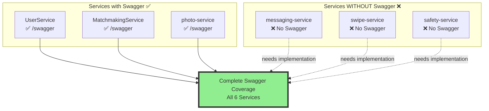
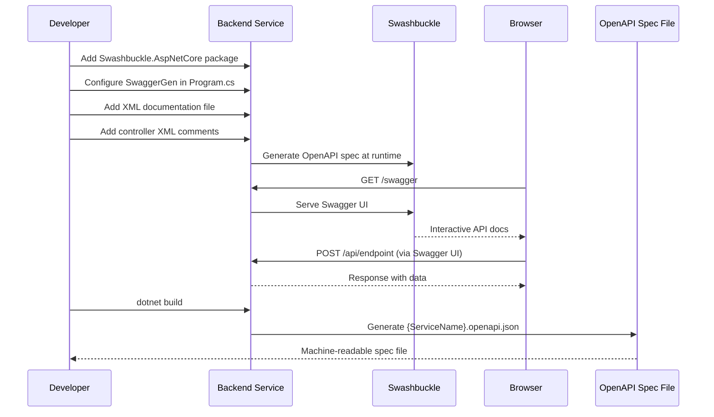

# OpenAPI/Swagger Documentation for All Services

## Layer 1: Feature Specification

### Business Context

Complete,consistent API documentation is critical for:
- **External integrations**: Third-party developers need machine-readable contracts
- **AI agents**: Complete context for understanding available endpoints
- **Frontend development**: Clear contracts prevent integration bugs
- **API testing**: Swagger UI enables direct endpoint testing without Postman

### User Stories

**US-1: API Documentation Visibility**
```
As a frontend developer
I want to see all available API endpoints with request/response schemas
So that I can integrate correctly without reading source code
```

**US-2: Interactive Testing**
```
As a backend developer
I want to test endpoints directly from the browser
So that I can debug issues without external tools
```

**US-3: AI Agent Context**
```
As an AI development assistant
I want machine-readable OpenAPI specs for all services
So that I can provide accurate code suggestions and understand system boundaries
```

### Acceptance Criteria

- [x] All 6 backend services expose `/swagger` endpoint
- [ ] Swagger UI includes JWT authentication support ("Authorize" button works)
- [ ] All controller actions have XML documentation comments
- [ ] OpenAPI spec files generated and stored in `specs/001-mvp-foundation/contracts/openapi/`
- [ ] Swagger UI shows request/response examples
- [ ] All DTOs document required vs optional fields
- [ ] Enum values documented with descriptions

---

## Layer 2: Implementation Plan

### Current State Assessment



### Implementation Sequence



### Component Design

#### Swashbuckle Configuration

**File**: `Program.cs` (each service)

```csharp
builder.Services.AddSwaggerGen(options =>
{
    options.SwaggerDoc("v1", new OpenApiInfo
    {
        Title = "UserService API",
        Version = "v1",
        Description = "User profile management and preferences",
        Contact = new OpenApiContact
        {
            Name = "DatingApp Team",
            Email = "dev@datingapp.example.com"
        }
    });
    
    // JWT Authentication
    options.AddSecurityDefinition("Bearer", new OpenApiSecurityScheme
    {
        Description = "JWT Authorization header using Bearer scheme. Enter 'Bearer' [space] and then your token.",
        Name = "Authorization",
        In = ParameterLocation.Header,
        Type = SecuritySchemeType.ApiKey,
        Scheme = "Bearer"
    });
    
    options.AddSecurityRequirement(new OpenApiSecurityRequirement
    {
        {
            new OpenApiSecurityScheme
            {
                Reference = new OpenApiReference
                {
                    Type = ReferenceType.SecurityScheme,
                    Id = "Bearer"
                }
            },
            Array.Empty<string>()
        }
    });
    
    // XML Documentation
    var xmlFile = $"{Assembly.GetExecutingAssembly().GetName().Name}.xml";
    var xmlPath = Path.Combine(AppContext.BaseDirectory, xmlFile);
    options.IncludeXmlComments(xmlPath);
});

builder.Services.AddSwaggerUI(options =>
{
    options.SwaggerEndpoint("/swagger/v1/swagger.json", "UserService API V1");
    options.RoutePrefix = "swagger";
    options.DocExpansion(Swashbuckle.AspNetCore.SwaggerUI.DocExpansion.List);
    options.DefaultModelsExpandDepth(2);
});
```

#### XML Documentation Example

```csharp
/// <summary>
/// Retrieves a user profile by ID with optional related data
/// </summary>
/// <param name="id">The unique identifier of the user profile</param>
/// <param name="includePhotos">Include user's photo collection</param>
/// <param name="includePreferences">Include match preferences</param>
/// <returns>User profile with requested related data</returns>
/// <response code="200">Profile found and returned successfully</response>
/// <response code="401">Unauthorized - JWT token missing or invalid</response>
/// <response code="403">Forbidden - Cannot access other users' profiles</response>
/// <response code="404">Profile not found</response>
/// <response code="500">Internal server error</response>
[HttpGet("{id}")]
[ProducesResponseType(typeof(UserProfileDto), StatusCodes.Status200OK)]
[ProducesResponseType(StatusCodes.Status401Unauthorized)]
[ProducesResponseType(StatusCodes.Status403Forbidden)]
[ProducesResponseType(StatusCodes.Status404NotFound)]
[ProducesResponseType(StatusCodes.Status500InternalServer Error)]
public async Task<ActionResult<UserProfileDto>> GetProfile(
    int id,
    [FromQuery] bool includePhotos = false,
    [FromQuery] bool includePreferences = false)
{
    // Implementation
}
```

---

## Layer 3: API Contracts

### Swagger UI Endpoints

Each service exposes Swagger at standardized location:

| Service | Swagger URL | OpenAPI JSON |
|---------|------------|--------------|
| UserService | `http://localhost:5002/swagger` | `/swagger/v1/swagger.json` |
| MatchmakingService | `http://localhost:5003/swagger` | `/swagger/v1/swagger.json` |
| photo-service | `http://localhost:5004/swagger` | `/swagger/v1/swagger.json` |
| swipe-service | `http://localhost:5005/swagger` | `/swagger/v1/swagger.json` |
| messaging-service | `http://localhost:5006/swagger` | `/swagger/v1/swagger.json` |
| safety-service | `http://localhost:5007/swagger` | `/swagger/v1/swagger.json` |

### Accessing via YARP Gateway

```bash
# All services aliased through YARP gateway
http://localhost:8080/swagger

# Individual services (if needed)
curl http://localhost:5002/swagger/v1/swagger.json > UserService.openapi.json
```

### OpenAPI Spec Storage

Generated specs stored in version control:

```
specs/001-mvp-foundation/contracts/openapi/
├── UserService.v1.json
├── MatchmakingService.v1.json
├── photo-service.v1.json
├── swipe-service.v1.json  
├── messaging-service.v1.json
└── safety-service.v1.json
```

### Example OpenAPI Snippet

```json
{
  "openapi": "3.0.1",
  "info": {
    "title": "UserService API",
    "version": "v1",
    "description": "User profile management and preferences"
  },
  "paths": {
    "/api/userprofiles/{id}": {
      "get": {
        "tags": ["UserProfiles"],
        "summary": "Retrieves a user profile by ID",
        "parameters": [
          {
            "name": "id",
            "in": "path",
            "required": true,
            "schema": {"type": "integer"}
          }
        ],
        "responses": {
          "200": {
            "description": "Profile found",
            "content": {
              "application/json": {
                "schema": {"$ref": "#/components/schemas/UserProfileDto"}
              }
            }
          }
        },
        "security": [{"Bearer": []}]
      }
    }
  },
  "components": {
    "schemas": {
      "UserProfileDto": {
        "type": "object",
        "properties": {
          "id": {"type": "integer"},
          "name": {"type": "string"},
          "age": {"type": "integer"},
          "bio": {"type": "string", "nullable": true}
        },
        "required": ["id", "name", "age"]
      }
    },
    "securitySchemes": {
      "Bearer": {
        "type": "apiKey",
        "name": "Authorization",
        "in": "header"
      }
    }
  }
}
```

---

## Layer 4: Architecture Decisions

### ADR-013: Swashbuckle vs NSwag

**Context:**  
Need to generate OpenAPI docs for .NET services. Two main options: Swashbuckle.AspNetCore and NSwag.

**Decision:**  
Use **Swashbuckle.AspNetCore** for all services.

**Consequences:**
- ✅ Most popular .NET OpenAPI library (better community support)
- ✅ Simpler configuration than NSwag
- ✅ Better Swagger UI integration
- ✅ Active maintenance and .NET 8 support
- ⚠️ Less customization than NSwag (acceptable for MVP)

**Alternatives Considered:**
- NSwag: More powerful but complex configuration, overkill for MVP
- Manual OpenAPI yaml: Unmaintainable, prone to drift from code

---

### ADR-014: XML Comments Required for All Endpoints

**Context:**  
Swagger can generate docs from controller actions alone, but descriptions are generic without XML comments.

**Decision:**  
Require XML documentation comments on all public controller methods and DTOs. Enforce via build warnings.

**Consequences:**
- ✅ Richer API documentation with descriptions and examples
- ✅ IntelliSense improvements in IDEs
- ✅ Better AI agent understanding of endpoints
- ⚠️ Developers must write comments (adds ~5 min per endpoint)
- ⚠️ Need to maintain comments alongside code

**Implementation:**
```xml
<PropertyGroup>
  <GenerateDocumentationFile>true</GenerateDocumentationFile>
  <NoWarn>$(NoWarn);1591</NoWarn> <!-- Suppress missing XML comment warnings for MVP -->
</PropertyGroup>
```

Post-MVP: Remove NoWarn to enforce 100% documentation.

---

### ADR-015: Store Generated OpenAPI Specs in Version Control

**Context:**  
OpenAPI specs can be generated on demand or stored as static files.

**Decision:**  
Generate specs during build and commit to `specs/001-mvp-foundation/contracts/openapi/` directory.

**Consequences:**
- ✅ Offline access to API contracts without running services
- ✅ Git diff shows API changes in PRs
- ✅ External tools can consume specs without live services
- ✅ AI agents have static contract references
- ⚠️ Must remember to regenerate after API changes
- ⚠️ Potential for drift if not automated

**Mitigation:**
Add CI check that validates committed specs match generated specs.

---

### ADR-016: JWT Authentication in Swagger UI

**Context:**  
Swagger UI can test endpoints but needs valid JWT tokens for auth.

**Decision:**  
Configure Swagger to accept Bearer tokens via "Authorize" button. Developers manually obtain token from Keycloak or `/api/auth/token`.

**Consequences:**
- ✅ Developers can test auth endpoints without Postman
- ✅ Faster debugging workflow
- ✅ Demonstrates working auth to stakeholders
- ⚠️ Tokens expire (must re-authorize every hour)
- ⚠️ Requires manual token copy-paste

**Alternatives Considered:**
- OAuth2 flow in Swagger: Too complex to configure with Keycloak
- Hardcoded test tokens: Security risk
- No auth in Swagger: Defeats purpose of testing real endpoints

---

## Implementation Checklist

### Phase 1: Enable Swagger (services missing it)

- [ ] **messaging-service**:
  - [ ] `dotnet add package Swashbuckle.AspNetCore`
  - [ ] Configure SwaggerGen and SwaggerUI in Program.cs
  - [ ] Enable XML documentation in .csproj
  - [ ] Add XML comments to SignalR hub methods

- [ ] **swipe-service**:
  - [ ] `dotnet add package Swashbuckle.AspNetCore`
  - [ ] Configure Swagger in Program.cs
  - [ ] Add XML comments to SwipesController

- [ ] **safety-service**:
  - [ ] `dotnet add package Swashbuckle.AspNetCore`
  - [ ] Configure Swagger in Program.cs
  - [ ] Add XML comments to SafetyController (reports, blocks)

### Phase 2: Enhance Existing Swagger

- [ ] **UserService**:
  - [ ] Add XML comments to all controller methods
  - [ ] Add ProducesResponseType attributes
  - [ ] Configure JWT authentication in Swagger UI

- [ ] **MatchmakingService**:
  - [ ] Add XML comments to GetCandidates, CreateMatch, Unmatch
  - [ ] Document scoring algorithm parameters

- [ ] **photo-service**:
  - [ ] Add XML comments to upload endpoint
  - [ ] Document file size limits and supported formats

### Phase 3: Generate and Store Specs

- [ ] Create generation script:
```bash
#!/bin/bash
# specs/001-mvp-foundation/contracts/openapi/generate-specs.sh

services=("UserService:5002" "Match makingService:5003" "photo-service:5004" "swipe-service:5005" "messaging-service:5006" "safety-service:5007")

for service in "${services[@]}"; do
    name="${service%%:*}"
    port="${service##*:}"
    curl "http://localhost:${port}/swagger/v1/swagger.json" \
        -o "${name}.v1.json"
    echo "✅ Generated ${name}.v1.json"
done
```

- [ ] Run generation after every API change
- [ ] Commit specs to git
- [ ] Add .gitattributes entry to treat .json as text

### Phase 4: CI/CD Integration

- [ ] Add swagger validation to GitHub Actions:
```yaml
- name: Validate OpenAPI Specs
  run: |
    ./dev-start.sh
    ./specs/001-mvp-foundation/contracts/openapi/generate-specs.sh
    git diff --exit-code specs/001-mvp-foundation/contracts/openapi/
```

---

## Testing Checklist

- [ ] All services respond to `/swagger` with Swagger UI
- [ ] Swagger UI "Authorize" button accepts JWT token
- [ ] Test authenticated endpoint returns 200 (not 401)
- [ ] Test unauthenticated endpoint returns 401
- [ ] All endpoints show request/response schemas
- [ ] Enum values documented in schemas
- [ ] Required vs optional fields clearly marked
- [ ] Error response schemas documented

---

## Benefits for AI Agents

### Improved Context
- Machine-readable contracts eliminate guesswork
- Parameter types, validation rules explicit
- Response schemas show exact data structures
- Examples demonstrate correct usage

### Code Generation
```typescript
// AI can generate accurate Flutter models from OpenAPI
class UserProfileDto {
  final int id;
  final String name;
  final int age;
  final String? bio;  // Nullable from OpenAPI spec
  
  UserProfileDto.fromJson(Map<String, dynamic> json)
      : id = json['id'] as int,
        name = json['name'] as String,
        age = json['age'] as int,
        bio = json['bio'] as String?;
}
```

---

## Future Enhancements

1. **API Versioning**: `/api/v2/` routes with separate Swagger docs
2. **Code Examples**: Curl, JavaScript, Python snippets in Swagger UI
3. **Mock Server**: Generate mock responses from OpenAPI specs for frontend dev
4. **Contract Testing**: Pact contracts generated from OpenAPI
5. **Breaking Change Detection**: Automated diff between spec versions

---

**Status**: Planned  
**Priority**: P1-008 (Phase 1, Week 1)  
**Estimated Effort**: 2-3 hours  
**Dependencies**: None  
**Next Action**: Add Swashbuckle to messaging-service, swipe-service, safety-service
