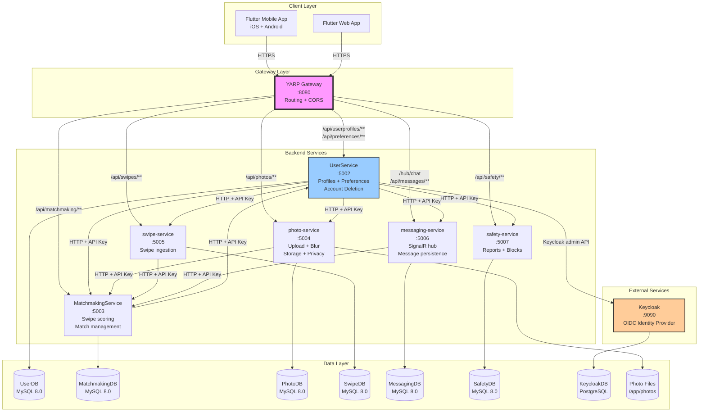
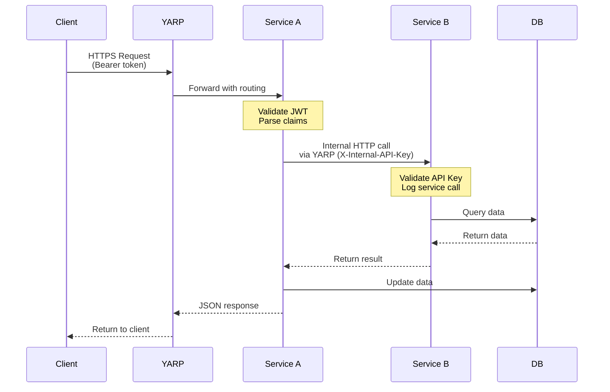
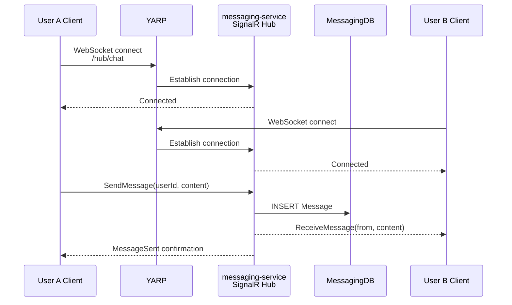
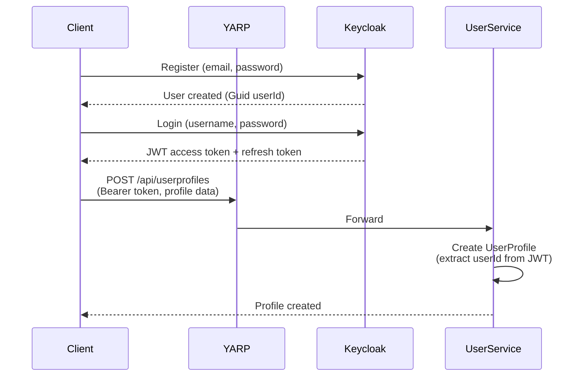
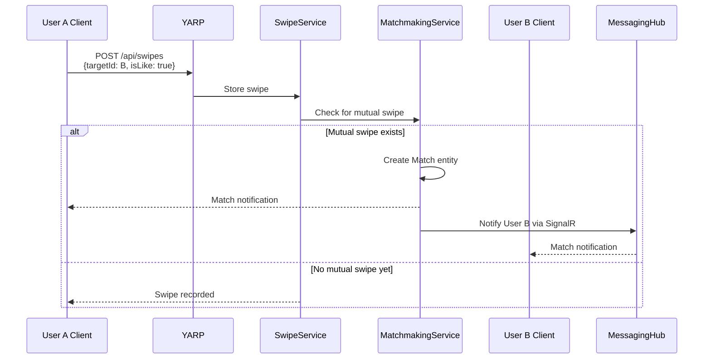
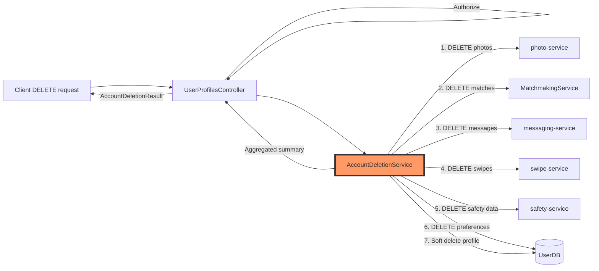
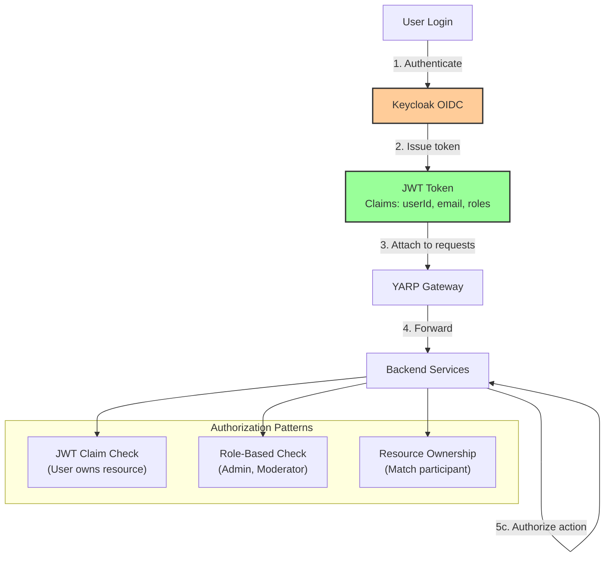
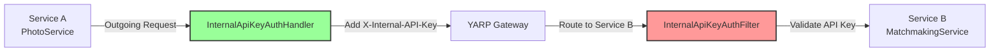
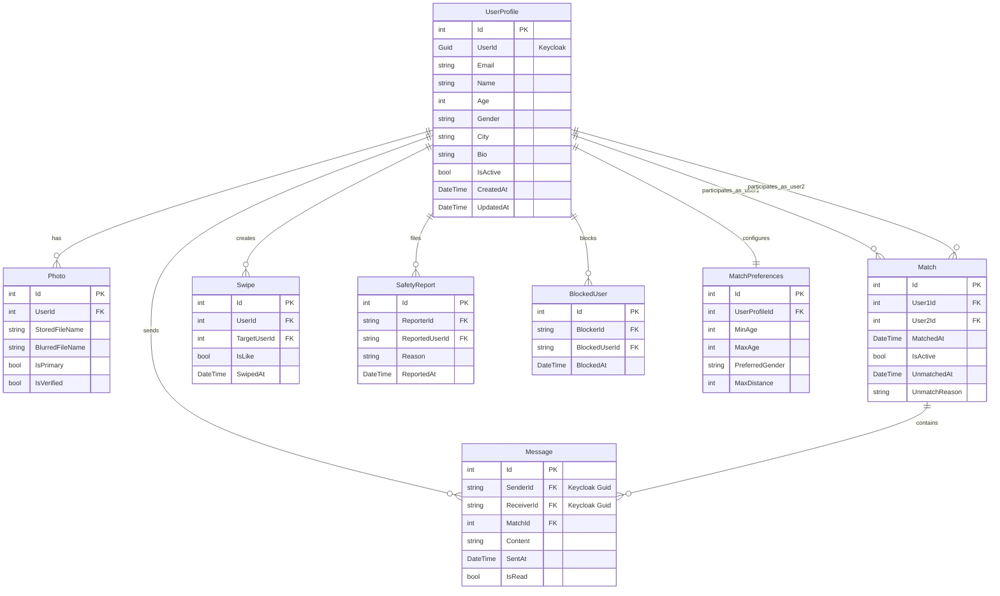
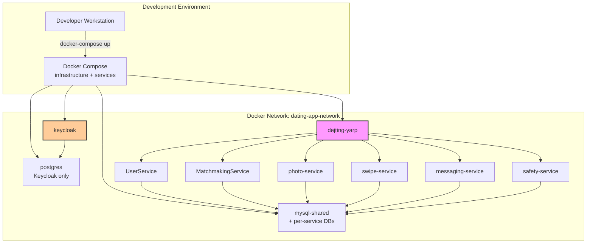

# DatingApp System Architecture Overview

## Purpose

This document provides a high-level overview of the DatingApp microservices architecture, showing how services communicate, data flows, and key integration points. This serves as the foundation for understanding individual feature implementations.

---

## System Components

### Microservices Architecture



---

## Service Responsibilities

| Service | Port | Primary Responsibilities | Key Entities |
|---------|------|-------------------------|--------------|
| **YARP** | 8080 | API gateway, routing, CORS, load balancing | N/A (stateless) |
| **Keycloak** | 9090 | OpenID Connect provider, user authentication, JWT issuance | Users, Clients, Realms |
| **UserService** | 5002 | User profiles, match preferences, account deletion orchestration | UserProfile, MatchPreferences |
| **MatchmakingService** | 5003 | Match creation, unmatch, consolidated match list | Match, Swipe |
| **photo-service** | 5004 | Photo upload, blur processing, privacy controls | Photo (metadata), file storage |
| **swipe-service** | 5005 | Swipe ingestion, matchmaking hooks | Swipe |
| **messaging-service** | 5006 | Real-time messaging (SignalR), message persistence | Message, Conversation |
| **safety-service** | 5007 | User reports, blocking, content moderation | SafetyReport, BlockedUser |

---

## Communication Patterns

### HTTP REST Communication



**Key Principles:**
- All external requests go through YARP gateway
- Service-to-service calls route through YARP (e.g., `http://dejting-yarp:8080`)
- Internal endpoints protected with `[RequireInternalApiKey]` attribute (API key validation)
- Authorization via JWT claims (Keycloak-issued tokens) for client requests
- Service-to-service auth via internal API keys (X-Internal-API-Key header)

### SignalR Real-Time Communication



**Key Principles:**
- SignalR hub hosted in messaging-service
- WebSocket connections through YARP (`/hub/chat`)
- Messages persisted to database for offline users
- Connection groups by userId for targeted delivery

---

## Data Flow Examples

### User Registration Flow



### Match Creation Flow



### Account Deletion Cascade Flow



---

## ID Strategy

### Dual ID System

The system uses two types of user identifiers:

| ID Type | Services Using It | Format | Source | Example |
|---------|------------------|--------|--------|---------|
| **UserProfile.Id** | photo-service, MatchmakingService, swipe-service | `int` (auto-increment) | UserService database | `123` |
| **UserId** | messaging-service, safety-service, AuthService | `Guid` (string) | Keycloak | `"a7f3e8c2-4b1a-..."` |

**Why Two IDs?**
- Legacy services (photo, matchmaking, swipe) built before Keycloak integration used auto-increment IDs
- Newer services (messaging, safety) built with Keycloak from start use standard OIDC `sub` claim (Guid)
- Migration to single ID strategy deferred to avoid breaking changes

**How Services Map Between Them:**
- UserProfile entity stores both: `Id` (int, PK) and `UserId` (Guid, indexed)
- AccountDeletionService retrieves both and uses appropriate ID per service

---

## Security Model



**Key Security Principles:**
1. **All client requests require JWT** (except anonymized public endpoints)
2. **Service-to-service calls use internal API keys** (X-Internal-API-Key header)
3. **UserId extracted from claims** (`ClaimTypes.NameIdentifier`)
4. **Resource ownership checks** (e.g., user can only delete own account)
5. **Keycloak as single source of truth** for authentication

### Service-to-Service Authentication

**Internal API Key System** (implemented 2026-01-26):

All microservices now use internal API key authentication to secure cross-service HTTP communication. This prevents unauthorized access to internal endpoints and provides audit trails for service-to-service calls.

**Architecture Components:**



**Components:**
- **InternalApiKeyAuthHandler** (`Common/InternalApiKeyAuthHandler.cs`): DelegatingHandler that adds `X-Internal-API-Key` header to outgoing HttpClient requests
- **InternalApiKeyAuthFilter** (`Common/InternalApiKeyAuthFilter.cs`): Authorization filter that validates incoming internal API requests
- **[RequireInternalApiKey]** Attribute: Apply to controllers/actions that should only accept service-to-service calls

**Security Model:**
- **Each service has unique API key for outgoing requests** (`InternalAuth:ApiKey` in appsettings)
- **Each service validates comma-separated trusted keys** (`InternalAuth:ValidApiKeys` from other services)
- **DEV mode**: Allows requests if `ValidApiKeys` empty (gradual rollout, logs warnings)
- **PROD mode** (TODO): Strict validation, environment variables, key rotation

**Service Communication Matrix:**

| Service | Outgoing Calls (adds API key to) | Incoming Calls (validates API key from) |
|---------|-----------------------------------|------------------------------------------|
| PhotoService | MatchmakingService, SafetyService | MessagingService, UserService |
| MatchmakingService | UserService, SafetyService | PhotoService, MessagingService, SwipeService |
| MessagingService | SafetyService, MatchmakingService | PhotoService |
| SwipeService | MatchmakingService | None currently |
| UserService | None currently | MatchmakingService |

**Configuration Example** (appsettings.Development.json - gitignored):
```json
{
  "InternalAuth": {
    "ApiKey": "photo-service-internal-key-dev-only",
    "ValidApiKeys": "matchmaking-service-internal-key-dev-only,safety-service-internal-key-dev-only,user-service-internal-key-dev-only"
  }
}
```

**Usage:**
```csharp
// Protecting an internal endpoint
[ApiController]
[Route("api/internal/matches")]
public class InternalMatchesController : ControllerBase
{
    [HttpGet("check/{userId1}/{userId2}")]
    [RequireInternalApiKey]  // Only services with valid API keys can call
    public async Task<ActionResult<bool>> CheckMatch(string userId1, string userId2)
    {
        // Match verification logic
    }
}
```

**See Also:** [SERVICE_TO_SERVICE_AUTH.md](../../../SERVICE_TO_SERVICE_AUTH.md) for complete implementation details, troubleshooting, and migration guide.

---

## Database Schema Relationships



---

## Technology Stack

### Backend
- **.NET 8**: All microservices use ASP.NET Core 8
- **Entity Framework Core 8**: ORM for database access with Pomelo MySQL provider
- **MySQL 8.0**: Primary database for all backend services (UserService, MatchmakingService, photo-service, swipe-service, messaging-service, safety-service)
- **PostgreSQL**: Identity database for Keycloak only
- **SignalR**: Real-time WebSocket communication
- **YARP**: Reverse proxy and API gateway
- **Keycloak**: OpenID Connect identity provider

### Frontend
- **Flutter 3.32.1**: Cross-platform mobile + web client
- **Dart 3.5**: Programming language
- **Riverpod**: State management (lite pattern)

### Infrastructure
- **Docker Compose**: Local development orchestration
- **Bash scripts**: dev-start.sh, dev-stop.sh automation

### Image Processing
- **ImageSharp**: Photo processing and blur
- **OpenCvSharp**: Advanced blur algorithms (future)

### Machine Learning
- **ML.NET**: Match scoring algorithms (planned)

---

## Deployment Architecture



**Container Ports:**
- YARP: 8080 (external), internal routing
- Keycloak: 9090 (external), 8080 (internal)
- Services: 5002-5007 (internal only, accessed via YARP)
- MySQL: 3306 (internal only), per-service databases on ports 3311-3315
- PostgreSQL: 5432 (internal only, Keycloak)

**Database Port Mapping:**
- 3311: photo-service-db
- 3312: matchmaking-service-db
- 3313: messaging-service-db
- 3314: swipe-service-db
- 3315: user-service-db

---

## Future Architecture Enhancements

### Planned Improvements
1. **Message Queue (RabbitMQ/Kafka)**: Async event-driven architecture for swipes, matches, notifications
2. **Redis Cache**: Cache UserProfiles, match lists, swipe history
3. **Elasticsearch**: Full-text search for profiles, messages
4. **CDN**: Offload photo delivery to Cloudflare/AWS CloudFront
5. **Kubernetes**: Replace Docker Compose for production
6. **API Versioning**: Support /v1/, /v2/ endpoints for breaking changes
7. **Circuit Breaker**: Polly policies for resilient service-to-service calls
8. **Distributed Tracing**: OpenTelemetry for request tracking across services

### Scalability Considerations
- **Horizontal Scaling**: All services stateless (except SignalR, needs sticky sessions)
- **Database Sharding**: Partition UserProfiles by geographic region
- **Read Replicas**: Offload read-heavy operations (match list, profiles)
- **CQRS**: Separate read/write models for high-traffic features

---

## Related Documentation

- [Account Deletion Feature](./account-deletion.md) - Cascade deletion across 6 services
- [Unmatch Feature](./unmatch.md) - Match lifecycle and soft delete
- [Consolidated Match List](./match-list.md) - Data aggregation pattern
- [API Specification](../contracts/api-spec.md) - Complete REST API reference
- [SignalR Specification](../contracts/signalr-spec.md) - Real-time messaging protocol
- [RUNBOOK.md](../../../RUNBOOK.md) - Operational commands and workflows

---

**Last Updated:** 2026-01-20  
**Version:** 1.0 - MVP Foundation  
**Maintainers:** Backend Team, Architecture Group
