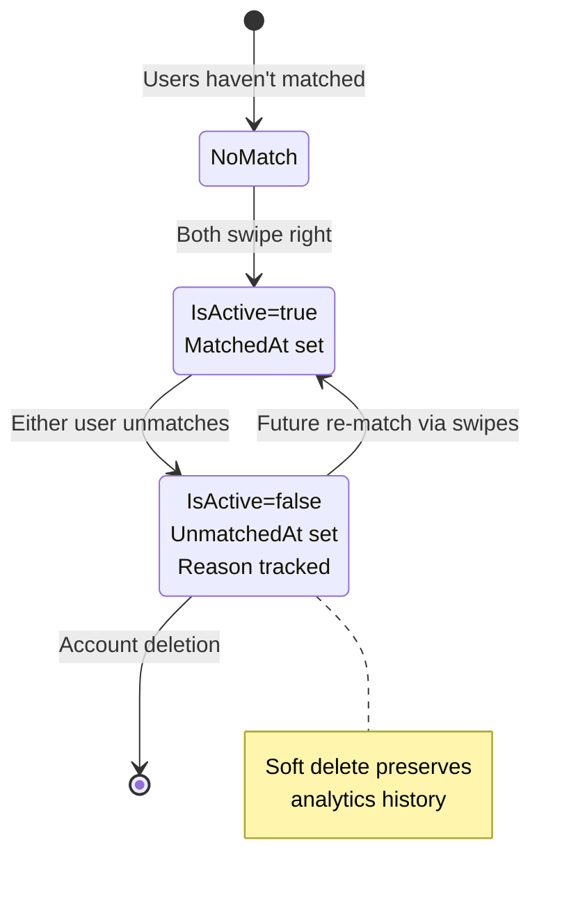
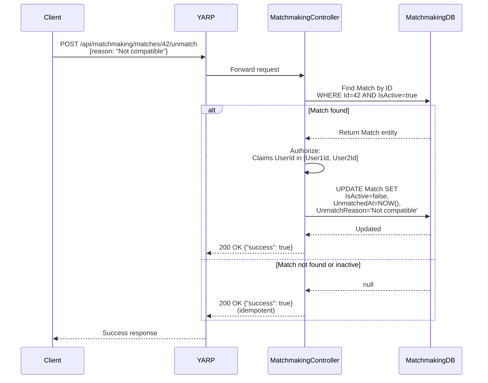
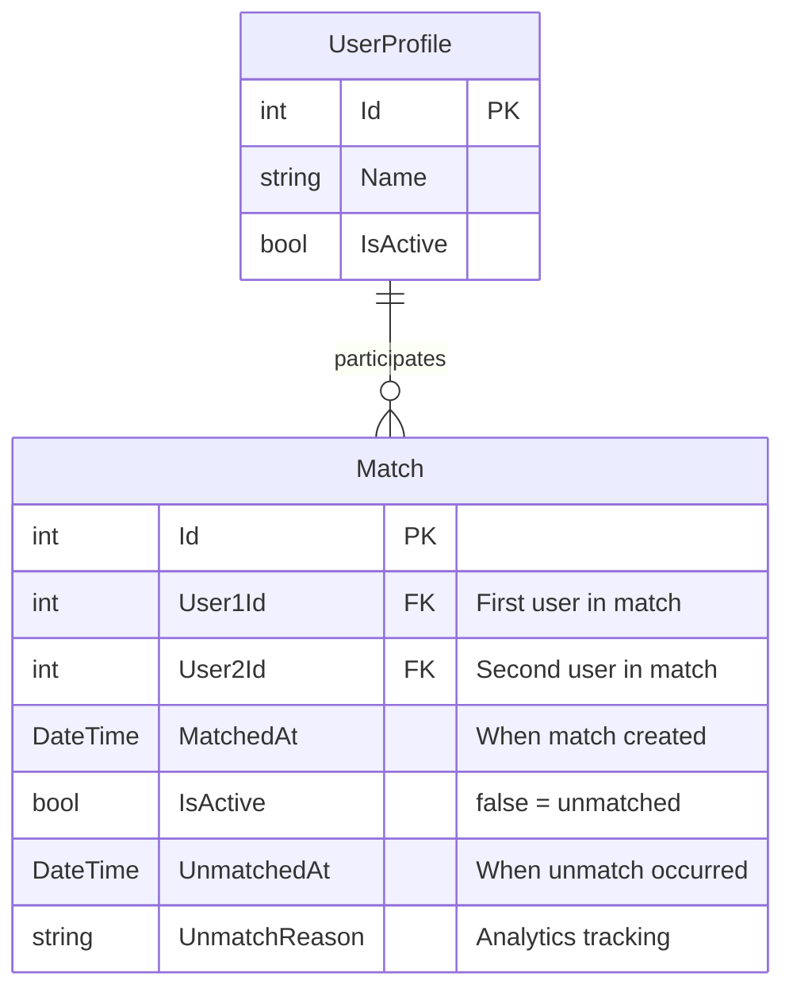

# Unmatch Feature

## Layer 1: Feature Specification

### Business Context

The unmatch feature gives users control over their match list by allowing them to remove unwanted matches. This is essential for user agency and improves match quality by capturing explicit negative feedback. Unlike blocking (safety feature), unmatching is a soft action that anonymizes the relationship without preventing future rematching.

### User Stories

**US-1: Basic Unmatch**
```
As a user
I want to unmatch with someone I'm no longer interested in
So that I can clean up my match list and stop receiving messages from them
```

**US-2: Reason Tracking**
```
As a product manager
I want to understand why users unmatch
So that I can improve the matching algorithm
```

**US-3: Graceful Degradation**
```
As a user
I want unmatching to be reversible (through algorithm)
So that accidental unmatch doesn't permanently block a potential connection
```

### Acceptance Criteria

- [x] User can unmatch from any active match they participate in
- [x] Unmatch sets `IsActive=false` on Match entity (soft delete)
- [x] Optional reason tracking for analytics
- [x] UnmatchedAt timestamp recorded
- [x] Match can be re-created in future if both users swipe right again
- [x] Endpoint returns success even if match not found (idempotent)
- [x] Only match participants can unmatch (authorization)

---

## Layer 2: Implementation Plan

### State Transition Diagram



### Request Flow Sequence



### Component Design

#### MatchmakingController.Unmatch

**Method Signature:**
```csharp
[HttpPost("matches/{matchId}/unmatch")]
public async Task<IActionResult> Unmatch(int matchId, [FromBody] UnmatchRequest request)
```

**Logic Flow:**
1. Query Match entity by ID where IsActive=true
2. If not found, return success (idempotent)
3. Verify JWT claims: User must be User1Id OR User2Id
4. Update entity: IsActive=false, UnmatchedAt=DateTime.UtcNow, UnmatchReason=request.Reason
5. Save changes
6. Return success response

**Error Handling:**
- Missing/invalid JWT → 401 Unauthorized
- User not participant in match → 403 Forbidden
- Database error → 500 Internal Server Error with logged details

---

## Layer 3: API Contracts

### Unmatch Endpoint

**Endpoint:** `POST /api/matchmaking/matches/{matchId}/unmatch`

**Authorization:** Required (Bearer token)

**Path Parameters:**
- `matchId` (integer): ID of the match to unmatch

**Request Headers:**
```
Authorization: Bearer {jwt_token}
Content-Type: application/json
```

**Request Body:**
```json
{
  "reason": "Not compatible"
}
```

**Request Schema:**
```typescript
interface UnmatchRequest {
  reason?: string;  // Optional analytics tracking
}
```

**Valid Reasons (suggested, not enforced):**
- `"not_compatible"`
- `"found_someone"`
- `"no_response"`
- `"inappropriate_behavior"`
- `"catfish"` (should trigger safety report)
- `"accidental"` (low priority for algorithm)

**Success Response (200 OK):**
```json
{
  "success": true,
  "message": "Match ended successfully"
}
```

**Success Response (200 OK - Idempotent):**
```json
{
  "success": true,
  "message": "Match already ended or not found"
}
```

**Error Responses:**

| Code | Scenario | Response |
|------|----------|----------|
| 401 | Not authenticated | `Unauthorized` |
| 403 | Not a participant in this match | `{"success": false, "message": "Forbidden"}` |
| 500 | Database error | `{"success": false, "message": "Error occurred"}` |

### Data Model



**Match Lifecycle Fields:**

| Field | Purpose | Set On Match | Set On Unmatch |
|-------|---------|--------------|----------------|
| `MatchedAt` | Timestamp of match creation | `DateTime.UtcNow` | (unchanged) |
| `IsActive` | Whether match is active | `true` | `false` |
| `UnmatchedAt` | Timestamp of unmatch | `null` | `DateTime.UtcNow` |
| `UnmatchReason` | Why user unmatched | `null` | Request.Reason |

---

## Layer 4: Architecture Decisions

### ADR-005: Soft Delete for Unmatch

**Context:**  
When users unmatch, we need to decide whether to delete the Match record or preserve it for analytics.

**Decision:**  
Use soft delete pattern: set `IsActive=false` and populate `UnmatchedAt` timestamp. Preserve Match record indefinitely for analytics.

**Consequences:**
- ✅ Analytics can track unmatch rates and reasons
- ✅ Algorithm can learn from negative feedback
- ✅ Audit trail preserved for safety investigations
- ✅ Future re-matching possible (creates new Match record or reactivates existing)
- ⚠️ Database grows with inactive matches
- ⚠️ Queries must filter by IsActive=true

**Alternatives Considered:**
- Hard delete Match record: Rejected due to loss of analytics data
- Move to MatchHistory table: Rejected as unnecessary complexity
- Delete and recreate on re-match: Rejected to preserve history lineage

### ADR-006: Reason Tracking as Optional Free-Text

**Context:**  
Understanding why users unmatch is valuable for algorithm improvement, but mandatory surveys reduce friction.

**Decision:**  
Accept optional `reason` field as free-text string. Client can offer predefined options but backend accepts any value.

**Consequences:**
- ✅ Low friction (users not forced to provide reason)
- ✅ Flexibility for A/B testing reason collection UX
- ✅ Rich qualitative data from free-text
- ⚠️ Requires NLP processing for categorization
- ⚠️ Can't enforce enum validation at API level

**Alternatives Considered:**
- Mandatory reason dropdown: Rejected due to user friction
- Enum-enforced reasons: Rejected to allow UX flexibility
- Separate analytics event: Deferred as potential enhancement

### ADR-007: Idempotent Unmatch Operation

**Context:**  
Network retries or UI double-clicks could cause duplicate unmatch requests.

**Decision:**  
Make unmatch endpoint idempotent: always return success if match doesn't exist or is already inactive.

**Consequences:**
- ✅ Safe for network retries
- ✅ Simplified client error handling
- ✅ Matches HTTP semantics (POST for state change, idempotent outcome)
- ⚠️ Can't distinguish "never existed" from "already unmatched" in response

**Alternatives Considered:**
- Return 404 if match not found: Rejected as adds client complexity
- Return different status for already-unmatched: Rejected as unnecessary detail
- Track unmatch count: Deferred to analytics layer

### ADR-008: Authorization via Match Participation

**Context:**  
Need to prevent users from unmatching other users' matches.

**Decision:**  
Verify JWT claims: `UserId` must match either `User1Id` or `User2Id` in the Match entity. Return 403 Forbidden if unauthorized.

**Consequences:**
- ✅ Simple authorization logic
- ✅ Leverages existing JWT infrastructure
- ✅ No separate permissions system needed
- ✅ User can unmatch from either side of match
- ⚠️ Requires database lookup before authorization check

**Alternatives Considered:**
- Administrator can unmatch anyone: Deferred to future moderation features
- Separate "unmatch permission" claim: Rejected as over-engineering
- Allow anyone to unmatch inactive matches: Rejected as security risk

---

## Implementation Checklist

- [x] Layer 1: Feature spec with user stories
- [x] Layer 2: State transition and sequence diagrams
- [x] Layer 3: API contract with request/response schemas
- [x] Layer 4: ADRs for key decisions
- [x] Controller endpoint implementation
- [x] Database schema updates (UnmatchedAt, UnmatchReason columns)
- [x] Authorization checks
- [x] Idempotent behavior
- [x] Build verification

## Testing Status

- [ ] Unit test: Successful unmatch
- [ ] Unit test: Idempotent unmatch (already inactive)
- [ ] Unit test: Authorization failure (wrong user)
- [ ] Unit test: Optional reason tracking
- [ ] Integration test: Unmatch + re-match flow
- [ ] Load test: Concurrent unmatch requests

## Future Enhancements

1. **Undo Unmatch**: Allow users to reverse unmatch within time window (e.g., 24 hours)
2. **Bulk Unmatch**: Unmatch multiple matches in single request
3. **Notification**: Optionally notify other user of unmatch (controversial)
4. **Unmatch Limit**: Prevent abuse by limiting unmatches per day
5. **Reason Analytics Dashboard**: ML clustering of free-text reasons
6. **Automatic Unmatch**: Unmatch inactive conversations after X days

---

**Status:** ✅ **Implemented** | **Date:** 2026-01-20  
**Related ADRs:** ADR-005, ADR-006, ADR-007, ADR-008  
**Related Features:** [Match List](./match-list.md), [Account Deletion](./account-deletion.md)
