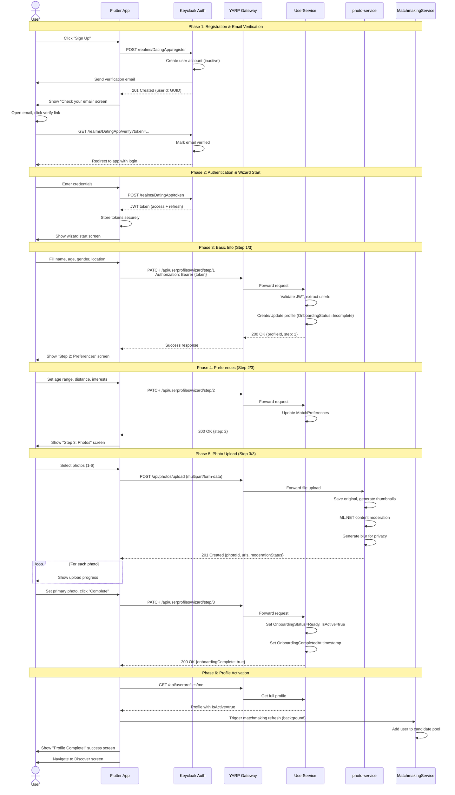
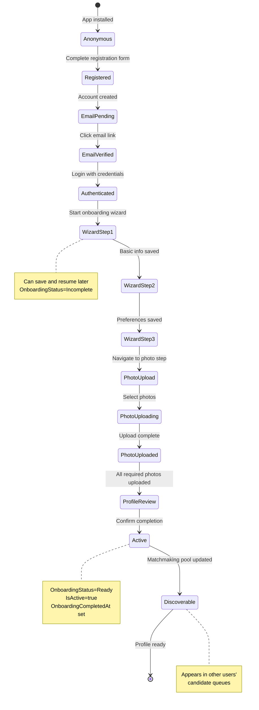
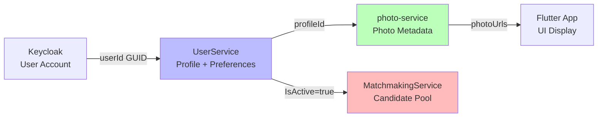
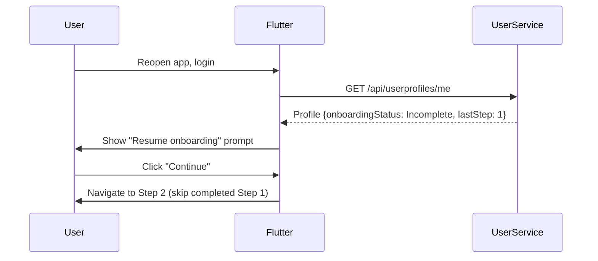
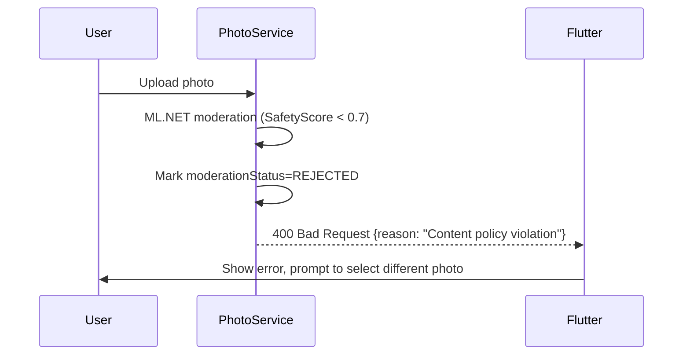
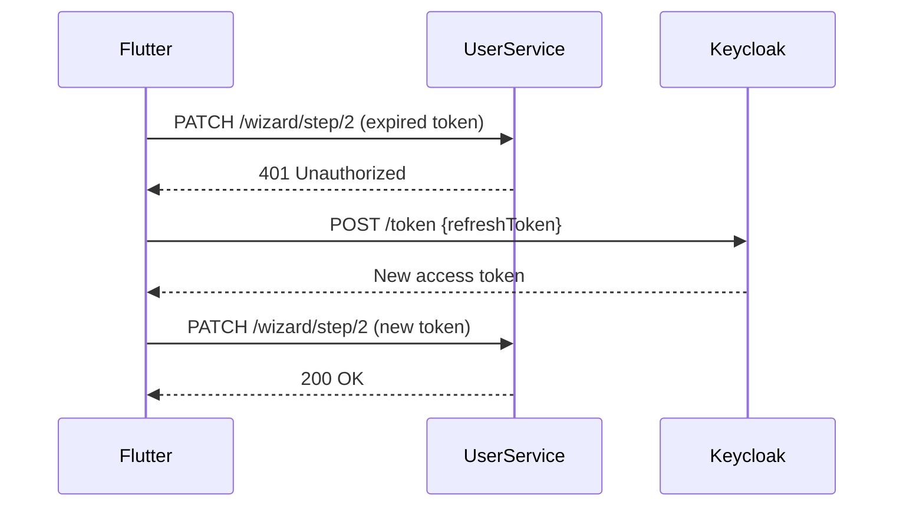

# User Journey: Registration to Active Profile

**User Story**: US1 - First-Time Profile Creation (Priority: P1)  
**Goal**: New visitor completes registration, email verification, profile wizard, and photo upload to become active on the platform  
**Time to Complete**: 5-12 minutes (target: <10 minutes for 90% of users)

---

## High-Level User Journey Flow



---

## User State Machine



---

## Service Integration Points

### Services Involved (In Order)

1. **Keycloak** (External OIDC Provider)
   - Registration endpoint: `/realms/DatingApp/realms-management`
   - Email verification: Sends template email with verify link
   - Token issuance: `/realms/DatingApp/protocol/openid-connect/token`

2. **YARP Gateway** (Port 8080)
   - Routes all API calls to backend services
   - Validates JWT on every request
   - Forwards Authorization header downstream

3. **UserService** (Port 8082)
   - **WizardController** endpoints:
     - `PATCH /api/userprofiles/wizard/step/1` - Basic info
     - `PATCH /api/userprofiles/wizard/step/2` - Preferences
     - `PATCH /api/userprofiles/wizard/step/3` - Photo confirmation
   - Creates `UserProfile` entity with `OnboardingStatus` enum
   - Creates `MatchPreferences` entity for step 2
   - Updates `IsActive=true` and `OnboardingCompletedAt` on step 3

4. **photo-service** (Port 8085)
   - **PhotosController** endpoint:
     - `POST /api/photos/upload` - Multipart file upload
   - Processes images: resize, thumbnails, blur generation
   - ML.NET content moderation (auto-approve safe content)
   - Returns photo URLs for immediate display

5. **MatchmakingService** (Port 8083)
   - Background refresh: Adds new active profiles to candidate pool
   - No explicit API call; triggered by periodic job or event

### Data Flow Across Services



---

## Edge Cases & Failure Modes

### 1. Email Verification Timeout
**Scenario**: User doesn't verify email within 24 hours

**Current Behavior**: Keycloak account remains unverified, cannot login

**Handling**:
- Show "Resend verification email" option on login screen
- Keycloak sends new email with fresh token
- Old token expires automatically

**Future Enhancement**: Send reminder email after 12 hours

---

### 2. Wizard Interruption (Resume Later)
**Scenario**: User closes app after completing Step 1 only

**Current Behavior**:
- `OnboardingStatus=Incomplete` persisted in database
- Profile exists but `IsActive=false`

**Resume Flow**:


**Test Case**: T026 Flutter wizard UI handles resume logic

---

### 3. Photo Upload Failure (Network/Server Error)
**Scenario**: File upload times out or photo-service returns 500

**Handling**:
- Flutter shows retry button
- Photos uploaded to local cache first
- Retry with exponential backoff (1s, 2s, 4s)
- User can skip and add photos later (but must have 1 minimum)

**Error Messages**:
- Network error: "Connection lost. Tap to retry."
- Server error: "Upload failed. Please try again or choose a different photo."
- Moderation rejection: "This photo cannot be used. Please select another."

---

### 4. Content Moderation Rejection
**Scenario**: ML.NET flags photo as inappropriate

**Flow**:


**Test Case**: T024 PhotoService moderation pipeline

---

### 5. Duplicate Registration Attempt
**Scenario**: User tries to register with already-used email

**Keycloak Behavior**:
- Returns 409 Conflict: "User already exists"

**Flutter Handling**:
- Show "Email already registered" message
- Redirect to login screen with "Forgot password?" option

---

### 6. Wizard Step Validation Failure
**Scenario**: User submits incomplete data (e.g., age < 18, bio > 500 chars)

**UserService Validation**:
- Each wizard endpoint validates input before saving
- Returns 400 Bad Request with specific field errors

**Example Response**:
```json
{
  "success": false,
  "errors": {
    "age": "Must be 18 or older",
    "bio": "Maximum 500 characters"
  }
}
```

**Flutter Handling**:
- Show inline validation errors
- Highlight invalid fields in red
- Prevent navigation to next step until valid

---

### 7. JWT Token Expiration Mid-Wizard
**Scenario**: Token expires after 1 hour during slow onboarding

**Handling**:
- YARP detects 401 Unauthorized from UserService
- Flutter intercepts 401, attempts token refresh
- If refresh succeeds, retry original request
- If refresh fails, redirect to login (preserve wizard progress via OnboardingStatus)

**Refresh Token Flow**:


---

### 8. No Photos Uploaded (Minimum Requirement)
**Scenario**: User tries to complete wizard without uploading any photos

**Validation**:
- Step 3 endpoint checks: `SELECT COUNT(*) FROM Photos WHERE UserId=... AND IsActive=true`
- If count < 1, return 400 Bad Request: "At least 1 photo required"

**Flutter Handling**:
- Disable "Complete" button until 1 photo uploaded
- Show visual indicator: "Upload at least 1 photo to continue"

---

### 9. Concurrent User Updates (Race Condition)
**Scenario**: User opens app on 2 devices, updates wizard on both

**Database Handling**:
- UserService uses optimistic concurrency (EF Core RowVersion)
- Last write wins for wizard data
- Unlikely scenario (onboarding typically single-session)

---

### 10. MatchmakingService Unreachable During Activation
**Scenario**: Profile set to Active but matchmaking never updates pool

**Current Behavior**:
- UserService completes successfully (ActiveTrue)
- Matchmaking refresh is async/background job
- If service down, retry on next scheduled refresh (every 5 mins)

**Impact**:
- User won't appear in discovery immediately
- Self-heals within 5 minutes

**Future Enhancement**: Publish event to message queue instead of polling

---

## Acceptance Test Scenarios

### Manual Test 1: Happy Path Registration
**Prerequisites**: Fresh Keycloak realm, no existing users

**Steps**:
1. Open Flutter app, tap "Sign Up"
2. Enter: email=test@example.com, password=Test123!
3. Check email inbox, click verification link
4. Return to app, login with credentials
5. Wizard Step 1: Name="John Doe", Age=28, Gender=Male, Location="Stockholm"
6. Wizard Step 2: AgeRange=25-35, Distance=50km, Interests=["Technology","Travel"]
7. Wizard Step 3: Upload 2 photos from gallery
8. Tap "Complete Profile"
9. Verify redirected to Discover screen
10. Check UserService DB: `IsActive=true`, `OnboardingStatus=Ready`

**Expected Result**: ✅ Profile active, appears in matchmaking pool

---

### Manual Test 2: Resume Interrupted Wizard
**Prerequisites**: User completed Step 1 only, logged out

**Steps**:
1. Login with existing credentials
2. Verify prompted to "Resume Onboarding"
3. Tap "Continue" → lands on Step 2 (not Step 1)
4. Complete Step 2 and Step 3
5. Verify profile activated successfully

**Expected Result**: ✅ Wizard resumes from last incomplete step

---

### Automated Test 3: Photo Moderation Rejection
**Test File**: `photo-service.Tests/ModerationServiceTests.cs`

```csharp
[Fact]
public async Task UploadPhoto_WithInappropriateContent_ReturnsRejected()
{
    // Arrange: Image with SafetyScore < 0.7
    var file = CreateTestImage(inappropriate: true);
    
    // Act
    var result = await _photoService.UploadPhotoAsync(file, userId: 1);
    
    // Assert
    result.ModerationStatus.Should().Be(ModerationStatus.REJECTED);
}
```

---

### Automated Test 4: JWT Expiration & Refresh
**Test File**: `dejtingapp/test/api_service_test.dart`

```dart
test('Wizard request auto-refreshes expired token', () async {
  // Arrange: Mock 401 then success on retry
  when(client.patch(any, headers: any))
    .thenAnswer((_) async => Response('Unauthorized', 401))
    .thenAnswer((_) async => Response('{"success":true}', 200));
  
  // Act
  final result = await apiService.updateWizardStep(2, data);
  
  // Assert
  expect(result.success, true);
  verify(apiService.refreshToken()).called(1);
});
```

---

### Load Test 5: Concurrent Registrations
**Tool**: `api_tests.py` with threading

**Scenario**: 100 users register simultaneously

**Metrics**:
- Keycloak registration rate: >50 req/sec
- UserService wizard update latency: P95 <500ms
- photo-service upload throughput: >10 MB/sec

**Expected Result**: All registrations succeed, no database deadlocks

---

## Performance Targets (SC-001)

From [spec.md](../spec.md):
> **SC-001**: 90% of new users complete profile creation (including first photo) within 12 minutes

**Current Performance** (as of Jan 2026):
- Keycloak registration: ~2 seconds
- Email verification: User-dependent (1-5 mins)
- Wizard Step 1: ~500ms API latency
- Wizard Step 2: ~300ms API latency
- Photo upload (1 photo): 3-5 seconds (resize + ML.NET moderation)
- Wizard Step 3: ~400ms API latency

**Total Estimated Time**: 5-10 minutes (excluding email check delay)

**Bottlenecks**:
- Email delivery latency (Keycloak SMTP config)
- Photo upload for slow connections

**Optimization Opportunities**:
- Async photo processing (T042: background jobs)
- Pre-fetch wizard steps to reduce perceived latency
- Show upload progress visually (already implemented)

---

## Related Documentation

- **User Story**: [spec.md - US1 First-Time Profile Creation](../spec.md#user-story-1---first-time-profile-creation-priority-p1)
- **Implementation Tasks**: [tasks.md - Phase 3 (T020-T027)](../tasks.md#phase-3-user-story-1--first-time-profile-creation-priority-p1)
- **API Contracts**: [api-spec.md - Wizard Endpoints](../contracts/api-spec.md#wizard-endpoints)
- **Keycloak Config**: T022 - Configure realm for registration + email verification
- **Flutter UI**: T026 - Onboarding wizard screen implementation
- **Photo Privacy**: T024 - PhotoService moderation + blur pipeline

---

**Status**: ✅ **DOCUMENTED** | **Next**: Implement US2 Match Discovery journey  
**Last Updated**: 2026-01-25
