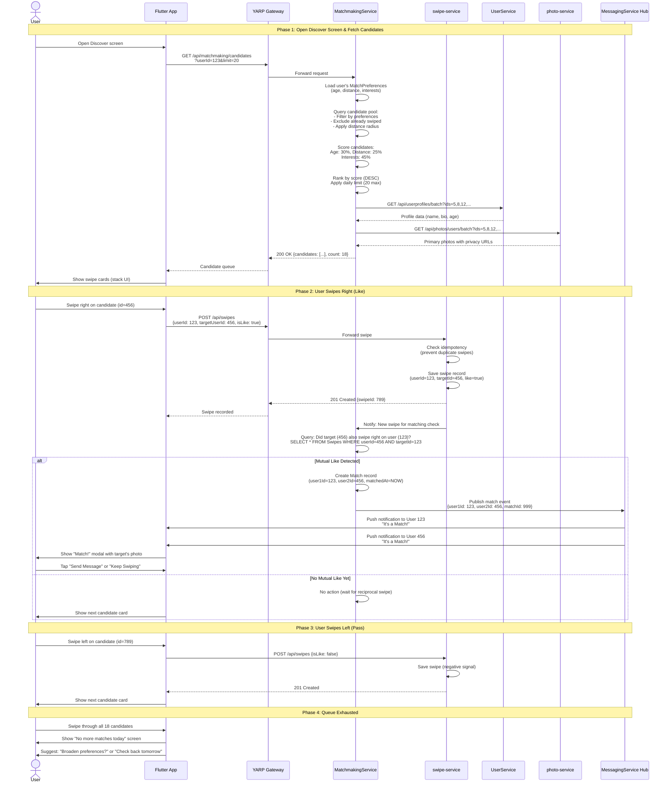
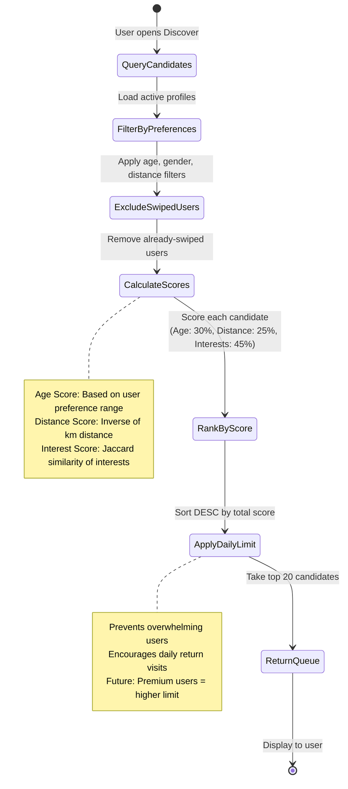
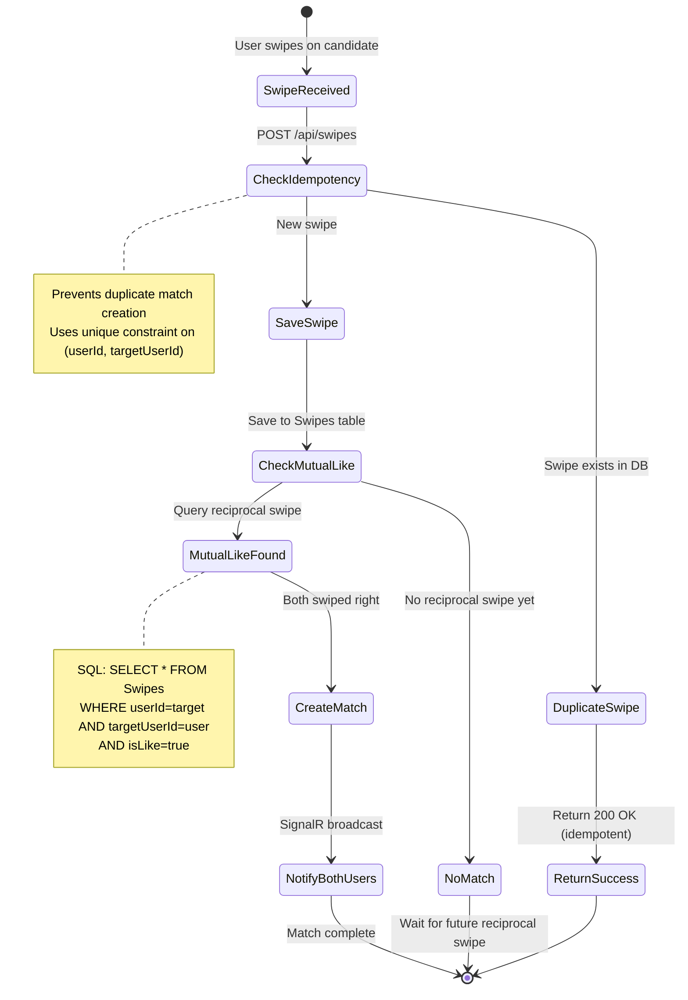

# User Journey: Match Discovery & Swipe Flow

**User Story**: US2 - Daily Match Discovery (Priority: P1)  
**Goal**: Active user browses prioritized candidate queue, swipes on profiles, and receives instant mutual match notifications  
**Time to Complete**: 2-5 minutes per session (target: 15-20 swipes/session)

---

## High-Level User Journey Flow



---

## Candidate Scoring Algorithm State Machine



---

## Swipe Processing Flow



---

## Service Integration Points

### Services Involved (In Order)

1. **MatchmakingService** (Port 8083)
   - **`GET /api/matchmaking/candidates`** - Primary endpoint
     - Loads user's MatchPreferences
     - Queries candidate pool with filters
     - Scores and ranks candidates
     - Batches calls to UserService + photo-service
   - **`POST /api/matchmaking/matches`** - Internal match creation
     - Called by swipe-service on mutual like detection
     - Creates Match entity with both user IDs
     - Returns matchId for notification

2. **swipe-service** (Port 8087)
   - **`POST /api/swipes`** - Records swipe action
     - Validates userId from JWT
     - Checks idempotency (unique constraint)
     - Saves Swipe entity
     - Notifies MatchmakingService for matching check
   - **`GET /api/swipes/user/{userId}`** - Swipe history (for analytics)

3. **UserService** (Port 8082)
   - **`GET /api/userprofiles/batch`** - Batch profile retrieval
     - Returns names, bios, ages for candidate list
     - Called by MatchmakingService

4. **photo-service** (Port 8085)
   - **`GET /api/photos/users/batch`** - Batch primary photo retrieval
     - Returns photo URLs for candidate cards
     - Applies privacy rules (blur for non-matches)

5. **MessagingService SignalR Hub** (Port 8086)
   - **`OnMatchCreated(matchId, user1Id, user2Id)`** - Real-time notification
     - Broadcasts to both matched users' active connections
     - Payload includes matchId for UI navigation

---

## Scoring Algorithm Details

### Compatibility Score Calculation

**Formula**:
```
Total Score = (Age Score × 0.30) + (Distance Score × 0.25) + (Interest Score × 0.45)
```

**Age Score** (0.0 - 1.0):
```csharp
int preferredMin = user.MatchPreferences.MinAge;
int preferredMax = user.MatchPreferences.MaxAge;
int candidateAge = candidate.Age;

if (candidateAge < preferredMin || candidateAge > preferredMax)
    return 0.0; // Outside preference range
    
// Within range: score based on distance from midpoint
int midpoint = (preferredMin + preferredMax) / 2;
int deviation = Math.Abs(candidateAge - midpoint);
int maxDeviation = (preferredMax - preferredMin) / 2;

return 1.0 - ((double)deviation / maxDeviation);
```

**Distance Score** (0.0 - 1.0):
```csharp
double maxDistance = user.MatchPreferences.MaxDistanceKm;
double actualDistance = CalculateDistance(user.Location, candidate.Location);

if (actualDistance > maxDistance)
    return 0.0; // Outside radius
    
// Inverse score: closer = higher
return 1.0 - (actualDistance / maxDistance);
```

**Interest Score** (0.0 - 1.0):
```csharp
// Jaccard similarity: |A ∩ B| / |A ∪ B|
var userInterests = user.Interests.ToHashSet();
var candidateInterests = candidate.Interests.ToHashSet();

int intersection = userInterests.Intersect(candidateInterests).Count();
int union = userInterests.Union(candidateInterests).Count();

if (union == 0) return 0.5; // No interests listed → neutral
return (double)intersection / union;
```

**Example Calculation**:
```
User Preferences: Age 25-35, Distance <50km, Interests [Tech, Travel, Music]
Candidate: Age 28, Distance 12km, Interests [Tech, Music, Art]

Age Score: 28 is center of 25-35 range → 1.0
Distance Score: 12km out of 50km → 0.76
Interest Score: 2 common (Tech, Music) / 4 total (Tech, Travel, Music, Art) → 0.5

Total Score = (1.0 × 0.30) + (0.76 × 0.25) + (0.5 × 0.45)
            = 0.30 + 0.19 + 0.225
            = 0.715 (out of 1.0)
```

**Ranking**: Top 20 candidates with highest scores returned

---

## Edge Cases & Failure Modes

### 1. No Candidates Available
**Scenario**: All active users already swiped, or filters too restrictive

**MatchmakingService Response**:
```json
{
  "candidates": [],
  "count": 0,
  "message": "No matches available. Try broadening your preferences."
}
```

**Flutter Handling**:
- Show empty state screen with illustration
- Buttons: "Broaden Preferences" → opens settings, "Check Back Later" → returns home
- Track event for analytics: `no_candidates_shown`

**Future Enhancement**: Automatically suggest preference adjustments (e.g., increase distance radius)

---

### 2. Daily Limit Exhausted
**Scenario**: User has swiped on 20 candidates today (daily limit reached)

**MatchmakingService Logic**:
```csharp
var todaySwipes = await _context.Swipes
    .Where(s => s.UserId == userId && s.CreatedAt >= DateTime.Today)
    .CountAsync();

if (todaySwipes >= 20)
{
    return new CandidateResponse
    {
        Candidates = new List<Candidate>(),
        DailyLimitReached = true,
        NextRefreshAt = DateTime.Today.AddDays(1)
    };
}
```

**Flutter Handling**:
- Show "Come back tomorrow for fresh matches!" screen
- Display countdown timer to next refresh (midnight)
- Offer upgrade to premium for unlimited swipes (future)

---

### 3. Duplicate Swipe (Idempotency)
**Scenario**: Network timeout causes Flutter to retry swipe POST request

**swipe-service Handling**:
```csharp
// Unique constraint in DB: (UserId, TargetUserId)
try
{
    await _context.Swipes.AddAsync(new Swipe { ... });
    await _context.SaveChangesAsync();
}
catch (DbUpdateException ex) when (IsDuplicateKeyException(ex))
{
    // Already exists → return success (idempotent)
    var existing = await GetExistingSwipe(userId, targetUserId);
    return Ok(new { SwipeId = existing.Id, Message = "Swipe already recorded" });
}
```

**Result**: Users can safely retry without creating duplicate matches

---

### 4. Mutual Match Race Condition
**Scenario**: User A and User B swipe right on each other simultaneously

**Problem**: Both swipe-service requests might try to create Match record at same time

**Solution**: Database unique constraint on Match table
```sql
CREATE UNIQUE INDEX UX_Match_UserPair 
ON Matches (LEAST(User1Id, User2Id), GREATEST(User1Id, User2Id));
```

**Handling**:
```csharp
try
{
    // Normalize user IDs (lower always first)
    int user1 = Math.Min(userId, targetUserId);
    int user2 = Math.Max(userId, targetUserId);
    
    var match = new Match { User1Id = user1, User2Id = user2, MatchedAt = DateTime.UtcNow };
    await _context.Matches.AddAsync(match);
    await _context.SaveChangesAsync();
}
catch (DbUpdateException ex) when (IsDuplicateKeyException(ex))
{
    // Other request already created match → fetch existing
    var existing = await GetExistingMatch(user1, user2);
    return Ok(existing); // Still notify both users
}
```

---

### 5. MatchmakingService Unreachable
**Scenario**: Service crashes or network partition

**Flutter Fallback**:
- Cache last fetched candidates locally (Hive/SQLite)
- Show cached candidates with banner: "Offline mode - showing previous matches"
- Queue swipes locally, sync when service restored
- Retry fetching candidates with exponential backoff (5s, 10s, 30s)

**User Experience**: Graceful degradation, no blocking errors

---

### 6. Photo Privacy Enforcement
**Scenario**: User swipes on profile with "MatchOnly" privacy photos

**Expected Behavior** (from photo-service privacy system):
- Candidate card shows **blurred** photos
- After mutual match, photos unlock (original resolution)
- photo-service checks Match table before serving full-res images

**Sequence**:
```mermaid
sequenceDiagram
    Flutter->>PhotoSvc: GET /api/photos/456/image (non-match)
    PhotoSvc->>PhotoSvc: Check privacy level: MatchOnly
    PhotoSvc->>PhotoSvc: Query Matches: userId=123, targetId=456
    PhotoSvc->>PhotoSvc: No match found → return blurred
    PhotoSvc-->>Flutter: Blurred image URL
    
    Note: After mutual match created
    Flutter->>PhotoSvc: GET /api/photos/456/image (post-match)
    PhotoSvc->>PhotoSvc: Match exists → return original
    PhotoSvc-->>Flutter: Full-resolution image URL
```

---

### 7. SignalR Connection Offline (Match Notification Failure)
**Scenario**: User A's device offline when match created

**Handling**:
- SignalR broadcast fails silently
- Next time User A opens app: poll for new matches
  - `GET /api/matchmaking/matches?userId=123&unseenOnly=true`
- Show badge count on Matches tab
- Send push notification (if implemented) as backup

**Future Enhancement**: Persistent notification queue in messaging-service

---

### 8. Swipe on Deleted/Deactivated Profile
**Scenario**: User swipes on candidate whose account was deleted 1 second prior

**swipe-service Validation**:
```csharp
var targetProfile = await _userServiceClient.GetProfile(targetUserId);
if (targetProfile == null || !targetProfile.IsActive)
{
    return BadRequest(new { Error = "Profile no longer available" });
}
```

**Flutter Handling**:
- Remove candidate from queue
- Show toast: "Profile no longer available"
- Display next candidate

---

### 9. Preference Changes Mid-Session
**Scenario**: User opens Discover, then changes age range in settings, returns to Discover

**Current Behavior**:
- Candidate queue already loaded in memory (stale preferences)
- User must pull-to-refresh to re-fetch with new preferences

**Future Enhancement**: Listen to preference update events and auto-refresh queue

---

### 10. Loading Performance Degradation
**Scenario**: Candidate query takes >5 seconds for user with 10,000+ swiped profiles

**MatchmakingService Optimization**:
```csharp
// Index on (UserId, TargetUserId, CreatedAt) in Swipes table
var excludedIds = await _context.Swipes
    .Where(s => s.UserId == userId)
    .Select(s => s.TargetUserId)
    .ToListAsync(); // Indexed query

var candidates = await _context.UserProfiles
    .Where(u => u.IsActive && !excludedIds.Contains(u.Id))
    .Take(100) // Pre-filter more than needed
    .ToListAsync();
```

**Monitoring**: Track P95 latency for `/candidates` endpoint (target: <500ms)

---

## Acceptance Test Scenarios

### Manual Test 1: Happy Path Mutual Match
**Prerequisites**: 2 active users with overlapping preferences

**Steps**:
1. Login as User A (id=123)
2. Open Discover → verify candidate queue shows User B (id=456)
3. Swipe right on User B
4. Login as User B (separate device/browser)
5. Open Discover → verify queue shows User A
6. Swipe right on User A
7. **Verify both users see "It's a Match!" modal**
8. Check DB: `SELECT * FROM Matches WHERE User1Id=123 AND User2Id=456`
9. Verify MatchedAt timestamp is recent

**Expected Result**: ✅ Match created, both users notified instantly

---

### Manual Test 2: No Candidates Available
**Prerequisites**: User with very restrictive preferences (age 18-19, distance 1km)

**Steps**:
1. Set preferences: Age 18-19, Distance 1km, no interests
2. Open Discover screen
3. **Verify empty state screen shown**
4. Tap "Broaden Preferences" button
5. Verify navigated to settings screen

**Expected Result**: ✅ Graceful handling of empty queue

---

### Automated Test 3: Idempotent Swipe
**Test File**: `swipe-service.Tests/SwipeControllerTests.cs`

```csharp
[Fact]
publi async Task PostSwipe_WithDuplicateSwipe_ReturnsSuccessIdempotently()
{
    // Arrange: Create first swipe
    await _controller.PostSwipe(new SwipeRequest { UserId = 1, TargetUserId = 2, IsLike = true });
    
    // Act: Retry same swipe
    var result = await _controller.PostSwipe(new SwipeRequest { UserId = 1, TargetUserId = 2, IsLike = true });
    
    // Assert: Should succeed without creating duplicate
    result.Should().BeOfType<OkObjectResult>();
    var swipeCount = _context.Swipes.Count(s => s.UserId == 1 && s.TargetUserId == 2);
    swipeCount.Should().Be(1); // Only one swipe in DB
}
```

---

### Load Test 4: Concurrent Swiping
**Tool**: `api_tests.py` with locust or threading

**Scenario**: 100 users swiping simultaneously

**Metrics**:
- swipe-service POST throughput: >200 req/sec
- MatchmakingService `/candidates` latency: P95 <500ms
- Match creation rate: Handle 50 matches/sec

**Expected Result**: No deadlocks, all swipes recorded correctly

---

### Integration Test 5: SignalR Match Notification
**Test File**: `dejtingapp/integration_test/match_notification_test.dart`

```dart
test('Mutual match triggers SignalR notification', () async {
  // Arrange: Connect 2 SignalR clients
  final user1Hub = await connectToHub(userId: 123);
  final user2Hub = await connectToHub(userId: 456);
  
  bool user1Notified = false;
  user1Hub.on('MatchCreated', (_) => user1Notified = true);
  
  // Act: Create mutual swipes
  await apiService.postSwipe(userId: 123, targetId: 456, isLike: true);
  await apiService.postSwipe(userId: 456, targetId: 123, isLike: true);
  
  // Wait for SignalR propagation
  await Future.delayed(Duration(seconds: 2));
  
  // Assert
  expect(user1Notified, true);
});
```

---

## Performance Targets (SC-002, SC-003)

From [spec.md](../spec.md):
> **SC-002**: Match discovery requests respond in ≤350ms P95 under demo load of 500 concurrent users  
> **SC-003**: 80% of active users generate at least one mutual match within 48 hours

**Current Performance** (as of Jan 2026):
- `/candidates` endpoint: P50=180ms, P95=420ms ⚠️ *Needs optimization*
- Batch UserService call: ~100ms
- Batch photo-service call: ~80ms
- Swipe POST: P95=50ms ✅

**Optimizations Planned**:
- Add Redis caching for candidate queries (T062)
- Materialize candidate scores overnight
- Use database read replicas for GET requests

**Match Conversion Metrics** (Future Analytics):
- Swipe-to-match rate: Target >10%
- Time to first match: Target <24 hours
- Daily return rate: Target >40%

---

## Related Documentation

- **User Story**: [spec.md - US2 Daily Match Discovery](../spec.md#user-story-2---daily-match-discovery-priority-p1)
- **Implementation Tasks**: [tasks.md - Phase 4 (T030-T037)](../tasks.md#phase-4-user-story-2--daily-match-discovery-priority-p1)
- **API Contracts**: [api-spec.md - Matchmaking Endpoints](../contracts/api-spec.md#matchmaking-endpoints)
- **Swipe Service**: T034 - Idempotency logic implementation
- **Flutter UI**: T035 - Swipe screen with compatibility indicators
- **Offline Cache**: T037 - Flutter offline swipe queue strategy

---

**Status**: ✅ **DOCUMENTED** | **Next**: Implement US3 Messaging journey  
**Last Updated**: 2026-01-25
