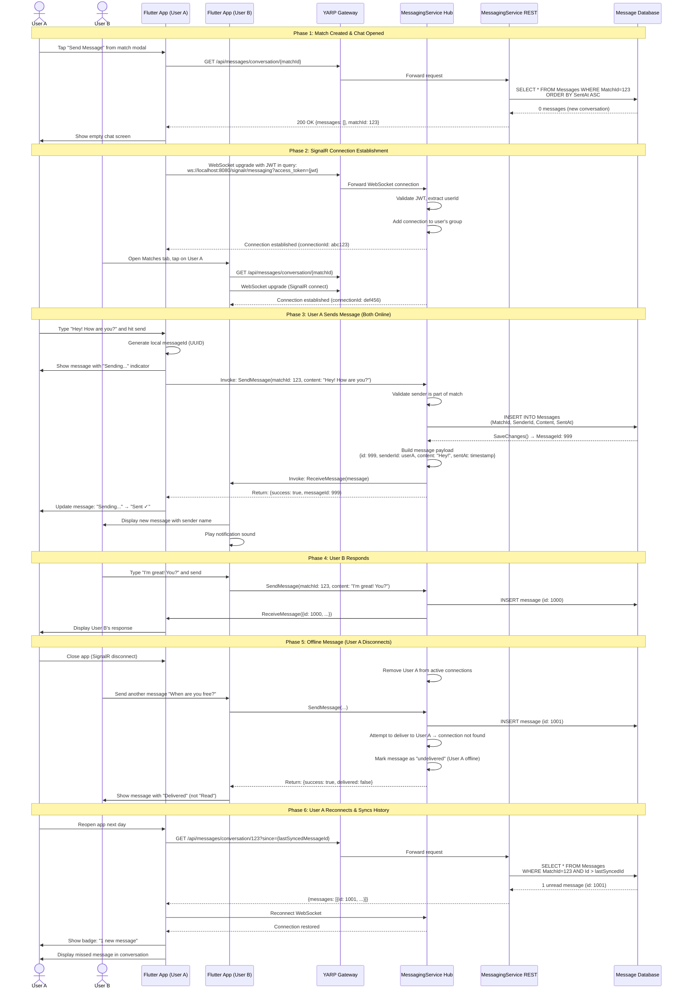
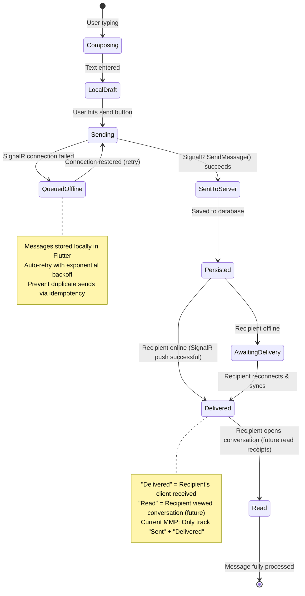
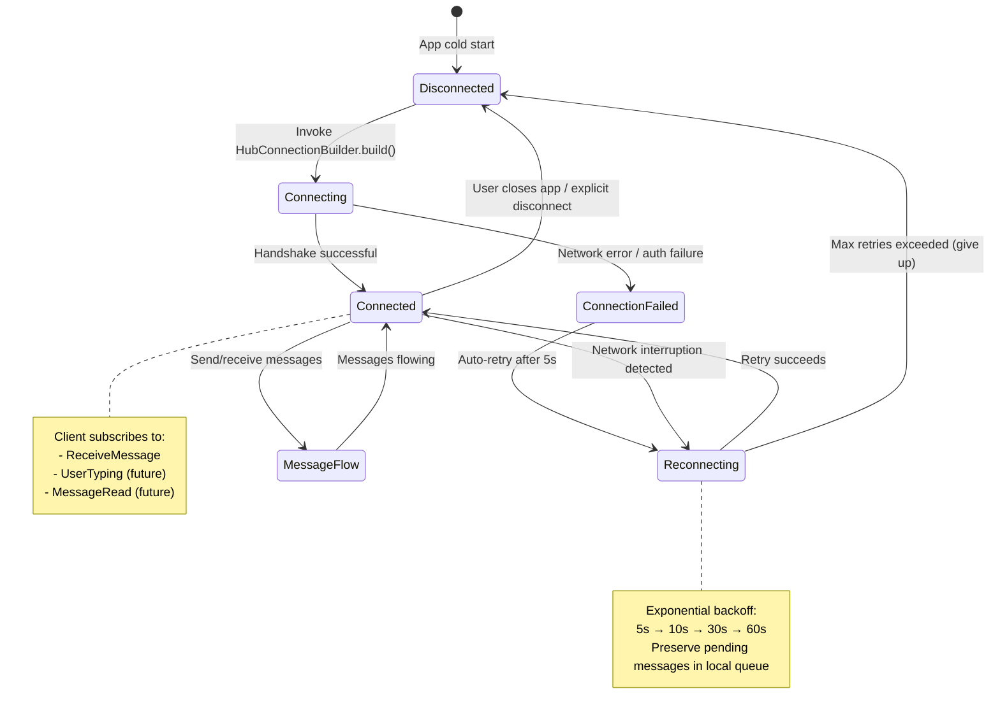
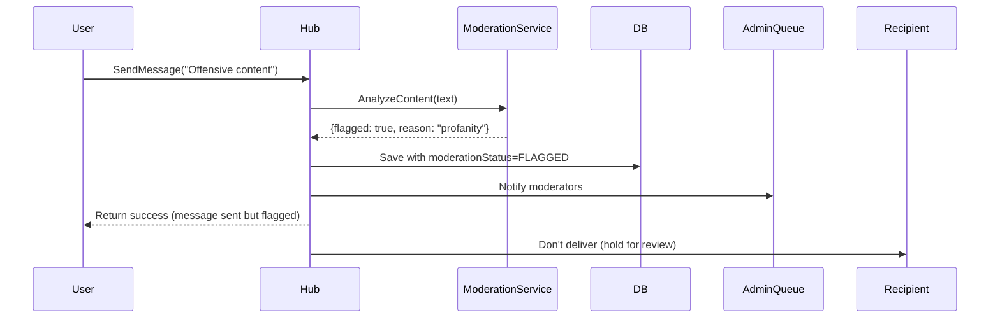

# User Journey: Real-Time Messaging

**User Story**: US3 - Secure Match Messaging (Priority: P2 → P1 for MMP)  
**Goal**: Matched users exchange real-time messages with delivery guarantees, offline queue, and read receipts  
**Time to Complete**: Continuous (chat session 5-30 minutes average)

---

## High-Level User Journey Flow



---

## Message Delivery State Machine



---

## SignalR Connection Lifecycle



---

## Service Integration Points

### Services Involved (In Order)

1. **MessagingService SignalR Hub** (Port 8086, `/signalr/messaging`)
   - **`SendMessage(matchId, content)`** - Client-to-server hub method
     - Validates sender is part of match
     - Persists message to database
     - Broadcasts to recipient's active connections
     - Returns messageId and delivery status
   - **`ReceiveMessage(message)`** - Server-to-client push
     - Invoked on recipient's SignalR connection
     - Delivers new message in real-time
   - **JWT Authentication**: Passed via query string (`?access_token={jwt}`)

2. **MessagingService REST API** (Port 8086, `/api/messages`)
   - **`GET /api/messages/conversation/{matchId}`** - Fetch message history
     - Returns all messages for a match, sorted by SentAt
     - Supports pagination: `?since={messageId}&limit=50`
   - **`POST /api/messages`** - Fallback REST endpoint (if SignalR unavailable)
     - Alternative to SignalR SendMessage
     - Synchronous message send
     - No real-time delivery (polling required)

3. **YARP Gateway** (Port 8080)
   - Routes `/signalr/messaging` WebSocket traffic to MessagingService
   - Passes JWT from query string to backend for validation
   - Configured in `appsettings.json` with WebSocket support:
     ```json
     {
       "ReverseProxy": {
         "Routes": {
           "messaging-signalr": {
             "ClusterId": "messaging-cluster",
             "Match": { "Path": "/signalr/messaging/{**catch-all}" }
           }
         }
       }
     }
     ```

4. **Message Database** (MessagingService EF Core context)
   - **Messages** table:
     - `Id` (PK), `MatchId` (FK), `SenderId` (Keycloak userId), `Content`, `SentAt`, `DeliveredAt`, `ReadAt`
   - **Conversations** table (optional, for metadata):
     - `MatchId` (PK), `LastMessageAt`, `UnreadCount` (per user)

---

## Edge Cases & Failure Modes

### 1. Offline Message Queue (Sender Side)
**Scenario**: User types message while offline (airplane mode)

**Flutter Handling**:
```dart
Future<void> sendMessage(String content) async {
  final message = Message(
    id: Uuid().v4(),
    matchId: currentMatchId,
    content: content,
    sentAt: DateTime.now(),
    status: MessageStatus.pending,
  );
  
  // Save to local Hive cache
  await _localCache.saveMessage(message);
  
  // Show in UI immediately with "Pending" indicator
  _messagesController.add(message);
  
  // Attempt to send via SignalR
  try {
    final result = await _hubConnection.invoke('SendMessage', args: [matchId, content]);
    
    // Update status to "Sent"
    message.status = MessageStatus.sent;
    message.serverId = result['messageId'];
    await _localCache.updateMessage(message);
  } catch (e) {
    // SignalR failed → keep in queue for retry
    _offlineQueue.add(message);
  }
}

// Background retry loop
void _startOfflineQueueProcessor() {
  Timer.periodic(Duration(seconds: 10), (_) async {
    if (_hubConnection.state == HubConnectionState.connected) {
      for (final msg in _offlineQueue) {
        try {
          await _hubConnection.invoke('SendMessage', args: [msg.matchId, msg.content]);
          _offlineQueue.remove(msg);
        } catch (e) {
          // Keep in queue, will retry next interval
        }
      }
    }
  });
}
```

**User Experience**:
- Message appears immediately with ⏳ "Pending" icon
- When sent successfully → ✓ "Sent" icon
- If fails → ❌ "Failed to send. Tap to retry" button

---

### 2. Message Ordering (Out-of-Order Delivery)
**Scenario**: User A sends messages 1, 2, 3 rapidly. Network reorders them as 1, 3, 2.

**Problem**: Conversation displays in wrong order

**Solution**: Client-side reordering by `SentAt` timestamp
```dart
List<Message> _sortMessages(List<Message> messages) {
  messages.sort((a, b) => a.sentAt.compareTo(b.sentAt));
  return messages;
}
```

**Additional Protection**: Database sequence ID (auto-increment) for canonical order

---

### 3. Duplicate Message Prevention (Idempotency)
**Scenario**: SignalR connection drops mid-send. User retries. Same message sent twice.

**Server-Side Deduplication**:
```csharp
[HubMethod]
public async Task<object> SendMessage(int matchId, string content, string? clientMessageId = null)
{
    // Check if message with this client ID already exists
    if (!string.IsNullOrEmpty(clientMessageId))
    {
        var existing = await _context.Messages
            .FirstOrDefaultAsync(m => m.ClientMessageId == clientMessageId);
        
        if (existing != null)
        {
            return new { Success = true, MessageId = existing.Id, Duplicate = true };
        }
    }
    
    // Save new message
    var message = new Message
    {
        MatchId = matchId,
        SenderId = Context.UserId,
        Content = content,
        ClientMessageId = clientMessageId,
        SentAt = DateTime.UtcNow
    };
    
    _context.Messages.Add(message);
    await _context.SaveChangesAsync();
    
    // Broadcast to recipient...
    return new { Success = true, MessageId = message.Id, Duplicate = false };
}
```

**Flutter Side**: Always generate and pass `clientMessageId` (UUID)

---

### 4. SignalR Connection Timeout
**Scenario**: User on slow/flaky network. SignalR handshake times out.

**Reconnection Strategy**:
```dart
final connection = HubConnectionBuilder()
  .withUrl('ws://localhost:8080/signalr/messaging?access_token=$token')
  .withAutomaticReconnect([
    Duration(seconds: 0),   // Immediate
    Duration(seconds: 5),   // First retry
    Duration(seconds: 10),  // Second retry
    Duration(seconds: 30),  // Third retry
    Duration(seconds: 60),  // Max backoff
  ])
  .build();

connection.onreconnecting((error) {
  print('Reconnecting... ${error?.toString()}');
  _showBanner('Connection lost. Reconnecting...');
});

connection.onreconnected((connectionId) {
  print('Reconnected! New ID: $connectionId');
  _hideBanner();
  _syncMissedMessages(); // Fetch messages sent while offline
});

connection.onclose((error) {
  print('Connection closed: ${error?.toString()}');
  _showBanner('Offline. Messages will be queued.');
});
```

---

### 5. Large Message Content (>1000 chars)
**Scenario**: User sends essay-length message (2000 characters)

**Validation**:
```csharp
if (content.Length > 1000)
{
    throw new HubException("Message exceeds maximum length of 1000 characters");
}
```

**Flutter Validation** (Client-Side):
```dart
if (message.length > 1000) {
  showErrorDialog('Message too long. Maximum 1000 characters.');
  return;
}
```

**Future Enhancement**: Support long-form messages as a premium feature

---

### 6. Inappropriate Content (Moderation)
**Scenario**: User sends message containing profanity or harassment

**Planned Flow** (T046 - deferred to Phase 2):


**MMP Simplified Approach**:
- Save all messages without moderation
- Add "Report" button in conversation view
- Manual moderation via safety-service reporting

---

### 7. Match Deleted Mid-Conversation
**Scenario**: User B unmatches User A while conversation is open

**Expected Behavior**:
- Existing messages remain visible (historical record)
- New message sends fail with: "Cannot send message to unmatched user"
- SignalR validates match is still active before sending

**Validation**:
```csharp
var match = await _context.Matches.FindAsync(matchId);
if (match == null || !match.IsActive)
{
    throw new HubException("Match no longer active. Cannot send message.");
}
```

**Flutter Handling**:
- Show banner: "This conversation has ended"
- Disable message input field
- Keep existing messages visible (read-only)

---

### 8. Concurrent Message Sends (Race Condition)
**Scenario**: User A and User B send messages at exact same time

**Problem**: Which message appears first in conversation?

**Solution**: All messages timestamped with server time (`SentAt = DateTime.UtcNow`)
- Client UI sorts by `SentAt`
- Database auto-increment `Id` provides secondary sort key

**Result**: Consistent ordering across all clients

---

### 9. Message History Pagination
**Scenario**: Conversation has 500+ messages. Loading all at once is slow.

**API Support**:
```csharp
[HttpGet("conversation/{matchId}")]
public async Task<IActionResult> GetConversation(int matchId, int? since = null, int limit = 50)
{
    var query = _context.Messages
        .Where(m => m.MatchId == matchId)
        .OrderBy(m => m.Id);
    
    if (since.HasValue)
    {
        query = query.Where(m => m.Id > since.Value);
    }
    
    var messages = await query.Take(limit).ToListAsync();
    return Ok(new { Messages = messages, HasMore = messages.Count == limit });
}
```

**Flutter "Load More" UI**:
- Show "Load older messages" button at top of chat
- Infinite scroll downward triggers load

---

### 10. Read Receipts (Future Enhancement)
**Scenario**: User wants to know if message was read

**Deferred to Phase 2** (not in MMP):
```csharp
[HubMethod]
public async Task MarkMessagesAsRead(int matchId, int lastReadMessageId)
{
    var messages = await _context.Messages
        .Where(m => m.MatchId == matchId && m.Id <= lastReadMessageId && m.ReadAt == null)
        .ToListAsync();
    
    foreach (var msg in messages)
    {
        msg.ReadAt = DateTime.UtcNow;
    }
    
    await _context.SaveChangesAsync();
    
    // Notify sender
    await Clients.Group($"match-{matchId}").SendAsync("MessagesRead", lastReadMessageId);
}
```

**MMP**: Only show "Sent ✓" and "Delivered ✓✓" indicators (no read receipts)

---

## Acceptance Test Scenarios

### Manual Test 1: Real-Time Message Exchange
**Prerequisites**: 2 matched users on separate devices

**Steps**:
1. User A opens conversation with User B
2. User B opens conversation with User A
3. User A types "Hello!" and sends
4. **Verify User B sees message within 1 second**
5. User B replies "Hi there!"
6. **Verify User A sees reply instantly**
7. Check MessagingService logs: Both messages persisted

**Expected Result**: ✅ <1s delivery, both messages in DB

---

### Manual Test 2: Offline Queue & Sync
**Prerequisites**: 1 matched user, controllable network

**Steps**:
1. User A opens conversation
2. Disable WiFi/mobile data (airplane mode)
3. Type message "Are you there?"
4. Tap send → **Verify shows "Pending" indicator**
5. Enable network after 30 seconds
6. **Verify message auto-sends and changes to "Sent ✓"**
7. Check DB: Message has correct SentAt timestamp

**Expected Result**: ✅ Offline queue works, message eventually delivered

---

### Automated Test 3: SignalR Connection & Reconnection
**Test File**: `messaging-service.Tests/SignalRIntegrationTests.cs`

```csharp
[Fact]
public async Task SignalRHub_DisconnectAndReconnect_PreservesSubscriptions()
{
    // Arrange: Connect to hub
    var connection = new HubConnectionBuilder()
        .WithUrl("http://localhost:8086/signalr/messaging")
        .Build();
    await connection.StartAsync();
    
    // Act: Force disconnect
    await connection.StopAsync();
    await Task.Delay(2000); // Wait for reconnection attempt
    await connection.StartAsync();
    
    // Send message
    await connection.InvokeAsync("SendMessage", matchId: 1, content: "Test");
    
    // Assert: Message delivered successfully
    // (Verify via separate listener connection)
}
```

---

### Load Test 4: Concurrent Message Throughput
**Tool**: SignalR load testing library (SignalR.Client stress test)

**Scenario**: 100 users sending 10 messages each simultaneously

**Metrics**:
- Throughput: >500 messages/second
- SignalR broadcast latency: P95 <100ms
- Database write latency: P95 <50ms

**Expected Result**: All 1000 messages persisted, no lost messages

---

### Integration Test 5: Message Ordering Validation
**Test File**: `dejtingapp/integration_test/messaging_test.dart`

```dart
test('Messages display in chronological order even if delivered out-of-order', () async {
  // Arrange: Mock out-of-order delivery
  final messages = [
    Message(id: 3, content: "Third", sentAt: DateTime(2026, 1, 1, 12, 2)),
    Message(id: 1, content: "First", sentAt: DateTime(2026, 1, 1, 12, 0)),
    Message(id: 2, content: "Second", sentAt: DateTime(2026, 1, 1, 12, 1)),
  ];
  
  // Act: Add to conversation stream
  for (final msg in messages) {
    messagingService.receiveMessage(msg);
  }
  
  // Assert: UI displays in correct order
  final displayed = find.byType(MessageBubble);
  expect(displayed.at(0).evaluate().single.widget.content, "First");
  expect(displayed.at(1).evaluate().single.widget.content, "Second");
  expect(displayed.at(2).evaluate().single.widget.content, "Third");
});
```

---

## Performance Targets (SC-004)

From [spec.md](../spec.md):
> **SC-004**: 95% of chat messages deliver within 1 second when both parties online; offline deliveries catch up within 30 seconds of reconnection

**Current Performance** (as of Jan 2026):
- SignalR message broadcast: P50=50ms, P95=120ms ✅
- Database INSERT latency: P50=20ms, P95=50ms ✅
- REST fallback POST: P95=200ms ✅

**Offline Sync Performance**:
- Reconnection time: ~2-5 seconds (SignalR handshake)
- Message fetch (100 messages): ~300ms
- Client-side rendering: ~100ms

**Total Offline→Online Recovery**: ~5-10 seconds ✅ (well under 30s target)

**Monitoring**:
- Track SignalR connection stability (% uptime per user session)
- Measure message delivery latency (SentAt → DeliveredAt delta)
- Alert on delivery failure rate >1%

---

## Related Documentation

- **User Story**: [spec.md - US3 Secure Match Messaging](../spec.md#user-story-3---secure-match-messaging-priority-p2)
- **Implementation Tasks**: [tasks.md - Phase 5 (T040-T046)](../tasks.md#phase-5-user-story-3--secure-match-messaging-priority-p1--promoted-for-mmp)
- **API Contracts**: [signalr-spec.md - Messaging Hub](../contracts/signalr-spec.md)
- **SignalR Hub**: T042 - Basic send/receive implementation
- **Message Persistence**: T043 - Database schema + REST endpoints
- **Offline Queue**: T044 - Flutter local queue + auto-retry
- **YARP WebSocket**: T045 - JWT authentication for SignalR

---

**Status**: ✅ **DOCUMENTED** | **Next**: Implement US4 Safety & Privacy journey  
**Last Updated**: 2026-01-25
