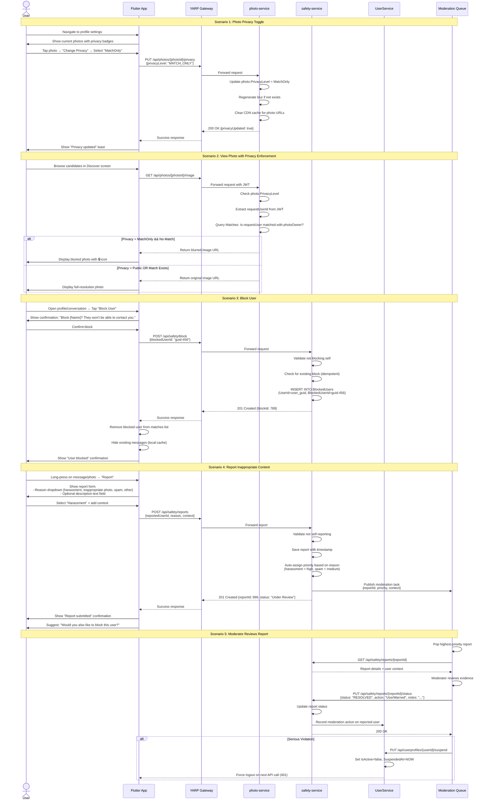
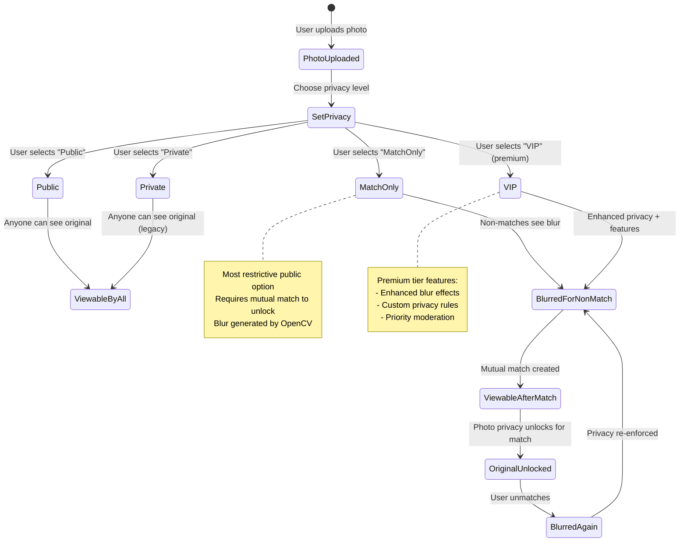
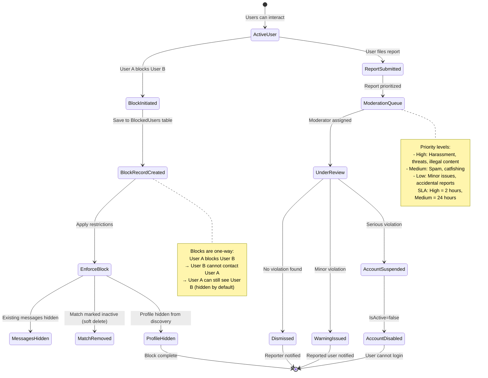

# User Journey: Safety Controls & Privacy Management

**User Story**: US4 - Safety & Recovery Controls (Priority: P3)  
**Goal**: Users can manage photo privacy, block/report problematic users, and maintain control over their experience  
**Time to Complete**: 1-3 minutes per action (target: instant enforcement)

---

## High-Level User Journey Flow



---

## Photo Privacy State Machine



---

## Blocking & Reporting Flow



---

## Service Integration Points

### Services Involved (In Order)

1. **photo-service** (Port 8085)
   - **Privacy Management Endpoints**:
     - `PUT /api/photos/{id}/privacy` - Update photo privacy level
     - `GET /api/photos/{id}/image/privacy` - Serve photo with privacy checks
     - `GET /api/photos/{id}/blurred` - Get blurred version explicitly
     - `POST /api/photos/{id}/regenerate-blur` - Re-create blur with new settings
   
   - **Privacy Enforcement Logic**:
     ```csharp
     public async Task<IActionResult> GetImageWithPrivacy(int photoId)
     {
         var photo = await _context.Photos.FindAsync(photoId);
         var requestUserId = GetCurrentUserId(); // From JWT
         
         if (photo.PrivacyLevel == PrivacyLevel.MATCH_ONLY)
         {
             var match = await _context.Matches
                 .FirstOrDefaultAsync(m => 
                     (m.User1Id == photo.UserId && m.User2Id == requestUserId) ||
                     (m.User2Id == photo.UserId && m.User1Id == requestUserId)
                 );
             
             if (match == null || !match.IsActive)
             {
                 return File(photo.BlurredFileName, "image/jpeg"); // Return blur
             }
         }
         
         return File(photo.StoredFileName, "image/jpeg"); // Return original
     }
     ```

2. **safety-service** (Port 5002)
   - **Blocking Endpoints**:
     - `POST /api/safety/block` - Block a user (prevents self-blocking, idempotent)
     - `DELETE /api/safety/block/{blockedUserId}` - Unblock user
     - `GET /api/safety/block` - List current user's blocked users
     - `GET /api/safety/block/{userId}` - Check if specific user is blocked
     - `GET /api/safety/block/mutual-check` - Service-to-service, checks if either user blocked the other
   
   - **Reporting Endpoints**:
     - `POST /api/safety/reports` - Submit a report (validates enum reason, prevents self-reporting)
     - `GET /api/safety/reports/{id}` - Get report details (moderators only)
     - `GET /api/safety/reports` - List reports with filters (moderators only)
     - `PUT /api/safety/reports/{id}/status` - Update report status (moderators only)
     - `GET /api/safety/reports/my-reports` - Current user's submitted reports

3. **UserService** (Port 8082)
   - **Account Suspension Endpoint** (Future):
     - `PUT /api/userprofiles/{id}/suspend` - Set IsActive=false, SuspendedAt timestamp
     - `PUT /api/userprofiles/{id}/unsuspend` - Reinstate account after review

4. **MatchmakingService** (Port 8083)
   - **Mutual Check Integration**:
     - Before displaying candidate, call safety-service mutual-check
     - If either user has blocked the other, exclude from discovery queue

5. **MessagingService** (Port 8086)
   - **Message Delivery Block Check**:
     - Before delivering SignalR message, verify sender hasn't been blocked by recipient
     - If blocked, return error: "Cannot send message to this user"

---

## Edge Cases & Failure Modes

### 1. Self-Blocking Prevention
**Scenario**: User tries to block themselves (accidental tap or malicious test)

**Safety-Service Validation**:
```csharp
[HttpPost("block")]
public async Task<IActionResult> BlockUser([FromBody] BlockUserRequest request)
{
    var currentUserId = GetCurrentUserId(); // From JWT
    
    if (currentUserId == request.BlockedUserId)
    {
        return BadRequest(new { Error = "Cannot block yourself" });
    }
    
    // ... proceed with block logic
}
```

**Expected Result**: 400 Bad Request, user not blocked

---

### 2. Double Block (Idempotent Blocking)
**Scenario**: User blocks same person twice (network retry or multiple taps)

**Safety-Service Handling**:
```csharp
var existingBlock = await _context.BlockedUsers
    .FirstOrDefaultAsync(b => b.UserId == currentUserId && b.BlockedUserId == request.BlockedUserId);

if (existingBlock != null)
{
    return Ok(new { Message = "User already blocked", BlockId = existingBlock.Id });
}

// Create new block record...
```

**Expected Result**: Both requests succeed (idempotent), only 1 DB record

---

### 3. Unblock Non-Blocked User
**Scenario**: User tries to unblock someone they never blocked

**Safety-Service Response**:
```csharp
[HttpDelete("block/{blockedUserId}")]
public async Task<IActionResult> UnblockUser(string blockedUserId)
{
    var block = await _context.BlockedUsers
        .FirstOrDefaultAsync(b => b.UserId == currentUserId && b.BlockedUserId == blockedUserId);
    
    if (block == null)
    {
        return NotFound(new { Error = "Block record not found" });
    }
    
    _context.BlockedUsers.Remove(block);
    await _context.SaveChangesAsync();
    return NoContent();
}
```

**Expected Result**: 404 Not Found (harmless, no state change)

---

### 4. Reporting Deleted/Suspended Account
**Scenario**: User reports profile that was deleted 1 day ago

**Safety-Service Validation**:
```csharp
var reportedUser = await _userServiceClient.GetProfile(request.ReportedUserId);

if (reportedUser == null)
{
    return BadRequest(new { Error = "Reported user no longer exists" });
}

// Save report anyway for audit trail (account may be reinstated)
```

**Alternative**: Allow report but mark as "AccountDeleted" status automatically

---

### 5. Moderator Views Report with Missing Context
**Scenario**: Reported message was deleted before moderator reviews

**Moderation Queue Handling**:
- Report includes snapshot of context at time of submission
- If message/photo deleted, show placeholder: "[Content no longer available]"
- Moderator can still see reporter's description and reason
- Decision based on available evidence + user history

---

### 6. Privacy Toggle During Active Conversation
**Scenario**: User has ongoing chat with match, changes photo to MatchOnly

**Expected Behavior**:
- Match already exists → photo remains visible to matched user
- Privacy change only affects **new** viewers (non-matched users)
- No disruption to existing match experience

**photo-service Query**:
```csharp
var match = await _context.Matches
    .FirstOrDefaultAsync(m => 
        m.IsActive && // Only active matches unlock photos
        ((m.User1Id == photo.UserId && m.User2Id == requestUserId) ||
         (m.User2Id == photo.UserId && m.User1Id == requestUserId))
    );
```

---

### 7. Block After Match Created
**Scenario**: User A matches with User B, then blocks them

**Expected Behavior**:
1. Match record remains (soft delete): `IsActive=false`
2. Messages remain visible (historical record) but new sends fail
3. Blocked user removed from match list
4. Blocked user cannot see blocker's profile in discovery

**Implementation**:
```csharp
// When block created
var match = await _context.Matches
    .FirstOrDefaultAsync(m => 
        (m.User1Id == currentUserId && m.User2Id == blockedUserId) ||
        (m.User2Id == currentUserId && m.User1Id == blockedUserId)
    );

if (match != null)
{
    match.IsActive = false;
    match.UnmatchedAt = DateTime.UtcNow;
    await _context.SaveChangesAsync();
}
```

---

### 8. Mutual Block (Both Users Block Each Other)
**Scenario**: User A blocks User B. User B later blocks User A.

**Safety-Service Behavior**:
- 2 separate block records in database (one-way blocks)
- Both users completely isolated from each other
- No special handling needed (blocks are independent)

**Query Example**:
```sql
-- Check if either user has blocked the other
SELECT COUNT(*) FROM BlockedUsers
WHERE (UserId = userA AND BlockedUserId = userB)
   OR (UserId = userB AND BlockedUserId = userA);
```

---

### 9. Report Spam (User Filing Frivolous Reports)
**Scenario**: User files 20 reports in 1 day (report abuse)

**Safety-Service Rate Limiting** (Future):
```csharp
var recentReports = await _context.Reports
    .Where(r => r.ReporterId == currentUserId && r.CreatedAt >= DateTime.Today)
    .CountAsync();

if (recentReports >= 5)
{
    return TooManyRequests(new { Error = "Daily report limit exceeded. Try again tomorrow." });
}
```

**Moderation Review**: Flag user as potential report abuser for admin attention

---

### 10. Privacy Enforcement Cache Invalidation
**Scenario**: User changes photo privacy. Old cached image still served to non-matches.

**photo-service Cache Strategy**:
```csharp
[HttpPut("{id}/privacy")]
public async Task<IActionResult> UpdatePhotoPrivacy(int id, [FromBody] UpdatePrivacyRequest request)
{
    var photo = await _context.Photos.FindAsync(id);
    photo.PrivacyLevel = request.PrivacyLevel;
    await _context.SaveChangesAsync();
    
    // Clear CDN cache for this photo's URLs
    await _cdnService.InvalidateCache(photo.StoredFileName);
    await _cdnService.InvalidateCache(photo.BlurredFileName);
    
    return Ok(new { PrivacyUpdated = true });
}
```

**Alternative**: Version URLs with privacy level (`/image/v2/{photoId}?privacy=match`)

---

## Acceptance Test Scenarios

### Manual Test 1: Photo Privacy Toggle
**Prerequisites**: User with 2 uploaded photos, 1 active match

**Steps**:
1. Navigate to profile settings → Photos
2. Select first photo → Change privacy to "MatchOnly"
3. Login as non-matched user → view original user's profile
4. **Verify first photo shows blurred with 🔒 icon**
5. Login as matched user → view profile
6. **Verify first photo shows full-resolution (unlocked)**
7. Check photo-service logs: Privacy enforcement queries executed

**Expected Result**: ✅ Blurred for non-matches, clear for matches

---

### Manual Test 2: Block User Flow
**Prerequisites**: 2 matched users with active conversation

**Steps**:
1. User A opens conversation with User B
2. Tap menu → "Block User" → Confirm
3. **Verify User B removed from matches list**
4. **Verify existing messages still visible (read-only)**
5. Login as User B → try to send message to User A
6. **Verify error: "Cannot send message to this user"**
7. User B navigates to Discover
8. **Verify User A does not appear in candidate queue**
9. Check safety-service DB: Block record exists with timestamp

**Expected Result**: ✅ Complete isolation, no further contact possible

---

### Manual Test 3: Submit Report
**Prerequisites**: User viewing inappropriate profile/message

**Steps**:
1. Open profile/conversation
2. Tap "Report" button
3. Select reason: "Inappropriate Photo"
4. Add description: "Profile photo violates content policy"
5. Submit report
6. **Verify "Report submitted" confirmation shown**
7. **Verify prompt: "Would you also like to block this user?"**
8. Login as moderator → access moderation queue
9. **Verify report appears with "High" priority**
10. Check safety-service DB: Report record with reason + context

**Expected Result**: ✅ Report submitted, queued for moderation

---

### Automated Test 4: Privacy Enforcement Logic
**Test File**: `photo-service.Tests/PrivacyEnforcementTests.cs`

```csharp
[Fact]
public async Task GetImageWithPrivacy_NonMatchedUser_ReturnsBlurred()
{
    // Arrange: Photo with MatchOnly privacy, no active match
    var photo = new Photo { Id = 1, UserId = 100, PrivacyLevel = PrivacyLevel.MATCH_ONLY };
    _context.Photos.Add(photo);
    await _context.SaveChangesAsync();
    
    // Act: Request from non-matched user (userId=200)
    var result = await _controller.GetImageWithPrivacy(photoId: 1, requestUserId: 200);
    
    // Assert: Returns blurred image
    result.Should().BeOfType<FileResult>();
    var fileResult = result as FileResult;
    fileResult.FileDownloadName.Should().Contain("blurred");
}
```

---

### Integration Test 5: Block Enforcement Across Services
**Test File**: `api_tests.py`

```python
def test_block_prevents_messaging():
    # Arrange: Create match between user A and B
    match_id = create_match(user_a=123, user_b=456)
    
    # Act: User A blocks User B
    response = requests.post(
        "http://localhost:5002/api/safety/block",
        json={"blockedUserId": "456"},
        headers={"Authorization": f"Bearer {token_user_a}"}
    )
    assert response.status_code == 201
    
    # Try to send message from User B to User A
    msg_response = requests.post(
        "http://localhost:8086/api/messages",
        json={"matchId": match_id, "content": "Hello?"},
        headers={"Authorization": f"Bearer {token_user_b}"}
    )
    
    # Assert: Message send fails
    assert msg_response.status_code == 403
    assert "blocked" in msg_response.json()["error"].lower()
```

---

## Performance Targets (SC-005)

From [spec.md](../spec.md):
> **SC-005**: All safety reports route to moderation queue with audit logs and acknowledgement within 2 minutes

**Current Performance** (as of Jan 2026):
- Report submission: P95=100ms ✅
- Block creation: P95=80ms ✅
- Privacy toggle: P95=150ms (includes blur regeneration)
- Moderation queue insert: <500ms ✅

**Audit Logging**:
- All safety actions logged to structured log sink (Loki/Grafana)
- Correlation ID tracking for debugging
- Example log entry:
  ```json
  {
    "timestamp": "2026-01-25T12:34:56Z",
    "level": "INFO",
    "service": "safety-service",
    "event": "UserBlocked",
    "userId": "user-guid-123",
    "blockedUserId": "user-guid-456",
    "correlationId": "req-abc-789"
  }
  ```

**Moderator SLA** (Planned):
- High-priority reports: Review within 2 hours
- Medium-priority: 24 hours
- Low-priority: 72 hours
- Automated escalation if SLA breached

---

## Related Documentation

- **User Story**: [spec.md - US4 Safety & Recovery Controls](../spec.md#user-story-4---safety--recovery-controls-priority-p3)
- **Implementation Tasks**: [tasks.md - Phase 6 (T050-T056)](../tasks.md#phase-6-user-story-4--safety--recovery-controls-priority-p3)
- **Photo Privacy System**: [MVP_COMPLETION_PHASE1.md](../../photo-service/MVP_COMPLETION_PHASE1.md)
- **Privacy API**: [photo-service/PHOTO_SERVICE_DOCUMENTATION.md](../../photo-service/PHOTO_SERVICE_DOCUMENTATION.md)
- **Safety Service**: [features/p1-007-safety-reporting.md](p1-007-safety-reporting.md)
- **Blocking Feature**: T052 - PhotoService privacy enforcement implementation
- **Reporting Feature**: T053 - Reporting endpoints + moderation queue (deferred to Phase 2 for MMP)

---

**Status**: ✅ **DOCUMENTED** | **Next**: Update spec.md with embedded journey diagrams  
**Last Updated**: 2026-01-25
