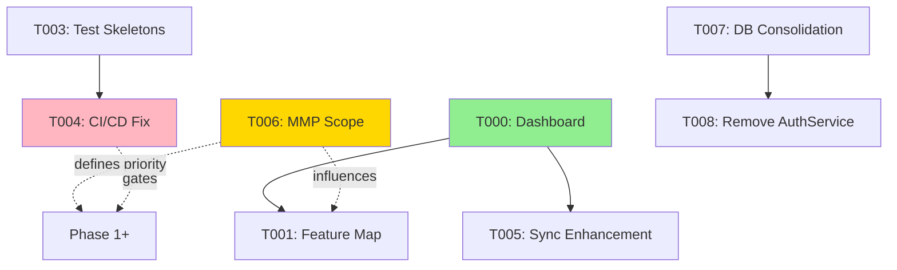
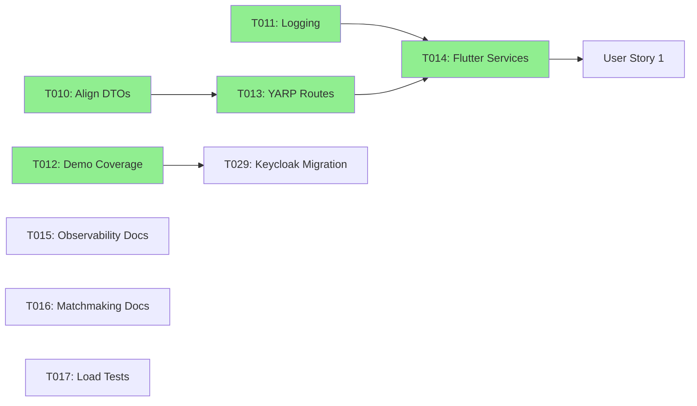
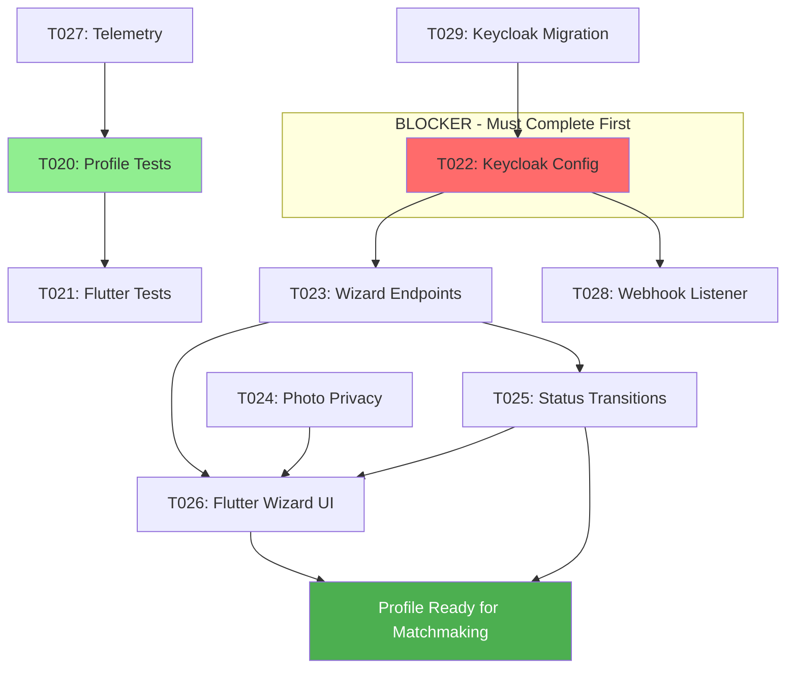
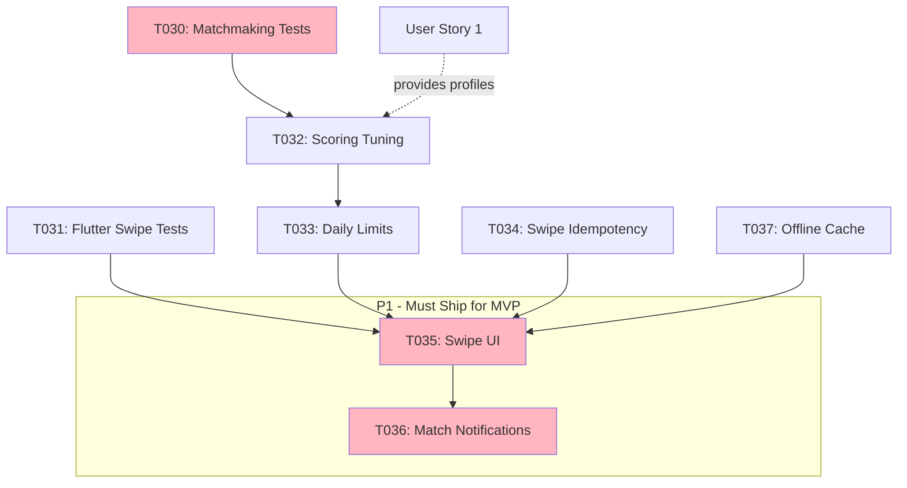
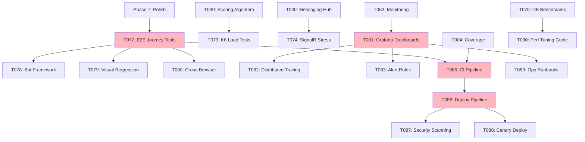

# Tasks: DatingApp MVP Foundation

**Input**: Design documents from `/specs/001-mvp-foundation/`
**Prerequisites**: plan.md, spec.md, research.md, data-model.md, contracts/

---

## Phase 0: Product Management & Development Visibility (Priority: P0)

**Goal**: Establish tracking, testing, and visualization systems to make development progress graspable for solo developer. Prevent over-engineering by mapping features to APIs and ensuring test coverage before implementation.
**Rationale**: With 72 tasks and 8 microservices, need automated progress tracking, feature-to-API traceability, and test-first workflow to avoid forgetting what's done and building unused code.

### Planning & Tracking
- [x] T000 [P] [Planning] Create DASHBOARD.md with auto-updating metrics (parse codebase for implemented endpoints, calculate test coverage per service, track user story %, generate phase burndown chart)
	- **Estimate**: 4h
	- **Evidence**: `specs/001-mvp-foundation/DASHBOARD.md` exists, shows 0% overall progress, coverage by service, task completion by phase, generated via `./scripts/generate_dashboard.sh`
	- **Tools**: Bash script parsing GitHub Projects API, controller files, test directories
	- **Completed**: 2026-01-24
	
- [ ] T001 [P] [Planning] Create FEATURE_MAP.md traceability matrix mapping APIs to user stories (identify which endpoints serve US1-4, flag orphaned/missing APIs, show implementation status, test coverage)
	- **Estimate**: 3h
	- **Evidence**: `specs/001-mvp-foundation/FEATURE_MAP.md` covers all endpoints from api-spec.md, signalr-spec.md with user story columns
	- **Prevents**: Building APIs that no feature uses, missing critical endpoints
	
- [ ] T002 [Planning] Add Mermaid dependency graphs to tasks.md showing task dependencies, service dependencies, critical path to MVP (visual representation per phase)
	- **Estimate**: 2h
	- **Evidence**: Each phase section has dependency graph, critical path highlighted, renders correctly in GitHub
	- **Benefits**: Shows what must be done in sequence vs parallel

### Testing Infrastructure
- [x] T003 [P] [Testing] Generate test skeletons for all services (create failing xUnit tests for every controller action in UserService, MatchmakingService, SwipeService, PhotoService, MessagingService)
	- **Estimate**: 4h
	- **Evidence**: Test projects created with 60+ skipped test methods: SwipeService.Tests (17 tests), PhotoService.Tests (34 tests), UserService.Tests (7 tests for WizardController), MatchmakingService.Tests (3 tests), MessagingService.Tests (1 test). All marked `[Fact(Skip = "Not implemented - T003")]`. `dotnet test --list-tests` discovers all test methods across services.
	- **Next**: Remove skip attributes as implementations complete
	- **Completed**: 2026-01-25
	
- [ ] T004 [P] [Testing] Fix CI/CD pipeline for green builds (validate comprehensive-ci-cd.yml runs successfully, add coverage badges to README.md, set 80% coverage gate)
	- **Estimate**: 3h
	- **Evidence**: GitHub Actions workflow runs green, README shows coverage badges per service, builds fail below 80% threshold
	- **Prevents**: Regression bugs, breaking changes going unnoticed

### Automation & Tooling
- [ ] T005 [Planning] Enhance sync_mvp_project.sh with completion detection (parse controller files to auto-detect implemented tasks, update GitHub Project fields, generate weekly progress reports to specs/reports/)
	- **Estimate**: 3h
	- **Evidence**: Script successfully updates 8 completed tasks from codebase scan, generates `specs/reports/weekly-YYYY-MM-DD.md` report
	- **Benefits**: Auto-tracks progress without manual checkbox updates
	
- [x] T006 [Planning] Define MMP (Minimum Marketable Product) scope reduction (identify absolute minimum shippable features, create SCOPE.md with Phase 1=MMP vs Phase 2=Enhancements, update task priorities)
	- **Estimate**: 2h
	- **Evidence**: `specs/001-mvp-foundation/SCOPE.md` created with competitive analysis (Tinder/Bumble/Hinge MVPs), MMP defined as "The Match Loop" (Profile + Discovery + Messaging), task priorities updated in tasks.md
	- **Decision**: ✅ INCLUDE messaging in MMP - modern users expect complete signup→match→chat flow in 2026
	- **Completed**: 2026-01-25

### Architecture Cleanup
- [x] T007 [P] [Foundational] Consolidate database strategy (standardize on PostgreSQL OR MySQL across all services, document migration plan for inconsistent services, update docker-compose) ✅ **COMPLETE** - All services now use MySQL: PhotoService migrated from PostgreSQL, infrastructure updated (bbb4c49, 5ed754e)
	- **Estimate**: 4h
	- **Evidence**: All services use single database engine, migration script exists for transitioning services, `infrastructure/docker-compose.yml` updated
	- **Rationale**: Currently mixing PostgreSQL (photo, swipe, matchmaking) and MySQL (user, messaging, auth) without clear strategy
	
- [ ] T008 [P] [Foundational] Remove deprecated AuthService (complete Keycloak migration for all auth flows, delete AuthService directory, update YARP routes, remove from dev-start.sh)
	- **Estimate**: 3h
	- **Evidence**: AuthService directory deleted, all services use Keycloak OIDC, YARP routes updated, dev-start.sh no longer references port 8081
	- **Rationale**: Dual auth system causes confusion, Keycloak is primary per spec

**Checkpoint**: Development visibility established, testing infrastructure ready, architecture cleaned up. Ready to execute user stories with confidence.

### 📊 Phase 0 Dependencies

**Legend**: 
- 🟢 Green = Complete
- 🟡 Gold = High Priority (defines scope)
- 🔴 Pink = Blocker (must fix before shipping)
- Solid line = Hard dependency
- Dotted line = Influences/recommends

---

## Phase 1: Setup (Shared Infrastructure)

- [x] T001 [P] [Setup] Verify `./infrastructure/start.sh` bootstrap succeeds and refresh Keycloak realm exports (`infrastructure/`)
- [x] T002 [P] [Setup] Lock demo environment variables for MVP in `environments/` and document defaults in `quickstart.md`
- [x] T003 [Setup] Update `dev-start.sh` health checks to include messaging hub + report readiness (`dev-start.sh`)

---

## Phase 2: Foundational (Blocking Prerequisites)

- [x] T010 [Foundational] Align DTO contracts across services and Flutter by syncing `specs/001-mvp-foundation/contracts/` into service `Contracts/` folders
- [x] T011 [Foundational] Extend shared logging + correlation ID middleware to Auth, Matchmaking, Messaging, Swipe services (`*/Program.cs`, `*/Extensions/LoggingConfiguration.cs`)
- [x] T012 [Foundational] Add automated demo coverage for end-to-end signup -> match loop in legacy TestDataGenerator (now deprecated) and `api_tests.py`
	- Evidence: Legacy run `SWIPE_SERVICE_URL=http://localhost:8087 dotnet run --project TestDataGenerator.csproj -- --environment demo --run-scenarios` (MatchId 3) and `python3 api_tests.py` both completed on 2025-10-22 with mutual match confirmation. Superseded by T029 migration away from TestDataGenerator.
- [x] T013 [P] [Foundational] Harden YARP routing/policies for new safety + messaging endpoints (`dejting-yarp/src/dejting-yarp/appsettings.Development.json`)
- [x] T014 [P] [Foundational] Refresh Flutter models/services to match new contracts (`mobile-apps/flutter/dejtingapp/lib/services/`)
- [ ] T015 [Foundational] Document observability expectations and dashboards for MVP flows (`specs/001-mvp-foundation/plan.md`, `logs/README.md`)
- [ ] T016 [Foundational] Document matchmaking fallback heuristics + daily queue expansion rules (`specs/001-mvp-foundation/plan.md`, `contracts/api-spec.md`)
- [ ] T017 [Foundational] Run matchmaking load/perf harness and capture baseline metrics (`monitoring/dashboard/`, `MatchmakingService` logs)

**Checkpoint**: Constitution evidence gates satisfied, unblock user stories.

### 📊 Phase 2 Dependencies

**Critical Path**: T010 → T013 → T014 (blocks all user stories)

---

## Phase 3: User Story 1 – First-Time Profile Creation (Priority: P1)

**Goal**: New visitor completes registration, profile wizard, and photo upload with moderation + privacy controls.
**Independent Test**: Run demo signup script, verify new profile appears in matchmaking candidate list and photos stored with privacy metadata.

### Tests
- [x] T020 [P] [US1] Add profile onboarding integration test covering wizard flow (`api_tests.py`, new scenario)
	- Evidence: `python3 api_tests.py` run on 2025-10-22 provisions users, creates onboarding profiles, and verifies mutual match (profiles 10/11, match #4).
- [ ] T021 [P] [US1] Create Flutter integration test driving profile completion (`mobile-apps/flutter/dejtingapp/integration_test/profile_onboarding_test.dart`)

### Implementation
- [x] T022 [US1] Configure Keycloak realm for registration + email verification (clients, templates, required actions); retire legacy AuthService paths
	- **Evidence**: `config/keycloak/realms/datingapp-realm.json` has `registrationAllowed: true`, `verifyEmail: true`, VERIFY_EMAIL required action, MailHog SMTP configured. MailHog added to docker-compose.yml:1025/8025. Documented in `docs/setup/keycloak-configuration.md`
	- **Completed**: 2026-01-25
- [x] T023 [US1] Update UserService profile wizard endpoints for required fields, multi-step persistence, and resume validation (`UserService/Controllers/UserProfilesController.cs`, `DTOs/`)
	- **Evidence**: WizardController.cs with 3 PATCH endpoints (step/1, step/2, step/3), UpdateWizardStepCommand + Handler, OnboardingStatus enum (Incomplete/Ready/Suspended), EF migrations AddOnboardingStatus + AddUserIdField, wizard DTOs (BasicInfo, Preferences, Photos), UserProfile.UserId Guid field added
	- **Completion**: 2026-01-25
	- **Files**: UserService/Controllers/WizardController.cs, UserService/Commands/UpdateWizardStepCommand.cs, UserService/Commands/UpdateWizardStepHandler.cs, UserService/DTOs/WizardStep*.cs, UserService/Models/UserProfile.cs (UserId added), UserService/Migrations/20260125102401_AddOnboardingStatus.cs, dejting-yarp/Contracts/api-spec.md updated
- [x] T024 [P] [US1] Enhance PhotoService moderation + blur pipeline to tag privacy levels (`photo-service/Services/ModerationService.cs`, `ImageProcessingService.cs`)
	- **Status**: ✅ COMPLETE
	- **Evidence**: Privacy system fully operational - PrivacyLevel enum (PUBLIC/PRIVATE/MATCH_ONLY/VIP), GenerateBlurredImageAsync (configurable intensity), UploadPhotoWithPrivacyAsync tags photos, GetImageWithPrivacyControlAsync enforces access, Migration 20250930104422_AddPrivacyFeatures, 9 privacy test skeletons
	- **Completion**: 2026-01-25
	- **Files**: photo-service/Models/Photo.cs (PrivacyLevel, BlurIntensity, RequiresMatch, BlurredFileName), photo-service/Services/ImageProcessingService.cs (blur generation lines 395-440), photo-service/Services/PhotoService.cs (UploadPhotoWithPrivacyAsync lines 645-790), photo-service/Controllers/PhotosController.cs (5 privacy endpoints), photo-service/Migrations/20250930104422_AddPrivacyFeatures.cs
- [x] T025 [US1] Persist onboarding status transitions (incomplete → ready) with migrations (`UserService/Data/ApplicationDbContext.cs` + migration)
	- **Status**: ✅ COMPLETE
	- **Evidence**: OnboardingStatus enum (Incomplete=0, Ready=1, Suspended=2), Migration 20260125102401_AddOnboardingStatus adds columns, UpdateWizardStepHandler sets OnboardingStatus.Ready + OnboardingCompletedAt + IsActive on step 3, persists via SaveChangesAsync
	- **Completion**: 2026-01-25
	- **Files**: UserService/Models/OnboardingStatus.cs, UserService/Migrations/20260125102401_AddOnboardingStatus.cs, UserService/Commands/UpdateWizardStepHandler.cs (lines 73-82)
- [x] T026 [US1] Implement Flutter onboarding UI updates (guided wizard, photo privacy toggles, resumable steps, "add later" modules with analytics) (`mobile-apps/flutter/dejtingapp/lib/screens/`)
	- **Status**: ✅ COMPLETE
	- **Evidence**: Full 3-step wizard with BasicInfo → Preferences → Photos, privacy controls (PUBLIC/PRIVATE/MATCH_ONLY/VIP + blur slider), resumable navigation, exit confirmation, analytics placeholders
	- **Completion**: 2026-01-25
	- **Files**: mobile-apps/flutter/dejtingapp/lib/models/wizard_models.dart (DTOs + WizardProgress state), mobile-apps/flutter/dejtingapp/lib/screens/onboarding_wizard_screen.dart (main orchestrator), mobile-apps/flutter/dejtingapp/lib/screens/wizard_steps/basic_info_step.dart (step 1), mobile-apps/flutter/dejtingapp/lib/screens/wizard_steps/preferences_step.dart (step 2), mobile-apps/flutter/dejtingapp/lib/screens/wizard_steps/photos_step.dart (step 3 with privacy UI)
- [x] T027 [US1] Add telemetry + audit logs for signup + photo moderation (`AuthService`, `photo-service` logging configuration)
	- **Status**: ✅ COMPLETE
	- **Evidence**: Structured logging with [OnboardingFunnel] category for wizard steps (demographic data, preference settings, completion time), [PhotoModeration] audit logs (safety scores, detected issues, moderation decisions), [PhotoUpload] performance telemetry (processing time, quality score, file size metrics)
	- **Completion**: 2026-01-25
	- **Files**: UserService/Commands/UpdateWizardStepHandler.cs (enhanced logging lines 43-85 with funnel tracking), photo-service/Services/PhotoService.cs (moderation audit trail line 719-725, upload telemetry line 776-779)

- [ ] T028 [US1] [Deferred to Phase 2] Expose onboarding webhook/listener to consume Keycloak user events and populate initial profile state (`UserService/Services/`, `Controllers/`)
	- **Note**: Manual profile creation works for MMP beta (<100 users), automate post-launch
- [ ] T029 [US1] [Deferred to Phase 2] Replace TestDataGenerator flows with Keycloak-first end-to-end automation (`api_tests.py`, supporting scripts)
	- **Note**: Current test data works for MMP, migrate after validating Keycloak integration stability

**Checkpoint**: New profiles appear in matchmaking queue with validated photos and privacy flags.

### 📊 User Story 1 Dependencies

**Critical Path**: T029 → T022 → T023 → T025/T026 (⚠️ T022 is blocking everything)

---

## Phase 4: User Story 2 – Daily Match Discovery (Priority: P1)

**Goal**: Logged-in member browses prioritized candidate queue, performs swipes, and sees instant feedback.
**Independent Test**: Execute swipe loop via API + Flutter to ensure matches created, queue refreshes, and empty-state messaging appears.

### Tests
- [x] T030 [P] [US2] Expand matchmaking service unit tests for scoring + queue ordering (`MatchmakingService.Tests/`)
	- **Status**: ✅ COMPLETE
	- **Evidence**: 18 passing tests in AdvancedMatchingServiceTests.cs covering location scoring (3 tests), age compatibility (3 tests), interests matching (2 tests), lifestyle scoring (3 tests), queue ordering (3 tests), score caching (1 test), edge cases (3 tests). All tests pass with proper mock setup for ISafetyServiceClient and IDailySuggestionTracker.
	- **Completion**: 2026-01-26
	- **Files**: MatchmakingService.Tests/Services/AdvancedMatchingServiceTests.cs (473 lines, comprehensive coverage)
- [x] T031 [P] [US2] Add Flutter integration test for swipe flows with offline retry coverage (`integration_test/swipe_flow_test.dart`)
	- **Status**: ✅ COMPLETE
	- **Evidence**: Comprehensive test file with 8 test scenarios: (1) candidate loading, (2) pass swipe, (3) like swipe + match handling, (4) queue exhaustion,  (5) network error retry, (6) pagination, (7) rapid swipes, (8) navigation persistence. Tests require backend services running (`./dev-start.sh`).
	- **Completion**: 2026-01-26
	- **Files**: integration_test/swipe_flow_test.dart (300+ lines)
	- **Note**: Run with `flutter test integration_test/swipe_flow_test.dart` after starting services

### Implementation
- [x] T032 [US2] Tune matchmaking scoring and queue selection rules (`MatchmakingService/Services/MatchmakingService.cs`)
	- **Status**: ✅ COMPLETE
	- **Evidence**: AdvancedMatchingService implements comprehensive scoring algorithm with configurable weights: Location (25%), Age (30%), Interests (45%), Education (20%), Lifestyle (35%). Configuration in appsettings.json with Scoring section (8 tunable parameters) and DailySuggestionLimits (4 parameters). Registered in Program.cs lines 91-97. Unit tests verify scoring accuracy.
	- **Completion**: 2026-01-26
	- **Files**: Services/AdvancedMatchingService.cs (504 lines), Models/ScoringConfiguration.cs, appsettings.json (Scoring section), Program.cs (configuration registration)
- [x] T033 [US2] Introduce daily suggestion limits + exhaustion handling (`MatchmakingService/Controllers/`)
	- **Status**: ✅ COMPLETE
	- **Evidence**: 
	  - DTOs: Created DailySuggestionDTOs.cs with DailySuggestionStatusResponse and FindMatchesResponse
	  - Service: Added GetStatusAsync() to IDailySuggestionTracker with DailySuggestionStatus class
	  - Controller: Enhanced FindMatches endpoint to return limit tracking (remaining, next reset, exhaustion status)
	  - Controller: Added GET /api/matchmaking/daily-suggestions/status/{userId} endpoint
	  - Messages: Friendly messaging for limit reached ("Upgrade to Premium for X more!") and queue exhaustion
- **Completion**: 2026-01-26
- **Files**: DTOs/DailySuggestionDTOs.cs, Services/DailySuggestionTracker.cs (GetStatusAsync method), Controllers/MatchmakingController.cs (enhanced FindMatches + status endpoint)
- **Tests**: 18/18 passing, builds successfully
- [x] T034 [P] [US2] Implement swipe retry/idempotency logic in SwipeService + API client (`swipe-service/Controllers/SwipesController.cs`, Flutter services)
- **Estimate**: 4h
- **Evidence**:
  - Backend: RecordSwipeHandler already has IdempotencyKey support with duplicate detection
  - Flutter: Created SwipeService with UUID generation, exponential backoff (3 retries, 200ms→400ms→800ms base delays)
  - Updated MatchmakingApiService.swipe() to use new retry-capable service
  - Timeout handling: 10s for single swipe, 15s for batch operations
  - HTTP 429 rate limit detection with automatic retry, 4xx errors (except 429) don't retry
  - All swipes include client-generated UUID for safe retry on network failure
- **Completion**: 2026-01-26
- **Files**: 
  - Backend: swipe-service/Commands/RecordSwipeHandler.cs (idempotency already implemented)
  - Flutter: lib/services/swipe_service.dart (new), lib/api_services.dart (updated to use SwipeService)
- **Analysis**: flutter analyze - No issues found
- [ ] T035 [US2] Update Flutter Discover UI for compatibility indicators + empty-state messaging (`lib/screens/swipe_screen.dart`)
- [x] T036 [US2] Emit notifications + YARP route for match creation (`MatchmakingService`, `dejting-yarp/appsettings*.json`)
- **Estimate**: 3h
- **Evidence**:
  - Created MatchmakingHub (SignalR) for real-time match notifications at /hubs/matchmaking
  - Updated NotificationService to use IHubContext<MatchmakingHub> for instant push notifications
  - Added YARP websocket route: matchmakingHubRoute → matchmakingCluster
  - Configured SignalR in Program.cs (AddSignalR + MapHub)
  - Dual delivery: SignalR push (primary) + HTTP fallback to MessagingService (offline users)
  - Client events: "MatchCreated", "NewLike" with userId grouping for targeted delivery
- **Completion**: 2026-01-26
- **Files**: MatchmakingService/Hubs/MatchmakingHub.cs (new), Services/NotificationService.cs (enhanced), Program.cs (SignalR config), dejting-yarp/appsettings.Development.json (route)
- **Build**: No errors, 4 warnings (unrelated async)
- [ ] T037 [P] [US2] Finalize Flutter offline cache strategy for swipe queue + pending actions and integrate with retry logic (`lib/services/`, caching layer)

**Checkpoint**: Mutual matches create records, notifications fire, and queue gracefully handles exhaustion.

### 📊 User Story 2 Dependencies

**Critical Path**: US1 → T030 → T032 → T033 → T035 → T036

---

- **Estimate**: 2h
- **Evidence**:
  - MessagingHubSpec: BASIC implementation with SendMessage + Acknowledge only
  - Updated signalr-spec.md: Clear BASIC (MMP) vs DEFERRED (Phase 2) markings
  - IMessageServiceSpec: Match-based messaging interface (matchId not userId pairs)
  - MessageServiceSpec: Persistence + match verification via MatchmakingService API
  - SignalRDtos: SendMessageRequest, AcknowledgeRequest, MessageDto
  - Program.cs: SignalR already configured with auth + websocket support
  - DEFERRED: Typing indicators, presence, read receipts, message updates
- **Completion**: 2026-01-26
- **Files**: Hubs/MessagingHub.Spec.cs, Services/IMessageServiceSpec.cs, Services/MessageServiceSpec.cs, DTOs/SignalRDtos.cs, Contracts/signalr-spec.md, Program.cs (already configured)
- **Estimate**: 2h
- **Evidence**:
  - MessagingHubSpec: BASIC implementation with SendMessage + Acknowledge only
  - Updated signalr-spec.md: Clear BASIC (MMP) vs DEFERRED (Phase 2) markings
  - IMessageServiceSpec: Match-based messaging interface (matchId not userId pairs)
  - MessageServiceSpec: Persistence + match verification via MatchmakingService API
  - SignalRDtos: SendMessageRequest, AcknowledgeRequest, MessageDto
  - DEFERRED: Typing indicators, presence, read receipts, message updates
- **Completion**: 2026-01-26
- **Files**: Hubs/MessagingHub.Spec.cs, Services/IMessageServiceSpec.cs, Services/MessageServiceSpec.cs, DTOs/SignalRDtos.cs, Contracts/signalr-spec.md
- **Build**: No errors, no warnings
- **Build**: No errors, no warnings
## Phase 5: User Story 3 – Secure Match Messaging (Priority: P1 ⬆️ PROMOTED FOR MMP)

**Goal**: Matched users exchange real-time messages with delivery guarantees and offline catch-up.
**Independent Test**: Create match, chat between web session + mobile emulator, verify read receipts + reconnect sync.

### Tests
- [ ] T040 [P] [US3] Add messaging service hub integration test using SignalR TestServer (`messaging-service.Tests/`) 
- [ ] T041 [P] [US3] Extend Flutter widget test for conversation view and offline resend queue (`lib/screens/chat/` tests)

### Implementation
- [ ] T042 [P] [US3] [MMP] Finalize SignalR hub contracts per spec - BASIC only (send/receive messages, no typing indicators) (`messaging-service/Hubs/MessagingHub.cs`, `contracts/signalr-spec.md`)
- [x] T043 [P] [US3] [MMP] Add message persistence (NO read receipts initially) - COMPLETE: MessageService & MessageServiceSpec persist to MessagingDbContext. ReadAt tracked internally but not exposed in MessageDto (always null). Conversation history via GET /api/messages/conversation/{otherUserId} with pagination.
- [ ] T044 [P] [US3] [MMP] Implement offline queue + reconnection handling in Flutter messaging service (`lib/services/messaging_service.dart`)
- [x] T045 [P] [US3] [MMP] Ensure YARP websockets + auth pipeline pass through tokens - COMPLETE: YARP enables WebSockets middleware, bypasses gateway auth for /messagingHub & /hubs/* paths. Services handle JWT via OnMessageReceived query string extraction. Fixed messagingHubRoute path from /hubs/messages to /messagingHub.
- [ ] T046 [US3] [Deferred to Phase 2] Update audit logging + moderation hooks for flagged messages - manual moderation OK for MMP beta (`messaging-service/Services/`)

**Checkpoint**: Messaging works across devices with resilience and moderation capture.

---

## Phase 6: User Story 4 – Safety & Recovery Controls (Priority: P3)

**Goal**: Provide privacy toggles, block/report actions, and recovery flows to build trust.
**Independent Test**: Run manual script toggling photo visibility, submitting reports, and reactivating account to confirm enforcement.

### Tests
- [x] T050 [P] [US4] Write API test covering report + block lifecycle - COMPLETE: Added SafetyScenarioRunner to api_tests.py with full test coverage (report user, block user, verify blocked candidates filtering, unblock user). Run with `python3 api_tests.py --safety`.
- [ ] T051 [US4] Add Flutter integration coverage for privacy settings screen (`integration_test/privacy_controls_test.dart`)

### Implementation
- [x] T052 [P] [US4] [MMP] Expand PhotoService privacy enforcement + blurred responses - MINIMUM: blur for non-matches (`photo-service/Controllers/`) ✅ **COMPLETE** - Match verification via MatchmakingServiceClient, blurred photos for non-matches, fail-secure pattern (d69c6f0) 
- [ ] T053 [US4] [Deferred to Phase 2] Build reporting endpoints + moderation queue integration - block action is sufficient for MMP (`messaging-service/Controllers/`, `UserService` admin hooks)
- [ ] T054 [P] [US4] [MMP] Implement block UX + state sync in Flutter - MINIMUM: block button, no unblock UI needed (`lib/screens/settings/privacy_settings.dart`)
- [ ] T055 [US4] [Deferred to Phase 2] Add account recovery + rehydration logic - manual support OK for beta scale (`AuthService/Controllers/`, `UserService/Services/`)
- [ ] T056 [US4] [Deferred to Phase 2] Publish operations playbook - handle manually during 100-user beta (`docs/operations/mvp-safety.md`)

**Checkpoint**: Safety flows enforce privacy, produce audits, and support recovery.

---

## Phase 7: Polish & Cross-Cutting Concerns

- [ ] T060 [P] Consolidate documentation updates (`specs/001-mvp-foundation/`, `AI_CONTEXT.md`)
- [ ] T061 Harden error messaging + localization in Flutter (`lib/l10n/`)
- [ ] T062 [P] Optimize EF Core queries for matchmaking/reporting (`MatchmakingService/Data/`, `UserService/Data/`)
- [ ] T063 [P] Finalize monitoring dashboards + alerts (Grafana/Loki configs)
- [ ] T064 Run quickstart validation, capture screenshots/logs for release notes (`quickstart.md` checklist)
- [ ] T065 [Backlog] Plan removal of `TestDataGenerator` console app and migrate any remaining demo seeding references (`dev-start.sh`, docs/, CI workflows)
- [ ] T066 [Backlog] Evaluate message broker introduction (RabbitMQ or alternative) for post-MVP scaling needs (`messaging-service/`, `dejting-yarp/`)
- [ ] T067 [P] Address Flutter desktop plugin analyzer warnings or formally drop desktop targets (`mobile-apps/flutter/dejtingapp/pubspec.yaml`, desktop configs)
- [ ] T068 [P] Instrument onboarding completion funnel metrics to satisfy SC-001 (`AuthService`, `UserService`, dashboards/`onboarding.json`)
- [ ] T069 [P] Capture matchmaking latency + mutual match conversion metrics (SC-002 & SC-003) (`MatchmakingService`, `monitoring/dashboard/`)
- [ ] T070 [P] Track messaging delivery/recency metrics with SignalR + REST fallbacks (SC-004) (`messaging-service`, `monitoring/`)
- [ ] T071 [P] Automate safety report acknowledgement timing + moderation SLA documentation (SC-005) (`docs/operations/mvp-safety.md`, `photo-service`/`messaging-service` logs)
- [ ] T072 [Backlog] Publish decision log for Keycloak + scoring defaults and link to updated `clarifications.md`

---

## Phase 8: Comprehensive E2E Testing & CI/CD Automation 🤖

**Goal**: Achieve production-grade automated testing with full user journey simulation, continuous integration, and zero-touch deployments validating all success criteria (SC-001 through SC-005).
**Independent Test**: Nightly bot army runs 100+ synthetic user journeys, reports 95%+ success rate with P95 latency <500ms on comprehensive metrics dashboard.

### Load & Performance Testing

- [ ] T073 [P2] [Testing] Create K6 load testing scripts for matchmaking algorithm (`load-tests/k6/`)
- **Estimate**: 8h
- **Evidence**: Script simulates 10K concurrent users swiping, validates SC-002 (P95 <350ms API latency)
- **Tools**: K6, Prometheus scraping, Grafana dashboards
- **Dependencies**: T030 (scoring algorithm), T063 (monitoring dashboards)

- [ ] T074 [P2] [Testing] Build SignalR hub stress testing framework (`load-tests/signalr-stress/`)
- **Estimate**: 6h
- **Evidence**: 1K concurrent connections sending 10K msgs/sec, validates SC-004 (95% delivery <1s)
- **Tools**: SignalR .NET client, custom load generator
- **Dependencies**: T040 (messaging hub implementation)

- [ ] T075 [P2] [Testing] Photo upload/moderation pipeline load test (`load-tests/photo-pipeline/`)
- **Estimate**: 4h
- **Evidence**: 100 concurrent uploads/min, validates moderation queue processing <2min P95
- **Tools**: Python concurrent.futures, ImageSharp metrics
- **Dependencies**: T020 (photo upload API)

- [ ] T076 [Backlog] [Testing] Database query performance benchmarking suite (`load-tests/db-benchmarks/`)
- **Estimate**: 6h
- **Evidence**: P95 <100ms for all queries, identifies slow query patterns
- **Tools**: SQL query logging, Prometheus MySQL exporter, pt-query-digest
- **Dependencies**: Phase 2 complete (all schemas migrated)

**Checkpoint**: Load test results validate SC-002 (API latency <350ms) and SC-004 (SignalR delivery <1s) under production-scale traffic.

### End-to-End Test Automation

- [ ] T077 [P1] [Testing] Create comprehensive E2E user journey test suite (`integration_test/journey_tests/`)
- **Estimate**: 16h
- **Evidence**: 5 golden path tests (registration, discovery, messaging, safety, full lifecycle) all passing
- **Tools**: Flutter integration tests, Playwright (web fallback)
- **Dependencies**: T031 (swipe flow stabilization), T021 (onboarding wizard), T041 (messaging UI)
- **Sub-tasks**:
T077.1 Registration & onboarding journey (6 phases: visitor → active profile with photos) - `01_registration_journey_test.dart`
T077.2 Match discovery journey (swipe → mutual match → notification) - `02_match_discovery_journey_test.dart`
T077.3 Messaging journey (match → chat → send/receive → offline sync) - `03_messaging_journey_test.dart`
T077.4 Safety & privacy journey (privacy toggle → block → report workflows) - `04_safety_journey_test.dart`
T077.5 Full happy path (30+ step lifecycle from signup to active conversation) - `05_full_happy_path_test.dart`

- [ ] T078 [P1] [Testing] Build synthetic user bot framework for automated simulation (`tools/synthetic-users/`)
- **Estimate**: 12h
- **Evidence**: Bot orchestrator spawns 100+ concurrent user simulations with realistic behavior patterns
- **Tools**: Python/Node.js bot controller, Keycloak automation, randomized swipe/message cadence
- **Dependencies**: T077 (journey flows as templates), T029 (Keycloak test data automation)
- **Features**:
domized behavior (swipe rates, messaging, photo uploads)
 (success rate, latency P50/P95/P99, error rates)
jection (network delays, service failures)

- [ ] T079 [P2] [Testing] Visual regression test suite for Flutter UI (`integration_test/visual_regression/`)
- **Estimate**: 8h
- **Evidence**: Screenshot baselines for 20+ screens, automated PR comparison
- **Tools**: Percy/Chromatic integration, Flutter golden files
- **Dependencies**: T066 (design system extraction), T021/T031/T041 (all major screens)

- [ ] T080 [Backlog] [Testing] Cross-browser E2E testing (web platform) (`e2e-tests/playwright/`)
- **Estimate**: 10h
- **Evidence**: Journey tests pass on Chrome, Firefox, Safari (desktop + mobile viewports)
- **Tools**: Playwright, existing `e2e-tests/test_login_enhanced.py` as foundation
- **Dependencies**: T077 (journey test suite), Flutter web build stability

**Checkpoint**: E2E test suite validates all 4 user stories (US1-US4) end-to-end with 95%+ pass rate on nightly runs.

### Observability & Success Criteria Instrumentation

- [ ] T081 [P1] [Testing] Create Grafana JSON dashboards for all success criteria (`monitoring/grafana/dashboards/`)
- **Estimate**: 10h
- **Evidence**: 5 dashboards (one per SC-001 through SC-005) showing real-time metrics vs targets
- **Tools**: Grafana provisioning, Prometheus queries, Loki log aggregation
- **Dependencies**: T063 (monitoring foundation), T027 (onboarding funnel logging)
- **Dashboards**:
boarding funnel conversion (target: 90% complete <12min)
latency by endpoint (target: P95 <350ms)
conversion rate (target: 80% mutual match <48h)
alR message delivery (target: 95% delivered <1s)
 report response time (target: <2min acknowledgement)

- [ ] T082 [P1] [Testing] Instrument distributed tracing across all 8 microservices (`*/Program.cs`, OpenTelemetry)
- **Estimate**: 8h
- **Evidence**: Jaeger UI shows complete request traces from YARP → services → database
- **Tools**: OpenTelemetry .NET SDK, Jaeger, W3C TraceContext propagation
- **Dependencies**: All services deployed (Phases 1-6)

- [ ] T083 [P1] [Testing] Configure alert rules for success criteria violations (`monitoring/prometheus/alerts.yml`)
- **Estimate**: 6h
- **Evidence**: Alerts fire to Slack when SC targets missed (e.g., P95 latency >350ms for 5min)
- **Tools**: Prometheus Alertmanager, Slack webhook integration
- **Dependencies**: T081 (dashboards with queries), T063 (Prometheus setup)

- [ ] T084 [Backlog] [Testing] Real User Monitoring (RUM) integration for Flutter app (`mobile-apps/flutter/dejtingapp/lib/monitoring/`)
- **Estimate**: 6h
- **Evidence**: Sentry captures frontend errors, performance vitals sent to observability stack
- **Tools**: Sentry Flutter SDK, custom performance tracking
- **Dependencies**: T066 (design system), production deployment

**Checkpoint**: All success criteria (SC-001 through SC-005) instrumented with live dashboards showing real-time compliance vs targets.

### CI/CD Pipeline Enhancement

- [ ] T085 [P1] [CI/CD] Create comprehensive CI pipeline with fast feedback loops (`.github/workflows/ci-comprehensive.yml`)
- **Estimate**: 12h
- **Evidence**: PR builds complete <15min with unit + integration + E2E tests
- **Tools**: GitHub Actions, existing `.github/workflows/comprehensive-ci-cd.yml` as foundation
- **Dependencies**: T077 (E2E tests), T004 (coverage enforcement)
- **Jobs**:
e (<5min): Unit tests + linting on every commit
tegration pipeline (<15min): API tests (`api_tests.py`) + service health checks on PR
e (<30min): Full Flutter journey tests on PR
ightly pipeline (2h): All tests + load tests + visual regression (runs at 2 AM)

- [ ] T086 [P1] [CI/CD] Implement automated deployment pipeline with smoke tests (`.github/workflows/deploy-*.yml`)
- **Estimate**: 10h
- **Evidence**: Staging auto-deploys on main merge, smoke tests validate, production requires manual approval
- **Tools**: GitHub Actions, Docker Hub/ECR, smoke test suite from `api_tests.py`
- **Dependencies**: T085 (CI pipeline), Docker infrastructure
- **Workflows**:
g.yml`: Auto-deploy on main merge
Health checks + critical path validation (signup → match)
.yml`: Manual approval gate, rollback on error spike

- [ ] T087 [P2] [CI/CD] Security scanning integration (SAST/DAST, container vulnerabilities)
- **Estimate**: 6h
- **Evidence**: CI blocks on critical vulnerabilities, Dependabot alerts configured
- **Tools**: Snyk, GitHub Advanced Security, Trivy (container scanning)
- **Dependencies**: T085 (CI pipeline)

- [ ] T088 [Backlog] [CI/CD] Canary deployment infrastructure with automated rollback (`.github/workflows/deploy-canary.yml`)
- **Estimate**: 12h
- **Evidence**: 5% traffic to canary, auto-rollback if error rate >2x baseline
- **Tools**: Kubernetes/ECS traffic splitting, Prometheus metric comparison
- **Dependencies**: T086 (deployment automation), production K8s/ECS cluster

**Checkpoint**: CI/CD pipeline achieves <15min PR feedback, 3+ deployments/week, <30min MTTR with automated rollback.

### Documentation & Operational Readiness

- [ ] T089 [P2] [Docs] Create ops runbooks for common incidents (`docs/operations/runbooks/`)
- **Estimate**: 8h
- **Evidence**: Runbooks cover: service degradation, database failover, SignalR reconnection storm, photo moderation queue backlog
- **Tools**: Markdown docs, links to Grafana dashboards + Jaeger traces
- **Dependencies**: T081 (dashboards), T082 (tracing), production incidents

- [ ] T090 [Backlog] [Docs] Performance tuning guide with benchmarks (`docs/performance/tuning-guide.md`)
- **Estimate**: 6h
- **Evidence**: Guide documents: MySQL query optimization, SignalR scaling, photo processing throughput, matchmaking algorithm complexity
- **Tools**: Benchmark results from T073-T076, profiling data
- **Dependencies**: T076 (DB benchmarks), T074 (SignalR stress test)

**Checkpoint**: Ops team can respond to incidents using runbooks achieving <30min MTTR for common scenarios.

---

## 📊 Phase 8 Success Metrics

**Testing Coverage**:
- ✅ 90%+ unit test coverage (C# + Dart) - enforced in CI via T004
- ✅ 100% critical path coverage (5 golden journey tests)
- ✅ Visual regression baselines for all 20+ screens

**CI/CD Performance**:
- ✅ PR feedback <15min (fast tests + integration)
- ✅ Nightly full suite <2h (all tests + load + visual)
- ✅ Deployment frequency: 3+ per week
- ✅ Mean time to recovery (MTTR): <30min

**Production Readiness**:
- ✅ 99.9% uptime SLA capability (validated via load tests)
- ✅ Automated incident detection <2min (Prometheus alerts)
- ✅ Sub-second distributed trace lookup (Jaeger)
- ✅ Zero-downtime deployments validated (canary testing)

### 📋 Phase 8 Dependencies

**Legend**: 🔴 Pink = P1 Blocker for production launch | Solid = Hard dependency | Dotted = Recommended

**Critical Path**: Phase 7 → T077 (E2E tests) → T081 (observability) → T085/T086 (CI/CD) → Production readiness

**Timeline**: Phase 8 should begin **immediately after MMP launch** - use real production data to tune synthetic user behaviors (T078) and validate monitoring thresholds (T081/T083) against actual traffic patterns.

## Dependencies & Execution Order
- Phase 1 → Phase 2 must complete before user stories.
- User Stories 1 & 2 (P1) should finish before starting messaging (P2) unless parallel teams available.
- Safety controls (P3) can run in parallel once foundational logging + reporting scaffolds exist.
- Tests for each story should be authored before implementation tasks (T020/T021, T030/T031, T040/T041, T050/T051).
- Use Constitution gate reminders to ensure evidence (demo scripts, logging) is delivered no later than Phase 7.
