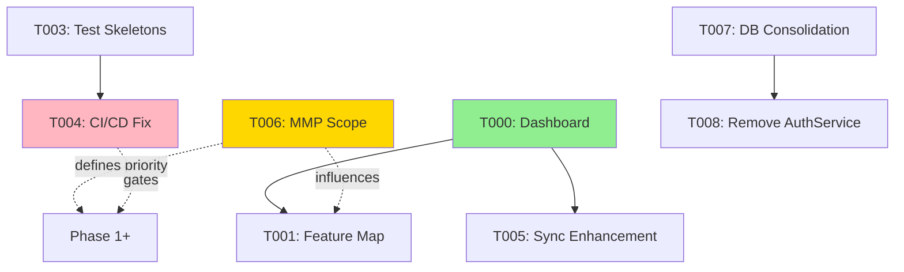
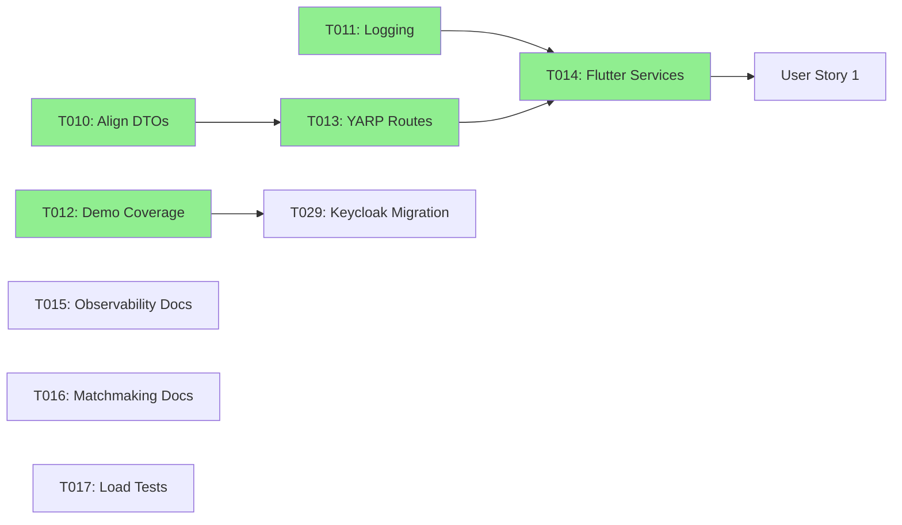
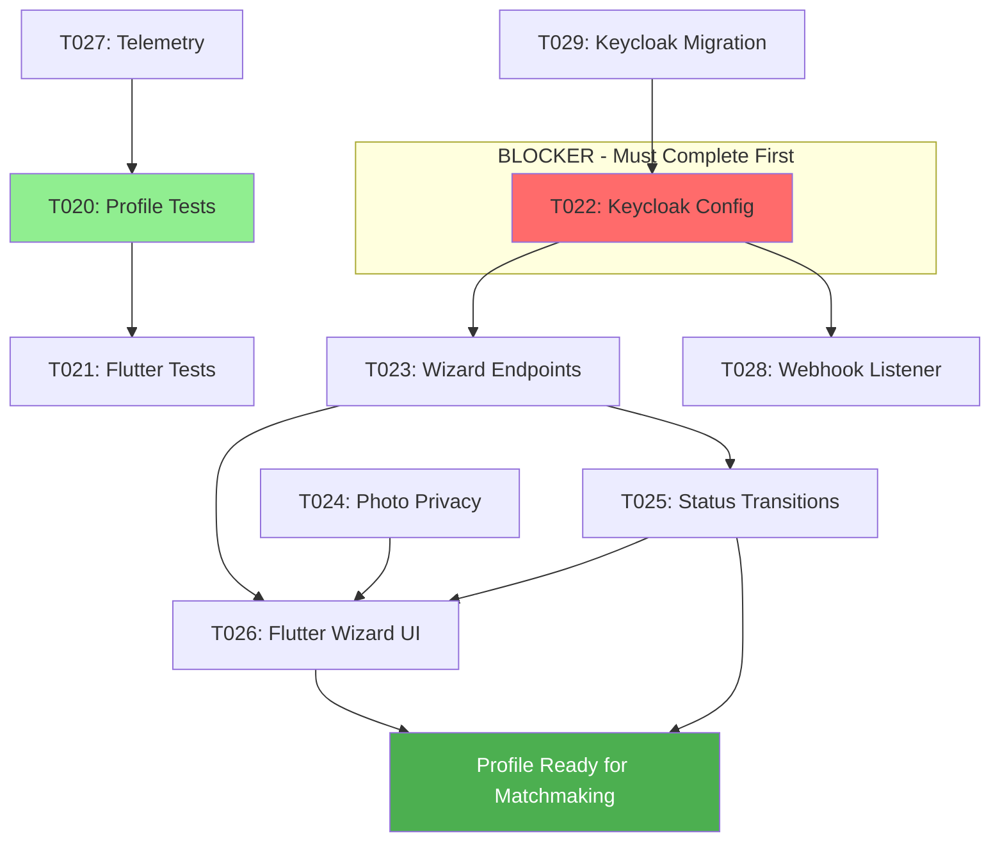
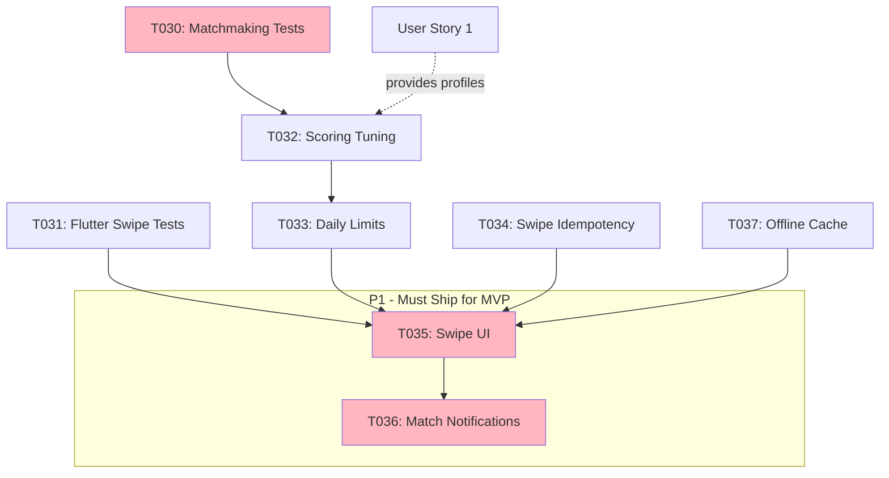

# Tasks: DatingApp MVP Foundation

**Input**: Design documents from `/specs/001-mvp-foundation/`
**Prerequisites**: plan.md, spec.md, research.md, data-model.md, contracts/

---

## Phase 0: Product Management & Development Visibility (Priority: P0)

**Goal**: Establish tracking, testing, and visualization systems to make development progress graspable for solo developer. Prevent over-engineering by mapping features to APIs and ensuring test coverage before implementation.
**Rationale**: With 72 tasks and 8 microservices, need automated progress tracking, feature-to-API traceability, and test-first workflow to avoid forgetting what's done and building unused code.

### Planning & Tracking
- [x] T000 [P] [Planning] Create DASHBOARD.md with auto-updating metrics (parse codebase for implemented endpoints, calculate test coverage per service, track user story %, generate phase burndown chart)
	- **Estimate**: 4h
	- **Evidence**: `specs/001-mvp-foundation/DASHBOARD.md` exists, shows 0% overall progress, coverage by service, task completion by phase, generated via `./scripts/generate_dashboard.sh`
	- **Tools**: Bash script parsing GitHub Projects API, controller files, test directories
	- **Completed**: 2026-01-24
	
- [ ] T001 [P] [Planning] Create FEATURE_MAP.md traceability matrix mapping APIs to user stories (identify which endpoints serve US1-4, flag orphaned/missing APIs, show implementation status, test coverage)
	- **Estimate**: 3h
	- **Evidence**: `specs/001-mvp-foundation/FEATURE_MAP.md` covers all endpoints from api-spec.md, signalr-spec.md with user story columns
	- **Prevents**: Building APIs that no feature uses, missing critical endpoints
	
- [ ] T002 [Planning] Add Mermaid dependency graphs to tasks.md showing task dependencies, service dependencies, critical path to MVP (visual representation per phase)
	- **Estimate**: 2h
	- **Evidence**: Each phase section has dependency graph, critical path highlighted, renders correctly in GitHub
	- **Benefits**: Shows what must be done in sequence vs parallel

### Testing Infrastructure
- [ ] T003 [P] [Testing] Generate test skeletons for all services (create failing xUnit tests for every controller action in UserService, MatchmakingService, SwipeService, PhotoService, MessagingService)
	- **Estimate**: 4h
	- **Evidence**: `dotnet test` discovers 50+ tests across all service test projects (currently ~5 tests exist), all skeletons marked `[Fact(Skip = "Not implemented")]`
	- **Next**: Remove skip attributes as implementations complete
	
- [ ] T004 [P] [Testing] Fix CI/CD pipeline for green builds (validate comprehensive-ci-cd.yml runs successfully, add coverage badges to README.md, set 80% coverage gate)
	- **Estimate**: 3h
	- **Evidence**: GitHub Actions workflow runs green, README shows coverage badges per service, builds fail below 80% threshold
	- **Prevents**: Regression bugs, breaking changes going unnoticed

### Automation & Tooling
- [ ] T005 [Planning] Enhance sync_mvp_project.sh with completion detection (parse controller files to auto-detect implemented tasks, update GitHub Project fields, generate weekly progress reports to specs/reports/)
	- **Estimate**: 3h
	- **Evidence**: Script successfully updates 8 completed tasks from codebase scan, generates `specs/reports/weekly-YYYY-MM-DD.md` report
	- **Benefits**: Auto-tracks progress without manual checkbox updates
	
- [x] T006 [Planning] Define MMP (Minimum Marketable Product) scope reduction (identify absolute minimum shippable features, create SCOPE.md with Phase 1=MMP vs Phase 2=Enhancements, update task priorities)
	- **Estimate**: 2h
	- **Evidence**: `specs/001-mvp-foundation/SCOPE.md` created with competitive analysis (Tinder/Bumble/Hinge MVPs), MMP defined as "The Match Loop" (Profile + Discovery + Messaging), task priorities updated in tasks.md
	- **Decision**: ✅ INCLUDE messaging in MMP - modern users expect complete signup→match→chat flow in 2026
	- **Completed**: 2026-01-25

### Architecture Cleanup
- [ ] T007 [P] [Foundational] Consolidate database strategy (standardize on PostgreSQL OR MySQL across all services, document migration plan for inconsistent services, update docker-compose)
	- **Estimate**: 4h
	- **Evidence**: All services use single database engine, migration script exists for transitioning services, `infrastructure/docker-compose.yml` updated
	- **Rationale**: Currently mixing PostgreSQL (photo, swipe, matchmaking) and MySQL (user, messaging, auth) without clear strategy
	
- [ ] T008 [P] [Foundational] Remove deprecated AuthService (complete Keycloak migration for all auth flows, delete AuthService directory, update YARP routes, remove from dev-start.sh)
	- **Estimate**: 3h
	- **Evidence**: AuthService directory deleted, all services use Keycloak OIDC, YARP routes updated, dev-start.sh no longer references port 8081
	- **Rationale**: Dual auth system causes confusion, Keycloak is primary per spec

**Checkpoint**: Development visibility established, testing infrastructure ready, architecture cleaned up. Ready to execute user stories with confidence.

### 📊 Phase 0 Dependencies

**Legend**: 
- 🟢 Green = Complete
- 🟡 Gold = High Priority (defines scope)
- 🔴 Pink = Blocker (must fix before shipping)
- Solid line = Hard dependency
- Dotted line = Influences/recommends

---

## Phase 1: Setup (Shared Infrastructure)

- [x] T001 [P] [Setup] Verify `./infrastructure/start.sh` bootstrap succeeds and refresh Keycloak realm exports (`infrastructure/`)
- [x] T002 [P] [Setup] Lock demo environment variables for MVP in `environments/` and document defaults in `quickstart.md`
- [x] T003 [Setup] Update `dev-start.sh` health checks to include messaging hub + report readiness (`dev-start.sh`)

---

## Phase 2: Foundational (Blocking Prerequisites)

- [x] T010 [Foundational] Align DTO contracts across services and Flutter by syncing `specs/001-mvp-foundation/contracts/` into service `Contracts/` folders
- [x] T011 [Foundational] Extend shared logging + correlation ID middleware to Auth, Matchmaking, Messaging, Swipe services (`*/Program.cs`, `*/Extensions/LoggingConfiguration.cs`)
- [x] T012 [Foundational] Add automated demo coverage for end-to-end signup -> match loop in legacy TestDataGenerator (now deprecated) and `api_tests.py`
	- Evidence: Legacy run `SWIPE_SERVICE_URL=http://localhost:8087 dotnet run --project TestDataGenerator.csproj -- --environment demo --run-scenarios` (MatchId 3) and `python3 api_tests.py` both completed on 2025-10-22 with mutual match confirmation. Superseded by T029 migration away from TestDataGenerator.
- [x] T013 [P] [Foundational] Harden YARP routing/policies for new safety + messaging endpoints (`dejting-yarp/src/dejting-yarp/appsettings.Development.json`)
- [x] T014 [P] [Foundational] Refresh Flutter models/services to match new contracts (`mobile-apps/flutter/dejtingapp/lib/services/`)
- [ ] T015 [Foundational] Document observability expectations and dashboards for MVP flows (`specs/001-mvp-foundation/plan.md`, `logs/README.md`)
- [ ] T016 [Foundational] Document matchmaking fallback heuristics + daily queue expansion rules (`specs/001-mvp-foundation/plan.md`, `contracts/api-spec.md`)
- [ ] T017 [Foundational] Run matchmaking load/perf harness and capture baseline metrics (`monitoring/dashboard/`, `MatchmakingService` logs)

**Checkpoint**: Constitution evidence gates satisfied, unblock user stories.

### 📊 Phase 2 Dependencies

**Critical Path**: T010 → T013 → T014 (blocks all user stories)

---

## Phase 3: User Story 1 – First-Time Profile Creation (Priority: P1)

**Goal**: New visitor completes registration, profile wizard, and photo upload with moderation + privacy controls.
**Independent Test**: Run demo signup script, verify new profile appears in matchmaking candidate list and photos stored with privacy metadata.

### Tests
- [x] T020 [P] [US1] Add profile onboarding integration test covering wizard flow (`api_tests.py`, new scenario)
	- Evidence: `python3 api_tests.py` run on 2025-10-22 provisions users, creates onboarding profiles, and verifies mutual match (profiles 10/11, match #4).
- [ ] T021 [P] [US1] Create Flutter integration test driving profile completion (`mobile-apps/flutter/dejtingapp/integration_test/profile_onboarding_test.dart`)

### Implementation
- [x] T022 [US1] Configure Keycloak realm for registration + email verification (clients, templates, required actions); retire legacy AuthService paths
	- **Evidence**: `config/keycloak/realms/datingapp-realm.json` has `registrationAllowed: true`, `verifyEmail: true`, VERIFY_EMAIL required action, MailHog SMTP configured. MailHog added to docker-compose.yml:1025/8025. Documented in `docs/setup/keycloak-configuration.md`
	- **Completed**: 2026-01-25
- [x] T023 [US1] Update UserService profile wizard endpoints for required fields, multi-step persistence, and resume validation (`UserService/Controllers/UserProfilesController.cs`, `DTOs/`)
	- **Evidence**: WizardController.cs with 3 PATCH endpoints (step/1, step/2, step/3), UpdateWizardStepCommand + Handler, OnboardingStatus enum (Incomplete/Ready/Suspended), EF migrations AddOnboardingStatus + AddUserIdField, wizard DTOs (BasicInfo, Preferences, Photos), UserProfile.UserId Guid field added
	- **Completion**: 2026-01-25
	- **Files**: UserService/Controllers/WizardController.cs, UserService/Commands/UpdateWizardStepCommand.cs, UserService/Commands/UpdateWizardStepHandler.cs, UserService/DTOs/WizardStep*.cs, UserService/Models/UserProfile.cs (UserId added), UserService/Migrations/20260125102401_AddOnboardingStatus.cs, dejting-yarp/Contracts/api-spec.md updated
- [ ] T024 [P] [US1] Enhance PhotoService moderation + blur pipeline to tag privacy levels (`photo-service/Services/ModerationService.cs`, `ImageProcessingService.cs`)
- [ ] T025 [US1] Persist onboarding status transitions (incomplete → ready) with migrations (`UserService/Data/ApplicationDbContext.cs` + migration)
- [ ] T026 [US1] Implement Flutter onboarding UI updates (guided wizard, photo privacy toggles, resumable steps, "add later" modules with analytics) (`mobile-apps/flutter/dejtingapp/lib/screens/`)
- [ ] T027 [US1] Add telemetry + audit logs for signup + photo moderation (`AuthService`, `photo-service` logging configuration)

- [ ] T028 [US1] [Deferred to Phase 2] Expose onboarding webhook/listener to consume Keycloak user events and populate initial profile state (`UserService/Services/`, `Controllers/`)
	- **Note**: Manual profile creation works for MMP beta (<100 users), automate post-launch
- [ ] T029 [US1] [Deferred to Phase 2] Replace TestDataGenerator flows with Keycloak-first end-to-end automation (`api_tests.py`, supporting scripts)
	- **Note**: Current test data works for MMP, migrate after validating Keycloak integration stability

**Checkpoint**: New profiles appear in matchmaking queue with validated photos and privacy flags.

### 📊 User Story 1 Dependencies

**Critical Path**: T029 → T022 → T023 → T025/T026 (⚠️ T022 is blocking everything)

---

## Phase 4: User Story 2 – Daily Match Discovery (Priority: P1)

**Goal**: Logged-in member browses prioritized candidate queue, performs swipes, and sees instant feedback.
**Independent Test**: Execute swipe loop via API + Flutter to ensure matches created, queue refreshes, and empty-state messaging appears.

### Tests
- [ ] T030 [P] [US2] Expand matchmaking service unit tests for scoring + queue ordering (`MatchmakingService.Tests/`)
- [ ] T031 [P] [US2] Add Flutter integration test for swipe flows with offline retry coverage (`integration_test/swipe_flow_test.dart`)

### Implementation
- [ ] T032 [US2] Tune matchmaking scoring and queue selection rules (`MatchmakingService/Services/MatchmakingService.cs`)
- [ ] T033 [US2] Introduce daily suggestion limits + exhaustion handling (`MatchmakingService/Controllers/`)
- [ ] T034 [P] [US2] Implement swipe retry/idempotency logic in SwipeService + API client (`swipe-service/Controllers/SwipesController.cs`, Flutter services)
- [ ] T035 [US2] Update Flutter Discover UI for compatibility indicators + empty-state messaging (`lib/screens/swipe_screen.dart`)
- [ ] T036 [US2] Emit notifications + YARP route for match creation (`MatchmakingService`, `dejting-yarp/appsettings*.json`)
- [ ] T037 [P] [US2] Finalize Flutter offline cache strategy for swipe queue + pending actions and integrate with retry logic (`lib/services/`, caching layer)

**Checkpoint**: Mutual matches create records, notifications fire, and queue gracefully handles exhaustion.

### 📊 User Story 2 Dependencies

**Critical Path**: US1 → T030 → T032 → T033 → T035 → T036

---

## Phase 5: User Story 3 – Secure Match Messaging (Priority: P1 ⬆️ PROMOTED FOR MMP)

**Goal**: Matched users exchange real-time messages with delivery guarantees and offline catch-up.
**Independent Test**: Create match, chat between web session + mobile emulator, verify read receipts + reconnect sync.

### Tests
- [ ] T040 [P] [US3] Add messaging service hub integration test using SignalR TestServer (`messaging-service.Tests/`) 
- [ ] T041 [P] [US3] Extend Flutter widget test for conversation view and offline resend queue (`lib/screens/chat/` tests)

### Implementation
- [ ] T042 [P] [US3] [MMP] Finalize SignalR hub contracts per spec - BASIC only (send/receive messages, no typing indicators) (`messaging-service/Hubs/MessagingHub.cs`, `contracts/signalr-spec.md`)
- [ ] T043 [P] [US3] [MMP] Add message persistence (NO read receipts initially) in `MessagingService/Services/MessageService.cs`
- [ ] T044 [P] [US3] [MMP] Implement offline queue + reconnection handling in Flutter messaging service (`lib/services/messaging_service.dart`)
- [ ] T045 [P] [US3] [MMP] Ensure YARP websockets + auth pipeline pass through tokens (`dejting-yarp/Program.cs`)
- [ ] T046 [US3] [Deferred to Phase 2] Update audit logging + moderation hooks for flagged messages - manual moderation OK for MMP beta (`messaging-service/Services/`)

**Checkpoint**: Messaging works across devices with resilience and moderation capture.

---

## Phase 6: User Story 4 – Safety & Recovery Controls (Priority: P3)

**Goal**: Provide privacy toggles, block/report actions, and recovery flows to build trust.
**Independent Test**: Run manual script toggling photo visibility, submitting reports, and reactivating account to confirm enforcement.

### Tests
- [ ] T050 [P] [US4] Write API test covering report + block lifecycle (`api_tests.py` scenario)
- [ ] T051 [US4] Add Flutter integration coverage for privacy settings screen (`integration_test/privacy_controls_test.dart`)

### Implementation
- [ ] T052 [P] [US4] [MMP] Expand PhotoService privacy enforcement + blurred responses - MINIMUM: blur for non-matches (`photo-service/Controllers/`) 
- [ ] T053 [US4] [Deferred to Phase 2] Build reporting endpoints + moderation queue integration - block action is sufficient for MMP (`messaging-service/Controllers/`, `UserService` admin hooks)
- [ ] T054 [P] [US4] [MMP] Implement block UX + state sync in Flutter - MINIMUM: block button, no unblock UI needed (`lib/screens/settings/privacy_settings.dart`)
- [ ] T055 [US4] [Deferred to Phase 2] Add account recovery + rehydration logic - manual support OK for beta scale (`AuthService/Controllers/`, `UserService/Services/`)
- [ ] T056 [US4] [Deferred to Phase 2] Publish operations playbook - handle manually during 100-user beta (`docs/operations/mvp-safety.md`)

**Checkpoint**: Safety flows enforce privacy, produce audits, and support recovery.

---

## Phase 7: Polish & Cross-Cutting Concerns

- [ ] T060 [P] Consolidate documentation updates (`specs/001-mvp-foundation/`, `AI_CONTEXT.md`)
- [ ] T061 Harden error messaging + localization in Flutter (`lib/l10n/`)
- [ ] T062 [P] Optimize EF Core queries for matchmaking/reporting (`MatchmakingService/Data/`, `UserService/Data/`)
- [ ] T063 [P] Finalize monitoring dashboards + alerts (Grafana/Loki configs)
- [ ] T064 Run quickstart validation, capture screenshots/logs for release notes (`quickstart.md` checklist)
- [ ] T065 [Backlog] Plan removal of `TestDataGenerator` console app and migrate any remaining demo seeding references (`dev-start.sh`, docs/, CI workflows)
- [ ] T066 [Backlog] Evaluate message broker introduction (RabbitMQ or alternative) for post-MVP scaling needs (`messaging-service/`, `dejting-yarp/`)
- [ ] T067 [P] Address Flutter desktop plugin analyzer warnings or formally drop desktop targets (`mobile-apps/flutter/dejtingapp/pubspec.yaml`, desktop configs)
- [ ] T068 [P] Instrument onboarding completion funnel metrics to satisfy SC-001 (`AuthService`, `UserService`, dashboards/`onboarding.json`)
- [ ] T069 [P] Capture matchmaking latency + mutual match conversion metrics (SC-002 & SC-003) (`MatchmakingService`, `monitoring/dashboard/`)
- [ ] T070 [P] Track messaging delivery/recency metrics with SignalR + REST fallbacks (SC-004) (`messaging-service`, `monitoring/`)
- [ ] T071 [P] Automate safety report acknowledgement timing + moderation SLA documentation (SC-005) (`docs/operations/mvp-safety.md`, `photo-service`/`messaging-service` logs)
- [ ] T072 [Backlog] Publish decision log for Keycloak + scoring defaults and link to updated `clarifications.md`

---

## Dependencies & Execution Order
- Phase 1 → Phase 2 must complete before user stories.
- User Stories 1 & 2 (P1) should finish before starting messaging (P2) unless parallel teams available.
- Safety controls (P3) can run in parallel once foundational logging + reporting scaffolds exist.
- Tests for each story should be authored before implementation tasks (T020/T021, T030/T031, T040/T041, T050/T051).
- Use Constitution gate reminders to ensure evidence (demo scripts, logging) is delivered no later than Phase 7.
