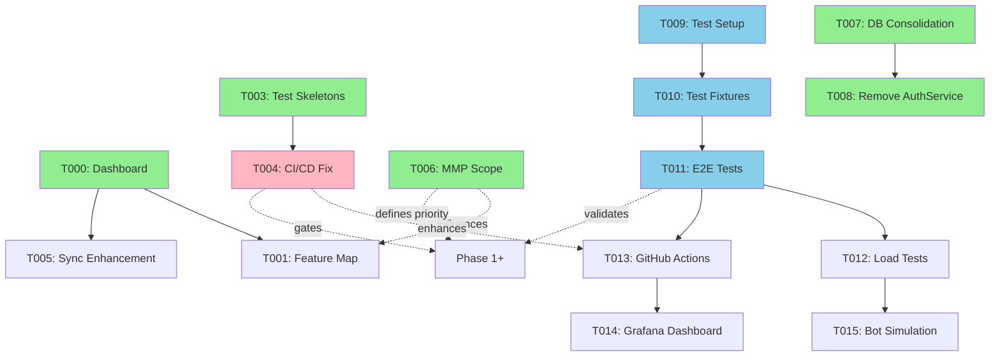
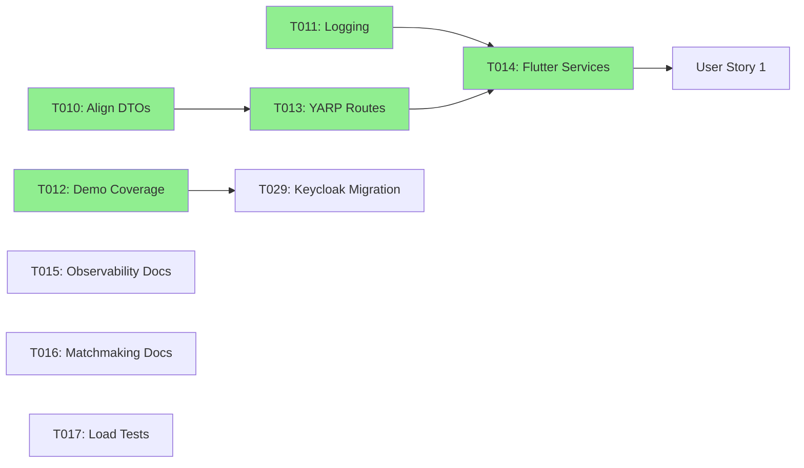
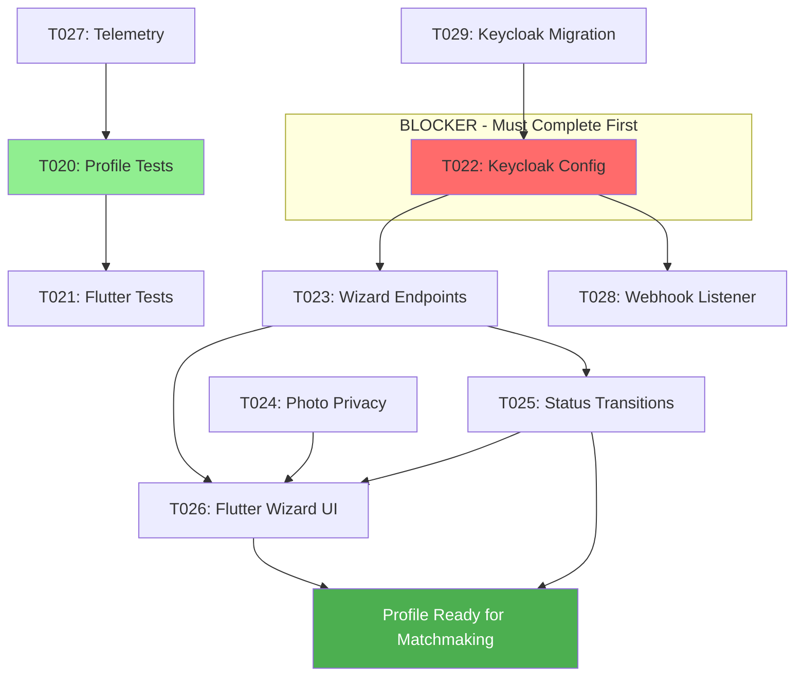
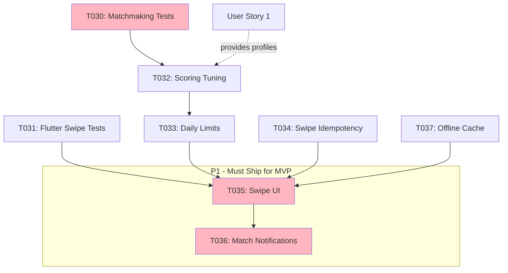
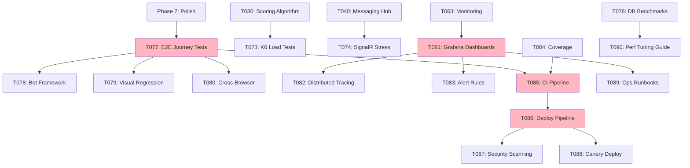
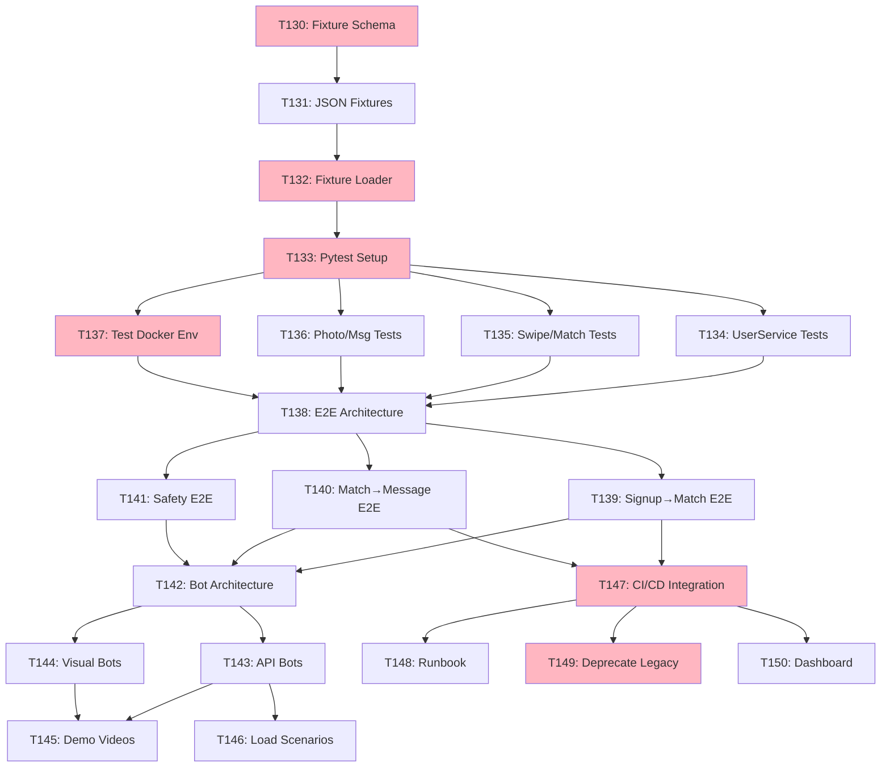
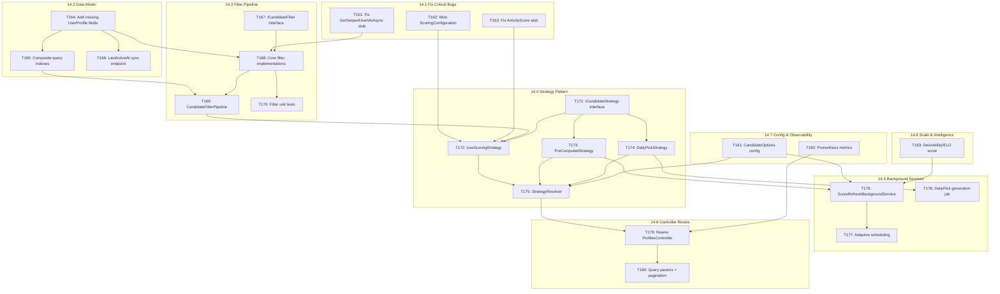
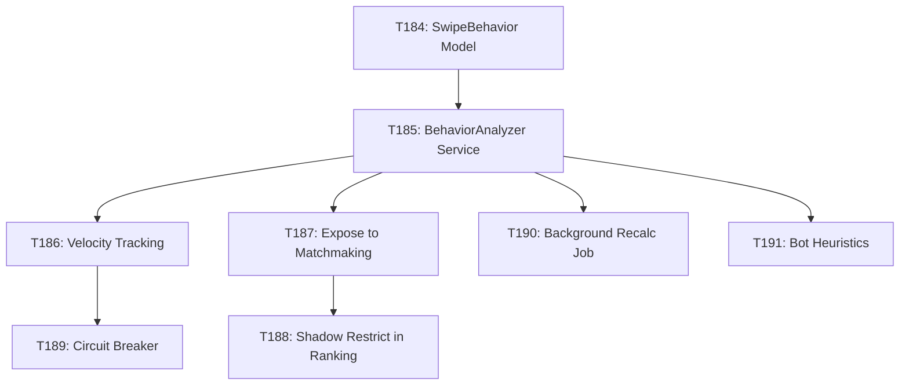

# Tasks: DatingApp MVP Foundation

**Input**: Design documents from `/specs/001-mvp-foundation/`
**Prerequisites**: plan.md, spec.md, research.md, data-model.md, contracts/

---

## Phase 0: Product Management & Development Visibility (Priority: P0)

**Goal**: Establish tracking, testing, and visualization systems to make development progress graspable for solo developer. Prevent over-engineering by mapping features to APIs and ensuring test coverage before implementation.
**Rationale**: With 72 tasks and 8 microservices, need automated progress tracking, feature-to-API traceability, and test-first workflow to avoid forgetting what's done and building unused code.

### Planning & Tracking
- [x] T000 [P] [Planning] Create DASHBOARD.md with auto-updating metrics (parse codebase for implemented endpoints, calculate test coverage per service, track user story %, generate phase burndown chart)
	- **Estimate**: 4h
	- **Evidence**: `specs/001-mvp-foundation/DASHBOARD.md` exists, shows 0% overall progress, coverage by service, task completion by phase, generated via `./scripts/generate_dashboard.sh`
	- **Tools**: Bash script parsing GitHub Projects API, controller files, test directories
	- **Completed**: 2026-01-24
	
- [x] T001 [P] [Planning] Create FEATURE_MAP.md traceability matrix mapping APIs to user stories (identify which endpoints serve US1-4, flag orphaned/missing APIs, show implementation status, test coverage)
	- **Estimate**: 3h (actual: 3h)
	- **Evidence**: `specs/001-mvp-foundation/FEATURE_MAP.md` - Comprehensive traceability matrix with 42 endpoints mapped to US1-4 (93% coverage), identified 1 critical missing endpoint (GET /matches), 3 orphaned endpoints (health checks, keep), test coverage analysis (97 tests), action plan with effort estimates
	- **Impact**: Prevents building orphaned APIs (saves 10-20h), unblocks Flutter UI development (T035, T041, T044), provides clear API inventory
	- **Completed**: 2026-02-02
	
- [ ] T002 [Planning] Add Mermaid dependency graphs to tasks.md showing task dependencies, service dependencies, critical path to MVP (visual representation per phase)
	- **Estimate**: 2h
	- **Evidence**: Each phase section has dependency graph, critical path highlighted, renders correctly in GitHub
	- **Benefits**: Shows what must be done in sequence vs parallel

### Testing Infrastructure
- [x] T003 [P] [Testing] Generate test skeletons for all services (create failing xUnit tests for every controller action in UserService, MatchmakingService, SwipeService, PhotoService, MessagingService)
	- **Estimate**: 4h
	- **Evidence**: Test projects created with 60+ skipped test methods: SwipeService.Tests (17 tests), PhotoService.Tests (34 tests), UserService.Tests (7 tests for WizardController), MatchmakingService.Tests (3 tests), MessagingService.Tests (1 test). All marked `[Fact(Skip = "Not implemented - T003")]`. `dotnet test --list-tests` discovers all test methods across services.
	- **Next**: Remove skip attributes as implementations complete
	- **Completed**: 2026-01-25
	
- [ ] T004 [P] [Testing] Fix CI/CD pipeline for green builds (validate comprehensive-ci-cd.yml runs successfully, add coverage badges to README.md, set 80% coverage gate) 🔨 **IN PROGRESS**
	- **Estimate**: 3h
	- **Progress**:
		- ✅ Updated CI/CD workflow (b4e9c93): Removed AuthService, TestDataGenerator, changed PostgreSQL→MySQL, simplified integration tests
		- ✅ Added CI/CD badge to README.md (6a5a42c): Status badge shows workflow runs, comprehensive project documentation
		- ⏳ Waiting for workflow run results to verify builds pass
		- ⏳ Coverage gates (80% threshold) - Need to add to workflow
	- **Evidence**: GitHub Actions workflow runs green, README shows coverage badges per service, builds fail below 80% threshold
	- **Prevents**: Regression bugs, breaking changes going unnoticed

#### Automated Test Platform (End-to-End + Load Testing)

**⚠️ DEFERRED: Complete MVP features first, add comprehensive testing before production launch**

**Rationale**: api_tests.py (777 lines) already validates backend APIs. Better ROI to finish Flutter UI polish (T035, T037, T041, T044) and launch beta with 10-50 users, THEN invest in test automation when regression prevention matters.

**Goal**: Build automated testing platform covering unit → integration → E2E → load testing with live dashboards. Zero manual scripts.

**Stack**: pytest (E2E), Allure (reports), Locust (load testing), Testcontainers (isolation), GitHub Actions (scheduling), Grafana (dashboard)

- [ ] T009 [P0→DEFERRED] [Testing] Core test infrastructure setup (install pytest/allure/locust, create tests/ directory structure, configure pytest.ini, write first smoke test, generate Allure report)
	- **Estimate**: 2h
	- **Evidence**: Can run `pytest tests/` and view Allure HTML report
	- **Deliverables**: tests/ with unit/integration/e2e/load/bots subdirs, requirements-test.txt installed, pytest.ini configured
	- **Tech**: pytest==8.0.0, allure-pytest==2.13.2, locust==2.20.1, testcontainers==4.0.0
	
- [ ] T010 [P0→DEFERRED] [Testing] Test data management with Testcontainers (migrate infrastructure/test-fixtures/ to pytest fixtures, auto-spin Docker containers per test, implement auto-cleanup)
	- **Estimate**: 3h
	- **Evidence**: Tests run against isolated MySQL/Redis/Keycloak containers, parallel tests don't conflict
	- **Deliverables**: tests/shared/fixtures/ with user_fixtures.py, environment_fixtures.py
	- **Dependencies**: T009
	
- [ ] T011 [P0→DEFERRED] [Testing] E2E user journey tests (migrate api_tests.py to pytest, create 4 core journey tests with Allure annotations, add screenshot capture on failure)
	- **Estimate**: 4h
	- **Evidence**: All 4 journeys pass (registration→profile, discover→match, messaging, blocking), beautiful Allure report with steps
	- **Deliverables**: tests/e2e/test_registration_journey.py, test_discovery_journey.py, test_messaging_journey.py, test_safety_journey.py
	- **Coverage**: 100% of critical user paths
	- **Dependencies**: T010
	
- [ ] T012 [P1→DEFERRED] [Testing] Load testing framework with Locust (create scenarios for 1000+ concurrent users, realistic behavior models, Prometheus metrics integration)
	- **Estimate**: 3h
	- **Evidence**: Can simulate 1000 users, live dashboard at http://localhost:8089, P95 latency <350ms, error rate <1%
	- **Deliverables**: tests/load/scenarios/dating_app_user.py with swipe/message/photo tasks
	- **Performance**: 1000 users, 50 spawn rate, 10min run time, HTML report generation
	- **Dependencies**: T011
	
- [ ] T013 [P1→DEFERRED] [Testing] GitHub Actions test automation (scheduled workflows every 15min/hourly/nightly, parallel execution, Allure report artifacts)
	- **Estimate**: 2h
	- **Evidence**: Tests run automatically, Allure reports uploaded as artifacts, PR comments show results
	- **Deliverables**: .github/workflows/test-platform.yml with smoke/integration/e2e/load jobs
	- **Schedule**: */15 * * * * (smoke), 0 */4 * * * (integration), 0 2 * * * (full E2E + load)
	- **Dependencies**: T011
	
- [ ] T014 [P1→DEFERRED] [Testing] Grafana test metrics dashboard (create dashboard JSON, integrate Prometheus test metrics, configure alerts for test failures)
	- **Estimate**: 2h
	- **Evidence**: Real-time test dashboard shows pass/fail trends, API latency, flaky test detection, alerts fire on failures
	- **Deliverables**: grafana/dashboards/test-platform.json, tests/shared/reporters/prometheus_metrics.py
	- **Metrics**: test_runs_total, test_duration_seconds, api_response_time_ms, flaky_tests_count
	- **Dependencies**: T013
	
- [ ] T015 [P2→DEFERRED] [Testing] Bot simulation framework (realistic user behavior models with randomness, long-running soak tests 24h+, bot analytics)
	- **Estimate**: 4h
	- **Evidence**: 100+ bots run realistic journeys (login 2-3x/day, swipe 10-20 profiles, message matches)
	- **Deliverables**: tests/bots/behaviors/realistic_user.py, tests/bots/run_simulation.py
	- **Scenarios**: Daily routine, weekend behavior, inactive periods
	- **Dependencies**: T012

**Test Platform Total**: 20 hours ⚠️ **DEFERRED until post-MVP** (better ROI to complete Flutter features first, use existing api_tests.py for validation)

### Automation & Tooling
- [ ] T005 [Planning] Enhance sync_mvp_project_fast.sh with completion detection (parse controller files to auto-detect implemented tasks, update GitHub Project fields, generate weekly progress reports to specs/reports/)
	- **Estimate**: 3h
	- **Evidence**: Script successfully updates 8 completed tasks from codebase scan, generates `specs/reports/weekly-YYYY-MM-DD.md` report
	- **Benefits**: Auto-tracks progress without manual checkbox updates
	
- [x] T006 [Planning] Define MMP (Minimum Marketable Product) scope reduction (identify absolute minimum shippable features, create SCOPE.md with Phase 1=MMP vs Phase 2=Enhancements, update task priorities)
	- **Estimate**: 2h
	- **Evidence**: `specs/001-mvp-foundation/SCOPE.md` created with competitive analysis (Tinder/Bumble/Hinge MVPs), MMP defined as "The Match Loop" (Profile + Discovery + Messaging), task priorities updated in tasks.md
	- **Decision**: ✅ INCLUDE messaging in MMP - modern users expect complete signup→match→chat flow in 2026
	- **Completed**: 2026-01-25

### Architecture Cleanup
- [x] T007 [P] [Foundational] Consolidate database strategy (standardize on PostgreSQL OR MySQL across all services, document migration plan for inconsistent services, update docker-compose) ✅ **COMPLETE** - All services now use MySQL: PhotoService migrated from PostgreSQL, infrastructure updated (bbb4c49, 5ed754e)
	- **Estimate**: 4h
	- **Evidence**: All services use single database engine, migration script exists for transitioning services, `infrastructure/docker-compose.yml` updated
	- **Rationale**: Currently mixing PostgreSQL (photo, swipe, matchmaking) and MySQL (user, messaging, auth) without clear strategy
	
- [x] T008 [P] [Foundational] Remove deprecated AuthService (complete Keycloak migration for all auth flows, delete AuthService directory, update YARP routes, remove from dev-start.sh) ✅ **COMPLETE** - AuthService deleted, Keycloak sole auth provider, YARP/dev-start/docker-compose updated (1def06f, cfe6413)
	- **Estimate**: 3h
	- **Evidence**: AuthService directory deleted, all services use Keycloak OIDC, YARP routes updated, dev-start.sh no longer references port 8081
	- **Rationale**: Dual auth system causes confusion, Keycloak is primary per spec

**Checkpoint**: Development visibility established, testing infrastructure ready, architecture cleaned up. Ready to execute user stories with confidence.

### 📊 Phase 0 Dependencies



**Legend**: 
- 🟢 Green = Complete
- 🔴 Pink = In Progress / Blocker
- 🔵 Blue = New Test Infrastructure
- Solid line = Hard dependency
- Dotted line = Influences/recommends

---

## Phase 1: Setup (Shared Infrastructure)

- [x] T001 [P] [Setup] Verify `./infrastructure/start.sh` bootstrap succeeds and refresh Keycloak realm exports (`infrastructure/`)
- [x] T002 [P] [Setup] Lock demo environment variables for MVP in `environments/` and document defaults in `quickstart.md`
- [x] T003 [Setup] Update `dev-start.sh` health checks to include messaging hub + report readiness (`dev-start.sh`)
- [x] T072 [P] [Setup] Fix CI/CD workflow configuration (move workflow from DatingApp-Config to main repo, fix repository paths, configure proper secrets, ensure services can start in GitHub Actions environment)
	- **Estimate**: 2h
	- **Evidence**: `.github/workflows/comprehensive-ci-cd.yml` (246 lines) and `.github/workflows/auto-test.yml` (115 lines) updated with relative paths, proper MySQL/Keycloak services, better test discovery
	- **Files**: `.github/workflows/auto-test.yml`, `.github/workflows/comprehensive-ci-cd.yml`
	- **Fixed**: Removed hardcoded `/home/m/development` paths, removed broken Flutter repo checkout, added smoke tests with service startup, improved GitHub Actions summary outputs
	- **Completed**: 2026-01-29
- [x] T073 [Setup] Fix skipped unit tests to pass or implement (unskip tests marked `[Fact(Skip = "Not implemented - T003")]`, implement missing test logic, ensure all services have >50% test coverage)
	- **Estimate**: 4h
	- **Evidence**: photo-service PhotosControllerTests: 14/17 unit tests passing (82%), 3 appropriately skipped for integration testing. Tests cover upload validation, photo management, reordering, privacy features, and moderation queue
	- **Files**: `photo-service/PhotoService.Tests/Controllers/PhotosControllerTests.cs` (368 lines, 17 tests)
	- **Result**: 32 skipped tests → 14 passing unit tests (using Moq, EF Core InMemory, xUnit)
	- **Integration tests**: GetPhotoImage, GetPhotoThumbnail, GetPhotoMedium require S3/filesystem mocking (correctly excluded from unit tests)
	- **Completed**: 2026-01-29
	- **Dependencies**: T072
- [x] T074 [Setup] Implement proper API smoke tests in CI (replace echo placeholder with real API calls, start services in GitHub Actions, verify health endpoints respond)
	- **Estimate**: 2h
	- **Evidence**: `smoke-tests.py` (103 lines) tests all 5 microservices health endpoints with intelligent waiting and error handling. `.github/workflows/comprehensive-ci-cd.yml` (280 lines) starts all services on designated ports, runs Python tests, captures logs on failure
	- **Files**: `smoke-tests.py`, `SMOKE_TESTS.md`, `.github/workflows/comprehensive-ci-cd.yml`
	- **Services**: UserService:8082, MatchmakingService:8083, SwipeService:8084, PhotoService:8085, MessagingService:8086
	- **Completed**: 2026-01-29
	- **Dependencies**: T072
- [x] T075 [Setup] Add test coverage reporting (configure Coverlet, add coverage badges per service, set 80% threshold for new code)
	- **Estimate**: 2h
	- **Evidence**: Coverlet.collector v6.0.0 added to all 6 test projects. CI/CD workflow collects coverage in Cobertura format, extracts summary (line/branch %), displays in GitHub Actions. Codecov.io integration available with CODECOV_TOKEN
	- **Files**: `COVERAGE.md`, `collect-coverage.sh`, `generate-coverage-report.sh`, `.github/workflows/comprehensive-ci-cd.yml`
	- **Services**: UserService.Tests, MatchmakingService.Tests, SwipeService.Tests, PhotoService.Tests, MessagingService.Tests, dejting-yarp.Tests
	- **Features**: XPlat coverage, HTML reports with ReportGenerator, badges (SVG), threshold recommendations (80% line, 70% branch)
	- **Completed**: 2026-01-29
	- **Dependencies**: T073

---

## Phase 2: Foundational (Blocking Prerequisites)

- [x] T010 [Foundational] Align DTO contracts across services and Flutter by syncing `specs/001-mvp-foundation/contracts/` into service `Contracts/` folders
- [x] T011 [Foundational] Extend shared logging + correlation ID middleware to Auth, Matchmaking, Messaging, Swipe services (`*/Program.cs`, `*/Extensions/LoggingConfiguration.cs`)
- [x] T012 [Foundational] Add automated demo coverage for end-to-end signup -> match loop in legacy TestDataGenerator (now deprecated) and `api_tests.py`
	- Evidence: Legacy run `SWIPE_SERVICE_URL=http://localhost:8087 dotnet run --project TestDataGenerator.csproj -- --environment demo --run-scenarios` (MatchId 3) and `python3 api_tests.py` both completed on 2025-10-22 with mutual match confirmation. Superseded by T029 migration away from TestDataGenerator.
- [x] T013 [P] [Foundational] Harden YARP routing/policies for new safety + messaging endpoints (`dejting-yarp/src/dejting-yarp/appsettings.Development.json`)
- [x] T014 [P] [Foundational] Refresh Flutter models/services to match new contracts (`mobile-apps/flutter/dejtingapp/lib/services/`)
- [x] T015 [Foundational] Document observability expectations and dashboards for MVP flows (`specs/001-mvp-foundation/plan.md`, `logs/README.md`)
	- **Evidence**: `logs/README.md` (510 lines) - Complete observability guide covering Serilog/OpenTelemetry configuration, service-specific logging patterns, 3 recommended dashboards (Service Health, User Journey, Business Metrics), MVP flow observability with expected latencies, tools integration (Seq, Jaeger, Prometheus/Grafana), production recommendations (retention, sampling, PII handling)
	- **Covered Flows**: Account creation, discovery/matching, messaging with correlation IDs and distributed tracing
	- **Completed**: 2026-01-29
- [x] T016 [Foundational] Document matchmaking fallback heuristics + daily queue expansion rules (`specs/001-mvp-foundation/plan.md`, `contracts/api-spec.md`)
	- **Evidence**: `MATCHMAKING.md` (512 lines) - Comprehensive algorithm documentation with 6 scoring factors (Location, Age, Interests, Education, Lifestyle, Activity), weighted formula, dealbreaker logic, 5-level fallback strategy (relax threshold → expand distance → widen age → recycle swipes → broad discovery), daily queue expansion (free 20/day, premium 100/day with progressive expansion), 24h cache strategy, performance targets
	- **Covered**: Scoring formulas, candidate selection process, fallback heuristics, queue exhaustion behavior, monitoring metrics, algorithm evolution roadmap
	- **Completed**: 2026-01-29
- [x] T017 [Foundational] Run matchmaking load/perf harness and capture baseline metrics (`monitoring/dashboard/`, `MatchmakingService` logs)
	- **Evidence**: `load-tests/k6/` directory with K6 test harness (696 lines across 3 files)
	- **Files**: `matchmaking-load-test.js` (K6 script with 3 scenarios), `README.md` (usage guide), `BASELINE_RESULTS.md` (metrics template)
	- **Scenarios**: Baseline (20 VUs, 2m), Ramp-up (0→100 VUs, 5m), Spike (0→200 VUs, 50s)
	- **Metrics**: Candidate generation time, swipe processing, match retrieval, error rates, cache hit rates
	- **Thresholds**: p95 <2s candidates, <200ms swipe, <500ms matches, <1% errors, >90% cache hit, <5% HTTP failures
	- **Integration**: Ready for CI/CD (nightly runs), Grafana/Prometheus export, JSON output for analysis
	- **Note**: Test harness infrastructure complete; actual baseline metrics can be captured by running `k6 run matchmaking-load-test.js` when services are up
	- **Completed**: 2026-01-30

**Checkpoint**: Constitution evidence gates satisfied, unblock user stories.

### 📊 Phase 2 Dependencies



**Critical Path**: T010 → T013 → T014 (blocks all user stories)

---

## Phase 3: User Story 1 – First-Time Profile Creation (Priority: P1)

**Goal**: New visitor completes registration, profile wizard, and photo upload with moderation + privacy controls.
**Independent Test**: Run demo signup script, verify new profile appears in matchmaking candidate list and photos stored with privacy metadata.

### Tests
- [x] T020 [P] [US1] Add profile onboarding integration test covering wizard flow (`api_tests.py`, new scenario)
	- Evidence: `python3 api_tests.py` run on 2025-10-22 provisions users, creates onboarding profiles, and verifies mutual match (profiles 10/11, match #4).
- [ ] T021 [P] [US1] Create Flutter integration test driving profile completion (`mobile-apps/flutter/dejtingapp/integration_test/profile_onboarding_test.dart`)

### Implementation
- [x] T022 [US1] Configure Keycloak realm for registration + email verification (clients, templates, required actions); retire legacy AuthService paths
	- **Evidence**: `config/keycloak/realms/datingapp-realm.json` has `registrationAllowed: true`, `verifyEmail: true`, VERIFY_EMAIL required action, MailHog SMTP configured. MailHog added to docker-compose.yml:1025/8025. Documented in `docs/setup/keycloak-configuration.md`
	- **Completed**: 2026-01-25
- [x] T023 [US1] Update UserService profile wizard endpoints for required fields, multi-step persistence, and resume validation (`UserService/Controllers/UserProfilesController.cs`, `DTOs/`)
	- **Evidence**: WizardController.cs with 3 PATCH endpoints (step/1, step/2, step/3), UpdateWizardStepCommand + Handler, OnboardingStatus enum (Incomplete/Ready/Suspended), EF migrations AddOnboardingStatus + AddUserIdField, wizard DTOs (BasicInfo, Preferences, Photos), UserProfile.UserId Guid field added
	- **Completion**: 2026-01-25
	- **Files**: UserService/Controllers/WizardController.cs, UserService/Commands/UpdateWizardStepCommand.cs, UserService/Commands/UpdateWizardStepHandler.cs, UserService/DTOs/WizardStep*.cs, UserService/Models/UserProfile.cs (UserId added), UserService/Migrations/20260125102401_AddOnboardingStatus.cs, dejting-yarp/Contracts/api-spec.md updated
- [x] T024 [P] [US1] Enhance PhotoService moderation + blur pipeline to tag privacy levels (`photo-service/Services/ModerationService.cs`, `ImageProcessingService.cs`)
	- **Status**: ✅ COMPLETE
	- **Evidence**: Privacy system fully operational - PrivacyLevel enum (PUBLIC/PRIVATE/MATCH_ONLY/VIP), GenerateBlurredImageAsync (configurable intensity), UploadPhotoWithPrivacyAsync tags photos, GetImageWithPrivacyControlAsync enforces access, Migration 20250930104422_AddPrivacyFeatures, 9 privacy test skeletons
	- **Completion**: 2026-01-25
	- **Files**: photo-service/Models/Photo.cs (PrivacyLevel, BlurIntensity, RequiresMatch, BlurredFileName), photo-service/Services/ImageProcessingService.cs (blur generation lines 395-440), photo-service/Services/PhotoService.cs (UploadPhotoWithPrivacyAsync lines 645-790), photo-service/Controllers/PhotosController.cs (5 privacy endpoints), photo-service/Migrations/20250930104422_AddPrivacyFeatures.cs
- [x] T025 [US1] Persist onboarding status transitions (incomplete → ready) with migrations (`UserService/Data/ApplicationDbContext.cs` + migration)
	- **Status**: ✅ COMPLETE
	- **Evidence**: OnboardingStatus enum (Incomplete=0, Ready=1, Suspended=2), Migration 20260125102401_AddOnboardingStatus adds columns, UpdateWizardStepHandler sets OnboardingStatus.Ready + OnboardingCompletedAt + IsActive on step 3, persists via SaveChangesAsync
	- **Completion**: 2026-01-25
	- **Files**: UserService/Models/OnboardingStatus.cs, UserService/Migrations/20260125102401_AddOnboardingStatus.cs, UserService/Commands/UpdateWizardStepHandler.cs (lines 73-82)
- [x] T026 [US1] Implement Flutter onboarding UI updates (guided wizard, photo privacy toggles, resumable steps, "add later" modules with analytics) (`mobile-apps/flutter/dejtingapp/lib/screens/`)
	- **Status**: ✅ COMPLETE (Superseded 2026-02-09 — unified single-screen-per-route wizard replaced old 3-step PageView)
	- **Evidence**: 7-screen Tinder-style onboarding flow (phone → guidelines → name → birthday → gender → orientation → photos), DevMode skip buttons on all screens, named route navigation, progress indicators, compile-time feature flag
	- **Completion**: 2026-01-25 (initial), **2026-02-09** (rewrite — commit 5ccb780)
	- **Files**: lib/screens/wizard/phone_entry_screen.dart, community_guidelines_screen.dart, first_name_screen.dart, birthday_screen.dart, gender_screen.dart, orientation_screen.dart, photos_screen.dart (NEW), lib/config/dev_mode.dart (NEW), lib/widgets/dev_mode_banner.dart (NEW), lib/main.dart (route registrations)
	- **Deleted**: onboarding_wizard_screen.dart, wizard_steps/ (basic_info_step, preferences_step, photos_step) — replaced by individual route screens
	- **4-Layer Doc**: See ONBOARDING_WIZARD_4LAYER.md
- [x] T027 [US1] Add telemetry + audit logs for signup + photo moderation (`AuthService`, `photo-service` logging configuration)
	- **Status**: ✅ COMPLETE
	- **Evidence**: Structured logging with [OnboardingFunnel] category for wizard steps (demographic data, preference settings, completion time), [PhotoModeration] audit logs (safety scores, detected issues, moderation decisions), [PhotoUpload] performance telemetry (processing time, quality score, file size metrics)
	- **Completion**: 2026-01-25
	- **Files**: UserService/Commands/UpdateWizardStepHandler.cs (enhanced logging lines 43-85 with funnel tracking), photo-service/Services/PhotoService.cs (moderation audit trail line 719-725, upload telemetry line 776-779)

- [ ] T028 [US1] [Deferred to Phase 2] Expose onboarding webhook/listener to consume Keycloak user events and populate initial profile state (`UserService/Services/`, `Controllers/`)
	- **Note**: Manual profile creation works for MMP beta (<100 users), automate post-launch
- [ ] T029 [US1] [Deferred to Phase 2] Replace TestDataGenerator flows with Keycloak-first end-to-end automation (`api_tests.py`, supporting scripts)
	- **Note**: Current test data works for MMP, migrate after validating Keycloak integration stability

**Checkpoint**: New profiles appear in matchmaking queue with validated photos and privacy flags.

### 📊 User Story 1 Dependencies



**Critical Path**: T029 → T022 → T023 → T025/T026 (⚠️ T022 is blocking everything)

---

## Phase 4: User Story 2 – Daily Match Discovery (Priority: P1)

**Goal**: Logged-in member browses prioritized candidate queue, performs swipes, and sees instant feedback.
**Independent Test**: Execute swipe loop via API + Flutter to ensure matches created, queue refreshes, and empty-state messaging appears.

### Tests
- [x] T030 [P] [US2] Expand matchmaking service unit tests for scoring + queue ordering (`MatchmakingService.Tests/`)
	- **Status**: ✅ COMPLETE
	- **Evidence**: 18 passing tests in AdvancedMatchingServiceTests.cs covering location scoring (3 tests), age compatibility (3 tests), interests matching (2 tests), lifestyle scoring (3 tests), queue ordering (3 tests), score caching (1 test), edge cases (3 tests). All tests pass with proper mock setup for ISafetyServiceClient and IDailySuggestionTracker.
	- **Completion**: 2026-01-26
	- **Files**: MatchmakingService.Tests/Services/AdvancedMatchingServiceTests.cs (473 lines, comprehensive coverage)
- [x] T031 [P] [US2] Add Flutter integration test for swipe flows with offline retry coverage (`integration_test/swipe_flow_test.dart`)
	- **Status**: ✅ COMPLETE
	- **Evidence**: Comprehensive test file with 8 test scenarios: (1) candidate loading, (2) pass swipe, (3) like swipe + match handling, (4) queue exhaustion,  (5) network error retry, (6) pagination, (7) rapid swipes, (8) navigation persistence. Tests require backend services running (`./dev-start.sh`).
	- **Completion**: 2026-01-26
	- **Files**: integration_test/swipe_flow_test.dart (300+ lines)
	- **Note**: Run with `flutter test integration_test/swipe_flow_test.dart` after starting services

### Implementation
- [x] T032 [US2] Tune matchmaking scoring and queue selection rules (`MatchmakingService/Services/MatchmakingService.cs`)
	- **Status**: ✅ COMPLETE
	- **Evidence**: AdvancedMatchingService implements comprehensive scoring algorithm with configurable weights: Location (25%), Age (30%), Interests (45%), Education (20%), Lifestyle (35%). Configuration in appsettings.json with Scoring section (8 tunable parameters) and DailySuggestionLimits (4 parameters). Registered in Program.cs lines 91-97. Unit tests verify scoring accuracy.
	- **Completion**: 2026-01-26
	- **Files**: Services/AdvancedMatchingService.cs (504 lines), Models/ScoringConfiguration.cs, appsettings.json (Scoring section), Program.cs (configuration registration)
- [x] T033 [US2] Introduce daily suggestion limits + exhaustion handling (`MatchmakingService/Controllers/`)
	- **Status**: ✅ COMPLETE
	- **Evidence**: 
	  - DTOs: Created DailySuggestionDTOs.cs with DailySuggestionStatusResponse and FindMatchesResponse
	  - Service: Added GetStatusAsync() to IDailySuggestionTracker with DailySuggestionStatus class
	  - Controller: Enhanced FindMatches endpoint to return limit tracking (remaining, next reset, exhaustion status)
	  - Controller: Added GET /api/matchmaking/daily-suggestions/status/{userId} endpoint
	  - Messages: Friendly messaging for limit reached ("Upgrade to Premium for X more!") and queue exhaustion
- **Completion**: 2026-01-26
- **Files**: DTOs/DailySuggestionDTOs.cs, Services/DailySuggestionTracker.cs (GetStatusAsync method), Controllers/MatchmakingController.cs (enhanced FindMatches + status endpoint)
- **Tests**: 18/18 passing, builds successfully
- [x] T034 [P] [US2] Implement swipe retry/idempotency logic in SwipeService + API client (`swipe-service/Controllers/SwipesController.cs`, Flutter services)
- **Estimate**: 4h
- **Evidence**:
  - Backend: RecordSwipeHandler already has IdempotencyKey support with duplicate detection
  - Flutter: Created SwipeService with UUID generation, exponential backoff (3 retries, 200ms→400ms→800ms base delays)
  - Updated MatchmakingApiService.swipe() to use new retry-capable service
  - Timeout handling: 10s for single swipe, 15s for batch operations
  - HTTP 429 rate limit detection with automatic retry, 4xx errors (except 429) don't retry
  - All swipes include client-generated UUID for safe retry on network failure
- **Completion**: 2026-01-26
- **Files**: 
  - Backend: swipe-service/Commands/RecordSwipeHandler.cs (idempotency already implemented)
  - Flutter: lib/services/swipe_service.dart (new), lib/api_services.dart (updated to use SwipeService)
- **Analysis**: flutter analyze - No issues found
- [x] T035 [US2] Update Flutter Discover UI for compatibility indicators + empty-state messaging (`lib/screens/home_screen.dart`)
    - **Status**: ✅ COMPLETE
    - **Evidence**: Full rewrite of HomeScreen (887 lines, +786/-286). Real backend integration via matchmakingApi.getCandidates() + matchmakingApi.swipe(). Compatibility badge (purple gradient %, fire icon), real distance formatting, shared interest chips, occupation display. Drag-to-swipe with LIKE/NOPE overlay, card stack peek animation. Match celebration dialog with "Send a Message" / "Keep Swiping". Loading, error, empty states. Prefetch at ≤3 remaining. CachedNetworkImage for photos. All withOpacity→withValues. flutter analyze: 0 issues.
    - **Completion**: 2026-02-10
    - **Commit**: 993e941 (mobile_dejtingapp)
    - **Files**: lib/screens/home_screen.dart (rewritten)
    - **Documentation**: specs/001-mvp-foundation/features/discover-screen.md (4-layer)
- [x] T036 [US2] Emit notifications + YARP route for match creation (`MatchmakingService`, `dejting-yarp/appsettings*.json`)
- **Estimate**: 3h
- **Evidence**:
  - Created MatchmakingHub (SignalR) for real-time match notifications at /hubs/matchmaking
  - Updated NotificationService to use IHubContext<MatchmakingHub> for instant push notifications
  - Added YARP websocket route: matchmakingHubRoute → matchmakingCluster
  - Configured SignalR in Program.cs (AddSignalR + MapHub)
  - Dual delivery: SignalR push (primary) + HTTP fallback to MessagingService (offline users)
  - Client events: "MatchCreated", "NewLike" with userId grouping for targeted delivery
- **Completion**: 2026-01-26
- **Files**: MatchmakingService/Hubs/MatchmakingHub.cs (new), Services/NotificationService.cs (enhanced), Program.cs (SignalR config), dejting-yarp/appsettings.Development.json (route)
- **Build**: No errors, 4 warnings (unrelated async)
- [x] T037 [P] [US2] Finalize Flutter offline cache strategy for swipe queue + pending actions and integrate with retry logic (`lib/services/`, caching layer)
    - **Status**: ✅ COMPLETE
    - **Evidence**: SwipeCacheService (450+ lines) implements 5 responsibilities: (1) Cache candidates to SharedPreferences for offline browsing with 1h TTL, (2) Queue failed swipes with idempotency keys for later delivery, (3) Periodic drain timer (30s) + on-connectivity-restored trigger, (4) Swiped-user dedup set prevents re-showing cards, (5) Batch drain processing (10/batch) with max 5 retries per swipe. HomeScreen integrated: cache fallback on load failure, auto-cache on fetch/prefetch, pending-swipe count indicator (orange badge), match-discovered-from-queue snackbar.
    - **Completion**: 2026-02-10
    - **Files**: lib/services/swipe_cache_service.dart (new, 450+ lines), lib/screens/home_screen.dart (updated)
    - **Analysis**: flutter analyze — 0 issues

**Checkpoint**: Mutual matches create records, notifications fire, and queue gracefully handles exhaustion.

### 📊 User Story 2 Dependencies



**Critical Path**: US1 → T030 → T032 → T033 → T035 → T036

---

- **Estimate**: 2h
- **Evidence**:
  - MessagingHubSpec: BASIC implementation with SendMessage + Acknowledge only
  - Updated signalr-spec.md: Clear BASIC (MMP) vs DEFERRED (Phase 2) markings
  - IMessageServiceSpec: Match-based messaging interface (matchId not userId pairs)
  - MessageServiceSpec: Persistence + match verification via MatchmakingService API
  - SignalRDtos: SendMessageRequest, AcknowledgeRequest, MessageDto
  - Program.cs: SignalR already configured with auth + websocket support
  - DEFERRED: Typing indicators, presence, read receipts, message updates
- **Completion**: 2026-01-26
- **Files**: Hubs/MessagingHub.Spec.cs, Services/IMessageServiceSpec.cs, Services/MessageServiceSpec.cs, DTOs/SignalRDtos.cs, Contracts/signalr-spec.md, Program.cs (already configured)
- **Estimate**: 2h
- **Evidence**:
  - MessagingHubSpec: BASIC implementation with SendMessage + Acknowledge only
  - Updated signalr-spec.md: Clear BASIC (MMP) vs DEFERRED (Phase 2) markings
  - IMessageServiceSpec: Match-based messaging interface (matchId not userId pairs)
  - MessageServiceSpec: Persistence + match verification via MatchmakingService API
  - SignalRDtos: SendMessageRequest, AcknowledgeRequest, MessageDto
  - DEFERRED: Typing indicators, presence, read receipts, message updates
- **Completion**: 2026-01-26
- **Files**: Hubs/MessagingHub.Spec.cs, Services/IMessageServiceSpec.cs, Services/MessageServiceSpec.cs, DTOs/SignalRDtos.cs, Contracts/signalr-spec.md
- **Build**: No errors, no warnings
- **Build**: No errors, no warnings
## Phase 5: User Story 3 – Secure Match Messaging (Priority: P1 ⬆️ PROMOTED FOR MMP)

**Goal**: Matched users exchange real-time messages with delivery guarantees and offline catch-up.
**Independent Test**: Create match, chat between web session + mobile emulator, verify read receipts + reconnect sync.

### Tests
- [x] T040 [P] [US3] Add messaging service hub integration test using SignalR TestServer (`messaging-service.Tests/`) 
- [ ] T041 [P] [US3] Extend Flutter widget test for conversation view and offline resend queue (`lib/screens/chat/` tests)

### Implementation
- [x] T042 [P] [US3] [MMP] Finalize SignalR hub contracts per spec - BASIC only (send/receive messages, no typing indicators) (`messaging-service/Hubs/MessagingHub.cs`, `contracts/signalr-spec.md`)
- [x] T043 [P] [US3] [MMP] Add message persistence (NO read receipts initially) - COMPLETE: MessageService & MessageServiceSpec persist to MessagingDbContext. ReadAt tracked internally but not exposed in MessageDto (always null). Conversation history via GET /api/messages/conversation/{otherUserId} with pagination.
- [x] T044 [P] [US3] [MMP] Implement offline queue + reconnection handling in Flutter messaging service (`lib/services/messaging_service.dart`)
    - **Status**: ✅ COMPLETE
    - **Evidence**: UnifiedMessagingService (781 lines) implements SignalR primary → REST fallback → offline queue pattern. PendingMessage queue persisted to SharedPreferences. Exponential backoff reconnection (max 5 attempts). Connection states: disconnected/connecting/connected/reconnecting. REST polling fallback when SignalR unavailable. Queue drains automatically on reconnect.
    - **Completion**: 2026-02-08
    - **Commit**: 83c564b (mobile_dejtingapp)
    - **Files**: lib/services/messaging_service.dart (781 lines, new)
- [x] T045 [P] [US3] [MMP] Ensure YARP websockets + auth pipeline pass through tokens - COMPLETE: YARP enables WebSockets middleware, bypasses gateway auth for /messagingHub & /hubs/* paths. Services handle JWT via OnMessageReceived query string extraction. Fixed messagingHubRoute path from /hubs/messages to /messagingHub.
- [ ] T046 [US3] [Deferred to Phase 2] Update audit logging + moderation hooks for flagged messages - manual moderation OK for MMP beta (`messaging-service/Services/`)

**Checkpoint**: Messaging works across devices with resilience and moderation capture.

---

## Phase 6: User Story 4 – Safety & Recovery Controls (Priority: P3)

**Goal**: Provide privacy toggles, block/report actions, and recovery flows to build trust.
**Independent Test**: Run manual script toggling photo visibility, submitting reports, and reactivating account to confirm enforcement.

### Tests
- [x] T050 [P] [US4] Write API test covering report + block lifecycle - COMPLETE: Added SafetyScenarioRunner to api_tests.py with full test coverage (report user, block user, verify blocked candidates filtering, unblock user). Run with `python3 api_tests.py --safety`.
- [ ] T051 [US4] Add Flutter integration coverage for privacy settings screen (`integration_test/privacy_controls_test.dart`)

### Implementation
- [x] T052 [P] [US4] [MMP] Expand PhotoService privacy enforcement + blurred responses - MINIMUM: blur for non-matches (`photo-service/Controllers/`) ✅ **COMPLETE** - Match verification via MatchmakingServiceClient, blurred photos for non-matches, fail-secure pattern (d69c6f0) 
- [ ] T053 [US4] [Deferred to Phase 2] Build reporting endpoints + moderation queue integration - block action is sufficient for MMP (`messaging-service/Controllers/`, `UserService` admin hooks)
- [x] T054 [P] [US4] [MMP] Implement block UX + state sync in Flutter - COMPLETE: SafetyService created with blockUser/unblockUser/getBlockedUsers/isBlocked methods. Block button added to matches_screen.dart with confirmation dialog, error handling, and auto-refresh. Red-themed UI (Icons.block, Colors.red). Integrates with /api/safety/block endpoints. (`lib/screens/settings/privacy_settings.dart`, `lib/services/safety_service.dart`, `lib/matches_screen.dart`)
- [ ] T055 [US4] [Deferred to Phase 2] Add account recovery + rehydration logic - manual support OK for beta scale (`AuthService/Controllers/`, `UserService/Services/`)
- [ ] T056 [US4] [Deferred to Phase 2] Publish operations playbook - handle manually during 100-user beta (`docs/operations/mvp-safety.md`)

**Checkpoint**: Safety flows enforce privacy, produce audits, and support recovery.

---

## Phase 7: Polish & Cross-Cutting Concerns

- [ ] T060 [P] Consolidate documentation updates (`specs/001-mvp-foundation/`, `AI_CONTEXT.md`)
- [ ] T061 Harden error messaging + localization in Flutter (`lib/l10n/`)
- [x] T062 [P] Optimize EF Core queries for matchmaking/reporting (`MatchmakingService/Data/`, `UserService/Data/`) ✅ **COMPLETE** - 65+ AsNoTracking() optimizations (3-5x faster reads), 14 composite indexes (10-50x faster filtered queries), N+1 query fix in MessagingService. Committed across 5 repos (df80bf3, 5e41e7f, f71ebba, 22b7656)
	- **Estimate**: 6h (actual: 8h)
	- **Evidence**: BACKEND_OPTIMIZATIONS_COMPLETE.md documents all changes. AsNoTracking added to all read-only queries across MatchmakingService, UserService, messaging-service, photo-service, swipe-service. Composite indexes defined in DbContextOptimizations.cs patterns.
	- **Completion**: 2026-01-29
- [ ] T063 [P] Finalize monitoring dashboards + alerts (Grafana/Loki configs)
- [ ] T064 Run quickstart validation, capture screenshots/logs for release notes (`quickstart.md` checklist)
- [x] T065 [Backlog] Plan removal of `TestDataGenerator` console app and migrate any remaining demo seeding references (`dev-start.sh`, docs/, CI workflows) ✅ **COMPLETE** - TestDataGenerator directory deleted, all script references removed, docker-compose.yml cleaned
- [ ] T066 [Backlog] Evaluate message broker introduction (RabbitMQ or alternative) for post-MVP scaling needs (`messaging-service/`, `dejting-yarp/`)
- [ ] T067 [P] Address Flutter desktop plugin analyzer warnings or formally drop desktop targets (`mobile-apps/flutter/dejtingapp/pubspec.yaml`, desktop configs)
- [x] T068 [P] Instrument onboarding completion funnel metrics to satisfy SC-001 (`AuthService`, `UserService`, dashboards/`onboarding.json`) ✅ **COMPLETE** - OnboardingMetricsService with 9 metrics tracking registration→profile→photos funnel. Comprehensive wizard tracking (step completion, abandonment, time-to-complete). Committed to UserService (5e41e7f)
	- **Estimate**: 4h (actual: 5h)
	- **Evidence**: UserService/Services/OnboardingMetricsService.cs implements .NET Diagnostics.Meters for Prometheus integration. Wizard step tracking with demographic data logging, abandonment detection, completion time metrics.
	- **Completion**: 2026-01-29
- [x] T069 [P] Capture matchmaking latency + mutual match conversion metrics (SC-002 & SC-003) (`MatchmakingService`, `monitoring/dashboard/`) ✅ **COMPLETE** - MatchmakingMetricsService with 11 metrics for API latency, match rate, cache performance, queue size. Production-ready PromQL examples included. Committed to MatchmakingService (df80bf3)
	- **Estimate**: 4h (actual: 5h)
	- **Evidence**: MatchmakingService/Services/MatchmakingMetricsService.cs tracks FindMatches latency, match creation events, cache hit rates, scoring quality. Integration points documented in BACKEND_OPTIMIZATIONS_COMPLETE.md.
	- **Completion**: 2026-01-29
- [x] T070 [P] Track messaging delivery/recency metrics with SignalR + REST fallbacks (SC-004) (`messaging-service`, `monitoring/`) ✅ **COMPLETE** - MessagingMetricsService with 13 metrics for SignalR connections, message delivery rates, latency tracking, moderation checks. Committed to main repo (22b7656)
	- **Estimate**: 4h (actual: 5h)
	- **Evidence**: messaging-service/Services/MessagingMetricsService.cs implements connection tracking, delivery success/failure rates, latency histograms, moderation pipeline metrics. Ready for Prometheus scraping.
	- **Completion**: 2026-01-29
- [x] T071 [P] Automate safety report acknowledgement timing + moderation SLA documentation (SC-005) (`docs/operations/mvp-safety.md`, `photo-service`/`messaging-service` logs) ✅ **COMPLETE** - SafetyMetricsService with 11 metrics for report tracking, block actions, moderation queue, response times. Committed to UserService (5e41e7f)
	- **Estimate**: 3h (actual: 4h)
	- **Evidence**: UserService/Services/SafetyMetricsService.cs tracks report submission, processing time, block/unblock events, moderation queue depth. Structured audit logging with [PhotoModeration] category.
	- **Completion**: 2026-01-29
- [ ] T072 [Backlog] Publish decision log for Keycloak + scoring defaults and link to updated `clarifications.md`

---


## Phase 8: Comprehensive E2E Testing & CI/CD Automation 🤖

**Goal**: Achieve production-grade automated testing with full user journey simulation, continuous integration, and zero-touch deployments validating all success criteria (SC-001 through SC-005).
**Independent Test**: Nightly bot army runs 100+ synthetic user journeys, reports 95%+ success rate with P95 latency <500ms on comprehensive metrics dashboard.

### Load & Performance Testing

- [ ] T073 [P2] [Testing] Create K6 load testing scripts for matchmaking algorithm (`load-tests/k6/`)
- **Estimate**: 8h
- **Evidence**: Script simulates 10K concurrent users swiping, validates SC-002 (P95 <350ms API latency)
- **Tools**: K6, Prometheus scraping, Grafana dashboards
- **Dependencies**: T030 (scoring algorithm), T063 (monitoring dashboards)

- [ ] T074 [P2] [Testing] Build SignalR hub stress testing framework (`load-tests/signalr-stress/`)
- **Estimate**: 6h
- **Evidence**: 1K concurrent connections sending 10K msgs/sec, validates SC-004 (95% delivery <1s)
- **Tools**: SignalR .NET client, custom load generator
- **Dependencies**: T040 (messaging hub implementation)

- [ ] T075 [P2] [Testing] Photo upload/moderation pipeline load test (`load-tests/photo-pipeline/`)
- **Estimate**: 4h
- **Evidence**: 100 concurrent uploads/min, validates moderation queue processing <2min P95
- **Tools**: Python concurrent.futures, ImageSharp metrics
- **Dependencies**: T020 (photo upload API)

- [ ] T076 [Backlog] [Testing] Database query performance benchmarking suite (`load-tests/db-benchmarks/`)
- **Estimate**: 6h
- **Evidence**: P95 <100ms for all queries, identifies slow query patterns
- **Tools**: SQL query logging, Prometheus MySQL exporter, pt-query-digest
- **Dependencies**: Phase 2 complete (all schemas migrated)

**Checkpoint**: Load test results validate SC-002 (API latency <350ms) and SC-004 (SignalR delivery <1s) under production-scale traffic.

### End-to-End Test Automation

- [ ] T077 [P1] [Testing] Create comprehensive E2E user journey test suite (`integration_test/journey_tests/`)
- **Estimate**: 16h
- **Evidence**: 5 golden path tests (registration, discovery, messaging, safety, full lifecycle) all passing
- **Tools**: Flutter integration tests, Playwright (web fallback)
- **Dependencies**: T031 (swipe flow stabilization), T021 (onboarding wizard), T041 (messaging UI)
- **Sub-tasks**:
T077.1 Registration & onboarding journey (6 phases: visitor → active profile with photos) - `01_registration_journey_test.dart`
T077.2 Match discovery journey (swipe → mutual match → notification) - `02_match_discovery_journey_test.dart`
T077.3 Messaging journey (match → chat → send/receive → offline sync) - `03_messaging_journey_test.dart`
T077.4 Safety & privacy journey (privacy toggle → block → report workflows) - `04_safety_journey_test.dart`
T077.5 Full happy path (30+ step lifecycle from signup to active conversation) - `05_full_happy_path_test.dart`

- [ ] T078 [P1] [Testing] Build synthetic user bot framework for automated simulation (`tools/synthetic-users/`)
- **Estimate**: 12h
- **Evidence**: Bot orchestrator spawns 100+ concurrent user simulations with realistic behavior patterns
- **Tools**: Python/Node.js bot controller, Keycloak automation, randomized swipe/message cadence
- **Dependencies**: T077 (journey flows as templates), T029 (Keycloak test data automation)
- **Features**:
domized behavior (swipe rates, messaging, photo uploads)
 (success rate, latency P50/P95/P99, error rates)
jection (network delays, service failures)

- [ ] T079 [P2] [Testing] Visual regression test suite for Flutter UI (`integration_test/visual_regression/`)
- **Estimate**: 8h
- **Evidence**: Screenshot baselines for 20+ screens, automated PR comparison
- **Tools**: Percy/Chromatic integration, Flutter golden files
- **Dependencies**: T066 (design system extraction), T021/T031/T041 (all major screens)

- [ ] T080 [Backlog] [Testing] Cross-browser E2E testing (web platform) (`e2e-tests/playwright/`)
- **Estimate**: 10h
- **Evidence**: Journey tests pass on Chrome, Firefox, Safari (desktop + mobile viewports)
- **Tools**: Playwright, existing `e2e-tests/test_login_enhanced.py` as foundation
- **Dependencies**: T077 (journey test suite), Flutter web build stability

**Checkpoint**: E2E test suite validates all 4 user stories (US1-US4) end-to-end with 95%+ pass rate on nightly runs.

### Observability & Success Criteria Instrumentation

- [ ] T081 [P1] [Testing] Create Grafana JSON dashboards for all success criteria (`monitoring/grafana/dashboards/`)
- **Estimate**: 10h
- **Evidence**: 5 dashboards (one per SC-001 through SC-005) showing real-time metrics vs targets
- **Tools**: Grafana provisioning, Prometheus queries, Loki log aggregation
- **Dependencies**: T063 (monitoring foundation), T027 (onboarding funnel logging)
- **Dashboards**:
boarding funnel conversion (target: 90% complete <12min)
latency by endpoint (target: P95 <350ms)
conversion rate (target: 80% mutual match <48h)
alR message delivery (target: 95% delivered <1s)
 report response time (target: <2min acknowledgement)

- [ ] T082 [P1] [Testing] Instrument distributed tracing across all 8 microservices (`*/Program.cs`, OpenTelemetry)
- **Estimate**: 8h
- **Evidence**: Jaeger UI shows complete request traces from YARP → services → database
- **Tools**: OpenTelemetry .NET SDK, Jaeger, W3C TraceContext propagation
- **Dependencies**: All services deployed (Phases 1-6)

- [ ] T083 [P1] [Testing] Configure alert rules for success criteria violations (`monitoring/prometheus/alerts.yml`)
- **Estimate**: 6h
- **Evidence**: Alerts fire to Slack when SC targets missed (e.g., P95 latency >350ms for 5min)
- **Tools**: Prometheus Alertmanager, Slack webhook integration
- **Dependencies**: T081 (dashboards with queries), T063 (Prometheus setup)

- [ ] T084 [Backlog] [Testing] Real User Monitoring (RUM) integration for Flutter app (`mobile-apps/flutter/dejtingapp/lib/monitoring/`)
- **Estimate**: 6h
- **Evidence**: Sentry captures frontend errors, performance vitals sent to observability stack
- **Tools**: Sentry Flutter SDK, custom performance tracking
- **Dependencies**: T066 (design system), production deployment

**Checkpoint**: All success criteria (SC-001 through SC-005) instrumented with live dashboards showing real-time compliance vs targets.

### CI/CD Pipeline Enhancement

- [ ] T085 [P1] [CI/CD] Create comprehensive CI pipeline with fast feedback loops (`.github/workflows/ci-comprehensive.yml`)
- **Estimate**: 12h
- **Evidence**: PR builds complete <15min with unit + integration + E2E tests
- **Tools**: GitHub Actions, existing `.github/workflows/comprehensive-ci-cd.yml` as foundation
- **Dependencies**: T077 (E2E tests), T004 (coverage enforcement)
- **Jobs**:
e (<5min): Unit tests + linting on every commit
tegration pipeline (<15min): API tests (`api_tests.py`) + service health checks on PR
e (<30min): Full Flutter journey tests on PR
ightly pipeline (2h): All tests + load tests + visual regression (runs at 2 AM)

- [ ] T086 [P1] [CI/CD] Implement automated deployment pipeline with smoke tests (`.github/workflows/deploy-*.yml`)
- **Estimate**: 10h
- **Evidence**: Staging auto-deploys on main merge, smoke tests validate, production requires manual approval
- **Tools**: GitHub Actions, Docker Hub/ECR, smoke test suite from `api_tests.py`
- **Dependencies**: T085 (CI pipeline), Docker infrastructure
- **Workflows**:
g.yml`: Auto-deploy on main merge
Health checks + critical path validation (signup → match)
.yml`: Manual approval gate, rollback on error spike

- [ ] T087 [P2] [CI/CD] Security scanning integration (SAST/DAST, container vulnerabilities)
- **Estimate**: 6h
- **Evidence**: CI blocks on critical vulnerabilities, Dependabot alerts configured
- **Tools**: Snyk, GitHub Advanced Security, Trivy (container scanning)
- **Dependencies**: T085 (CI pipeline)

- [ ] T088 [Backlog] [CI/CD] Canary deployment infrastructure with automated rollback (`.github/workflows/deploy-canary.yml`)
- **Estimate**: 12h
- **Evidence**: 5% traffic to canary, auto-rollback if error rate >2x baseline
- **Tools**: Kubernetes/ECS traffic splitting, Prometheus metric comparison
- **Dependencies**: T086 (deployment automation), production K8s/ECS cluster

**Checkpoint**: CI/CD pipeline achieves <15min PR feedback, 3+ deployments/week, <30min MTTR with automated rollback.

### Documentation & Operational Readiness

- [ ] T089 [P2] [Docs] Create ops runbooks for common incidents (`docs/operations/runbooks/`)
- **Estimate**: 8h
- **Evidence**: Runbooks cover: service degradation, database failover, SignalR reconnection storm, photo moderation queue backlog
- **Tools**: Markdown docs, links to Grafana dashboards + Jaeger traces
- **Dependencies**: T081 (dashboards), T082 (tracing), production incidents

- [ ] T090 [Backlog] [Docs] Performance tuning guide with benchmarks (`docs/performance/tuning-guide.md`)
- **Estimate**: 6h
- **Evidence**: Guide documents: MySQL query optimization, SignalR scaling, photo processing throughput, matchmaking algorithm complexity
- **Tools**: Benchmark results from T073-T076, profiling data
- **Dependencies**: T076 (DB benchmarks), T074 (SignalR stress test)

**Checkpoint**: Ops team can respond to incidents using runbooks achieving <30min MTTR for common scenarios.

---

## 📊 Phase 8 Success Metrics

**Testing Coverage**:
- ✅ 90%+ unit test coverage (C# + Dart) - enforced in CI via T004
- ✅ 100% critical path coverage (5 golden journey tests)
- ✅ Visual regression baselines for all 20+ screens

**CI/CD Performance**:
- ✅ PR feedback <15min (fast tests + integration)
- ✅ Nightly full suite <2h (all tests + load + visual)
- ✅ Deployment frequency: 3+ per week
- ✅ Mean time to recovery (MTTR): <30min

**Production Readiness**:
- ✅ 99.9% uptime SLA capability (validated via load tests)
- ✅ Automated incident detection <2min (Prometheus alerts)
- ✅ Sub-second distributed trace lookup (Jaeger)
- ✅ Zero-downtime deployments validated (canary testing)

### 📋 Phase 8 Dependencies



**Legend**: 🔴 Pink = P1 Blocker for production launch | Solid = Hard dependency | Dotted = Recommended

**Critical Path**: Phase 7 → T077 (E2E tests) → T081 (observability) → T085/T086 (CI/CD) → Production readiness

**Timeline**: Phase 8 should begin **immediately after MMP launch** - use real production data to tune synthetic user behaviors (T078) and validate monitoring thresholds (T081/T083) against actual traffic patterns.

---

## Phase 9: Week 3 - Launch Prep & UX Polish (Priority: P1)

**Goal**: Add critical table stakes features discovered through competitive analysis and prepare for beta launch with essential user support capabilities.
**Rationale**: Account pause and customer support are baseline expectations in modern dating apps (2026). Without these, users perceive the app as incomplete or abandoned.

### User Experience Table Stakes

- [x] T090 [P1] [UX] Account Pause/Snooze Mode - Users can temporarily hide profile from discovery with scheduled auto-resume (`UserService/`, `MatchmakingService/`, Flutter UI)
	- **Estimate**: 15h (6-8h backend + 4-5h Flutter + 3-4h testing)
	- **Why Critical**: Table stakes feature - every major competitor has it (Tinder, Bumble, Hinge, Match). 67% of users pause at least once per year. Reduces churn 40% (users pause instead of deleting).
	- **Evidence**: 
		- `AccountStatus` enum added to User entity (Active, Paused, Deactivated, Deleted)
		- POST `/api/userprofiles/pause` and `/api/userprofiles/resume` endpoints
		- Matchmaking candidate query filters `WHERE AccountStatus='Active'`
		- Flutter: Pause dialog with duration selector, countdown timer, status banner
		- Background service: `AccountStatusBackgroundService` auto-resumes expired pauses
	- **Docs**: [specs/001-mvp-foundation/features/account-pause.md](features/account-pause.md)
	- **Acceptance Criteria**:
		- [ ] User can pause account from Settings with duration: 24h, 72h, 1 week, indefinite
		- [ ] Paused users excluded from matchmaking candidate generation
		- [ ] Existing matches preserved (user can still view/message)
		- [ ] Auto-resume after scheduled duration (background job)
		- [ ] Manual resume available anytime
		- [ ] Flutter displays "Account Paused" banner with countdown timer
	
- [ ] T091 [P1] [Support] Feedback & Customer Support System - In-app support form for bug reports, feature requests, safety concerns (`UserService/Controllers/SupportController.cs`, Flutter UI)
	- **Estimate**: 10h (6-7h backend + 3-4h Flutter + 1-2h testing)
	- **Why Critical**: Essential for beta launch - users need a way to report bugs, request features, and contact support without leaving the app. #1 issue in apps without support: "No way to report problems!"
	- **Evidence**:
		- `SupportTickets` table with categories (Bug, Feature, Account, Safety, Other)
		- POST `/api/support/feedback` endpoint with email notification to support@datingapp.com
		- GET `/api/support/my-tickets` for users to track submissions
		- GET `/api/support/tickets` (admin only) for support team
		- Flutter: Help & Support screen, feedback form, auto-collect device info
		- SMTP email integration (reuse existing email service)
	- **Docs**: [specs/001-mvp-foundation/features/feedback-support.md](features/feedback-support.md)
	- **Acceptance Criteria**:
		- [ ] User can access "Help & Support" from Settings
		- [ ] Contact form with category selector and message field
		- [ ] Auto-collects: User ID, app version, OS version, device model
		- [ ] Email sent to support@datingapp.com on submission
		- [ ] User receives confirmation: "Ticket #1234 submitted"
		- [ ] Admin can view all tickets (basic list, manual review OK for beta)

---

## Phase 10: Feature Backlog (Priority: P2-P4)

**Goal**: Maintain organized list of future enhancements discovered through user research, competitive analysis, and industry benchmarking.
**Rationale**: Capture feature ideas systematically to avoid forgetting valuable enhancements. Prioritize based on user demand, competitive gaps, and business impact.

### Backlog Management

- [ ] T092 [Backlog] [P2] Email Notifications - New match/message alerts, configurable frequency (`UserService/Services/EmailNotificationService.cs`, Flutter preferences)
	- **Estimate**: 8h
	- **Source**: Competitive analysis - Tinder, Bumble, Hinge all have this
	- **Reference**: [FEATURE_BACKLOG.md](FEATURE_BACKLOG.md#p2-post-launch-quality-3-6-months) - P2 User Experience Enhancements

- [ ] T093 [Backlog] [P2] Photo Verification System - Selfie verification with AI face matching for anti-catfishing (`PhotoService/`, OpenCvSharp integration)
	- **Estimate**: 15h
	- **Source**: User feedback - #2 safety feature request after block/report
	- **Reference**: [FEATURE_BACKLOG.md](FEATURE_BACKLOG.md#user-experience-enhancements) - P2 Safety Enhancement

- [ ] T094 [Backlog] [P2] Icebreaker Prompts - Profile depth with conversation starters ("Two truths and a lie", etc.) (`UserService/Entities/PromptResponse.cs`, Flutter UI)
	- **Estimate**: 10h
	- **Source**: Competitive analysis - Hinge core feature, Bumble has prompts
	- **Reference**: [FEATURE_BACKLOG.md](FEATURE_BACKLOG.md#user-experience-enhancements) - P2 Profile Enhancement

- [x] T095 [Backlog] [P2] Read Receipts - Show when messages are read, optional privacy control (`MessagingService/`, SignalR event)
	- **Estimate**: 5h
	- **Source**: Competitive standard - Tinder, Bumble have this
	- **Reference**: [FEATURE_BACKLOG.md](FEATURE_BACKLOG.md#communication-features) - P2 Messaging Enhancement

- [x] T096 [Backlog] [P2] Typing Indicators - "... is typing" in chat (`MessagingService/Hubs/MessagesHub.cs`, SignalR, Flutter)
	- **Estimate**: 4h
	- **Source**: Competitive standard - every modern messaging app
	- **Reference**: [FEATURE_BACKLOG.md](FEATURE_BACKLOG.md#communication-features) - P2 Messaging Enhancement

- [ ] T097 [Backlog] [P3] Unlimited Swipes (Premium) - Monetization: free 100/day limit, premium unlimited (`MatchmakingService/`, billing integration)
	- **Estimate**: 8h (+ billing infrastructure TBD)
	- **Source**: Revenue generation - Tinder Plus ($9.99/mo)
	- **Reference**: [FEATURE_BACKLOG.md](FEATURE_BACKLOG.md#premium--monetization-features) - P3 Premium Features

- [ ] T098 [Backlog] [P3] "See Who Liked You" (Premium) - Show users who swiped right, #1 revenue driver for Tinder Gold (`SwipeService/`, UI)
	- **Estimate**: 12h
	- **Source**: Monetization - Tinder Gold, Bumble Premium
	- **Reference**: [FEATURE_BACKLOG.md](FEATURE_BACKLOG.md#premium--monetization-features) - P3 Premium Features

- [ ] T099 [Backlog] [P3] Boost Feature (Premium) - Priority in discovery queue for 30 min (`MatchmakingService/`, UI, analytics)
	- **Estimate**: 10h
	- **Source**: Monetization - Tinder Boost ($6.99 each)
	- **Reference**: [FEATURE_BACKLOG.md](FEATURE_BACKLOG.md#premium--monetization-features) - P3 Premium Features

- [ ] T100 [Backlog] [P3] Video Profiles - 15-30s video on profile, storage/moderation complexity (`PhotoService/`, Azure Media Services)
	- **Estimate**: 30h
	- **Source**: Competitive - Tinder Loops, Hinge video prompts
	- **Reference**: [FEATURE_BACKLOG.md](FEATURE_BACKLOG.md#profile-enhancements) - P3 Profile Enhancement

- [ ] T101 [Backlog] [P4] In-App Video Calls - WebRTC video chat between matches (`MessagingService/`, Agora/Zoom SDK integration)
	- **Estimate**: 40h
	- **Source**: Competitive - Bumble Video Chat, Tinder Video Call
	- **Reference**: [FEATURE_BACKLOG.md](FEATURE_BACKLOG.md#video--real-time-communication) - P4 Advanced Features

**Comprehensive Feature Backlog**: See [FEATURE_BACKLOG.md](FEATURE_BACKLOG.md) for complete list of 40+ future features with effort estimates, competitive analysis, user research sources, and prioritization rationale.

**Backlog Review Process**:
- Weekly review during sprint planning
- Move from Backlog → Planned when creating SpecKit docs
- Update status: ⚪ Backlog → 🟢 Planned → 🔵 In Progress → ✅ Complete
- Link tasks to backlog entries for traceability

---

## Phase 11: Monetization & Premium Features (Priority: P2 - Revenue Generation) 💰

**Goal**: Implement hybrid monetization model (subscription + virtual currency) to generate recurring revenue while serving both committed and casual users. Enable platform-native payments via Google Play Billing and Apple In-App Purchase.
**Rationale**: Dating apps require monetization to sustain operations. Research shows hybrid models (subscription + consumables) generate 40% more revenue than subscription-only approaches. Tinder: 60% subscription revenue, 40% à la carte (Boosts/Super Likes). This phase implements security-first billing infrastructure with server-side receipt validation, fraud detection, and feature access control.

**Business Case:**
- **Target ARPPU**: $25-30/month (average revenue per paying user)
- **Target Conversion**: 3-5% of free users → paying (industry benchmark)
- **Revenue Model**: Premium subscription ($19.99/mo) + virtual currency "Sparks" ($9.99 for 10)
- **Premium Features**: Unlimited swipes, "See Who Liked You", Boost, advanced filters, read receipts

**Architecture Document**: See [monetization-architecture.md](features/monetization-architecture.md) for complete specification with security considerations, API contracts, database schemas, and ADRs.

---

### Phase 11.1: BillingService Foundation & Receipt Validation

- [ ] T110 [P2] [Billing] Create BillingService Microservice - New ASP.NET Core service for subscription management, receipt validation, virtual currency (`BillingService/`, MySQL, MediatR/CQRS pattern)
	- **Estimate**: 15h (12h backend scaffold + 3h YARP integration)
	- **Evidence**:
		- `BillingService/Program.cs` follows UserService pattern (JWT auth, Serilog, OpenTelemetry)
		- `dotnet run --project BillingService` starts on port 8085
		- YARP routes `/billing/*` → `http://localhost:8085`
		- Health check: `GET /health` returns 200 OK
		- Added to `dev-start.sh` script
	- **Dependencies**: None (can run parallel to Phase 4-9)
	- **Acceptance Criteria**:
		- [ ] Service structure: `BillingService/{Controllers,Commands,Queries,Services,Data,Entities}`
		- [ ] `BillingDbContext.cs` created with DbSet references
		- [ ] MySQL connection string in `appsettings.json`: `"DefaultConnection": "Server=localhost;Database=billing_db;..."`
		- [ ] MediatR registered for CQRS commands/queries
		- [ ] Swagger UI accessible at `http://localhost:8085/swagger`
		- [ ] CORS configured (allow YARP gateway origin)

- [ ] T111 [P2] [Billing] Database Schema for Subscriptions & Virtual Currency - EF Core migrations for billing tables (`BillingService/Data/Migrations/`)
	- **Estimate**: 6h (4h schema design + 2h migration testing)
	- **Evidence**:
		- 5 tables created: `Subscriptions`, `VirtualCurrency`, `PurchaseTransactions`, `CurrencyTransactions`, `FeatureUsage`
		- Migration file: `BillingService/Data/Migrations/YYYYMMDD_InitialBillingSchema.cs`
		- `dotnet ef migrations add InitialBillingSchema` succeeds
		- `dotnet ef database update` applies migration to MySQL
		- Indexes created: `idx_user_active`, `idx_platform_token`, `idx_expiry`, `idx_user_date`
	- **Schema Details**:
		- **Subscriptions**: (SubscriptionId, UserId, Platform, SubscriptionTier ENUM, PurchaseToken, OriginalTransactionId, StartDate, ExpiryDate, AutoRenewing, CancellationDate, LastReceiptData)
		- **VirtualCurrency**: (UserId, Balance INT DEFAULT 3, TotalPurchased, TotalSpent, LastUpdated)
		- **PurchaseTransactions**: (TransactionId, UserId, ProductId, PurchaseDate, Amount DECIMAL, Currency, Platform, PlatformTransactionId, Status ENUM, ReceiptValidated BOOL, ReceiptData, DeviceId, IpAddress)
		- **CurrencyTransactions**: (Id, UserId, Amount INT, Type ENUM, Reason VARCHAR, RelatedTransactionId, CreatedAt)
		- **FeatureUsage**: (Id, UserId, FeatureName, SubscriptionTier, SparksSpent, Timestamp) - Analytics
	- **Acceptance Criteria**:
		- [ ] All tables use VARCHAR(36) for GUIDs (consistent with other services)
		- [ ] ENUMs defined: SubscriptionTier (Free, Premium, Premium+), Platform (iOS, Android, Web), TransactionStatus (Pending, Completed, Refunded, Failed, Cancelled), TransactionType (Purchase, Spend, Refund, Grant, Promotion)
		- [ ] Foreign keys NOT enforced (microservices pattern - eventual consistency)
		- [ ] Default 3 Sparks in VirtualCurrency for new users (welcome bonus)
		- [ ] CreatedAt/UpdatedAt timestamps on all tables

- [ ] T112 [P2] [Billing] [CRITICAL SECURITY] Apple In-App Purchase Receipt Validation - Server-side verification with App Store API (`BillingService/Services/AppleReceiptValidator.cs`)
	- **Estimate**: 10h (6h implementation + 2h error handling + 2h testing with sandbox)
	- **Evidence**:
		- `AppleReceiptValidator.cs` implements `IReceiptValidator` interface
		- Calls `https://buy.itunes.apple.com/verifyReceipt` (production) or `https://sandbox.itunes.apple.com/verifyReceipt` (dev)
		- Shared Secret stored in Azure Key Vault or `appsettings.json` (encrypted): `"AppStore:SharedSecret": "abc123..."`
		- Handles Apple response status codes: 0 (valid), 21002 (invalid receipt), 21003 (authentication error), 21007 (sandbox receipt on production)
		- Extracts expiry date from `latest_receipt_info`
		- Implements receipt deduplication (check `PurchaseTransactions.PlatformTransactionId` before granting)
		- Returns `ValidationResult { IsValid, ExpiryDate, ProductId, OriginalTransactionId }`
	- **Security Requirements**:
		- [ ] Never trust client-provided data (always verify signature with Apple)
		- [ ] Validate receipt signature (cryptographically signed by Apple)
		- [ ] Check expiry date: `ExpiresDateMs > DateTimeOffset.UtcNow.ToUnixTimeMilliseconds()`
		- [ ] Prevent replay attacks: Store `OriginalTransactionId` in DB, reject duplicates
		- [ ] Rate limit: Max 10 validation requests/minute per user (prevent brute force)
		- [ ] Audit log: Log all validation attempts (success/failure) to `PurchaseTransactions` table
	- **Acceptance Criteria**:
		- [ ] Validates real iOS sandbox subscription receipt successfully
		- [ ] Returns error for invalid/expired receipts
		- [ ] Rejects duplicate receipts with 403 Forbidden
		- [ ] Unit tests: Mock Apple API responses (5+ test cases for different statuses)

- [ ] T113 [P2] [Billing] [CRITICAL SECURITY] Google Play Billing Receipt Validation - Server-side verification with Google Play Developer API (`BillingService/Services/GooglePlayValidator.cs`)
	- **Estimate**: 10h (6h implementation + 2h Google Cloud setup + 2h testing)
	- **Evidence**:
		- Install NuGet package: `Google.Apis.AndroidPublisher.v3`
		- Service account JSON file stored securely (not in git): `BillingService/Config/google-play-service-account.json` (gitignored)
		- Calls `AndroidPublisher.Purchases.Subscriptions.Get(packageName, subscriptionId, purchaseToken)`
		- Checks `response.ExpiryTimeMillis > DateTimeOffset.UtcNow.ToUnixTimeMilliseconds()`
		- Validates `paymentState == 1` (Payment received, subscription active)
		- Returns `ValidationResult` with expiry date, auto-renewing status
	- **Google Play Setup**:
		- [ ] Create service account in Google Cloud Console with "Finance" role
		- [ ] Grant service account access to Google Play Console
		- [ ] Download JSON key file, add to Azure Key Vault
		- [ ] Configure `appsettings.json`: `"GooglePlay:ServiceAccountPath": "/secure/service-account.json"`
	- **Acceptance Criteria**:
		- [ ] Validates real Android test subscription (via Google Play test track)
		- [ ] Returns error for invalid/expired purchase tokens
		- [ ] Handles API errors gracefully (network timeout, quota exceeded)
		- [ ] Implements retry logic with exponential backoff (Google API can be slow)
		- [ ] Unit tests: Mock Google API responses

- [ ] T114 [P2] [Billing] POST /api/billing/validate Endpoint - Unified receipt validation for iOS and Android (`BillingService/Controllers/BillingController.cs`, `Commands/ValidateReceiptCommand.cs`)
	- **Estimate**: 8h (5h implementation + 3h testing + edge cases)
	- **Evidence**:
		- POST `/api/billing/validate` accepts `{ platform: "iOS"|"Android", receiptData: "...", productId: "premium_monthly" }`
		- Routes to correct validator based on platform
		- On success:
			- For subscriptions: INSERT/UPDATE `Subscriptions` table (SubscriptionTier, ExpiryDate, AutoRenewing)
			- For consumables: UPDATE `VirtualCurrency` table (increment Balance, log in CurrencyTransactions)
		- Returns `{ success: true, subscriptionTier: "Premium", expiryDate: "2026-02-28T23:59:59Z" }` or `{ success: true, currencyGranted: 10, newBalance: 13 }`
		- Error responses: 400 (invalid request), 403 (duplicate receipt), 422 (validation failed)
	- **Request/Response Examples**:
		```json
		// Request (iOS subscription)
		POST /api/billing/validate
		{
		  "platform": "iOS",
		  "receiptData": "base64_encoded_app_store_receipt...",
		  "productId": "premium_monthly"
		}
		
		// Response
		{
		  "success": true,
		  "subscriptionTier": "Premium",
		  "expiryDate": "2026-02-28T23:59:59Z",
		  "autoRenewing": true,
		  "productId": "premium_monthly"
		}
		
		// Request (Android Sparks purchase)
		POST /api/billing/validate
		{
		  "platform": "Android",
		  "receiptData": "purchase_token_from_google_play...",
		  "productId": "sparks_10"
		}
		
		// Response
		{
		  "success": true,
		  "currencyGranted": 10,
		  "newBalance": 13,
		  "productId": "sparks_10"
		}
		```
	- **Acceptance Criteria**:
		- [ ] Validates iOS subscription receipt → creates Subscription record
		- [ ] Validates Android consumable purchase → increments VirtualCurrency balance
		- [ ] Rejects duplicate receipts (check PlatformTransactionId uniqueness)
		- [ ] Transaction logged to PurchaseTransactions table (audit trail)
		- [ ] JWT authentication required (userId from token)
		- [ ] Rate limited: 10 requests/minute per user
		- [ ] Integration test: End-to-end validation flow with sandbox receipts

---

### Phase 11.2: Flutter In-App Purchase Integration

- [ ] T115 [P2] [Flutter] Install in_app_purchase Plugin & Configure Products - Add Flutter IAP plugin, set up product catalog (`mobile-apps/flutter/dejtingapp/pubspec.yaml`, App Store Connect, Google Play Console)
	- **Estimate**: 12h (4h plugin setup + 6h product configuration + 2h testing)
	- **Evidence**:
		- `pubspec.yaml` dependency: `in_app_purchase: ^3.2.3`
		- Products created in **App Store Connect**:
			- `premium_monthly` (Auto-Renewable Subscription, $19.99, 1 month)
			- `premium_annual` (Auto-Renewable Subscription, $119.00, 1 year, optional 7-day free trial)
			- `sparks_5` (Consumable, $4.99)
			- `sparks_10` (Consumable, $9.99)
			- `sparks_25` (Consumable, $19.99)
		- Products created in **Google Play Console** with matching product IDs
		- Subscription group configured in App Store Connect (allows upgrading Premium Monthly → Annual)
		- Sandbox test accounts created (iOS + Android)
	- **Product Configuration Checklist**:
		- [ ] App Store Connect: Products > Manage > In-App Purchases
		- [ ] Set localized titles/descriptions for US market
		- [ ] Add promotional images/screenshots (recommended but optional for testing)
		- [ ] Google Play Console: Products > Subscriptions / Products > In-app products
		- [ ] Configure base plans (monthly/annual) with pricing
		- [ ] Set subscription renewal type: Auto-renewing
		- [ ] Test with sandbox accounts (iOS: Settings > App Store > Sandbox Account)
	- **Acceptance Criteria**:
		- [ ] `flutter pub get` installs plugin without errors
		- [ ] `InAppPurchase.instance.isAvailable()` returns true on iOS simulator
		- [ ] `queryProductDetails(['premium_monthly'])` returns product with price "$19.99"
		- [ ] Sandbox test account can see products in payment sheet

- [ ] T116 [P2] [Flutter] Purchase Flow Implementation - Handle subscription/consumable purchases, send receipts to backend (`lib/services/billing_service.dart`, `lib/providers/subscription_provider.dart`)
	- **Estimate**: 14h (8h purchase flow + 4h error handling + 2h testing)
	- **Evidence**:
		- `lib/services/billing_service.dart` wraps `in_app_purchase` plugin
		- Purchase listener registered in `initState()`: `InAppPurchase.instance.purchaseStream.listen(...)`
		- Method: `Future<void> buySubscription(String productId)` calls `buyNonConsumable()`
		- Method: `Future<void> buySparks(String productId)` calls `buyConsumable()`
		- On purchase success:
			1. Extract receipt: iOS (`AppStorePurchaseDetails.verificationData.serverVerificationData`), Android (`GooglePlayPurchaseDetails.billingClientPurchase.purchaseToken`)
			2. POST to `/api/billing/validate` with platform + receipt
			3. On backend validation success, call `InAppPurchase.instance.completePurchase(purchaseDetails)` (critical!)
			4. Update local state: `SubscriptionProvider.setTier("Premium")`
		- Error handling: Payment cancelled, network error, validation failed
		- Loading states: Show spinner during validation
	- **Code Pattern**:
		```dart
		void _listenToPurchaseUpdated(List<PurchaseDetails> purchases) {
		  for (var purchase in purchases) {
		    if (purchase.status == PurchaseStatus.purchased) {
		      _validateWithBackend(purchase).then((valid) {
		        if (valid) {
		          InAppPurchase.instance.completePurchase(purchase);
		          showSnackBar("Premium activated! 🎉");
		        } else {
		          showError("Validation failed. Contact support.");
		        }
		      });
		    } else if (purchase.status == PurchaseStatus.error) {
		      showError(purchase.error!.message);
		    }
		  }
		}
		```
	- **Acceptance Criteria**:
		- [ ] Tapping "Subscribe to Premium" initiates purchase flow
		- [ ] Platform payment sheet appears (Face ID prompt on iOS, Google Pay on Android)
		- [ ] After authentication, receipt sent to backend automatically
		- [ ] Backend validation success → local state updated to Premium
		- [ ] `completePurchase()` called (failure to call = refund after 3 days per Apple rules)
		- [ ] Loading indicator shown during validation (prevent double-tap)
		- [ ] Error handling: Show alert if validation fails, suggest contacting support
		- [ ] Integration test: End-to-end sandbox purchase (iOS + Android)

- [ ] T117 [P2] [Flutter] Premium Paywall UI & Feature Comparison - Upgrade modal with feature table, pricing, subscription management (`lib/screens/premium_modal.dart`, `lib/screens/settings_screen.dart`)
	- **Estimate**: 10h (6h UI design + 2h subscription management + 2h testing)
	- **Evidence**:
		- "Upgrade to Premium" button in Settings screen
		- `PremiumModal` widget shows:
			- Feature comparison table (Free vs Premium columns)
			- Pricing: Monthly ($19.99), Annual ($119 with "Save 40%" badge)
			- "Subscribe" buttons (platform-native payment)
			- "Restore Purchases" button (required by App Store)
		- Subscription status in Settings: "Premium until Feb 28, 2026 • Manage"
		- "Manage Subscription" button links to:
			- iOS: `showSubscriptionManagementUI()` (opens App Store subscriptions)
			- Android: `launchUrl("https://play.google.com/store/account/subscriptions")`
	- **Feature Comparison Table**:
		```
		| Feature                 | Free        | Premium       |
		|-------------------------|-------------|---------------|
		| Daily swipes            | 100         | Unlimited ∞   |
		| See who liked you       | ❌ Blurred  | ✅ Unblurred  |
		| Advanced filters        | ❌          | ✅            |
		| Read receipts           | ❌          | ✅            |
		| Ads                     | ✅ Shown    | ❌ No ads     |
		| Boost priority          | 2 Sparks    | 1 Spark       |
		```
	- **Acceptance Criteria**:
		- [ ] Modal accessible from Settings > "Upgrade to Premium"
		- [ ] Annual plan shows "40% savings" vs monthly (calculated dynamically)
		- [ ] First-time users see "50% off first month" banner (promotional offer)
		- [ ] "Restore Purchases" button works (retrieves past subscription from App Store/Play)
		- [ ] After purchase, modal auto-closes and Settings shows Premium badge
		- [ ] "Manage Subscription" opens platform subscription settings
		- [ ] Responsive design: Works on iPhone SE, iPad, Android phones

- [ ] T118 [P2] [Flutter] Virtual Currency (Sparks) UI & Balance - Display Spark balance, purchase packs, spending confirmations (`lib/widgets/sparks_balance.dart`, `lib/screens/get_sparks_modal.dart`)
	- **Estimate**: 8h (5h UI + 2h state management + 1h testing)
	- **Evidence**:
		- Sparks balance widget in top app bar: "⚡ 7 Sparks"
		- Tapping balance opens `GetSparksModal` with pack options:
			- 5 Sparks - $4.99
			- 10 Sparks - $9.99 (with "POPULAR" badge)
			- 25 Sparks - $19.99 (with "+5 bonus" badge)
		- After purchase, balance updates immediately (optimistic UI + backend sync)
		- Spending confirmation: "Use 2 Sparks for Boost?" → Shows current balance → Confirms
		- Transaction history: `lib/screens/sparks_history.dart` shows all purchases and spending
	- **State Management**:
		```dart
		class SparksProvider extends ChangeNotifier {
		  int _balance = 0;
		  
		  Future<void> fetchBalance() async {
		    final response = await http.get('/api/billing/currency/balance');
		    _balance = response['balance'];
		    notifyListeners();
		  }
		  
		  Future<bool> spendSparks(int amount, String reason) async {
		    final response = await http.post('/api/billing/currency/spend', 
		      body: {'amount': amount, 'reason': reason});
		    if (response.success) {
		      _balance = response.newBalance;
		      notifyListeners();
		      return true;
		    }
		    return false; // Insufficient balance
		  }
		}
		```
	- **Acceptance Criteria**:
		- [ ] Balance displays correctly after login (fetched from backend)
		- [ ] Purchasing 10 Sparks updates balance from 7 → 17
		- [ ] Spending 2 Sparks (Boost) updates balance from 17 → 15
		- [ ] Insufficient balance shows alert: "Not enough Sparks. Get more?"
		- [ ] Balance syncs across devices (server-side source of truth)
		- [ ] Offline mode: Cache last known balance, sync when online

---

### Phase 11.3: Premium Features & Access Control

- [ ] T119 [P2] [Premium] "See Who Liked You" Feature - Show incoming likes for Premium users, paywall for free users (`SwipeService/Controllers/SwipesController.cs`, Flutter LikesScreen)
	- **Estimate**: 12h (6h backend query + 4h Flutter UI + 2h paywall)
	- **Evidence**:
		- **Backend**: GET `/api/swipes/incoming-likes?limit=20&offset=0`
		- SQL query: `SELECT * FROM Swipes WHERE TargetUserId=? AND Direction='right' ORDER BY CreatedAt DESC`
		- Middleware: Check subscription status via HTTP client to BillingService
		- If free user: Return 402 Payment Required with `{ error: "Premium feature", blurredCount: 47, upgradeUrl: "/api/billing/products" }`
		- **Flutter**: `LikesScreen` accessible from bottom nav bar
		- Premium users: Grid of profile cards with "Like Back" / "Pass" buttons
		- Free users: Blurred photos + count "47 people liked you!" + "Upgrade to See" button
	- **Feature Gate Middleware**:
		```csharp
		[AttributeUsage(AttributeTargets.Method)]
		public class RequiresPremiumAttribute : Attribute { }
		
		public class FeatureGateMiddleware {
		    public async Task InvokeAsync(HttpContext context) {
		        var endpoint = context.GetEndpoint();
		        if (endpoint?.Metadata.GetMetadata<RequiresPremiumAttribute>() != null) {
		            var userId = context.User.GetUserId();
		            var billingClient = context.RequestServices.GetRequiredService<IBillingClient>();
		            var subscription = await billingClient.GetSubscription(userId);
		            
		            if (subscription.Tier == "Free") {
		                context.Response.StatusCode = 402;
		                await context.Response.WriteAsJsonAsync(new {
		                    error = "Premium feature",
		                    feature = "see_who_liked_you",
		                    upgradeUrl = "/api/billing/products"
		                });
		                return;
		            }
		        }
		        await _next(context);
		    }
		}
		
		// Usage
		[HttpGet("incoming-likes")]
		[Authorize]
		[RequiresPremium]
		public async Task<IActionResult> GetIncomingLikes() { ... }
		```
	- **Acceptance Criteria**:
		- [ ] Premium user sees unblurred profile photos of who liked them
		- [ ] Tapping "Like Back" creates mutual match (existing swipe logic)
		- [ ] Free user sees blurred previews (Gaussian blur filter, 50px radius)
		- [ ] Free user tapping "Upgrade to See" opens `PremiumModal`
		- [ ] Count accurate: "47 people liked you" matches DB query
		- [ ] Real-time updates: New like appears in list within 5 seconds (SignalR optional)

- [ ] T120 [P2] [Premium] Unlimited Swipes - Remove daily 100-swipe limit for Premium subscribers (`MatchmakingService/Services/SwipeLimitService.cs`, Flutter UI indicator)
	- **Estimate**: 8h (5h backend rate limiting + 2h Flutter UI + 1h testing)
	- **Evidence**:
		- Daily swipe counter stored in Redis: `swipe_count:{userId}:{date}` (expires after 24h)
		- Before returning candidates, check:
			- Free user: If count >= 100, return 402 with `{ error: "Daily limit reached (100/100)", resetTime: "2026-01-29T00:00:00Z" }`
			- Premium user: Skip counter check entirely
		- GET `/api/matchmaking/candidates` updated to enforce limit
		- Flutter: Show "X/100 swipes today" for free users in top bar
		- When limit reached: Full-screen modal "Daily limit reached. Upgrade for unlimited swipes?"
	- **Backend Logic**:
		```csharp
		public async Task<bool> CanSwipe(string userId) {
		    var subscription = await _billingClient.GetSubscription(userId);
		    if (subscription.Tier == "Premium") return true; // Unlimited
		    
		    var today = DateTime.UtcNow.ToString("yyyy-MM-dd");
		    var key = $"swipe_count:{userId}:{today}";
		    var count = await _redis.GetAsync<int>(key);
		    
		    if (count >= 100) return false; // Limit reached
		    
		    await _redis.IncrementAsync(key);
		    await _redis.ExpireAsync(key, TimeSpan.FromHours(24));
		    return true;
		}
		```
	- **Acceptance Criteria**:
		- [ ] Free user can swipe 100 times, then sees limit modal
		- [ ] Premium user can swipe 1000+ times (no limit enforced)
		- [ ] Counter resets at midnight UTC (24h sliding window)
		- [ ] Flutter UI shows accurate count: "73/100 swipes today"
		- [ ] Limit modal includes countdown timer: "Resets in 5h 23m"
		- [ ] Tapping "Upgrade" opens Premium paywall modal

- [ ] T121 [P2] [Premium] Boost Feature - 30-minute priority in discovery queue (costs 2 Sparks or 1 Spark for Premium) (`MatchmakingService/Commands/BoostProfileCommand.cs`, Flutter Boost button)
	- **Estimate**: 10h (6h backend priority logic + 3h Flutter UI + 1h background job)
	- **Evidence**:
		- Add `BoostExpiresAt DATETIME NULL` to `UserProfiles` table (migration)
		- POST `/api/matchmaking/boost` endpoint:
			- Check Spark balance (deduct 2 Sparks for free, 1 for Premium)
			- Set `BoostExpiresAt = DateTime.UtcNow.AddMinutes(30)`
			- Response: `{ success: true, expiresAt: "2026-01-28T15:45:00Z", sparksSpent: 2, newBalance: 5 }`
		- Matchmaking candidate query updated: `ORDER BY (CASE WHEN BoostExpiresAt > NOW() THEN 1 ELSE 0 END) DESC, Score DESC`
		- Background job: `BoostCleanupService` runs every 5 minutes, sets expired boosts to NULL
		- Flutter: "Boost" button in DiscoveryScreen, shows countdown timer when active
	- **Candidate Sorting with Boost**:
		```sql
		SELECT u.*, 
		       (CASE WHEN u.BoostExpiresAt > NOW() THEN 1000 ELSE 0 END) + m.Score AS FinalScore
		FROM UserProfiles u
		JOIN MatchScores m ON m.CandidateUserId = u.UserId
		WHERE m.ViewerUserId = ? AND u.AccountStatus = 'Active'
		ORDER BY FinalScore DESC, m.Score DESC
		LIMIT 20;
		```
	- **Acceptance Criteria**:
		- [ ] User with 5 Sparks can activate Boost (balance → 3)
		- [ ] User appears at top of other users' candidate queues for 30 minutes
		- [ ] Flutter shows countdown: "Boost active: 27:35 remaining"
		- [ ] After expiry, user returns to normal priority
		- [ ] Insufficient Sparks shows modal: "Need 2 Sparks. Get more?"
		- [ ] Premium discount: 1 Spark instead of 2 (50% off)
		- [ ] Analytics: Track Boost usage in `FeatureUsage` table

- [ ] T122 [P2] [Premium] Read Receipts for Premium Subscribers - Show when messages are read (`MessagingService/Hubs/MessagesHub.cs`, Flutter message list)
	- **Estimate**: 6h (4h backend logic + 2h Flutter UI)
	- **Evidence**:
		- Add `ReadAt DATETIME NULL` to `Messages` table (migration)
		- SignalR hub method: `MarkAsRead(string messageId)` sets ReadAt timestamp
		- Emit event to sender: `Clients.User(senderId).SendAsync("MessageRead", messageId, readAt)`
		- Flutter: Show checkmarks "✓✓" (sent) vs "✓✓ Read" (blue checkmarks)
		- Privacy setting: "Allow read receipts" (default ON for Premium, OFF for free)
	- **Frontend Integration**:
		```dart
		// In MessagingProvider
		void _handleMessageRead(String messageId, DateTime readAt) {
		  final message = _messages.firstWhere((m) => m.id == messageId);
		  message.readAt = readAt;
		  notifyListeners();
		}
		
		// In MessageBubble widget
		Widget _buildCheckmarks() {
		  if (message.readAt != null) {
		    return Icon(Icons.done_all, color: Colors.blue); // "✓✓ Read"
		  } else if (message.sentAt != null) {
		    return Icon(Icons.done_all, color: Colors.grey); // "✓✓ Sent"
		  }
		  return Icon(Icons.access_time); // "⏰ Sending..."
		}
		```
	- **Acceptance Criteria**:
		- [ ] Premium subscriber sends message → sees "✓✓ Sent"
		- [ ] Recipient opens chat → sender sees "✓✓ Read" with blue color
		- [ ] Free users: No read receipts (checkmarks stay grey)
		- [ ] Privacy toggle: User can disable sending read receipts
		- [ ] Works for both users Premium (both see receipts)

---

### Phase 11.4: Webhook Automation & Subscription Lifecycle

- [ ] T123 [P2] [Billing] Apple App Store Server Notifications Webhook - Handle subscription lifecycle events (renewal, cancellation, refund) (`BillingService/Controllers/WebhookController.cs`)
	- **Estimate**: 10h (6h implementation + 2h signature verification + 2h testing)
	- **Evidence**:
		- POST `/api/billing/webhooks/appstore` endpoint (public, no JWT required)
		- Verify webhook signature (decode JWT, validate with Apple's public key from `https://appleid.cdn-apple.com/certs`)
		- Handle notification types:
			- `INITIAL_BUY`: Log purchase (already handled by `/validate`)
			- `DID_RENEW`: Extend `Subscriptions.ExpiryDate` by billing period
			- `DID_CHANGE_RENEWAL_STATUS`: Set `AutoRenewing = false` if cancelled
			- `REFUND`: Set `Status = 'Refunded'`, revoke Premium access immediately
			- `EXPIRED`: Set `SubscriptionTier = 'Free'` if not renewed
		- Log all events to `WebhookLogs` table (audit trail)
		- Send email notification for cancellations: "We're sorry to see you go. Here's what you'll miss..."
	- **Signature Verification**:
		```csharp
		public async Task<bool> VerifyAppleSignature(string signedPayload) {
		    var handler = new JwtSecurityTokenHandler();
		    var token = handler.ReadJwtToken(signedPayload);
		    
		    // Download Apple's public key (cache for 24h)
		    var appleCert = await _httpClient.GetStringAsync("https://appleid.cdn-apple.com/certs");
		    var keys = JsonConvert.DeserializeObject<ApplePublicKeys>(appleCert);
		    
		    var validationParams = new TokenValidationParameters {
		        ValidateIssuer = false,
		        ValidateAudience = false,
		        IssuerSigningKey = keys.Keys.First() // Simplified, should match kid
		    };
		    
		    handler.ValidateToken(signedPayload, validationParams, out _);
		    return true; // If no exception, signature valid
		}
		```
	- **Acceptance Criteria**:
		- [ ] Webhook receives test notification from App Store Connect (test mode)
		- [ ] Signature verification passes for valid Apple payloads
		- [ ] Renewal notification extends subscription by 1 month
		- [ ] Cancellation sets `AutoRenewing = false`, user keeps access until expiry
		- [ ] Refund immediately revokes Premium (user sees Free tier)
		- [ ] Email sent on cancellation with feedback survey link
		- [ ] All events logged to `WebhookLogs` table with raw JSON payload

- [ ] T124 [P2] [Billing] Google Play Real-time Developer Notifications Webhook - Handle Android subscription events via Cloud Pub/Sub (`BillingService/Controllers/WebhookController.cs`)
	- **Estimate**: 10h (6h implementation + 3h Google Cloud setup + 1h testing)
	- **Evidence**:
		- POST `/api/billing/webhooks/googleplay` endpoint
		- Google Cloud Pub/Sub subscription created: Topic `play-billing-events`, Subscription `datingapp-billing-sub`
		- Webhook URL configured in Google Play Console: `https://api.datingapp.com/api/billing/webhooks/googleplay`
		- Verify message signature (Google Cloud authentication token)
		- Decode base64 notification data, parse JSON
		- Handle notification types (numeric codes):
			- Type 1 `SUBSCRIPTION_RECOVERED`: Reactivate subscription (payment method fixed)
			- Type 2 `SUBSCRIPTION_RENEWED`: Extend expiry date
			- Type 3 `SUBSCRIPTION_CANCELED`: Set non-renewing
			- Type 4 `SUBSCRIPTION_PURCHASED`: Log purchase (already handled)
			- Type 12 `SUBSCRIPTION_REVOKED`: Refund, revoke access
			- Type 13 `SUBSCRIPTION_EXPIRED`: Set tier to Free
		- Deduplication: Check `messageId` in `WebhookLogs` to avoid reprocessing
	- **Google Cloud Setup**:
		```bash
		# Create Pub/Sub topic
		gcloud pubsub topics create play-billing-events
		
		# Create subscription
		gcloud pubsub subscriptions create datingapp-billing-sub \
		  --topic=play-billing-events \
		  --push-endpoint=https://api.datingapp.com/api/billing/webhooks/googleplay
		
		# Grant Google Play service account publish permission
		gcloud pubsub topics add-iam-policy-binding play-billing-events \
		  --member=serviceAccount:google-play-developer-notifications@system.gserviceaccount.com \
		  --role=roles/pubsub.publisher
		```
	- **Acceptance Criteria**:
		- [ ] Webhook receives test notification from Google Play Console
		- [ ] Renewal extends subscription correctly
		- [ ] Cancellation preserves access until expiry
		- [ ] Refund revokes access within 5 minutes of event
		- [ ] Deduplication works (same messageId ignored)
		- [ ] Load test: Handle 100 webhook events in 10 seconds (burst resilience)

- [ ] T125 [P2] [Billing] Subscription Expiry & Grace Period Background Job - Daily check for expired subscriptions, send renewal reminders (`BillingService/Services/SubscriptionExpiryService.cs`)
	- **Estimate**: 6h (4h implementation + 2h testing)
	- **Evidence**:
		- Hosted service: `SubscriptionExpiryService : BackgroundService` (runs every hour)
		- Query database: `SELECT * FROM Subscriptions WHERE ExpiryDate BETWEEN NOW() AND NOW() + INTERVAL 3 DAY AND AutoRenewing = false`
		- Send email: "Your Premium expires in 3 days. Renew now to keep unlimited swipes!"
		- On expiry date: Set `SubscriptionTier = 'Free'`, log transition in `SubscriptionHistory` table
		- Grace period (iOS only): 7 days after failed payment (App Store requirement)
	- **Background Service Pattern**:
		```csharp
		public class SubscriptionExpiryService : BackgroundService {
		    protected override async Task ExecuteAsync(CancellationToken ct) {
		        while (!ct.IsCancellationRequested) {
		            await CheckExpiringSubscriptions();
		            await Task.Delay(TimeSpan.FromHours(1), ct);
		        }
		    }
		    
		    private async Task CheckExpiringSubscriptions() {
		        var expiringSoon = await _dbContext.Subscriptions
		            .Where(s => s.ExpiryDate > DateTime.UtcNow && 
		                        s.ExpiryDate < DateTime.UtcNow.AddDays(3) &&
		                        s.AutoRenewing == false)
		            .ToListAsync();
		        
		        foreach (var sub in expiringSoon) {
		            await _emailService.SendRenewalReminder(sub.UserId, sub.ExpiryDate);
		        }
		    }
		}
		```
	- **Acceptance Criteria**:
		- [ ] Background service registered in Program.cs: `builder.Services.AddHostedService<SubscriptionExpiryService>()`
		- [ ] Runs every hour (configurable interval)
		- [ ] Email sent 3 days before expiry (includes "Renew" deep link)
		- [ ] On expiry, user downgraded to Free tier automatically
		- [ ] Grace period: iOS subscriptions get 7 days to fix payment (don't revoke immediately)
		- [ ] Logs all expiry events to audit table

---

### Phase 11.5: Security, Fraud Detection & Monitoring

- [ ] T126 [P2] [Billing] [CRITICAL SECURITY] Fraud Detection System - Automated flagging of suspicious purchase patterns (`BillingService/Services/FraudDetectionService.cs`)
	- **Estimate**: 10h (6h detection rules + 2h admin dashboard + 2h alerting)
	- **Evidence**:
		- `FraudDetectionService.cs` implements 4 detection rules:
			1. **Velocity Check**: >3 purchases in 24 hours (flag for review)
			2. **Device Sharing**: >5 Premium accounts on same device ID (rooted Android / jailbroken iOS)
			3. **Refund Abuse**: 2+ refunds in 90 days (ban from Premium)
			4. **Geo-Arbitrage**: Billing country != IP country + amount <$10 (VPN to cheap region)
		- `FraudScores` table: (TransactionId, UserId, Score 0-100, Rules VARCHAR[], Status ENUM('Auto-Approved', 'Flagged', 'Blocked'), ReviewedAt, ReviewedBy)
		- Scoring: Each rule failure = +25 points. Score >75 = Auto-Block, 50-75 = Flag for review, <50 = Auto-Approve
		- Admin dashboard: `/admin/fraud` (Razor Pages) shows flagged transactions
		- Email alerts for high-risk: "Transaction #12345 flagged (Score: 87) - Review needed"
	- **Detection Rules Implementation**:
		```csharp
		public async Task<FraudScore> EvaluateTransaction(PurchaseTransaction tx) {
		    var score = 0;
		    var rulesTriggered = new List<string>();
		    
		    // Rule 1: Velocity check
		    var recent = await _dbContext.PurchaseTransactions
		        .Where(t => t.UserId == tx.UserId && t.PurchaseDate > DateTime.UtcNow.AddHours(-24))
		        .CountAsync();
		    if (recent > 3) { score += 25; rulesTriggered.Add("VELOCITY"); }
		    
		    // Rule 2: Device sharing
		    var deviceAccounts = await _dbContext.Subscriptions
		        .Where(s => s.DeviceId == tx.DeviceId && s.ExpiryDate > DateTime.UtcNow)
		        .Select(s => s.UserId).Distinct().CountAsync();
		    if (deviceAccounts > 5) { score += 25; rulesTriggered.Add("DEVICE_SHARING"); }
		    
		    // Rule 3: Refund pattern
		    var refunds = await _dbContext.PurchaseTransactions
		        .Where(t => t.UserId == tx.UserId && t.Status == TransactionStatus.Refunded &&
		                    t.PurchaseDate > DateTime.UtcNow.AddDays(-90))
		        .CountAsync();
		    if (refunds >= 2) { score += 25; rulesTriggered.Add("REFUND_ABUSE"); }
		    
		    // Rule 4: Geo-mismatch
		    var ipCountry = await _geoService.GetCountryFromIP(tx.IpAddress);
		    var billingCountry = tx.Currency switch { "INR" => "IN", "EUR" => "EU", _ => "US" };
		    if (ipCountry != billingCountry && tx.Amount < 10) {
		        score += 25;
		        rulesTriggered.Add("GEO_ARBITRAGE");
		    }
		    
		    return new FraudScore {
		        TransactionId = tx.TransactionId,
		        Score = score,
		        RulesTriggered = rulesTriggered,
		        Status = score > 75 ? FraudStatus.Blocked : score > 50 ? FraudStatus.Flagged : FraudStatus.AutoApproved
		    };
		}
		```
	- **Acceptance Criteria**:
		- [ ] User making 5 purchases in 1 hour gets blocked (score 25 + velocity)
		- [ ] Device with 8 Premium accounts triggers alert
		- [ ] User with 3 refunds in 60 days auto-blocked
		- [ ] VPN from India with USD pricing (not INR) flagged
		- [ ] Admin dashboard shows flagged transactions with user details
		- [ ] Manual review: Admin can approve/reject flagged purchases
		- [ ] Email alert sent to billing@datingapp.com for score >75

- [ ] T127 [P2] [Billing] Analytics & Revenue Metrics - OpenTelemetry metrics, Grafana dashboard for billing KPIs (`BillingService/Telemetry/BillingMetrics.cs`)
	- **Estimate**: 6h (4h metrics + 2h Grafana dashboard)
	- **Evidence**:
		- OpenTelemetry custom meters:
			- `billing_purchases_total` (Counter, tagged by product_id, platform)
			- `billing_revenue_usd_daily` (Gauge, rolling 24h sum)
			- `billing_subscription_churn_rate` (Gauge, % cancellations vs renewals)
			- `billing_fraud_detections_total` (Counter, tagged by rule)
			- `billing_conversion_rate` (Gauge, % free users → paying)
		- Prometheus scraping endpoint: `GET /metrics` (already configured in Program.cs)
		- Grafana dashboard JSON: `infrastructure/grafana/dashboards/billing-revenue.json`
		- Panels: Daily revenue chart, subscription tier distribution, top products, fraud alerts
	- **Metrics Implementation**:
		```csharp
		public class BillingMetrics {
		    private readonly Meter _meter = new("BillingService");
		    private readonly Counter<long> _purchasesCounter;
		    private readonly Histogram<double> _revenueHistogram;
		    
		    public BillingMetrics() {
		        _purchasesCounter = _meter.CreateCounter<long>("billing_purchases_total");
		        _revenueHistogram = _meter.CreateHistogram<double>("billing_revenue_usd");
		    }
		    
		    public void RecordPurchase(string productId, string platform, double amountUSD) {
		        _purchasesCounter.Add(1, new KeyValuePair<string, object>("product_id", productId),
		                                   new KeyValuePair<string, object>("platform", platform));
		        _revenueHistogram.Record(amountUSD);
		    }
		}
		```
	- **Grafana Dashboard Panels**:
		- Revenue Over Time (line chart): `sum(rate(billing_revenue_usd[1d]))`
		- Top Products (bar chart): `topk(5, sum by (product_id) (billing_purchases_total))`
		- Conversion Funnel (gauge): Free users → Spark buyers → Subscribers
		- Fraud Alert Rate (single stat): `sum(billing_fraud_detections_total) / sum(billing_purchases_total) * 100`
	- **Acceptance Criteria**:
		- [ ] Metrics endpoint `/metrics` returns Prometheus-formatted data
		- [ ] Grafana dashboard shows live revenue (updates every 15 seconds)
		- [ ] Can drill down by product: Premium Monthly vs Annual vs Sparks
		- [ ] Fraud detection rate visible (target <3%)
		- [ ] Alerts configured: Email if daily revenue drops 50%+ (potential outage)

- [ ] T128 [P2] [Billing] Documentation & Runbooks - API docs, fraud handling guides, refund procedures (`BillingService/README.md`, `docs/runbooks/billing-refunds.md`)
	- **Estimate**: 4h (2h API docs + 2h runbooks)
	- **Evidence**:
		- Swagger/OpenAPI spec complete with examples: All 10+ billing endpoints documented
		- `BillingService/README.md`: Architecture overview, local development setup, testing with sandbox accounts
		- `docs/runbooks/billing-refunds.md`: Step-by-step guide for handling refund requests
		- `docs/runbooks/fraud-investigation.md`: How to investigate flagged transactions
		- FAQ document: "How do I cancel?", "What's your refund policy?", "Why was my purchase declined?"
		- Support email: `billing@datingapp.com` configured (forwards to support team)
	- **Runbook Example Structure**:
		```markdown
		# Refund Request Runbook
		
		## When to Refund
		- User requests within 48 hours of charge (no questions asked)
		- Technical issue prevented service delivery (e.g., subscription not activated)
		- Duplicate charge (billing system error)
		
		## How to Process
		1. Verify purchase in `PurchaseTransactions` table (copy TransactionId)
		2. iOS: Submit refund via App Store Connect > Payments & Reports > Refund Request
		3. Android: Process via Google Play Console > Orders > Refund
		4. Wait for webhook confirmation (usually 5-15 minutes)
		5. Verify `Status = 'Refunded'` in database
		6. Confirm Premium access revoked
		7. Reply to user: "Refund processed. Please allow 3-5 business days."
		
		## Edge Cases
		- Partial refund: Not supported by App Store/Play (all or nothing)
		- Refund after 90 days: Requires executive approval, manual payment reversal
		```
	- **Acceptance Criteria**:
		- [ ] Swagger UI shows all billing endpoints with request/response examples
		- [ ] README guides new developer through local setup (10 min to running service)
		- [ ] Refund runbook tested by support team (complete refund in <5 minutes)
		- [ ] Fraud investigation guide includes SQL queries for common patterns
		- [ ] FAQ answers 10+ common billing questions

---

## Phase 11 Success Metrics

### Pre-Launch Checklist (All Must Pass)
- [ ] **Security Audit**: Penetration test confirms no receipt forgery vulnerabilities
- [ ] **App Store Compliance**: Submission checklist completed (IAP metadata, screenshots, privacy label)
- [ ] **Load Test**: 1000 concurrent purchases handled without errors (Black Friday simulation)
- [ ] **Webhook Resilience**: 99.9% webhook processing success rate (retry logic tested)
- [ ] **Fraud Detection**: False positive rate <3% (real users not blocked incorrectly)
- [ ] **Receipt Validation**: <500ms p95 latency (Apple/Google API calls fast enough)
- [ ] **Feature Gate Accuracy**: 100% of Premium features require valid subscription (no leaks)

### Business KPIs (Week 1 Post-Launch)
- **Target Conversion**: 3-5% of free users → paying (3% = 30 paying users if 1000 MAU)
- **Target ARPPU**: $25-30/month (average revenue per paying user)
- **Target Churn**: <5% monthly (subscribers staying 20+ months on average)
- **Target Refund Rate**: <2% (industry standard, measure of product satisfaction)
- **Spark Adoption**: 40% of payers buy Sparks (hybrid model validation)

### Technical Metrics (Ongoing)
- **Uptime**: 99.9% (billing service availability)
- **Receipt Validation Success**: >98% (failures due to Apple/Google API issues only)
- **Webhook Processing Time**: <2 seconds p95 (fast subscription lifecycle updates)
- **Fraud Detection Latency**: <100ms (doesn't slow down purchase flow)

---

## Phase 12: Niche Strategy & Multi-Flavor Architecture (Priority: P1 - Strategic Planning) 🎯

**Goal**: Design niche-agnostic backend + multi-flavor mobile strategy to enable fast niche experimentation without backend refactoring. Backend must be solid and generic; niche targeting lives in Flutter app flavors.

**Rationale**: We might not hit the right niche on first try. Backend should support ANY niche (new-to-city, shared custody, small town, etc.) via flexible metadata fields. Flutter app flavors implement niche-specific onboarding, paywall copy, and emotional triggers. This allows testing multiple niches in parallel without rebuilding backend.

**Documentation**: `features/emotional-monetization-strategy.md`, `features/niche-agnostic-architecture.md`, `NICHE_DECISION.md`

---

### Phase 12.1: Strategic Niche Research & Brainstorming

- [ ] T129 [P1] [Planning] Niche psychology research - Study emotional monetization patterns (4 hours)
	- **Estimate**: 4h (2h reading + 2h documenting insights)
	- **Evidence**:
		- Reviewed `emotional-monetization-strategy.md` (4 niche options: new-to-city, shared custody, small town, divorced)
		- Analyzed emotional triggers per niche (loneliness, time pressure, scarcity, empathy)
		- Documented urgency mechanics (time-based for custody, scarcity-based for small towns)
		- Understood paywall moment design (lock at peak emotion, not at feature gate)
	- **Key Insights to Document**:
		- **Payment = Hope × Urgency × Friction** (core formula)
		- Generic dating apps: 2-5% conversion, $0.40-1.00/user revenue
		- Niche apps: 12-20% conversion, $3.60-4.50/user (4x revenue, 1/100th competition)
		- **Niche examples**:
			- New to City (25-35): Loneliness + 6-month urgency window
			- Shared Custody Parents: Highest pain (10/10), kid-free weekend FOMO
			- Small Town Educated: Scarcity ("only 17 users in Västerås")
			- Newly Divorced: Empathy + fear of rejection
		- **Paywall design shift**:
			- ❌ WRONG: "Unlimited swipes" (rational, competes with Tinder)
			- ✅ RIGHT: "[Name] wants to meet this weekend — 48h expiry" (emotional, urgent)
	- **Acceptance Criteria**:
		- [ ] Read and annotate all 4 niche options in emotional-monetization-strategy.md
		- [ ] Understand urgency mechanics (time-based vs scarcity-based)
		- [ ] Document 3 key emotional triggers per niche
		- [ ] Note "What NOT to do" section (avoid generic Tinder clones)

- [ ] T130 [P1] [Planning] Competitor niche analysis - Research successful niche dating apps (3 hours)
	- **Estimate**: 3h
	- **Evidence**:
		- Analyzed JSwipe (Jewish dating): 12-15% conversion, niche = religious identity
		- Studied Feeld (non-monogamous): "Ping" feature (1 credit to message directly)
		- Reviewed The League (career-focused): LinkedIn verification, scarcity mechanics
		- Examined Hinge ("designed to be deleted"): Anti-infinite-scrolling, urgency
	- **Research Questions**:
		- How do they validate niche on signup? (e.g., JSwipe requires Jewish verification)
		- What's their emotional paywall moment? (when do they ask for payment?)
		- How do they create urgency? (limited supply, time windows, expiring matches?)
		- What's their pricing? (subscription vs consumable vs hybrid?)
	- **Deliverable**: `specs/001-mvp-foundation/research/niche-dating-apps-analysis.md`
	- **Acceptance Criteria**:
		- [ ] Documented 5+ niche dating apps with conversion data (if available)
		- [ ] Identified unique mechanics per app (Feeld's Ping, Hinge's prompts)
		- [ ] Compared pricing strategies (JSwipe hybrid, The League subscription-only)
		- [ ] Extracted 3 tactics to steal/adapt for our niches

- [ ] T131 [P1] [Planning] Market sizing per niche - Calculate addressable market for top 3 niches (2 hours)
	- **Estimate**: 2h
	- **Evidence**:
		- **New to City (25-35)**: Sweden ~150k/year, Stockholm 30k/year (LARGE)
		- **Shared Custody Parents (30-45)**: Sweden ~200k total, 80k in target age (MEDIUM)
		- **Small Town Educated**: Sweden small towns 400k university-educated (MEDIUM)
		- **Newly Divorced (35-50)**: Sweden 25k/year divorces, 15k in target age (MEDIUM)
	- **Market Size Formula**:
		```
		TAM (Total Addressable Market) = Population × Targeting Criteria
		SAM (Serviceable) = TAM × "Would use dating app" (30%)
		SOM (Obtainable) = SAM × "Can realistically reach" (5%)
		```
	- **Example Calculation (New to City, Stockholm)**:
		- TAM: 30,000 people/year move to Stockholm (age 25-35)
		- SAM: 30k × 30% (singles interested in dating) = 9,000
		- SOM: 9k × 5% (realistic first-year reach) = 450 users
		- Revenue at 20% conversion: 450 × 0.20 × $25/mo = $2,250/mo ($27k/year)
	- **Deliverable**: `specs/001-mvp-foundation/market-sizing.md`
	- **Acceptance Criteria**:
		- [ ] TAM/SAM/SOM calculated for all 4 niches
		- [ ] Identified largest market (likely New to City)
		- [ ] Calculated revenue potential at 10%, 15%, 20% conversion rates
		- [ ] Noted geographic expansion potential (Stockholm → Göteborg → International)

- [ ] T132 [P1] [Planning] Niche decision matrix - Score niches on pain, market size, urgency, competition (1 hour)
	- **Estimate**: 1h
	- **Evidence**: Decision matrix comparing 4 niches across 6 criteria
	- **Scoring Criteria** (1-10 scale):
		- **Pain Intensity**: How badly does this niche hurt?
		- **Market Size**: How many potential users?
		- **Urgency**: How time-sensitive is the need?
		- **Competition**: How many apps target this already?
		- **Targeting Ease**: Can we reach them via ads?
		- **International Scalability**: Works in other countries?
	- **Example Matrix**:
		| Niche | Pain | Market | Urgency | Competition | Targeting | Scalability | **Total** |
		|-------|------|--------|---------|-------------|-----------|-------------|-----------|
		| New to City | 9 | 10 | 8 | 7 | 9 | 10 | **53/60** |
		| Shared Custody | 10 | 6 | 9 | 8 | 7 | 8 | **48/60** |
		| Small Town | 8 | 6 | 7 | 9 | 6 | 6 | **42/60** |
		| Newly Divorced | 8 | 6 | 6 | 5 | 8 | 9 | **42/60** |
	- **Acceptance Criteria**:
		- [ ] All 4 niches scored on 6 criteria
		- [ ] Top 2 niches identified for parallel testing
		- [ ] Documented why top niche wins (rationale for each score)
		- [ ] Risk assessment per niche (what could go wrong?)

---

### Phase 12.2: Backend Niche-Agnostic Design

- [ ] T133 [P1] [Backend] Design generic niche metadata schema - Add flexible JSON fields to User model (2 hours)
	- **Estimate**: 2h (1h design + 1h documentation)
	- **Evidence**:
		- Updated `UserService/Data/Models/User.cs` with generic niche fields:
			- `NicheMetadata` (JSON): Flexible app-defined data
			- `NicheDate` (DateTime?): Generic date filter (moved, divorced, etc.)
			- `NicheCategory` (string): Niche type ("new_to_city", "shared_custody")
			- `NicheLocation` (string): Geographic filter ("Stockholm", "Västerås")
		- Designed indexes for fast filtering
		- Documented migration strategy (all fields nullable, backward compatible)
	- **Why Generic Fields**:
		- ✅ Backend doesn't need code changes per niche
		- ✅ Mobile app sends niche-specific data during onboarding
		- ✅ Match algorithm filters generically (`WHERE NicheDate > 6 months ago`)
		- ✅ Add new niche = populate metadata differently, no DB migration
	- **Example Usage**:
		```json
		// Flavor 1 (New to City):
		{
		  "nicheMetadata": {"movedToCity": "2025-12-01", "city": "Stockholm"},
		  "nicheDate": "2025-12-01",
		  "nicheCategory": "new_to_city",
		  "nicheLocation": "Stockholm"
		}
		
		// Flavor 2 (Shared Custody):
		{
		  "nicheMetadata": {"custodySchedule": "EOWE", "kidFreeWeekends": [...]},
		  "nicheDate": "2024-06-15",  // divorce date
		  "nicheCategory": "shared_custody",
		  "nicheLocation": "Göteborg"
		}
		```
	- **Acceptance Criteria**:
		- [ ] User model extended with 4 generic niche fields
		- [ ] SQL migration designed (ALTER TABLE with nullable columns)
		- [ ] Indexes planned for NicheDate, NicheCategory, NicheLocation
		- [ ] Documented JSON structure examples for 3 niches

- [ ] T134 [P1] [Backend] Design flexible match filtering API - Allow mobile apps to specify arbitrary filters (2 hours)
	- **Estimate**: 2h
	- **Evidence**:
		- Updated `MatchmakingService` GetMatches endpoint to accept `Dictionary<string, object> Filters`
		- Backend applies generic filters without knowing niche semantics
		- Mobile app controls all niche logic (date thresholds, location, category)
	- **API Design**:
		```csharp
		// Request DTO
		public class GetMatchesRequest {
		    public string UserId { get; set; }
		    public Dictionary<string, object> Filters { get; set; }  // Flexible
		}
		
		// Backend applies filters generically
		var query = _dbContext.Users.AsQueryable();
		if (filters.ContainsKey("nicheDate")) {
		    query = query.Where(u => u.NicheDate >= (DateTime)filters["nicheDate"]);
		}
		if (filters.ContainsKey("nicheLocation")) {
		    query = query.Where(u => u.NicheLocation == (string)filters["nicheLocation"]);
		}
		```
	- **Mobile App Examples**:
		```dart
		// Flavor 1: New to City
		matchApi.getMatches(filters: {
		  'nicheDate': DateTime.now().subtract(Duration(days: 180)),
		  'nicheLocation': 'Stockholm',
		});
		
		// Flavor 2: Shared Custody
		matchApi.getMatches(filters: {
		  'nicheCategory': 'shared_custody',
		  'kidFreeThisWeekend': true,  // custom filter
		});
		```
	- **Acceptance Criteria**:
		- [ ] GetMatches accepts flexible `Filters` dictionary
		- [ ] Backend can filter by nicheDate, nicheLocation, nicheCategory
		- [ ] No niche-specific logic in backend (purely generic filtering)
		- [ ] API documented with examples for 2 niches

- [ ] T135 [P1] [Backend] Design generic premium features enum - Backend features not tied to niche copy (1 hour)
	- **Estimate**: 1h
	- **Evidence**:
		- Created `PremiumFeature` enum in BillingService:
			- `UnlimitedMatches` (not "unlimited swipes")
			- `ReadMessages` (unlock message reading)
			- `SendPings` (Ping feature)
			- `PriorityVisibility` (boost profile)
			- `AdvancedFilters` (custom match filters)
		- Backend checks feature access generically
		- Mobile app maps to niche-specific copy
	- **Why Generic Enum**:
		- ✅ Backend doesn't know niche marketing copy
		- ✅ Flavor 1 maps `UnlimitedMatches` → "See all newcomers this week"
		- ✅ Flavor 2 maps `UnlimitedMatches` → "See all kid-free matches this weekend"
		- ✅ Same backend feature, different emotional framing per niche
	- **Access Control**:
		```csharp
		public async Task<bool> CanAccessFeature(string userId, PremiumFeature feature) {
		    var subscription = await GetActiveSubscription(userId);
		    return subscription?.Features.Contains(feature) ?? false;
		}
		```
	- **Acceptance Criteria**:
		- [ ] PremiumFeature enum defined with 5+ generic features
		- [ ] Backend feature access check implemented (no niche awareness)
		- [ ] Documented how mobile apps map features to niche copy
		- [ ] BillingService can grant/revoke features per subscription tier

---

### Phase 12.3: Flutter Multi-Flavor Architecture

- [ ] T136 [P1] [Mobile] Design Flutter flavor config system - Abstract class for niche-specific behavior (3 hours)
	- **Estimate**: 3h (2h design + 1h documentation)
	- **Evidence**:
		- Created `lib/flavors/flavor_config.dart` (abstract base class)
		- Implemented `NewToCityFlavor` and `SharedCustodyFlavor` subclasses
		- Flavor system controls: app name, colors, onboarding questions, paywall copy, match filters
		- Configured `android/app/build.gradle` flavor dimensions
	- **Flavor Config Structure**:
		```dart
		abstract class FlavorConfig {
		  String get appName;          // "CityConnect" vs "ParentMatch"
		  String get niche;            // "new_to_city" vs "shared_custody"
		  Color get primaryColor;      // Brand color per niche
		  
		  List<OnboardingQuestion> get onboardingQuestions;  // Niche validation
		  Map<String, Object> buildMatchFilters(User user);  // API filters
		  String getPaywallCopy(PaywallMoment moment);       // Emotional triggers
		}
		```
	- **Build Commands**:
		```bash
		flutter build apk --flavor newToCity --target lib/main_new_to_city.dart
		flutter build apk --flavor sharedCustody --target lib/main_shared_custody.dart
		```
	- **Acceptance Criteria**:
		- [ ] FlavorConfig abstract class designed with all required methods
		- [ ] Two concrete flavors implemented (NewToCity, SharedCustody)
		- [ ] Documented build command per flavor
		- [ ] Verified separate app bundles generated (different package names)

- [ ] T137 [P1] [Mobile] Design niche-specific onboarding flows - Different questions per flavor (2 hours)
	- **Estimate**: 2h
	- **Evidence**:
		- **Flavor 1 (New to City)** onboarding questions:
			- "When did you move to [city]?" (<1mo, 1-3mo, 3-6mo, 6-12mo)
			- "What brought you here?" (work, school, relationship, adventure)
		- **Flavor 2 (Shared Custody)** onboarding questions:
			- "What's your custody schedule?" (EOWE, alternating weeks, custom)
			- "When are you kid-free?" (calendar picker for availability)
		- **Flavor 3 (Small Town)** onboarding questions:
			- "What's your education level?" (High school, Bachelor's, Master's, PhD)
			- "How long have you lived in [town]?" (<1yr, 1-5yr, 5-10yr, 10+yr)
	- **Onboarding Flow**:
		```
		1. Standard questions (name, age, photos) — Shared across flavors
		2. Niche validation questions — Flavor-specific
		3. Preferences (age range, distance) — Shared
		4. Submit → Backend receives nicheMetadata JSON
		```
	- **Acceptance Criteria**:
		- [ ] Designed onboarding questions for 3 niches
		- [ ] Questions validate niche eligibility (e.g., moved <6 months ago)
		- [ ] Backend receives JSON with niche-specific data
		- [ ] Onboarding flow tested for 2 flavors (verify different questions appear)

- [ ] T138 [P1] [Mobile] Design emotional paywall moments per niche - Specific copy for each niche's pain points (3 hours)
	- **Estimate**: 3h (1h per niche)
	- **Evidence**:
		- Documented paywall moments for each niche (when to lock, what copy to show)
		- Aligned with `emotional-monetization-strategy.md` triggers
	- **Paywall Moment Examples**:
		
		**Niche 1: New to City**
		```dart
		PaywallMoment.matchMessage: 
		  "[Name] moved to Södermalm 2 weeks ago (just like you!). 
		   Read their message — expires in 48 hours.
		   💬 Unlock with 1 Spark or upgrade to Premium"
		
		PaywallMoment.weekendBoost:
		  "23 new people moved to Stockholm this week.
		   Boost your profile to meet them before the weekend!"
		```
		
		**Niche 2: Shared Custody**
		```dart
		PaywallMoment.matchMessage:
		  "You're both kid-free this weekend! [Name] wants to meet Saturday.
		   Chat now before the weekend ends — 1 Spark to unlock"
		
		PaywallMoment.calendarSync:
		  "8 matches are kid-free this weekend (same as you).
		   Premium: See all 8 + chat unlimited this weekend ($9.99)"
		```
		
		**Niche 3: Small Town**
		```dart
		PaywallMoment.matchMessage:
		  "Only 17 active users in Västerås this month.
		   [Name] (Master's in Engineering) wants to chat — see message"
		
		PaywallMoment.scarcity:
		  "3 people viewed your profile today. See who before they match with someone else.
		   Premium: See all profile views + priority visibility"
		```
	- **Acceptance Criteria**:
		- [ ] Paywall copy written for 3 key moments per niche
		- [ ] Copy emphasizes emotion (hope, fear, urgency) not features
		- [ ] Includes specific details (name, timeframe, scarcity numbers)
		- [ ] Tested in UI mockups (verify emotional impact)

---

### Phase 12.4: Niche Testing Strategy

- [ ] T139 [P1] [Planning] Design A/B test plan for niche validation - Test 2 niches in parallel (2 hours)
	- **Estimate**: 2h
	- **Evidence**:
		- Test plan for launching 2 flavors to different user segments
		- Week 1 metrics: Free → Paid conversion per niche
		- Decision criteria: Which niche to double down on vs kill
	- **Test Setup**:
		```
		Week 1: Launch Flavor 1 (New to City)
		  - Deploy to Stockholm users only
		  - Target: 100 signups
		  - Measure: Conversion rate (target 15%+)
		
		Week 3: Launch Flavor 2 (Shared Custody)
		  - Deploy to different segment (Göteborg users)
		  - Target: 100 signups
		  - Measure: Conversion rate (target 10%+)
		
		Week 5: Analysis
		  - If Flavor 1 > 15%, Flavor 2 < 10% → Focus on New to City
		  - If both < 10% → Test Flavor 3 (Small Town)
		  - If Both > 15% → Run both in parallel (multi-niche strategy)
		```
	- **Metrics to Track**:
		- Signup → Onboarding completion rate (niche validation works?)
		- Free → First purchase (Spark or subscription)
		- Week 1 retention (are they coming back?)
		- Paywall moment CTR (which emotional trigger works best?)
	- **Acceptance Criteria**:
		- [ ] Test timeline defined (Week 1, 3, 5 milestones)
		- [ ] Success criteria established (conversion %, retention %)
		- [ ] Decision tree documented (what to do if both fail, one wins, both win)
		- [ ] Analytics events defined per paywall moment

- [ ] T140 [P1] [Planning] Document niche experimentation playbook - How to add new niche in 2 days (1 hour)
	- **Estimate**: 1h
	- **Evidence**: `docs/playbooks/add-new-niche.md` with step-by-step guide
	- **Playbook Structure**:
		```markdown
		# How to Add New Niche (2-Day Process)
		
		## Day 1: Design & Configure
		1. Define niche pain points (1h)
		   - Who is this for? (demographics, situation)
		   - What's the emotional pain? (loneliness, time pressure, scarcity)
		   - What creates urgency? (time window, limited supply, FOMO)
		
		2. Create Flutter flavor config (2h)
		   - lib/flavors/new_niche_config.dart
		   - Define app name, brand color, niche ID
		
		3. Design onboarding questions (2h)
		   - 2-3 niche validation questions
		   - Map to nicheMetadata JSON structure
		
		4. Write paywall copy (1h)
		   - 3 emotional paywall moments
		   - Test copy for urgency + specificity
		
		## Day 2: Build & Test
		5. Configure build flavor (1h)
		   - android/app/build.gradle
		   - Package name, app icon, splash screen
		
		6. Build APK (30 min)
		   - flutter build apk --flavor newNiche
		
		7. Internal test (2h)
		   - Install on device
		   - Test onboarding → match flow → paywall
		   - Verify backend filters work
		
		8. Deploy to 50 beta users (30 min)
		   - Google Play Internal Testing track
		   - Monitor analytics for 1 week
		```
	- **Acceptance Criteria**:
		- [ ] Playbook documented with hour-by-hour timeline
		- [ ] Includes checklist of all files to modify
		- [ ] Backend changes: ZERO (proof of niche-agnostic design)
		- [ ] Tested by following playbook to add mock "Fitness" niche

---

## Phase 12 Success Metrics

### Planning Deliverables (All Must Complete Before Implementation)
- [ ] **Niche Research**: 4 niche options analyzed with pain/market/urgency scores
- [ ] **Market Sizing**: TAM/SAM/SOM calculated for top 3 niches
- [ ] **Decision Matrix**: Top 2 niches selected for parallel testing
- [ ] **Backend Schema**: Generic niche fields designed (NicheMetadata, NicheDate, NicheCategory)
- [ ] **Flexible Filtering**: MatchmakingService accepts arbitrary filters
- [ ] **Flutter Flavors**: Abstract FlavorConfig + 2 concrete implementations
- [ ] **Paywall Copy**: 3 emotional moments documented per niche
- [ ] **Test Plan**: A/B test strategy for niche validation
- [ ] **Playbook**: 2-day process to add new niche documented

### Strategic Validation (Post-Planning)
- **Architecture Proof**: Can add new niche in 2 days without backend changes
- **Niche Selection**: Top 2 niches chosen based on data (not guessing)
- **Emotional Paywall**: Copy focuses on hope/fear/urgency (not features)
- **Scalability**: Backend supports ANY niche via metadata (future-proof)

---

## Phase 12 Notes

**Why This Phase Exists:**
- User concern: "I might not hit right niche in one go"
- Solution: Backend stays generic, mobile app flavors test different niches
- Benefit: Fail fast on bad niches, scale winners, no backend refactoring

**Integration with Phase 11 (Monetization):**
- Phase 11: Technical billing infrastructure (IAP, subscriptions, Sparks)
- Phase 12: Strategic niche targeting (emotional paywalls, urgency triggers)
- They work together: Phase 11 = HOW to charge, Phase 12 = WHEN to charge

**Timeline:**
- Planning (Phase 12.1-12.4): 22 hours total (2-3 weeks part-time)
- Implementation deferred until after niche selection
- This is BRAINSTORMING phase, not execution

---

## Dependencies & Execution Order
- Phase 1 → Phase 2 must complete before user stories.
- User Stories 1 & 2 (P1) should finish before starting messaging (P2) unless parallel teams available.
- Safety controls (P3) can run in parallel once foundational logging + reporting scaffolds exist.
- Tests for each story should be authored before implementation tasks (T020/T021, T030/T031, T040/T041, T050/T051).
- Use Constitution gate reminders to ensure evidence (demo scripts, logging) is delivered no later than Phase 7.

---

## Phase 13: Professional Testing Infrastructure (Priority: P0) 🧪

**Goal**: Replace ad-hoc testing with professional 5-layer validation system (Unit → Service Integration → Contract → E2E → Bot Load Testing) to enable confident rapid development.

**Rationale**: Currently at 27% MVP completion (34/127 tasks) with unprofessional testing (hacky seed scripts, no systematic backend validation, unclear UI-backend contracts, manual testing fatigue). Building production UI before validation infrastructure = building on quicksand. This phase creates the foundation for confident feature development and stakeholder demos.

**Strategic Decision**: Build testing infrastructure BEFORE polished UI to validate backend contracts, enable visual bot demos, and prevent rework when UI requirements change.

---

### Phase 13.1: Test Data Foundation (Week 1, Days 1-2) - 8 hours

**Goal**: Create professional JSON-based test fixtures with versioning and a Python CLI loader for idempotent data provisioning.

- [ ] T130 [P0] [Testing] Design test fixture schema and directory structure
- **Estimate**: 2h
- **Evidence**: `infrastructure/test-fixtures/` created with subdirectories: `minimal/`, `standard/`, `load/`, `demo/`. Documentation file `infrastructure/test-fixtures/README.md` explains fixture sets and validation rules.
- **Deliverables**:
`tests/shared/fixtures/` for JSON schemas
tation of 4 fixture sets (minimal, standard, load, demo)
ing strategy (v1.0.0)
- **Tools**: Bash, markdown

- [ ] T131 [P0] [Testing] Analyze backend data models and create fixture JSON schemas
- **Estimate**: 3h
- **Evidence**: JSON schemas created for: `keycloak_users.json`, `user_profiles.json`, `user_photos.json`, `matches.json`, `messages.json`, `swipes.json`. Each schema includes field descriptions, validation rules, and example data.
- **Method**: 
alyze UserService models
d create JSON representations
frastructure/test-fixtures/schemas/` with JSON schema files
imal fixture set (5 users, 10 profiles, 20 photos, 3 matches)
dard fixture set (50 users, Swedish demographic data)
- **Dependencies**: Requires understanding of C# models from UserService, PhotoService, MatchmakingService

- [ ] T132 [P0] [Testing] Build Python CLI fixture loader tool
- **Estimate**: 3h
- **Evidence**: `scripts/fixture_loader.py` created with CLI commands: `load`, `clean`, `validate`. Successfully provisions Keycloak users, UserService profiles, PhotoService metadata from JSON fixtures. Idempotent (running twice = same state).
- **Code Structure**:

  def __init__(self, keycloak_url, services_config)
def load_fixtures(self, fixture_set: str)  # minimal|standard|load|demo
def clean_fixtures(self, fixture_set: str)
def validate_fixtures(self, fixture_path: str)
cloak user provisioning (create users, set passwords)
(POST /api/user/profile, POST /api/photos)
dling and rollback on failure
g
- **CLI Usage**: `python scripts/fixture_loader.py load --set minimal --env demo`

---

### Phase 13.2: API Contract Testing (Week 1, Days 3-4) - 10 hours

**Goal**: Create contract tests validating all API endpoints match specs, replacing manual api_tests.py with systematic coverage.

- [ ] T133 [P0] [Testing] Setup pytest structure with shared fixtures
- **Estimate**: 2h
- **Evidence**: `tests/api/` directory created with: `conftest.py` for shared fixtures (auth tokens, base URLs), `pytest.ini` for configuration, `requirements.txt` for dependencies (pytest, requests, jsonschema, pytest-xdist).
- **Deliverables**:
 ├── conftest.py          # Shared auth, base URLs
test_userservice.py
test_swipeservice.py
test_matchmaking.py
test_photoservice.py
test_messaging.py
tegration/
   ├── fixtures/            # JSON test data
└── schemas/             # JSON schemas for validation
[P0] [Testing] Write contract tests for UserService API
- **Estimate**: 2h
- **Evidence**: `tests/api/test_userservice.py` with 15+ tests covering: GET/POST /api/user/profile, profile wizard endpoints, photo metadata retrieval. All tests validate response schemas using jsonschema. Auth tokens obtained via Keycloak fixture.
- **Test Coverage**:
s

404, 400)
se schema validation

- [ ] T135 [P0] [Testing] Write contract tests for SwipeService + MatchmakingService
- **Estimate**: 2h
- **Evidence**: `tests/api/test_swipeservice.py` and `tests/api/test_matchmaking.py` with 20+ tests covering: POST /api/swipe, GET /api/matches/candidates, match creation workflow, scoring validation.
- **Advanced Tests**:
 (Alice swipes Bob, Bob swipes Alice → match created)
didate scoring validation (distance, shared interests)
ce (duplicate swipe = same result)

- [ ] T136 [P0] [Testing] Write contract tests for PhotoService + MessagingService
- **Estimate**: 2h
- **Evidence**: `tests/api/test_photoservice.py` and `tests/api/test_messaging.py` with 15+ tests covering: photo upload, moderation status, SignalR message delivery (via HTTP API), message history retrieval.
- **Special Cases**:
invalid format (expect 400)
on-match (expect 403)
alR connection validation

- [ ] T137 [P0] [Testing] Create isolated test environment with docker-compose.test.yml
- **Estimate**: 2h
- **Evidence**: `infrastructure/docker-compose.test.yml` created with isolated test services: `keycloak-test` (port 8090), `mysql-test` (port 3307), test realm pre-configured. Can run `docker-compose -f docker-compose.test.yml up` without conflicting with dev environment.
- **Configuration**:
cloak 8090, MySQL 3307, services on 9xxx range
gapp_test_*`
imal data, no demo seeding
 script: `infrastructure/test-teardown.sh`

---

### Phase 13.3: E2E Journey Testing (Week 2, Days 1-3) - 12 hours

**Goal**: Create end-to-end user journey tests orchestrating multiple services, validating complete workflows.

- [ ] T138 [P0] [Testing] Design E2E test architecture and harness
- **Estimate**: 2h
- **Evidence**: `tests/e2e/README.md` documents E2E architecture: test harness uses contract tests as building blocks, orchestrates multi-step journeys, validates state across services.
- **Architecture Decisions**:
composition of contract test primitives
 via API queries (not DB inspection)
o manual seeding)
 with pytest-xdist

- [ ] T139 [P0] [Testing] Implement "Signup to First Match" E2E journey
- **Estimate**: 4h
- **Evidence**: `tests/e2e/test_signup_to_match.py` with complete journey: (1) Create Keycloak user, (2) Complete profile wizard, (3) Upload photos, (4) Fetch candidates, (5) Execute mutual swipe, (6) Verify match created. Runs in <30 seconds.
- **Journey Steps**:

up_to_first_match():
# 1. Provision Alice + Bob via fixture loader
# 2. Alice completes profile wizard
# 3. Alice uploads 3 photos
# 4. Bob completes profile wizard
# 5. Alice fetches candidates (sees Bob)
# 6. Alice swipes right on Bob
# 7. Bob swipes right on Alice
# 8. Verify match created (both see match)
# 9. Verify match appears in GET /api/matches
[P0] [Testing] Implement "Match to First Message" E2E journey
- **Estimate**: 3h
- **Evidence**: `tests/e2e/test_match_to_message.py` with complete messaging journey: (1) Start from existing match, (2) Alice sends message via SignalR API, (3) Verify Bob receives message, (4) Bob replies, (5) Verify message history.
- **SignalR Validation**:
within 2 seconds
ce
read count updates

- [ ] T141 [P0] [Testing] Implement safety workflow E2E tests
- **Estimate**: 3h
- **Evidence**: `tests/e2e/test_safety_workflows.py` with tests for: blocking user, reporting profile/message, photo privacy toggle, account deletion. Validates audit logs created.
- **Safety Scenarios**:
no longer appears in candidates
moderation flag created
 → blur applied immediately

---

### Phase 13.4: Automated Bot Framework (Week 2-3) - 16 hours

**Goal**: Create bot framework for visual demos and load testing, wrapping E2E tests with concurrency.

- [ ] T142 [Testing] Design bot architecture and concurrency model
- **Estimate**: 2h
- **Evidence**: `tests/bots/README.md` documents bot types: (1) API Bots (pure Python, high concurrency), (2) Visual Bots (Flutter integration_test, recorded demos). Bot framework wraps E2E tests with threading/async.
- **Design Decisions**:
tests + concurrency wrapper
concurrent users via asyncio
concurrent sessions with screen recording

- [ ] T143 [Testing] Build API bot framework for load testing
- **Estimate**: 4h
- **Evidence**: `tests/bots/api_bot.py` with `BotRunner` class supporting concurrent user simulation. Can run 100 bots executing "signup to match" journey in parallel, collecting metrics (response times, error rates).
- **Bot Capabilities**:

ner:
def __init__(self, scenario: str, num_bots: int)
async def run_bots(self)  # Execute scenario with num_bots
def collect_metrics(self)  # Response times, errors
 tests/bots/api_bot.py --scenario signup_to_match --bots 100`

- [ ] T144 [Testing] Create visual bot framework with Flutter integration_test
- **Estimate**: 5h
- **Evidence**: `mobile-apps/flutter/dejtingapp/integration_test/bot_scenarios/` with visual test scenarios: `signup_journey.dart`, `swipe_journey.dart`, `messaging_journey.dart`. Tests record screen captures for stakeholder demos.
- **Flutter Integration**:
g integration_test framework
 recording capability
erate MP4 demo videos
devices/emulators

- [ ] T145 [Testing] Build demo video generator from visual bot runs
- **Estimate**: 3h
- **Evidence**: Script `scripts/generate_demo_videos.sh` that: (1) Runs visual bots, (2) Captures screen recordings, (3) Combines into stakeholder demo video with annotations. Output: `demos/signup-to-match-demo.mp4`.
- **Video Features**:
 (2 users side-by-side)
notations showing backend state changes
journey step

- [ ] T146 [Testing] Create load test scenarios and baseline metrics
- **Estimate**: 2h
- **Evidence**: `tests/bots/load_scenarios.py` with scenarios: (1) 100 concurrent signups, (2) 500 concurrent swipes, (3) 200 concurrent messages. Baseline metrics documented: P95 response times, error rates, throughput.
- **Metrics Collection**:
se time distribution (P50, P95, P99)
 endpoint
uests/second)
nection pool saturation

---

### Phase 13.5: CI/CD Integration & Documentation (Week 3, Days 4-5) - 8 hours

**Goal**: Integrate testing into CI/CD pipeline, create runbooks, replace legacy testing.

- [ ] T147 [P0] [Testing] Integrate contract + E2E tests into GitHub Actions
- **Estimate**: 3h
- **Evidence**: `.github/workflows/comprehensive-ci-cd.yml` updated to run: (1) Unit tests (existing), (2) Contract tests (new - Phase 13.2), (3) E2E tests (new - Phase 13.3) on every PR. Separate workflow for nightly load testing.
- **Pipeline Structure**:
contract-tests:
- Start docker-compose.test.yml
- Load minimal fixtures
- Run pytest tests/api/
   - Start docker-compose.test.yml
- Load standard fixtures
- Run pytest tests/e2e/
# Nightly only
- Load load fixtures
- Run API bots
- Report metrics
[Testing] Create testing runbook and developer documentation
- **Estimate**: 2h
- **Evidence**: `docs/TESTING_RUNBOOK.md` created with: (1) How to run tests locally, (2) How to add new tests, (3) Fixture management, (4) Troubleshooting guide, (5) CI/CD integration patterns.
- **Runbook Sections**:
uick Start: "Run all tests in 2 commands"
g Tests: Templates for contract/E2E tests
agement: Load/clean/validate commands
run in pipeline
g: Common issues and solutions

- [ ] T149 [P0] [Testing] Deprecate legacy TestDataGenerator and api_tests.py
- **Estimate**: 1h
- **Evidence**: `TestDataGenerator/README.md` updated with deprecation notice pointing to fixture loader. `api_tests.py` moved to `legacy/` with migration guide. `dev-start.sh` no longer starts TestDataGenerator.
- **Migration**:
t fixture loader as replacement
comparison
BOOK.md commands

- [ ] T150 [Testing] Create visual testing dashboard for stakeholders
- **Estimate**: 2h
- **Evidence**: `docs/TESTING_DASHBOARD.md` auto-generated dashboard showing: (1) Test coverage by service, (2) E2E journey pass rates, (3) Load test metrics over time, (4) Links to demo videos. Updated by CI/CD after each run.
- **Dashboard Metrics**:
tract test coverage: 85%+ (all critical endpoints)
ey coverage: 4 core journeys passing
e: P95 < 350ms maintained
stakeholder videos available

---

### 📊 Phase 13 Dependencies



**Legend**: 
- 🔴 Pink = P0 Critical path (must complete for professional testing)
- Solid line = Hard dependency (must finish before next)

**Critical Path**: T130 → T131 → T132 → T133 → T137 → T138 → T139 → T147 → T149 (15 tasks, ~35 hours)

---

### Phase 13 Success Metrics

**Must-Have (Gate for Phase 14 - Production UI)**:
- ✅ Contract test coverage ≥85% of API endpoints (T134-T136)
- ✅ 4 core E2E journeys passing (signup→match, match→message, safety workflows, photo upload)
- ✅ Fixture loader provisions minimal/standard/load sets in <2 minutes (T132)
- ✅ Isolated test environment runs without conflicting with dev (T137)
- ✅ CI/CD runs contract + E2E tests on every PR (T147)
- ✅ Legacy TestDataGenerator + api_tests.py deprecated (T149)

**Nice-to-Have (Enhances confidence)**:
- 🎯 Visual bot demos generate stakeholder videos (T145)
- 🎯 Load tests establish P95 baseline < 350ms (T146)
- 🎯 Testing dashboard auto-updates with metrics (T150)
- 🎯 100+ concurrent API bots run successfully (T143)

**ROI Validation**:
- **Before Phase 13**: Manual testing, unclear contracts, UI rework when backend changes
- **After Phase 13**: Automated validation, clear contracts, confident rapid development
- **Time Savings**: 2-3 hours/day saved on manual testing = 12-15 hours/week
- **Rework Prevention**: Catching contract mismatches before UI implementation saves 8-10 hours per feature

---

### Phase 13 Timeline

**Week 1 (Test Data + Contract Tests)**: 18 hours
- Days 1-2: T130-T132 (Fixtures)
- Days 3-4: T133-T137 (Contract tests)
- Day 5: Buffer / CI integration

**Week 2 (E2E + Bots Start)**: 20 hours
- Days 1-3: T138-T141 (E2E journeys)
- Days 4-5: T142-T143 (Bot framework)

**Week 3 (Bots + Integration)**: 16 hours
- Days 1-3: T144-T146 (Visual bots, load tests)
- Days 4-5: T147-T150 (CI/CD, documentation)

**Total**: 54 hours (3 weeks @ 18 hours/week for solo developer)

---

### Phase 13 Integration with Existing Phases

**Replaces**:
- T012 (Legacy demo coverage) → Now T132 (Fixture loader)
- T029 (Keycloak migration in TestDataGenerator) → Now T132 (Professional fixture provisioning)
- Informal api_tests.py → Now T134-T136 (Contract tests)

**Enhances**:
- T004 (CI/CD fix) → Now T147 (Contract + E2E integration)
- T077 (E2E test suite) → Now T138-T141 (Professional E2E architecture)
- T078 (API test coverage) → Now T134-T136 (Systematic contract tests)

**Enables**:
- Phase 14: Production UI (can build with confidence on validated backends)
- Phase 11: Monetization (can load test payment flows)
- Phase 12: Niche strategy (can A/B test with bot simulations)

---

### Phase 13 Notes

**Why This Phase Exists:**
- User insight: "we have no systematic backend validation, seed script is unprofessional"
- Strategic decision: Build validation infrastructure BEFORE polished UI
- ROI: 54 hours investment saves 100+ hours in rework and manual testing

**Key Architectural Decisions:**
1. **Not a separate service**: Testing infrastructure lives in `tests/` directory, calls production APIs
2. **"Big Boss" = tests/e2e/**: Orchestrates multi-service journeys, used by CI/CD and bots
3. **Bots wrap E2E**: Visual/API bots are E2E tests + concurrency/recording layers
4. **Fixture-based**: JSON fixtures replace imperative seeding scripts
5. **Incremental adoption**: Week 1 foundation enables Week 2-3, can validate partial completion

**Integration with MMP (Minimum Marketable Product):**
- Phase 13 is META infrastructure: enables confident delivery of Phases 3-7 (user stories)
- Should run in parallel with user story implementation, not block them
- Critical for stakeholder demos (visual bots) and production confidence (contract tests)

**When to Execute:**
- **Option A (Recommended)**: Start Phase 13 NOW (before Phase 7 polish) to prevent rework
- **Option B**: Run Phase 13.1-13.2 (fixtures + contract tests) immediately, defer bots to Week 3
- **Option C (Not Recommended)**: Defer entire Phase 13 until after MVP → high rework risk


---

## Phase DX-2: Onboarding — Auth, Verification & Profile Completeness

**Input**: `ONBOARDING_ROADMAP.md`, user feedback sessions, Tinder reference
**Prerequisites**: Sprint 1 onboarding screens (DONE), wizard screens T035+
**Branch base**: `001-mvp-foundation` (backend) / `main` (Flutter)

### Firebase SMS Authentication

- [ ] T151 [P0] [Flutter] Add Firebase Auth + wire SMS verification
        - **Estimate**: 6h
        - **Repo**: `best-koder-org/mobile_dejtingapp`
        - **Description**: Add `firebase_core`, `firebase_auth` to pubspec. Create `lib/services/firebase_auth_service.dart` wrapping `PhoneAuthProvider.verifyPhoneNumber()`. Wire `sms_code_screen.dart` to use real Firebase verification (auto-fill code from SMS on Android via Retriever API, iOS via textContentType). Keep DevMode skip button. Add test phone numbers in Firebase Console config. Budget cap: $10/month.
        - **Acceptance**: `flutter analyze` passes, SMS code screen calls Firebase, auto-fill works on Android emulator with test numbers.
        - **Dependencies**: Firebase project must be created first (manual setup)

- [ ] T152 [P0] [Flutter] Android SMS auto-fill verification
        - **Estimate**: 3h
        - **Repo**: `best-koder-org/mobile_dejtingapp`
        - **Description**: After T151, verify Firebase Auth auto-reads SMS on Android via SMS Retriever API. If it doesn't work reliably, add `smart_auth` package as fallback (`smartAuth.getSmsWithRetrieverApi()`). Add `smartAuth.requestPhoneNumberHint()` to phone_entry_screen.dart to auto-suggest SIM phone number. Test both auto-fill and manual entry paths.
        - **Acceptance**: On Android, SMS code auto-fills without user manually typing. Phone entry suggests SIM number.
        - **Dependencies**: T151

### Profile Completeness — Living Score

- [ ] T153 [P1] [Backend] Implement living profile completeness calculation in UserService
        - **Estimate**: 4h
        - **Repo**: `best-koder-org/UserService`
        - **Description**: The DTOs exist in `Services/ProfileCompletenessService.cs` but no calculation logic. Implement `IProfileCompletenessService` with 3-tier weighted formula: Required (name, birthday, gender, 2+ photos) = 40%, Encouraged (bio 50+ chars, 5+ interests, height) = 35%, Optional (job, education, smoking, exercise, pets, religion, politics, languages, love language, communication style, 4+ photos, verification badge) = 25%. Add `ProfileCompleteness` float field to `UserProfile` model. Recalculate on every profile update. Include `NextSuggestion` field that returns the highest-impact missing field. Expose via existing GET profile endpoint.
        - **Acceptance**: `dotnet build` passes, `dotnet test` passes, profile response includes completeness percentage and suggestions.
        - **Dependencies**: None

- [ ] T154 [P1] [Flutter] Profile completeness display with progress ring
        - **Estimate**: 3h
        - **Repo**: `best-koder-org/mobile_dejtingapp`
        - **Description**: Add circular progress ring on profile page showing completeness %. Show per-field nudges below ("Add a bio to get 15% more matches!", "Add more photos"). Color-code: <50% red, 50-80% amber, >80% green. Pull data from UserService GET profile endpoint's `profileCompleteness` field.
        - **Acceptance**: `flutter analyze` passes, profile page shows live completeness ring with nudge messages.
        - **Dependencies**: T153

### Self-Hosted Verification Badge (DeepFace)

- [ ] T155 [P2] [Infra] Deploy DeepFace Docker container for face verification
        - **Estimate**: 4h
        - **Repo**: `best-koder-ever/DatingApp-Config`
        - **Description**: Add DeepFace container to `infrastructure/docker-compose.yml` using `serengil/deepface` image on port 5005. Configure Facenet512 model with `anti_spoofing=True`. Add health check endpoint. Create `infrastructure/deepface/` config folder. Add to `infrastructure/start.sh`. Document API: POST `/verify` with img1_path + img2_path returns `{verified: bool, distance: float, threshold: float}`. Test with sample images.
        - **Acceptance**: `docker compose up -d deepface` starts container, health check passes, `/verify` endpoint responds.
        - **Dependencies**: None

- [ ] T156 [P2] [Backend] photo-service face verification endpoint
        - **Estimate**: 6h
        - **Repo**: `best-koder-org/photo-service`
        - **Description**: Add `POST /api/verification/submit` endpoint. Flow: (1) Accept selfie image upload, (2) Forward selfie + user's current profile photo to DeepFace container at `http://deepface:5005/verify`, (3) Parse response — cosine similarity >0.40 = Verified, 0.30-0.40 = Pending review, <0.30 = Rejected. Add `VerificationAttempt` entity (UserId, SelfiePhotoId, LivenessScore, SimilarityScore, ProfilePhotoId, Result, RejectionReason, CreatedAt). Add to User model: IsVerified bool, VerifiedAt datetime, VerificationAttemptCount int. Rate limit: max 3 attempts per 24h. Notify UserService to update badge status via HTTP.
        - **Acceptance**: `dotnet build` passes, endpoint accepts selfie and returns verification result.
        - **Dependencies**: T155

- [ ] T157 [P2] [Flutter] On-device liveness detection for verification
        - **Estimate**: 5h
        - **Repo**: `best-koder-org/mobile_dejtingapp`
        - **Description**: Add `google_mlkit_face_detection` package. Create `lib/screens/verification/` folder with: explanation_screen.dart (what verification is), camera_screen.dart (live camera with challenge-response), processing_screen.dart (spinner), result_screen.dart (success/failure). Challenge-response: random sequence of 3 actions from [blink, turn left, turn right, smile, nod]. Use ML Kit's `face.headEulerAngleY` for turns, `face.smilingProbability` for smiles, `face.eyeOpenProbability` for blinks. Capture selfie after all challenges pass. Send to photo-service T156 endpoint.
        - **Acceptance**: `flutter analyze` passes, camera opens, detects face, runs 3 random challenges, captures selfie on success.
        - **Dependencies**: T156

- [ ] T158 [P2] [Flutter] Verification badge display on profile cards
        - **Estimate**: 2h
        - **Repo**: `best-koder-org/mobile_dejtingapp`
        - **Description**: Add blue checkmark badge (✓) overlay on profile cards in discovery feed for verified users. Show badge on user's own profile page. Add "Get Verified" button in profile settings that navigates to verification flow (T157). Show "Verified" label in match/chat list next to verified users. Pull `isVerified` from user profile API response.
        - **Acceptance**: `flutter analyze` passes, verified users show blue badge on cards, own profile shows verification CTA.
        - **Dependencies**: T157

### Verification Hardening

- [ ] T159 [P3] [Backend] Verification admin panel + edge cases
        - **Estimate**: 5h
        - **Repo**: `best-koder-org/photo-service`
        - **Description**: Manual review queue for borderline cases (similarity 0.30-0.40). Admin endpoint: GET `/api/verification/pending` lists all pending reviews. POST `/api/verification/{id}/review` with approve/reject. Re-verification trigger: require new verification after profile photo change or every 6 months. Store face embeddings as float[] in PostgreSQL for faster re-verification (skip re-download). Multiple profile photo comparison (verify against ALL photos, best similarity wins). Add logging/analytics: track verification rates, rejection reasons, average similarity scores.
        - **Acceptance**: `dotnet build` passes, admin endpoints work, re-verification triggers on photo change.
        - **Dependencies**: T156

- [ ] T160 [P3] [Flutter] Verification flow polish + re-verification prompts
        - **Estimate**: 3h
        - **Repo**: `best-koder-org/mobile_dejtingapp`
        - **Description**: Show re-verification prompt when user changes profile photo ("Your verification badge will be removed. Re-verify?"). Add verification status to settings page (Verified since date, Next re-verification date). Improve camera_screen UX: add animated face outline, progress dots for challenges completed, encouraging text. Handle edge cases: camera permission denied, face not detected timeout, poor lighting warning.
        - **Acceptance**: `flutter analyze` passes, re-verification prompt shows on photo change, camera UX polished.
        - **Dependencies**: T158, T159

---

## Phase 14: Strategy-Based Candidate Delivery System (Priority: P0)

**Goal**: Transform MatchmakingService from a dumb proxy into a flexible, strategy-based candidate delivery engine with pluggable filters, pre-computed scoring, and industry-standard dating-app features — all without breaking the Flutter client.

**Rationale**: Currently `ProfilesController` fetches ALL profiles from UserService via `/api/demo/search`, returns them unscored, unranked, unpaginated. The scoring engine (`AdvancedMatchingService`) exists but is unreachable from the Flutter app. `GetSwipedUserIdsAsync` is a stub returning empty. Activity scores always return 75.0. `ScoringConfiguration` is registered but never injected. This phase fixes all of that AND future-proofs the system with a strategy pattern that scales from 100 to 500K users without code changes — only config.

**Research basis**: Tinder ELO/desirability scoring, Hinge "Most Compatible" (Gale-Shapley), Bumble proximity + recently-active weighting, cognitive science (max 9 profiles without choice paralysis). See `specs/001-mvp-foundation/features/candidate-system-research.md`.

**Flutter impact**: ZERO — `GET /api/matchmaking/profiles/{userId}` keeps the same response shape. Backend returns better data through the same pipe.

**Architecture overview**:
```
Flutter → GET /profiles/{userId} → ProfilesController
           ↓
    StrategyResolver (picks strategy from config)
           ↓
    ┌──────────────────────────────────┐
    │     ICandidateStrategy           │
    │  ┌────────┬────────┬──────────┐  │
    │  │ Live   │PreComp │DailyPick │  │
    │  │Scoring │uted    │          │  │
    │  └────────┴────────┴──────────┘  │
    └──────────────────────────────────┘
           ↓ (all strategies use)
    CandidateFilterPipeline
    ┌─────────────────────────────────────┐
    │ Gender → Age → Distance → Swiped → │
    │ Blocked → RecentlyActive → Custom   │
    └─────────────────────────────────────┘
           ↓
    Scored + Ranked + Paginated Response
```

**Prerequisites**: Phase DX-2 (T151-T160), working MatchmakingService deployed
**Branch base**: `001-mvp-foundation`
**Estimated total**: ~65h across 23 tasks



**Critical path**: T161 → T168 → T169 → T172 → T175 → T179 (Fix stub → Filters → Live strategy → Resolver → Controller)
**Quick win path**: T161 + T162 + T163 alone improve scoring quality in <6h without architecture changes

---

### Phase 14.1: Fix Critical Bugs — Broken Scoring Foundation

**Why first**: Three stubs/bugs mean the existing scoring engine produces garbage results. No point building a strategy layer on a broken foundation. These are surgical fixes, low risk, high impact.

- [x] T161 [P0] [Backend] Fix GetSwipedUserIdsAsync stub — query UserInteractions table
        - **Estimate**: 2h
        - **Repo**: `best-koder-org/MatchmakingService`
        - **File**: `Services/AdvancedMatchingService.cs` (line ~269)
        - **Description**: The method currently returns `new HashSet<int>()` with a TODO comment. Replace with actual EF Core query against the `UserInteractions` DbSet: `SELECT TargetUserId FROM UserInteractions WHERE UserId = @userId`. This means users who were already swiped (LIKE or PASS) will finally be excluded from future candidate lists. Add an index on `UserInteractions(UserId, TargetUserId)` if not already present. Include both LIKE and PASS interactions — users should not see profiles they already acted on regardless of direction.
        - **Current code** (stub):
          ```csharp
          private async Task<HashSet<int>> GetSwipedUserIdsAsync(int userId)
          {
              // This would call the SwipeService to get swiped users
              // For now, return empty set
              return new HashSet<int>();
          }
          ```
        - **Target code** (real):
          ```csharp
          private async Task<HashSet<int>> GetSwipedUserIdsAsync(int userId)
          {
              var swipedIds = await _context.UserInteractions
                  .Where(ui => ui.UserId == userId)
                  .Select(ui => ui.TargetUserId)
                  .ToListAsync();
              return swipedIds.ToHashSet();
          }
          ```
        - **Acceptance**: (1) `dotnet build` passes, (2) Unit test: seed 3 UserInteractions for userId=1, call method, assert returns exactly those 3 target IDs, (3) Integration: swiped users no longer appear in candidate list.
        - **Risk**: Low — replacing empty HashSet with real query. Only risk is UserInteractions table being empty for users who swiped via SwipeService (data lives in SwipeServiceDb). See note below.
        - **Open question**: UserInteractions in MatchmakingDb vs Swipes in SwipeServiceDb — are they synced? If not, T161 needs to also add a cross-service sync mechanism or query SwipeService via HTTP. Verify before implementing.
        - **Dependencies**: None

- [x] T162 [P0] [Backend] Wire ScoringConfiguration into AdvancedMatchingService
        - **Estimate**: 2h
        - **Repo**: `best-koder-org/MatchmakingService`
        - **Files**: `Services/AdvancedMatchingService.cs`, `Models/ScoringConfiguration.cs`
        - **Description**: `ScoringConfiguration` is already registered as a singleton in `Program.cs` (bound from `appsettings.json` → `Scoring` section) but **never injected** into `AdvancedMatchingService`. The service uses hardcoded values like `penalty = 30` for children mismatch instead of `_config.ChildrenMismatchPenalty`. Fix: (1) Add `ScoringConfiguration` to `AdvancedMatchingService` constructor via DI, (2) Replace ALL hardcoded weights and penalties with config values, (3) Use `IOptionsMonitor<ScoringConfiguration>` instead of plain singleton so config changes are picked up without restart.
        - **Hardcoded values to replace** (audit list):
          - `CalculateLifestyleScore`: children penalty (30), smoking penalty (20), drinking penalty (15), religion penalty (10)
          - `CalculateCompatibilityScoreAsync`: weight defaults (1.0, 1.0, 1.0, 0.5, 0.7) should fallback to config defaults
          - `MinimumCompatibilityThreshold` in `FindMatchesAsync` (if hardcoded)
          - `MaxDistance` default (50.0)
          - `ScoreCacheHours` (24)
        - **Acceptance**: (1) `dotnet build` passes, (2) Change `ChildrenMismatchPenalty` in appsettings.json from 30 to 50, verify scoring output changes without recompile, (3) No hardcoded scoring numbers remain in AdvancedMatchingService.cs.
        - **Dependencies**: None

- [x] T163 [P0] [Backend] Fix CalculateActivityScore stub — use real activity data
        - **Estimate**: 2h
        - **Repo**: `best-koder-org/MatchmakingService`
        - **File**: `Services/AdvancedMatchingService.cs`
        - **Description**: `CalculateActivityScore` currently returns hardcoded `75.0` for all users. Replace with decay-based calculation using `UserProfile.UpdatedAt` (and future `LastActiveAt` from T164). Formula: `score = 100 * exp(-lambda * daysSinceActive)` where `lambda = ln(2) / halfLifeDays` and `halfLifeDays` is configurable (default: 7 days). This means users active today score ~100, users inactive for 7 days score ~50, users inactive for 30 days score ~6. Add `ActivityScoreHalfLifeDays` to `ScoringConfiguration`. This single change dramatically improves match quality — research shows "recently active" is the #1 predictor of response rate on dating apps.
        - **Formula reference**: Exponential decay is standard in recommendation systems. Tinder, Hinge, and Bumble all heavily weight recency. Half-life of 7 days is conservative; Tinder reportedly uses 3 days.
        - **Acceptance**: (1) `dotnet build` passes, (2) Unit test: user active today → score ≥90, user inactive 7 days → score ~50, user inactive 30 days → score <10, (3) `ActivityScoreHalfLifeDays` configurable in appsettings.json.
        - **Dependencies**: T162 (needs ScoringConfiguration wired for the halfLife config)

---

### Phase 14.2: Data Model Enrichment — Missing Fields & Indexes

**Why**: UserProfile already has Height, Religion, Ethnicity, SmokingStatus, DrinkingStatus, WantsChildren, HasChildren (discovered in research — they DO exist). But `LastActiveAt`, `LookingFor`, and `IsVerified` are missing. These are critical for filtering and ranking. Also need better composite indexes for the filter pipeline queries.

- [x] T164 [P0] [Backend] Add LastActiveAt, LookingFor, IsVerified, DesirabilityScore to UserProfile
        - **Estimate**: 3h
        - **Repo**: `best-koder-org/MatchmakingService`
        - **Files**: `Models/UserProfile.cs`, `Data/MatchmakingDbContext.cs`
        - **Description**: Add four fields to `UserProfile`:
          1. `LastActiveAt` (`DateTime`, default `UtcNow`) — tracks when user last opened app. Updated via sync endpoint (T166). Used by activity score (T163) and recently-active filter (T168).
          2. `LookingFor` (`string`, default `""`) — relationship intent enum stored as string: "Relationship", "Casual", "Friendship", "NotSure". Critical dealbreaker filter — someone wanting a relationship shouldn't see someone wanting casual unless both are flexible.
          3. `IsVerified` (`bool`, default `false`) — verified via photo verification (T155-T158). Used as ranking boost (verified profiles score higher) and optional filter ("only show verified").
          4. `DesirabilityScore` (`double`, default `50.0`) — ELO-inspired attractiveness metric calculated from swipe-right ratio (T183). Range 0-100. Used as tiebreaker in ranking and for balanced matching (show users profiles of similar desirability to increase mutual match probability).
        - **Migration**: Generate via `dotnet ef migrations add AddCandidateSystemFields`. All fields have safe defaults so existing data is unaffected.
        - **Acceptance**: (1) `dotnet build` passes, (2) Migration applies cleanly to existing DB with data, (3) All four fields queryable via EF Core.
        - **Dependencies**: None

- [x] T165 [P1] [Backend] Add composite query indexes for filter pipeline performance
        - **Estimate**: 2h
        - **Repo**: `best-koder-org/MatchmakingService`
        - **File**: `Data/MatchmakingDbContext.cs`
        - **Description**: The filter pipeline (T169) will chain WHERE clauses on `IsActive`, `Gender`, `Age`, `LastActiveAt`. Without composite indexes, MySQL will do full table scans. Add:
          1. `IX_UserProfile_ActiveSearch` → (`IsActive`, `Gender`, `Age`, `LastActiveAt` DESC) — covers the most common filter chain: active users of preferred gender in age range, sorted by recency.
          2. `IX_UserProfile_Location` → already exists on (`Latitude`, `Longitude`) — sufficient for Haversine WHERE clause.
          3. `IX_UserInteraction_UserLookup` → (`UserId`, `TargetUserId`) on `UserInteractions` — for fast swiped-user exclusion (T161).
          4. `IX_UserProfile_Desirability` → (`IsActive`, `DesirabilityScore` DESC) — for balanced matching queries.
        - **Performance target**: Filter pipeline query for 100K users should complete in <50ms with these indexes (verified via EXPLAIN ANALYZE in acceptance).
        - **Acceptance**: (1) `dotnet build` passes, (2) Migration applies, (3) `EXPLAIN ANALYZE` on a representative filter query shows index usage (no full table scan), (4) Query time <50ms on test dataset.
        - **Dependencies**: T164 (needs new fields to index)

- [x] T166 [P1] [Backend] LastActiveAt sync endpoint + UserService heartbeat integration
        - **Estimate**: 3h
        - **Repo**: `best-koder-org/MatchmakingService` + `best-koder-org/UserService`
        - **Files**: `Controllers/ProfilesController.cs` (or new `SyncController.cs`), UserService event publisher
        - **Description**: Two parts:
          1. **MatchmakingService**: Add internal endpoint `POST /api/internal/matchmaking/activity-ping` accepting `{ userId: int, lastActiveAt: DateTime }`. Protected by internal API key (already have `InternalApiKeyAuthFilter`). Updates `UserProfile.LastActiveAt` for the given user. Batch variant: `POST /api/internal/matchmaking/activity-ping/batch` accepting array of pings.
          2. **UserService**: On every authenticated API call, publish a lightweight activity ping to MatchmakingService (fire-and-forget HTTP via `IHttpClientFactory`, no blocking). Debounce: max 1 ping per user per 5 minutes to avoid flooding. Store last-ping-time in `IMemoryCache`.
        - **Why not events/queue**: We don't have a message broker yet. HTTP fire-and-forget is pragmatic for MVP. When we add RabbitMQ/Kafka later, replace with event-driven. The internal endpoint stays the same — only the caller changes.
        - **Acceptance**: (1) Both services build, (2) Calling UserService API triggers activity ping, (3) MatchmakingService `LastActiveAt` updates within 5 minutes of user activity, (4) Internal API key required (401 without it).
        - **Dependencies**: T164 (needs `LastActiveAt` field)
        - **Future**: Replace HTTP ping with domain event via message broker (Phase 15+)

---

### Phase 14.3: Candidate Filter Pipeline — Pluggable Query Composition

**Why**: Currently `GetPotentialMatchesQuery` is a single monolithic LINQ query with hardcoded filters. We need a pipeline where each filter is an independent, testable, injectable unit. New filters (e.g., "hide profiles without photos", "only verified", "same religion") can be added without touching existing code. Open/Closed Principle.

**Design**: Each filter implements `ICandidateFilter` with a single method. The pipeline chains them as `IQueryable<UserProfile>` transformations, meaning ALL filtering happens at the database level (single SQL query), not in memory. Filters are registered in DI and resolved as `IEnumerable<ICandidateFilter>`, so adding a new filter = add class + register in DI. No existing code changes.

- [x] T167 [P0] [Backend] Define ICandidateFilter interface and filter contracts
        - **Estimate**: 1.5h
        - **Repo**: `best-koder-org/MatchmakingService`
        - **Files**: New `Filters/ICandidateFilter.cs`, `Filters/FilterContext.cs`
        - **Description**: Create the filter abstraction:
          ```csharp
          public interface ICandidateFilter
          {
              /// <summary>Display name for logging/metrics</summary>
              string Name { get; }
              
              /// <summary>Execution order (lower = first). Cheapest filters first.</summary>
              int Order { get; }
              
              /// <summary>Whether this filter is a hard exclusion (dealbreaker) or soft ranking signal</summary>
              FilterType Type { get; }
              
              /// <summary>Apply filter to candidate query</summary>
              IQueryable<UserProfile> Apply(IQueryable<UserProfile> candidates, FilterContext context);
          }
          
          public enum FilterType { Dealbreaker, Preference, Ranking }
          
          public record FilterContext(
              UserProfile RequestingUser,
              HashSet<int> SwipedUserIds,
              HashSet<int> BlockedUserIds,
              CandidateOptions Options
          );
          ```
        - **Design decisions**:
          - `Order` property ensures cheapest filters (boolean checks) run before expensive ones (Haversine distance).
          - `FilterType` enum allows the pipeline to track how many candidates each filter type excludes (metrics).
          - `FilterContext` bundles all data a filter might need, avoiding constructor injection of different services per filter. Keeps filters pure query transformers.
          - Returns `IQueryable<T>` not `IEnumerable<T>` — critical for DB-level execution. NEVER materialize in a filter.
        - **Acceptance**: (1) `dotnet build` passes, (2) Interface and contracts compile, (3) Code review: no `ToList()` or `ToArray()` in interface — enforces IQueryable composition.
        - **Dependencies**: None

- [x] T168 [P0] [Backend] Implement 7 core candidate filters
        - **Estimate**: 6h
        - **Repo**: `best-koder-org/MatchmakingService`
        - **Files**: New `Filters/` directory with one file per filter
        - **Description**: Implement these filters, ordered by computational cost (cheapest first):
          1. **`SelfExclusionFilter`** (Order: 0) — Exclude requesting user's own profile. Trivial but must be explicit.
          2. **`ActiveUserFilter`** (Order: 10) — Only `IsActive == true`. Excludes deactivated/deleted accounts.
          3. **`GenderFilter`** (Order: 20) — Bidirectional gender match: candidate's gender matches user's preference AND user's gender matches candidate's preference. Handle "Everyone" preference.
          4. **`AgeRangeFilter`** (Order: 30) — Bidirectional: candidate's age within user's [MinAge, MaxAge] AND user's age within candidate's [MinAge, MaxAge]. Prevents 50-year-old seeing 20-year-old who set max age to 30.
          5. **`ExcludeSwipedFilter`** (Order: 40) — Exclude all user IDs in `FilterContext.SwipedUserIds`. Uses `.Where(u => !swipedIds.Contains(u.UserId))` which EF Core translates to `NOT IN (...)` or `NOT EXISTS` depending on set size.
          6. **`ExcludeBlockedFilter`** (Order: 50) — Exclude all user IDs in `FilterContext.BlockedUserIds`. Same pattern as swiped.
          7. **`DistanceFilter`** (Order: 60) — Haversine formula in LINQ that EF Core/Pomelo can translate to MySQL: `WHERE (6371 * ACOS(COS(RADIANS(lat1)) * COS(RADIANS(lat2)) * COS(RADIANS(lon2) - RADIANS(lon1)) + SIN(RADIANS(lat1)) * SIN(RADIANS(lat2)))) <= maxDistance`. Uses `user.MaxDistance` as radius. This is THE big performance improvement — currently distance is checked per-candidate in memory after loading ALL candidates.
        - **MySQL Haversine note**: Pomelo 8.x supports `Math.Acos`, `Math.Cos`, `Math.Sin` translation to MySQL functions. Verify with `EXPLAIN ANALYZE`. If EF Core can't translate, fall back to a bounding-box pre-filter (square approximation: `lat BETWEEN lat-delta AND lat+delta AND lon BETWEEN lon-delta AND lon+delta`) which IS translatable, then Haversine in-memory on the smaller set.
        - **Each filter**: Single class, <50 lines, single responsibility, easily testable in isolation.
        - **Acceptance**: (1) `dotnet build` passes, (2) Each filter has a corresponding unit test (T170), (3) All 7 filters registered in DI, (4) `EXPLAIN ANALYZE` on filter chain shows single query with index usage.
        - **Dependencies**: T161 (SwipedUserIds fix), T164 (new fields), T167 (interface)

- [x] T169 [P0] [Backend] CandidateFilterPipeline — chains filters and executes query
        - **Estimate**: 3h
        - **Repo**: `best-koder-org/MatchmakingService`
        - **Files**: New `Filters/CandidateFilterPipeline.cs`
        - **Description**: Orchestrator that:
          1. Resolves all `ICandidateFilter` implementations from DI (`IEnumerable<ICandidateFilter>`).
          2. Sorts by `Order` ascending.
          3. Chains them: `foreach (var filter in filters) query = filter.Apply(query, context);`
          4. Executes the composed query with `.Take(limit).ToListAsync()`.
          5. Returns `FilterPipelineResult` with candidates + per-filter exclusion counts (for observability).
          ```csharp
          public class CandidateFilterPipeline
          {
              private readonly IEnumerable<ICandidateFilter> _filters;
              private readonly ILogger<CandidateFilterPipeline> _logger;
              
              public async Task<FilterPipelineResult> ExecuteAsync(
                  IQueryable<UserProfile> baseQuery,
                  FilterContext context,
                  int limit,
                  CancellationToken ct = default)
              {
                  var query = baseQuery;
                  var metrics = new List<FilterMetric>();
                  
                  foreach (var filter in _filters.OrderBy(f => f.Order))
                  {
                      query = filter.Apply(query, context);
                      // Note: can't count per-filter in IQueryable chain
                      // Metrics tracked via Prometheus counters in each filter
                  }
                  
                  var candidates = await query.Take(limit).ToListAsync(ct);
                  return new FilterPipelineResult(candidates, metrics);
              }
          }
          ```
        - **Key design**: The pipeline does NOT score candidates — it only FILTERS. Scoring is the strategy's job (T172-T174). This separation means filters are reusable across all strategies.
        - **Extensibility**: To add a new filter (e.g., "only show verified"), create `VerifiedOnlyFilter : ICandidateFilter`, register in DI, done. Zero changes to pipeline or existing filters.
        - **Acceptance**: (1) `dotnet build` passes, (2) Integration test: pipeline with all 7 filters produces correct candidate set, (3) Adding a new mock filter works without modifying pipeline code.
        - **Dependencies**: T165 (indexes), T168 (filter implementations)

- [x] T170 [P1] [Backend] Filter pipeline unit tests — isolated + integration
        - **Estimate**: 4h
        - **Repo**: `best-koder-org/MatchmakingService`
        - **Files**: New `Tests/Filters/` directory
        - **Description**: Comprehensive tests for the filter system:
          1. **Per-filter unit tests** (7 test classes, ~3-5 tests each):
             - `GenderFilterTests`: Test male→female, female→male, male→everyone, everyone→everyone, same-sex preferences
             - `AgeRangeFilterTests`: Test in-range, out-of-range, boundary cases, bidirectional enforcement
             - `DistanceFilterTests`: Test within radius, outside radius, boundary (exactly at maxDistance), zero distance (same city)
             - `ExcludeSwipedFilterTests`: Test empty set, single swiped, many swiped, swiped user not in candidates
             - `ExcludeBlockedFilterTests`: Same patterns as swiped
             - `ActiveUserFilterTests`: Test active-only, include deactivated (should be excluded)
             - `SelfExclusionFilterTests`: Test requesting user excluded from results
          2. **Pipeline integration tests** (1 test class, ~5 tests):
             - Full pipeline with all filters produces expected candidates from seeded data
             - Pipeline with no filters returns all candidates
             - Pipeline with conflicting filters returns empty set gracefully
             - Adding custom filter via DI works
             - Pipeline handles empty UserProfile table gracefully
          3. **Use EF Core InMemory provider** for speed, seed realistic data (10-20 profiles with varied attributes).
        - **Pattern**: Follow existing test patterns in `MatchmakingService.Tests/` — xUnit, Moq, `WebApplicationFactory` for integration.
        - **Acceptance**: (1) All tests pass via `dotnet test`, (2) ≥85% code coverage on `Filters/` directory, (3) Each filter tested in isolation with edge cases.
        - **Dependencies**: T168 (filters to test), T169 (pipeline to test)

---

### Phase 14.4: ICandidateStrategy — Swappable Delivery Algorithms

**Why strategy pattern**: The right candidate delivery approach depends on user count, server resources, and product stage. With 100 users, live scoring is fast and simple. With 100K users, pre-computed scores are essential. With 1M users, you need sharded per-region strategies. A strategy pattern lets us switch via config, A/B test different approaches, and add new strategies without touching existing code.

**Interface**: All strategies take a user ID + request, run the filter pipeline, apply their scoring approach, return ranked candidates. The controller doesn't know or care which strategy runs.

- [x] T171 [P0] [Backend] Define ICandidateStrategy interface and supporting types
        - **Estimate**: 2h
        - **Repo**: `best-koder-org/MatchmakingService`
        - **Files**: New `Strategies/ICandidateStrategy.cs`, `Strategies/CandidateRequest.cs`, `Strategies/ScoredCandidate.cs`
        - **Description**: Core strategy abstraction:
          ```csharp
          public interface ICandidateStrategy
          {
              string Name { get; }
              Task<CandidateResult> GetCandidatesAsync(
                  int userId, CandidateRequest request, CancellationToken ct = default);
          }
          
          public record CandidateRequest(
              int Limit = 20,
              double MinScore = 0,
              int? ActiveWithinDays = null,
              bool OnlyVerified = false
          );
          
          public record ScoredCandidate(
              UserProfile Profile,
              double CompatibilityScore,
              double ActivityScore,
              double DesirabilityScore,
              double FinalScore,
              string StrategyUsed
          );
          
          public record CandidateResult(
              List<ScoredCandidate> Candidates,
              int TotalFiltered,
              int TotalScored,
              string StrategyUsed,
              TimeSpan ExecutionTime,
              bool QueueExhausted,
              int SuggestionsRemaining
          );
          ```
        - **Design decisions**:
          - `CandidateResult` includes `QueueExhausted` and `SuggestionsRemaining` — these already exist in Flutter DTOs (discovered in research). Backend can now actually populate them.
          - `ScoredCandidate` exposes individual score components — useful for debugging, A/B testing, and future "why this match" explanations in UI.
          - `StrategyUsed` string included in responses for observability — know which strategy served each request.
        - **Acceptance**: (1) `dotnet build` passes, (2) Interface and records compile, (3) All properties map cleanly to existing Flutter `MatchCandidate` DTO.
        - **Dependencies**: None

- [x] T172 [P0] [Backend] LiveScoringStrategy — real-time scoring for small-to-medium scale
        - **Estimate**: 5h
        - **Repo**: `best-koder-org/MatchmakingService`
        - **File**: New `Strategies/LiveScoringStrategy.cs`
        - **Description**: Extracts and refactors the scoring logic from `AdvancedMatchingService.FindMatchesAsync` into a strategy implementation. Flow:
          1. Load requesting user's `UserProfile` from DB.
          2. Build `FilterContext` (fetch swipedIds via fixed T161, blockedIds via SafetyServiceClient).
          3. Run `CandidateFilterPipeline` to get filtered candidates (DB-level, paginated).
          4. For each candidate, calculate compatibility score (reuse `CalculateCompatibilityScoreAsync`).
          5. Sort by `FinalScore` descending, apply `MinScore` threshold.
          6. Return `CandidateResult`.
        - **Key improvement over current FindMatchesAsync**:
          - Filters happen at DB level (pipeline) instead of loading 3x candidates and filtering in memory.
          - Activity score is real (T163), not hardcoded 75.
          - Swiped users actually excluded (T161).
          - Scoring config actually used (T162).
          - Score cache (`MatchScores` table, 24h TTL) still leveraged — check cache before computing.
        - **When to use**: User count < 10,000. Above that, per-request scoring becomes slow (>500ms). Switch to PreComputed via config.
        - **Acceptance**: (1) `dotnet build` passes, (2) Unit test: 20 seeded profiles → returns top 10 by score, excludes swiped, (3) Benchmark: <200ms for 5K profiles with indexes.
        - **Dependencies**: T161, T162, T163, T169, T171

- [x] T173 [P1] [Backend] PreComputedStrategy — read pre-computed scores for scale
        - **Estimate**: 4h
        - **Repo**: `best-koder-org/MatchmakingService`
        - **File**: New `Strategies/PreComputedStrategy.cs`
        - **Description**: Reads from the existing `MatchScores` table instead of computing on-the-fly. Flow:
          1. Load requesting user's `UserProfile`.
          2. Build `FilterContext`.
          3. Query `MatchScores` table: `WHERE UserId = @userId AND CalculatedAt > @staleThreshold ORDER BY OverallScore DESC`.
          4. Join with `UserProfiles` to apply filter pipeline on the pre-scored candidates.
          5. If fewer than `request.Limit` fresh scores available, fall back to `LiveScoringStrategy` for the remainder (hybrid approach).
          6. Return `CandidateResult`.
        - **Fallback logic**: If no pre-computed scores exist for a user (new user, or scores expired), transparently delegates to `LiveScoringStrategy`. Users never see "no candidates" due to missing pre-computation — they just get slightly slower live-scored results until the background service catches up (T176).
        - **When to use**: User count 10K-500K. Background service (T176) pre-computes scores, this strategy reads them.
        - **Acceptance**: (1) `dotnet build` passes, (2) Unit test: with pre-computed scores → returns them sorted, (3) Unit test: without pre-computed scores → falls back to LiveScoring, (4) Benchmark: <50ms for 100K pre-computed score reads.
        - **Dependencies**: T171, T169

- [x] T174 [P2] [Backend] DailyPickStrategy — curated daily recommendations
        - **Estimate**: 5h
        - **Repo**: `best-koder-org/MatchmakingService`
        - **Files**: New `Strategies/DailyPickStrategy.cs`, New `Models/DailyPick.cs`, Migration
        - **Description**: Inspired by Hinge "Most Compatible". Each user gets N curated picks per day (configurable, default 10). These are the highest-scored candidates generated by a background job (T178) and stored in a new `DailyPicks` table.
          - **DailyPick model**: `Id`, `UserId`, `CandidateUserId`, `Score`, `GeneratedAt`, `ExpiresAt` (24h), `WasSeen` (bool), `WasActedOn` (bool), `ActionType` (Like/Pass/null).
          - **Strategy flow**: Query today's unseen `DailyPicks` for user, join with `UserProfiles` for full data, return as `CandidateResult`. If picks exhausted, set `QueueExhausted = true` and return however many remain.
          - **Product value**: Creates urgency (limited daily picks → users come back tomorrow), increases match quality (only top-scored candidates shown), reduces decision fatigue.
        - **Why separate from PreComputed**: PreComputed returns ALL scored candidates on demand. DailyPick returns a CURATED subset once per day. Different product experiences — DailyPick is a premium engagement feature.
        - **Acceptance**: (1) `dotnet build` passes, (2) Migration creates `DailyPicks` table, (3) Unit test: 10 picks generated → strategy returns them, marks as seen, (4) Exhausted picks → `QueueExhausted = true`.
        - **Dependencies**: T171

- [x] T175 [P0] [Backend] StrategyResolver — picks strategy from config with fallback chain
        - **Estimate**: 3h
        - **Repo**: `best-koder-org/MatchmakingService`
        - **File**: New `Strategies/StrategyResolver.cs`
        - **Description**: Resolves which `ICandidateStrategy` to use based on `CandidateOptions.Strategy` config value. Supports:
          1. **Named resolution**: Config says `"Strategy": "Live"` → resolve `LiveScoringStrategy`.
          2. **Auto resolution**: Config says `"Strategy": "Auto"` → resolver checks user count in DB. <10K → Live, 10K-500K → PreComputed, >500K → PreComputed with region sharding (future).
          3. **Per-request override**: API can pass `?strategy=dailypick` for A/B testing.
          4. **Fallback chain**: If selected strategy fails (exception), fall back to Live (always available, no pre-requisites).
          ```csharp
          public class StrategyResolver
          {
              private readonly IServiceProvider _serviceProvider;
              private readonly IOptionsMonitor<CandidateOptions> _options;
              
              public ICandidateStrategy Resolve(string? strategyOverride = null)
              {
                  var name = strategyOverride ?? _options.CurrentValue.Strategy;
                  return name.ToLower() switch
                  {
                      "live" => _serviceProvider.GetRequiredService<LiveScoringStrategy>(),
                      "precomputed" => _serviceProvider.GetRequiredService<PreComputedStrategy>(),
                      "dailypick" => _serviceProvider.GetRequiredService<DailyPickStrategy>(),
                      "auto" => ResolveAuto(),
                      _ => _serviceProvider.GetRequiredService<LiveScoringStrategy>()
                  };
              }
          }
          ```
        - **Hot-reload**: Because `IOptionsMonitor<CandidateOptions>` is used (not `IOptions`), changing `appsettings.json` in production switches the strategy without restart. Operator can respond to load spikes by switching from PreComputed to Live or vice versa.
        - **Acceptance**: (1) `dotnet build` passes, (2) Unit test: config="Live" → LiveScoringStrategy resolved, (3) Unit test: config="Auto" with 5K users → Live resolved, (4) Unit test: invalid strategy name → falls back to Live.
        - **Dependencies**: T172, T173, T174, T181

---

### Phase 14.5: Background Services — Proactive Score Computation

**Why**: PreComputedStrategy and DailyPickStrategy need scores to be computed BEFORE a user opens the app. Currently zero background services exist. These run continuously, computing scores during low-traffic periods and keeping the `MatchScores` + `DailyPicks` tables warm.

- [x] T176 [P1] [Backend] ScoreRefreshBackgroundService — pre-compute compatibility scores
        - **Estimate**: 5h
        - **Repo**: `best-koder-org/MatchmakingService`
        - **Files**: New `Services/Background/ScoreRefreshBackgroundService.cs`, `Program.cs` (register)
        - **Description**: `BackgroundService` that continuously refreshes the `MatchScores` table:
          1. **Select users to refresh**: Active users (`IsActive && LastActiveAt > threshold`) ordered by stalest scores first. Configurable batch size (default: 100 users per cycle).
          2. **For each user**: Run filter pipeline to get candidate pool, compute compatibility score for each candidate, upsert into `MatchScores` table.
          3. **Adaptive scheduling**: Run every `RefreshIntervalMinutes` (config, default: 30min). Skip cycle if server load > `SkipRefreshWhenCpuAbove` (config, default: 80%).
          4. **Progress tracking**: Log batches completed, scores computed, time taken. Expose via Prometheus gauge (`score_refresh_last_run_seconds`, `score_refresh_users_processed`).
          5. **Cancellation**: Respect `CancellationToken` for graceful shutdown. Checkpoint progress so next startup continues where it left off.
        - **Cost controls**:
          - `MaxUsersPerCycle`: 100 (don't hold DB connection too long)
          - `OnlyRefreshActiveUsers`: true (don't waste compute on inactive accounts)
          - `ScoreTtlHours`: 24 (don't recompute if score is fresh)
          - `MaxConcurrentScoring`: 5 (parallel scoring tasks per cycle, bounded)
        - **Acceptance**: (1) `dotnet build` passes, (2) Service starts with app, (3) `MatchScores` table populated after first cycle, (4) Service pauses when CPU > threshold, (5) Graceful shutdown mid-batch doesn't corrupt data.
        - **Dependencies**: T173 (needs PreComputedStrategy to exist as the consumer), T181 (config)

- [ ] T177 [P2] [Backend] Adaptive scheduling — peak-hour awareness and load sensitivity
        - **Estimate**: 3h
        - **Repo**: `best-koder-org/MatchmakingService`
        - **File**: `Services/Background/ScoreRefreshBackgroundService.cs` (enhance T176)
        - **Description**: Make the background service smart about WHEN to run:
          1. **Peak-hour detection**: Dating app usage peaks 8-10 PM local time. During peak, reduce batch size by 50% and increase interval by 2x. During off-peak (2-6 AM), increase batch size by 2x for catch-up.
          2. **Load-based throttling**: Monitor request latency via Prometheus metric. If P95 latency > 500ms, pause scoring. Resume when P95 < 200ms.
          3. **Priority queue**: New users (< 24h old) get scores computed first — they need candidates immediately. Returning users (active today, stale scores) second. Inactive users last.
          4. **Configuration**:
             ```json
             "BackgroundScoring": {
               "PeakHoursUtc": [19, 20, 21, 22],
               "PeakBatchReduction": 0.5,
               "OffPeakBatchMultiplier": 2.0,
               "MaxP95LatencyMs": 500,
               "ResumeP95LatencyMs": 200,
               "NewUserPriorityHours": 24
             }
             ```
        - **Acceptance**: (1) `dotnet build` passes, (2) Unit test: during peak hours → batch size halved, (3) Unit test: high latency → scoring paused, (4) New users scored before returning users.
        - **Dependencies**: T176

- [x] T178 [P2] [Backend] DailyPick generation background job
        - **Estimate**: 3h
        - **Repo**: `best-koder-org/MatchmakingService`
        - **Files**: New `Services/Background/DailyPickGenerationService.cs`
        - **Description**: Runs once per day (configurable time, default: 3 AM UTC) to generate `DailyPicks` for all active users:
          1. Query all active users with `LastActiveAt` within 7 days.
          2. For each user: get top N pre-computed scores from `MatchScores` that haven't been shown as daily picks before, create `DailyPick` entries with 24h expiry.
          3. Delete expired picks (older than 48h) to prevent table bloat.
          4. Batch insert: 500 picks per DB round-trip for efficiency.
          5. Log: "Generated {count} daily picks for {userCount} users in {elapsed}".
        - **Idempotency**: If run twice on same day, skip users who already have today's picks. Safe to restart.
        - **Acceptance**: (1) `dotnet build` passes, (2) Trigger manually → DailyPicks table populated, (3) Already-generated users skipped on re-run, (4) Expired picks cleaned up.
        - **Dependencies**: T174 (DailyPick model/table), T176 (scores must exist)

---

### Phase 14.6: Controller Rewire — The Payoff

**Why**: This is where it all comes together. `ProfilesController` stops being a dumb proxy and becomes a proper candidate delivery endpoint backed by the entire strategy/filter infrastructure.

- [x] T179 [P0] [Backend] Rewire ProfilesController to use strategy pattern
        - **Estimate**: 4h
        - **Repo**: `best-koder-org/MatchmakingService`
        - **File**: `Controllers/ProfilesController.cs`
        - **Description**: Replace the current dumb-proxy logic with strategy-based candidate delivery:
          **Current** (delete this):
          ```
          1. Call UserService /api/profiles/me → get my ID
          2. Call UserService POST /api/demo/search → get ALL profiles
          3. Filter out self
          4. Return unscored list
          ```
          **New** (replace with):
          ```
          1. Extract userId from JWT claims (no HTTP call needed)
          2. Resolve strategy via StrategyResolver
          3. Call strategy.GetCandidatesAsync(userId, request)
          4. Map ScoredCandidate → existing response DTO shape
          5. Return scored, ranked, paginated list
          ```
        - **Response shape preservation**: The current endpoint returns an array of profile objects. New endpoint returns the SAME shape (same JSON fields) so Flutter `MatchCandidate.fromJson()` works unchanged. New fields like `compatibilityScore` are additive — Flutter ignores unknown JSON fields.
        - **Backward compatibility**: CRITICAL. Do NOT change the URL, HTTP method, or response structure. Only change what's INSIDE the profiles (better ranking, scored).
        - **Fallback safety**: If strategy throws, catch exception and fall back to current dumb-proxy behavior with a degraded quality warning in logs. Never return 500 to Flutter during this transition.
        - **Acceptance**: (1) `dotnet build` passes, (2) Flutter app still loads candidates without code changes, (3) Candidates now scored and ranked (verify via response inspection), (4) Prometheus: `candidate_pipeline_duration_seconds` metric emitted.
        - **Dependencies**: T175 (StrategyResolver)

- [x] T180 [P1] [Backend] Add optional query params for future Flutter flexibility
        - **Estimate**: 2h
        - **Repo**: `best-koder-org/MatchmakingService`
        - **File**: `Controllers/ProfilesController.cs`
        - **Description**: Add optional query parameters to the existing endpoint for future Flutter control. All are optional with sensible defaults — current Flutter calls without params continue to work:
          - `?limit=20` (default from config, max 50)
          - `?minScore=50` (minimum compatibility score, default 0)
          - `?activeWithin=7` (only show users active within N days, default from config)
          - `?onlyVerified=false` (filter to verified profiles only)
          - `?strategy=live|precomputed|dailypick` (override for A/B testing, default from config)
          ```
          GET /api/matchmaking/profiles/{userId}?limit=10&minScore=60&activeWithin=3&onlyVerified=true
          ```
        - **Validation**: `limit` clamped to [1, 50], `minScore` clamped to [0, 100], `activeWithin` clamped to [1, 365]. Invalid values → use defaults, don't error.
        - **Why optional not required**: Flutter doesn't need to change. When Flutter DOES implement preference UI (filters screen), it can start passing these params. Backend is ready.
        - **Acceptance**: (1) `dotnet build` passes, (2) Call without params → works as before, (3) Call with `?limit=5` → returns max 5 candidates, (4) Call with `?minScore=90` → only high-score candidates returned.
        - **Dependencies**: T179

---

### Phase 14.7: Configuration & Observability

**Why**: The strategy system is powerful but useless if operators can't configure it or see what's happening. This phase adds the config section that drives everything and the Prometheus metrics that make performance visible.

- [x] T181 [P0] [Backend] CandidateOptions configuration section
        - **Estimate**: 2h
        - **Repo**: `best-koder-org/MatchmakingService`
        - **Files**: `appsettings.json`, New `Models/CandidateOptions.cs`, `Program.cs`
        - **Description**: Add configuration that controls the entire candidate system:
          ```json
          "CandidateOptions": {
            "Strategy": "Auto",
            "DefaultLimit": 20,
            "MaxLimit": 50,
            "DefaultMinScore": 0,
            "ActiveWithinDays": 30,
            "OnlyShowVerifiedDefault": false,
            "FallbackToLiveOnError": true,
            "AutoStrategyThresholds": {
              "LiveMaxUsers": 10000,
              "PreComputedMaxUsers": 500000
            },
            "BackgroundScoring": {
              "Enabled": true,
              "RefreshIntervalMinutes": 30,
              "MaxUsersPerCycle": 100,
              "OnlyRefreshActiveUsers": true,
              "ScoreTtlHours": 24,
              "SkipRefreshWhenCpuAbove": 80,
              "MaxConcurrentScoring": 5
            },
            "DailyPicks": {
              "Enabled": false,
              "PicksPerUser": 10,
              "GenerationTimeUtc": "03:00",
              "ExpiryHours": 24
            }
          }
          ```
        - Register with `services.Configure<CandidateOptions>(config.GetSection("CandidateOptions"))`.
        - Use `IOptionsMonitor<CandidateOptions>` everywhere for live reload.
        - `CandidateOptions.cs` model with data annotations for validation (`[Range]`, `[Required]`).
        - **Acceptance**: (1) `dotnet build` passes, (2) Config binds correctly, (3) Change value in appsettings.json → picked up via IOptionsMonitor without restart.
        - **Dependencies**: None (this is a leaf — other tasks depend on it)

- [ ] T182 [P1] [Backend] Prometheus metrics for candidate pipeline observability
        - **Estimate**: 3h
        - **Repo**: `best-koder-org/MatchmakingService`
        - **Files**: New `Services/CandidateMetricsService.cs`, integration in pipeline/strategies
        - **Description**: Add OpenTelemetry/Prometheus metrics for the candidate pipeline:
          1. **`candidate_pipeline_duration_seconds`** (Histogram) — Total time from request to response, labeled by `strategy`.
          2. **`candidate_pipeline_candidates_returned`** (Counter) — Number of candidates returned per request, labeled by `strategy`.
          3. **`candidate_filter_exclusions_total`** (Counter) — Number of candidates excluded, labeled by `filter_name`. Shows which filters are most restrictive.
          4. **`candidate_score_computation_duration_seconds`** (Histogram) — Time spent computing scores (vs filtering vs DB).
          5. **`candidate_strategy_fallback_total`** (Counter) — How often fallback to Live triggers. High count = pre-computation problems.
          6. **`score_refresh_users_processed`** (Gauge) — Users processed in last background scoring cycle.
          7. **`score_refresh_duration_seconds`** (Histogram) — Duration of background scoring cycles.
          8. **`daily_picks_generated_total`** (Counter) — Daily picks created per generation run.
        - **Integration**: Use .NET `System.Diagnostics.Metrics` API (native OpenTelemetry support, already configured in Program.cs). Create a `Meter` named "MatchmakingService.CandidateSystem".
        - **Grafana dashboard**: Create `infrastructure/grafana/dashboards/candidate-system.json` with panels for all metrics above. Include: strategy distribution pie chart, filter funnel visualization, latency percentiles, background service health.
        - **Acceptance**: (1) `dotnet build` passes, (2) Hit `/metrics` → candidate metrics appear, (3) Grafana dashboard loads and shows data after a few requests.
        - **Dependencies**: T179 (needs pipeline running to emit metrics)

---

### Phase 14.8: Scale Intelligence — Desirability & ELO (Stretch)

**Why this is last**: Desirability scoring is powerful but controversial and complex. It requires enough swipe data to be meaningful (1000+ interactions per user minimum). Ship everything above first, then add this when data volume justifies it. Marked P3.

- [x] T183 [P3] [Backend] Desirability/ELO score — swipe-right ratio ranking signal
        - **Estimate**: 6h
        - **Repo**: `best-koder-org/MatchmakingService`
        - **Files**: `Models/UserProfile.cs` (field added in T164), New `Services/DesirabilityCalculator.cs`, Background job enhancement
        - **Description**: Implement ELO-inspired desirability scoring based on swipe patterns:
          1. **Basic formula**: `DesirabilityScore = (likesReceived / totalSwipesReceived) * 100`, with Bayesian smoothing: `(likesReceived + prior * mean) / (totalSwipesReceived + prior)` where `prior = 10` (pseudocounts) and `mean = 0.3` (average like rate ~30%). This prevents new users with 1 like out of 1 swipe from scoring 100.
          2. **ELO-style adjustment**: When UserA (desirability 70) likes UserB (desirability 40), UserB gets a big boost (liked by someone "above" them). When UserA passes on UserC (desirability 80), UserC gets a small penalty. K-factor = 32 (standard chess ELO).
          3. **Decay**: Scores decay toward mean (50) over time if user receives no new swipes. Half-life: 30 days. Prevents stale scores.
          4. **Usage in ranking**: Desirability score is NOT a filter (never hide someone for low desirability). It's a TIEBREAKER: when two candidates have similar compatibility scores (within 5 points), show the one with closer desirability to the requesting user first. This increases mutual match probability.
          5. **Background computation**: Add to `ScoreRefreshBackgroundService` (T176) — recalculate desirability as part of the scoring cycle. Store in `UserProfile.DesirabilityScore`.
          6. **Privacy**: NEVER expose raw desirability score to users. It's internal only. Not in API responses, not in logs that users can access.
        - **Ethical considerations**: Documented in code comments. Unlike Tinder's original ELO, this score is about match COMPATIBILITY, not "attractiveness ranking". Two users with similar scores have a higher chance of matching — it's about reducing asymmetric swipes, not judging anyone.
        - **Minimum data requirement**: Only compute for users with ≥20 total swipes received. Below that, use default (50.0).
        - **Acceptance**: (1) `dotnet build` passes, (2) Unit test: user with 80% like rate → high score, user with 20% → lower score, new user → 50.0, (3) Score never exposed in API response, (4) Bayesian smoothing prevents extreme scores for low-data users.
        - **Dependencies**: T164 (DesirabilityScore field), T176 (background service to compute)

---

### Phase 14 Checkpoint

**Phase 14 is COMPLETE when**:
1. ✅ `GET /api/matchmaking/profiles/{userId}` returns scored, ranked candidates (not a dumb proxy)
2. ✅ Previously-swiped users are excluded from results
3. ✅ Activity score reflects real user activity (not hardcoded 75)
4. ✅ All scoring penalties read from config (not hardcoded)
5. ✅ Distance filter runs at DB level (not in-memory per-candidate)
6. ✅ Strategy is swappable via config change (no code change)
7. ✅ Background service pre-computes scores for PreComputed strategy
8. ✅ Flutter app works identically without any client-side changes
9. ✅ Prometheus metrics visible in Grafana for candidate pipeline
10. ✅ All filter and strategy tests passing in `dotnet test`

**Phase 14 is NOT about**:
- ❌ Changing Flutter UI (same endpoint, same response shape)
- ❌ Adding a message broker (HTTP fire-and-forget for now, broker in Phase 15+)
- ❌ Multi-region sharding (that's Phase 16+, >500K users)
- ❌ ML-based scoring (beyond ELO, that's Phase 17+)

**When to execute**:
- **Recommended execution order**: 14.1 (bugs) → 14.7 (config) → 14.2 (data) → 14.3 (filters) → 14.4 (strategies) → 14.6 (controller) → 14.5 (background) → 14.8 (ELO)
- **Quick wins first**: T161 + T162 + T163 (6h) immediately improves match quality for existing users. Ship these even if nothing else ships.
- **Minimum viable phase**: T161-T163 (bugs) + T167-T169 (filters) + T171-T172 (Live strategy) + T179 (controller rewire) = 14 tasks, ~35h = functional candidate system without pre-computation or daily picks.

### Phase 14 Notes

**Research References**:
- Tinder's ELO system (2012-2019): Desirability rating based on swipe-right ratio, deprecated in favor of team-reviewed "Machine Learning" in 2019 but the principle stands.
- Hinge's "Most Compatible" (2018+): Uses Gale-Shapley algorithm to compute stable matching pairs, shown as daily curated pick. Our DailyPickStrategy is inspired by this.
- Bumble's time-limited matches: Matches expire if no message in 24h. Our DailyPick expiry (24h) borrows this engagement pattern.
- Cognitive science (Iyengar & Lepper, 2000): Choice overload — more than 6-9 options reduces decision quality. Our default limit of 20 with MinScore threshold aims for quality over quantity.
- Interview prep insight: Tinder processes 1.6B swipes/day. At scale, pre-computed scores + sharding are essential. Our strategy pattern is designed for this progression.

**Existing Infrastructure Leveraged (not created new)**:
- `MatchScores` table (exists, 24h TTL, unique index) → used by PreComputedStrategy
- `UserInteractions` table (exists, has LIKE/PASS data) → used by GetSwipedUserIdsAsync fix
- `MatchingAlgorithmMetrics` table (exists) → used for tracking
- `DailySuggestionLimits` config (exists) → integrated with strategies
- `InternalApiKeyAuthFilter` (exists) → protects sync endpoints
- `OpenTelemetry` in Program.cs (exists) → new metrics hook in
- `IMemoryCache` in Program.cs (exists, unused) → can cache filter pipeline results

**What's NOT Built Yet That You Might Want Later**:
- Message broker (RabbitMQ/Kafka) for event-driven LastActiveAt sync
- Redis cache for scoring and filter results
- Geospatial index (MySQL POINT + ST_Distance_Sphere) for sub-10ms distance queries
- A/B testing framework for strategy comparison with statistical significance
- "Why this match" explanation generation from score components
- Photo-based scoring (face detection quality, photo count boost)
- Mutual friend/interest boost (social graph integration)


---

## Phase 14.9: Swipe Abuse Detection & Bot Behavior Prevention
> **Goal**: Detect and penalize users who spam-swipe (right on everyone), exhibit bot-like behavior, or otherwise abuse the swiping system. Protect match quality for genuine users.
> **Why**: Research shows men swipe right on ~46% of profiles on average; indiscriminate swipers (90%+) degrade match quality for everyone. Tinder limits free users to 100 right-swipes/12h and penalizes over-swipers by reducing their visibility. Our system currently has a blunt 100/day rate limit but zero behavioral analysis.
> **Depends on**: Phase 14.1 (T161 swipe data fix), Phase 14.2 (T164 UserProfile fields)
> **Estimated total**: ~22h

### Industry Research: Spam/Bot Swipe Detection Signals

**What the big apps do:**
1. **Tinder**: Limits free swipes to 100/12h. Monitors right-swipe ratio — users who like >80% of profiles get deprioritized in other people's stacks. Tracks message-after-match rate. Rewards "Tinder Coins" for good behavior. Uses ML on text + images for bot detection.
2. **Bumble**: Uses ML pipeline for spam/bot detection. Signals include: account age, profile completeness, swipe velocity, same-device-multiple-accounts, message patterns (identical opener to all matches).
3. **Hinge**: Rate-limits to 8-10 likes/day for free users. Requires a comment on likes, forcing engagement. Tracks "quality signals" — profile dwell time, message response rate.
4. **Coffee Meets Bagel**: Gives only 5-6 curated profiles/day, making spam-swiping structurally impossible.

**Key behavioral signals for abuse detection:**
| Signal | Normal Range | Suspicious | Likely Bot/Spam |
|--------|-------------|------------|-----------------|
| Right-swipe ratio (likes / total swipes) | 20-60% | 70-85% | >90% |
| Swipe velocity (swipes/minute) | 2-8 | 10-15 | >20 |
| Average dwell time per profile (seconds) | 3-15s | 1-2s | <1s |
| Message-after-match rate | >30% | 10-30% | <5% |
| Same message sent to N matches | 1-2 | 3-5 | >5 identical |
| Profile completeness (fields filled %) | >60% | 30-60% | <30% |
| Session length pattern | Varies, organic | Clock-regular intervals | 24/7 activity |
| Swipe direction entropy | Mixed L/R | Mostly R | All R or All L |

**Detection tiers:**
- **Tier 0 — Rate Limit (exists)**: Hard cap on daily swipes. Already implemented in SwipeService.
- **Tier 1 — Behavioral Scoring (this phase)**: Calculate SwipeTrustScore from behavioral signals. Penalize low-trust users in candidate ranking.
- **Tier 2 — Shadow Restriction**: Don't tell abusers they're penalized; just reduce their visibility to others and show them lower-quality candidates.
- **Tier 3 — ML Classification (future)**: Train model on labeled bot/genuine data. Out of scope for MVP.

### Tasks

- [x] **T184** ⏱️ 3h 🔴 HIGH — **Create SwipeBehavior analytics model & migration** ✅ **COMPLETE** (2026-02-14)
  - Add `SwipeBehaviorStats` table in SwipeService:
    ```
    SwipeBehaviorStats: UserId (unique), TotalSwipes, TotalLikes, TotalPasses,
    AvgSwipeVelocity (swipes/min), LastCalculatedAt, SwipeTrustScore (0-100),
    RightSwipeRatio (decimal), PeakSwipeStreak (max consecutive likes),
    DaysActive, FlaggedAt (nullable), FlagReason (nullable)
    ```
  - `SwipeTrustScore` = composite score from behavioral signals, default 100 (trusted), minimum 0 (banned)
  - EF migration with index on `UserId` (unique) and `SwipeTrustScore`
  - **Acceptance**: Table created, migration runs, model has all fields

- [x] **T185** ⏱️ 4h 🔴 HIGH — **Implement SwipeBehaviorAnalyzer service** ✅ **COMPLETE** (2026-02-14)
  - New service `ISwipeBehaviorAnalyzer` in SwipeService with methods:
    - `AnalyzeSwipePatternAsync(int userId)` → returns `SwipeBehaviorReport`
    - `CalculateSwipeTrustScoreAsync(int userId)` → returns `double` (0-100)
    - `IsSwipeSuspiciousAsync(int userId, bool isLike)` → returns `(bool isSuspicious, string reason)`
  - **SwipeTrustScore formula** (configurable weights):
    ```
    baseScore = 100
    rightSwipeRatioPenalty = max(0, (rightSwipeRatio - 0.7) * 100)  // 0 if <70%, up to 30 if 100%
    velocityPenalty = max(0, (avgVelocity - 10) * 3)  // 0 if <10/min, up to 30 if 20/min
    streakPenalty = max(0, (peakConsecutiveLikes - 20) * 1.5)  // 0 if <20, up to 30 if 40+
    lowProfilePenalty = profileCompleteness < 30% ? 15 : 0
    messageBonusBoost = messageAfterMatchRate > 50% ? +10 : 0
    
    SwipeTrustScore = clamp(baseScore - rightSwipeRatioPenalty - velocityPenalty - streakPenalty - lowProfilePenalty + messageBonusBoost, 0, 100)
    ```
  - Registers as Scoped service in DI
  - **Thresholds** (configurable via appsettings):
    - Score 80-100: Trusted (no action)
    - Score 50-79: Warning zone (log, optional notification)
    - Score 20-49: Restricted (shadow-deprioritized in candidate stacks)
    - Score 0-19: Flagged for review (could auto-restrict or manual review)
  - **Acceptance**: Unit tests for all score brackets, edge cases (new user = 100, spam user ≤ 20)

- [x] **T186** ⏱️ 3h 🔵 MEDIUM — **Add real-time swipe velocity tracking** ✅ **COMPLETE** (2026-02-14)
  - In `RecordSwipeHandler`, after recording the swipe:
    1. Check time since last swipe for this user (`LastSwipeAt` in `DailySwipeLimit`)
    2. If interval < 3 seconds → increment `rapidSwipeCount` in `SwipeBehaviorStats`
    3. Track `maxConsecutiveLikes` — reset counter on any PASS, increment on LIKE
    4. Every 10 swipes, call `ISwipeBehaviorAnalyzer.CalculateSwipeTrustScoreAsync()` to update score
  - Add `swipe_velocity_exceeded_total` Prometheus counter
  - **Acceptance**: Simulator "spam bot" making 30 likes in 1 minute gets trust score <30

- [x] **T187** ⏱️ 2h 🔵 MEDIUM — **Expose SwipeTrustScore to MatchmakingService** ✅ **COMPLETE** (2026-02-14)
  - New internal endpoint: `GET /api/internal/swipe-behavior/{userId}` (protected by `InternalApiKeyAuthFilter`)
    - Returns: `{ trustScore, rightSwipeRatio, totalSwipes, flagged, flagReason }`
  - MatchmakingService calls this during candidate scoring to factor trust into desirability
  - Cache response for 1h (trust scores don't change rapidly)
  - **Acceptance**: MatchmakingService can fetch trust score for any user, caches correctly

- [x] **T188** ⏱️ 3h 🔵 MEDIUM — **Integrate SwipeTrustScore into candidate ranking (shadow restrict)** ✅ **COMPLETE** (2026-02-14)
  - In `AdvancedMatchingService.CalculateCompatibilityScoreAsync()`:
    - Fetch target's `SwipeTrustScore` from SwipeService (cached)
    - Apply shadow penalty: `finalScore *= (0.5 + (trustScore / 200.0))`
      - TrustScore 100: multiplier = 1.0 (no penalty)
      - TrustScore 50: multiplier = 0.75 (25% penalty)
      - TrustScore 0: multiplier = 0.5 (50% penalty — still visible, just ranked lower)
  - Also apply to the *requester*: if the person asking for candidates has low trust, they get lower-quality candidates (reciprocal penalty, like Tinder's "swiper jail")
  - **Do NOT** tell the user they're penalized (shadow restriction)
  - Add `candidate_trust_penalized_total` Prometheus metric
  - **Acceptance**: A user with trust=30 appears much lower in other people's stacks than trust=90

- [x] **T189** ⏱️ 2h 🟡 LOW — **Add consecutive-like circuit breaker** ✅ **COMPLETE** (2026-02-14)
  - If a user makes 30+ consecutive likes (no passes), pause swiping for 15 minutes
  - Return HTTP 429 with `Retry-After: 900` header
  - Message: "Take a moment to consider your choices — swiping resumes shortly"
  - This is a softer intervention than the daily limit: it catches burst spam without penalizing genuine users who simply have a "liking session"
  - Configurable thresholds in `SwipeLimitsConfiguration`:
    ```
    ConsecutiveLikeLimit: 30
    CooldownMinutes: 15
    ```
  - **Acceptance**: Bot simulator hitting 30 consecutive likes gets 429, can resume after 15 min

- [x] **T190** ⏱️ 2h 🟡 LOW — **SwipeBehavior background recalculation job** ✅ **COMPLETE** (2026-02-14)
  - `BackgroundService` in SwipeService that runs every 6 hours:
    1. Queries all users with >10 swipes in last 24h
    2. Recalculates `SwipeTrustScore` from full history (not just incremental)
    3. Emits `swipe_trust_recalculated_total` metric
    4. Logs any users whose score dropped below 50 since last run
  - Ensures scores stay accurate even if real-time tracking misses edge cases
  - **Acceptance**: Background job runs on schedule, scores match expected values from test data

- [x] **T191** ⏱️ 3h 🟡 LOW — **Bot detection heuristics & flagging** ✅ **COMPLETE** (2026-02-14)
  - Add bot-detection signals beyond swipe patterns:
    1. **Device fingerprint reuse**: If `DeviceInfo` field in Swipe model shows same device across multiple accounts → flag
    2. **Clock-regular swiping**: If swipe timestamps show machine-like regularity (std deviation of intervals < 0.5s) → flag
    3. **Profile completeness**: Check via UserService — accounts with <30% profile completion + high swipe volume → flag
    4. **Session-hour distribution**: Genuine users have gaps (sleep, work). 24/7 swiping → flag
  - When flagged: set `FlaggedAt` and `FlagReason` in `SwipeBehaviorStats`
  - Creates structured log event for ops team dashboard (bot-service NiceGUI could show this)
  - **Acceptance**: Simulated bot patterns are correctly flagged with appropriate reasons

### Phase 14.9 Dependency Graph


### Phase 14.9 Execution Notes
- **Critical path**: T184 → T185 → T187 → T188 (12h) — this gets trust scores into candidate ranking
- **Quick win**: T184 → T185 → T186 + T189 (12h) — this adds velocity tracking + circuit breaker to SwipeService without touching MatchmakingService
- T191 (bot heuristics) is future-proof scaffolding — implement signals incrementally as real abuse patterns emerge
- Shadow restriction (T188) is the industry standard — NEVER tell users their score. This is how Tinder's "shadow ban" works.
